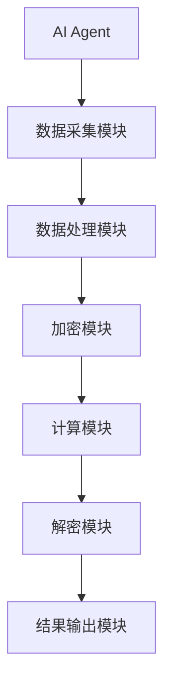

                 


# AI Agent 的隐私计算：在保护数据隐私的同时应用 LLM

> **关键词**：AI Agent, 隐私计算, 大语言模型, 数据隐私, LLM 应用

> **摘要**：  
本文探讨了在保护数据隐私的前提下，如何利用大语言模型（LLM）提升AI Agent的能力。通过分析AI Agent的核心概念、隐私计算技术以及LLM的工作原理，本文提出了在隐私保护与性能之间找到平衡的实现方案。文章详细介绍了隐私计算的关键技术，如同态加密、安全多方计算和差异隐私，以及LLM的架构和训练机制。通过实际案例分析和系统架构设计，本文展示了如何在AI Agent中实现隐私保护下的LLM应用，并提出了性能优化和安全测试的建议。

---

# 第一部分: AI Agent 的隐私计算背景与核心概念

## 第1章: AI Agent 的隐私计算概述

### 1.1 AI Agent 的定义与特点
#### 1.1.1 AI Agent 的定义  
AI Agent 是一种智能体，能够感知环境、自主决策并执行任务，具备自主性、反应性、目标导向和社交能力等特点。  

#### 1.1.2 AI Agent 的核心特点  
- **自主性**：无需外部干预，自主完成任务。  
- **反应性**：能够感知环境并实时调整行为。  
- **目标导向**：以目标为导向，优化决策过程。  
- **社交能力**：能够与其他智能体或人类进行交互和协作。  

#### 1.1.3 AI Agent 与传统AI 的区别  
AI Agent 更注重实时性、动态性和交互性，而传统AI 更关注静态数据处理和单点任务完成。

---

### 1.2 隐私计算技术的背景与意义
#### 1.2.1 隐私计算技术的定义  
隐私计算是一种在保护数据隐私的前提下，对数据进行计算的技术，旨在在不泄露原始数据的情况下完成数据分析和处理。

#### 1.2.2 隐私计算技术的核心目标  
- 数据可用性：在不泄露原始数据的前提下，支持数据分析和计算。  
- 数据安全性：防止数据被未经授权的访问或篡改。  
- 数据隐私性：确保数据处理过程中的隐私保护。  

#### 1.2.3 隐私计算技术的现状与趋势  
随着数据隐私保护的法规日益严格（如GDPR），隐私计算技术在金融、医疗、教育等领域得到了广泛应用，并成为AI技术发展的重要方向。

---

### 1.3 大语言模型（LLM）的应用与挑战
#### 1.3.1 大语言模型的定义与特点  
- **定义**：大语言模型是一种基于深度学习的自然语言处理模型，能够理解和生成人类语言。  
- **特点**：参数量大、训练数据丰富、具备上下文理解和生成能力。  

#### 1.3.2 LLM 在 AI Agent 中的应用场景  
- **对话交互**：通过LLM实现自然语言对话，提升用户体验。  
- **任务处理**：利用LLM进行任务理解、信息检索和决策支持。  
- **多模态交互**：结合LLM与视觉、听觉等模态信息，实现更复杂的交互任务。  

#### 1.3.3 LLM 应用中的隐私问题  
- 数据泄露风险：LLM的训练依赖大量数据，可能包含敏感信息。  
- 计算过程中的隐私保护：如何在不泄露原始数据的情况下进行模型推理。  

---

### 1.4 本章小结  
本章介绍了AI Agent 的定义、特点以及隐私计算技术的核心概念。同时，分析了大语言模型在AI Agent中的应用潜力及其面临的隐私挑战。

---

# 第二部分: 隐私计算与大语言模型的核心原理

## 第2章: 隐私计算技术的核心原理

### 2.1 同态加密
#### 2.1.1 同态加密的定义与特点  
- **定义**：同态加密是一种允许在加密数据上进行计算的技术，最终结果解密后与直接在明文上计算的结果相同。  
- **特点**：支持加法、乘法等基本运算，能够在不泄露原始数据的情况下完成计算。  

#### 2.1.2 同态加密的数学基础  
同态加密的数学模型基于环和模运算。假设加密函数为 $E(x)$，解密函数为 $D(x)$，则同态加密满足：  
$$ D(E(x) \oplus E(y)) = x + y $$  

#### 2.1.3 同态加密的实现流程  
1. 数据加密：对原始数据进行加密，生成密文。  
2. 数据计算：在密文上进行计算，生成密文结果。  
3. 数据解密：对密文结果进行解密，得到明文结果。  

---

### 2.2 安多方计算
#### 2.2.1 安多方计算的定义与特点  
- **定义**：安多方计算是指多个参与方在不泄露各自数据的情况下，共同完成计算任务。  
- **特点**：通过秘密分享和加密技术，确保各方数据的隐私性。  

#### 2.2.2 安多方计算的实现步骤  
1. 数据秘密分享：将数据分割成多个密片，分发给不同的参与方。  
2. 计算协作：各参与方在自己的密片上进行计算，并将结果返回给协调方。  
3. 结果合并：协调方将各参与方的计算结果合并，得到最终结果。  

#### 2.2.3 安多方计算的应用场景  
- 数据共享：多个机构在不泄露各自数据的情况下，共同完成数据分析任务。  
- 联合建模：多个机构联合训练模型，但不共享原始数据。  

---

### 2.3 差异隐私
#### 2.3.1 差异隐私的定义与特点  
- **定义**：差异隐私是一种通过在数据中添加噪声，使得单个数据点的贡献无法被识别的隐私保护技术。  
- **特点**：适用于频数统计、范围查询等场景。  

#### 2.3.2 差异隐私的实现方法  
1. 数据采样：从数据集中随机采样数据点。  
2. 噪声添加：在采样数据上添加随机噪声，确保单个数据点无法被识别。  
3. 数据发布：发布加噪后的数据，供分析使用。  

#### 2.3.3 差异隐私的优缺点  
- 优点：保护数据隐私，适用于频数统计等场景。  
- 缺点：噪声的添加可能影响数据分析的准确性。  

---

## 第3章: 大语言模型的核心原理

### 3.1 大语言模型的架构
#### 3.1.1 深度学习的基本概念  
- 深度学习是一种基于人工神经网络的机器学习方法，通过多层非线性变换提取数据特征。  

#### 3.1.2 大语言模型的网络结构  
- **编码器-解码器结构**：编码器将输入文本转换为向量表示，解码器根据向量生成输出文本。  
- **注意力机制**：通过自注意力机制捕捉文本中的长距离依赖关系。  

#### 3.1.3 大语言模型的训练过程  
1. 数据准备：收集和预处理大规模文本数据。  
2. 模型训练：使用随机梯度下降等优化算法，最小化预测误差。  
3. 模型优化：通过剪枝、量化等技术优化模型性能。  

---

### 3.2 大语言模型的训练与推理
#### 3.2.1 大语言模型的训练目标  
- **目标函数**：最小化生成文本的概率损失。  
- **损失函数**：交叉熵损失函数。  

#### 3.2.2 大语言模型的推理机制  
- **解码策略**：贪心解码、随机采样、束搜索等。  
- **生成过程**：基于上下文生成下一步的概率分布，选择概率最高的词进行生成。  

---

### 3.3 大语言模型的隐私保护挑战
#### 3.3.1 大语言模型中的数据泄露风险  
- 数据泄露：模型可能泄露训练数据中的敏感信息。  
- 模型推理：如何在不泄露数据的情况下进行模型推理。  

#### 3.3.2 大语言模型的隐私保护技术  
- **数据脱敏**：在训练数据中去除或隐藏敏感信息。  
- **模型压缩**：通过模型压缩技术减少模型参数，降低隐私泄露风险。  

#### 3.3.3 大语言模型的隐私保护与性能平衡  
- 隐私保护技术可能会影响模型的准确性和响应速度，需要在隐私与性能之间找到平衡点。

---

# 第三部分: AI Agent 的隐私计算实现

## 第4章: AI Agent 的隐私计算实现

### 4.1 算法实现
#### 4.1.1 同态加密算法实现  
1. 数据加密：使用同态加密算法对输入数据进行加密。  
2. 数据计算：在密文上进行计算，生成密文结果。  
3. 数据解密：对密文结果进行解密，得到明文结果。  

#### 4.1.2 安多方计算算法实现  
1. 数据秘密分享：将数据分割成多个密片，分发给不同的参与方。  
2. 计算协作：各参与方在自己的密片上进行计算，并将结果返回给协调方。  
3. 结果合并：协调方将各参与方的计算结果合并，得到最终结果。  

---

### 4.2 系统架构设计
#### 4.2.1 系统功能设计  
- 数据采集：采集用户输入或传感器数据。  
- 数据处理：对数据进行加密、计算和解密。  
- 结果输出：将计算结果返回给用户或系统。  

#### 4.2.2 系统架构图  


---

### 4.3 项目实战
#### 4.3.1 环境安装  
- 安装Python和必要的开发工具。  
- 安装隐私计算库（如Paillier、MPC等）。  
- 安装大语言模型框架（如Transformers、Hugging Face等）。  

#### 4.3.2 核心代码实现  
```python
# 同态加密实现
class HomomorphicEncryption:
    def __init__(self, key):
        self.key = key

    def encrypt(self, data):
        return data + self.key

    def decrypt(self, encrypted_data):
        return encrypted_data - self.key
```

---

### 4.4 性能优化与安全测试
#### 4.4.1 性能优化  
- 优化加密算法的计算效率。  
- 优化模型压缩技术，减少模型参数。  

#### 4.4.2 安全测试  
- 模拟攻击测试，确保系统具备抗攻击能力。  
- 定期进行安全审计，发现并修复潜在漏洞。  

---

# 第五章: 最佳实践与未来展望

## 5.1 最佳实践
#### 5.1.1 数据隐私保护  
- 定期进行数据清理，删除不必要的数据。  
- 使用匿名化技术处理敏感数据。  

#### 5.1.2 系统安全加固  
- 定期更新系统补丁，修复安全漏洞。  
- 配置防火墙和入侵检测系统，保护系统免受攻击。  

---

## 5.2 小结与展望
本文详细探讨了AI Agent 的隐私计算实现，提出了在保护数据隐私的前提下，利用大语言模型提升AI Agent能力的方案。未来，随着隐私计算技术的不断发展，AI Agent将在更多领域得到广泛应用。

---

**作者：AI天才研究院 & 禅与计算机程序设计艺术**

