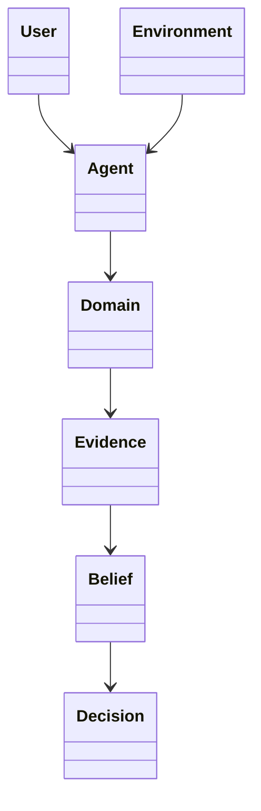
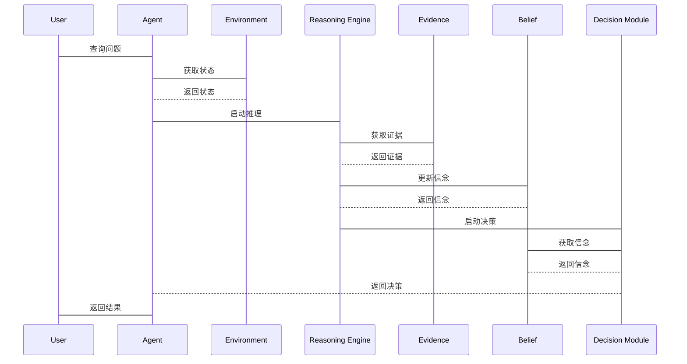

                 


# AI Agent中的不确定性推理与决策

> 关键词：AI Agent，不确定性推理，决策机制，概率论，模糊逻辑，贝叶斯网络，Dempster-Shafer证据理论

> 摘要：AI Agent在处理复杂环境中的不确定性时，需要依赖有效的推理和决策机制。本文从背景介绍出发，分析不确定性推理的核心概念，深入探讨贝叶斯网络和Dempster-Shafer证据理论等算法原理，并结合系统架构设计与项目实战，全面阐述AI Agent中的不确定性推理与决策方法。通过实际案例分析和最佳实践总结，为读者提供系统化的知识体系和实践指导。

---

## 第一章：背景介绍

### 1.1 问题背景
- 1.1.1 不确定性推理的定义与重要性
- 1.1.2 AI Agent在复杂环境中的应用挑战
- 1.1.3 不确定性推理与决策的核心问题

### 1.2 问题描述
- 1.2.1 不确定性推理的基本问题
- 1.2.2 AI Agent中的不确定性来源
- 1.2.3 决策过程中的不确定性处理

### 1.3 问题解决
- 1.3.1 不确定性推理的方法概述
- 1.3.2 AI Agent中的决策策略
- 1.3.3 不确定性建模与处理的技术手段

### 1.4 边界与外延
- 1.4.1 不确定性推理的边界条件
- 1.4.2 AI Agent决策的适用范围与限制
- 1.4.3 相关领域的对比与联系

### 1.5 核心要素组成
- 1.5.1 不确定性推理的核心要素
- 1.5.2 AI Agent决策的关键因素
- 1.5.3 不确定性建模的要素分析

---

## 第二章：核心概念与联系

### 2.1 不确定性推理的基本原理
- 2.1.1 概率论基础
- 2.1.2 模糊逻辑与证据理论
- 2.1.3 贝叶斯网络与马尔可夫链

### 2.2 AI Agent决策机制
- 2.2.1 基于概率的决策方法
- 2.2.2 基于模糊逻辑的决策方法
- 2.2.3 组合推理与决策策略

### 2.3 核心概念对比分析
- 2.3.1 不同不确定性处理方法的对比
- 2.3.2 概率推理与模糊推理的异同
- 2.3.3 贝叶斯网络与其他方法的对比

---

## 第三章：算法原理讲解

### 3.1 贝叶斯网络算法
- 3.1.1 贝叶斯网络的定义与结构
- 3.1.2 贝叶斯定理与公式推导
- 3.1.3 贝叶斯网络的构建与推理

#### 3.1.4 贝叶斯网络的Python实现示例

```python
import networkx as nx
from pgmpy.inference import VariableElimination

# 定义贝叶斯网络结构
G = nx.DiGraph()
G.add_edges_from([('A', 'B'), ('B', 'C'), ('D', 'C')])

# 创建模型
model = BayesianModel(G)

# 添加概率分布
model.add_factors(
    Factor(['A'], [0.5, 0.5)),
    Factor(['B', 'A'], [0.8, 0.2, 0.2, 0.8)),
    Factor(['C', 'B', 'D'], [0.7, 0.3, 0.4, 0.6, 0.1, 0.9, 0.2, 0.8])
)

# 推理
infer = VariableElimination(model)
result = infer.query(['C'], evidence={'A': 0})
print(result)
```

#### 3.1.5 贝叶斯定理公式
$$ P(B|A) = \frac{P(A|B)P(B)}{P(A)} $$

### 3.2 Dempster-Shafer证据理论
- 3.2.1 证据理论的基本概念
- 3.2.2 Dempster规则与组合公式
- 3.2.3 证据理论在决策中的应用

#### 3.2.4 Dempster-Shafer证据理论的Python实现示例

```python
from py DempsterShafer import DempsterShafer

# 初始化证据体
body = DempsterShafer.Body({'A': 0.6, 'B': 0.3})
body2 = DempsterShafer.Body({'A': 0.5, 'B': 0.3})

# 组合证据
combined = DempsterShafer.combine(body, body2)
print(combined)
```

#### 3.2.5 Dempster规则公式
$$ Bel(A) = \sum_{B \subseteq A} m(B) $$

---

## 第四章：系统分析与架构设计

### 4.1 问题场景介绍
- 4.1.1 智能助手中的不确定性处理
- 4.1.2 自动驾驶中的决策问题

### 4.2 系统功能设计
- 4.2.1 领域模型设计（Mermaid类图）



### 4.3 系统架构设计
- 4.3.1 系统架构图（Mermaid架构图）


### 4.4 系统接口设计
- 4.4.1 接口描述与交互流程（Mermaid序列图）



---

## 第五章：项目实战

### 5.1 环境配置
- 5.1.1 安装必要的Python库
- 5.1.2 配置开发环境

### 5.2 核心代码实现
- 5.2.1 贝叶斯网络实现
- 5.2.2 Dempster-Shafer证据理论实现

#### 5.2.3 模糊逻辑实现

```python
from fuzzywuzzy import fuzz

# 定义模糊规则
def fuzzy_rule(input_value):
    if input_value >= 0.8:
        return 'high'
    elif input_value >= 0.4:
        return 'medium'
    else:
        return 'low'

# 应用模糊推理
input_value = 0.6
result = fuzzy_rule(input_value)
print(result)
```

### 5.3 案例分析与解读
- 5.3.1 智能助手中的不确定性处理
- 5.3.2 自动驾驶中的决策问题

### 5.4 项目小结
- 5.4.1 实践总结
- 5.4.2 可能遇到的问题与解决方案

---

## 第六章：最佳实践与总结

### 6.1 关键点总结
- 6.1.1 不确定性推理的核心要素
- 6.1.2 AI Agent决策的关键策略

### 6.2 小结
- 6.2.1 本书的主要内容回顾
- 6.2.2 读者收获与启示

### 6.3 注意事项
- 6.3.1 实际应用中的常见问题
- 6.3.2 算法选择与优化建议

### 6.4 未来研究方向
- 6.4.1 新兴技术的影响
- 6.4.2 深度学习与不确定性推理的结合

### 6.5 拓展阅读
- 6.5.1 推荐书籍与论文
- 6.5.2 在线资源与工具

---

## 作者

作者：AI天才研究院/AI Genius Institute & 禅与计算机程序设计艺术 /Zen And The Art of Computer Programming

