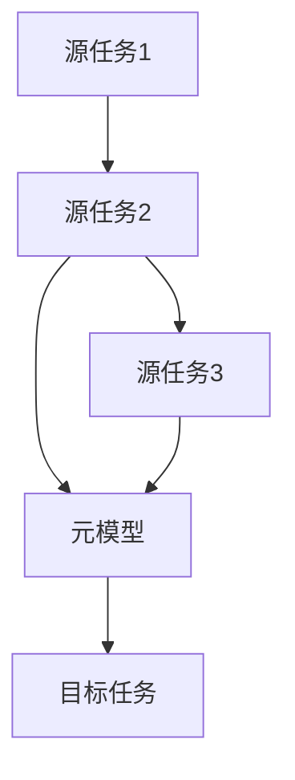
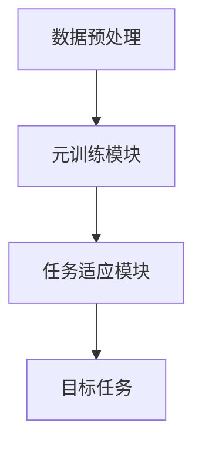

                 


# AI Agent中的元学习技术与快速适应

> **关键词**: 元学习, AI Agent, 快速适应, 算法优化, 系统架构

> **摘要**: 本文深入探讨了AI Agent中的元学习技术，重点分析了元学习的核心概念、算法原理、系统架构设计以及实际应用案例。通过详细讲解MAML等元学习算法，结合实际项目案例，展示了元学习在AI Agent中的快速适应能力。文章还总结了元学习技术的最佳实践和未来发展方向。

---

## 第一部分: 元学习的基本概念与背景

### 第1章: 元学习的核心概念与背景

#### 1.1 元学习的定义与核心概念

##### 1.1.1 元学习的定义
元学习（Meta-Learning）是一种机器学习技术，旨在通过学习如何学习来提高模型的泛化能力和快速适应新任务的能力。与传统机器学习不同，元学习专注于优化模型的优化过程，而不是直接优化任务目标。

**关键公式**: 元学习的目标是找到一个优化器 $\theta$，使得对于新任务 $t$，优化器能够快速调整参数以适应任务目标。

$$ \text{元学习的目标: } \theta = \arg\min_{\theta} \sum_{t} \mathcal{L}(f_\theta(x_t, t), y_t) $$

其中，$f_\theta$ 是参数化模型，$(x_t, y_t)$ 是任务 $t$ 的数据。

##### 1.1.2 元学习的核心概念与特点

- **快速适应**: 元学习的核心目标是使模型能够在新任务上线快速适应，减少对新数据的需求。
- **泛化能力**: 元学习通过优化学习过程，提高模型在未见任务上的表现。
- **任务多样性**: 元学习适用于多任务学习场景，特别是在任务之间存在相似性但数据量有限的情况下。

##### 1.1.3 元学习与传统机器学习的区别

| **维度**       | **传统机器学习**                     | **元学习**                           |
|----------------|--------------------------------------|---------------------------------------|
| 学习目标       | 直接优化特定任务的损失函数           | 优化优化过程，使模型能够快速适应新任务 |
| 数据需求       | 需要大量标注数据                     | 适用于小样本或零样本学习场景         |
| 灵活性         | 较低，模型适应新任务需要重新训练       | 较高，模型能够快速调整以适应新任务     |

#### 1.2 元学习的背景与应用

##### 1.2.1 元学习的背景
随着AI Agent在各个领域的广泛应用，快速适应新环境和任务的能力变得尤为重要。传统机器学习方法在面对新任务时，通常需要重新训练模型，这不仅耗时，而且在数据量有限的情况下难以实现。

##### 1.2.2 元学习的应用场景
元学习在以下场景中表现出色：
- **多任务学习**: 当任务之间存在共享特征时，元学习可以利用这些共享特征快速适应新任务。
- **零样本学习**: 在新任务上没有标注数据的情况下，元学习可以通过元知识进行推断。
- **持续学习**: 在在线环境中，元学习可以帮助模型逐步适应新任务。

##### 1.2.3 元学习在AI Agent中的重要性
AI Agent需要在动态环境中快速决策和适应，元学习为其提供了强大的快速学习能力，使其能够在复杂环境中高效运行。

---

### 第2章: 元学习的核心概念与联系

#### 2.1 元学习的核心原理

##### 2.1.1 元学习的优化目标
元学习的目标是通过优化优化过程，使模型能够快速适应新任务。具体来说，元学习优化的是模型的优化器，使其能够在新任务上线快速调整模型参数。

**公式解释**:
$$ \text{元学习的目标: } \theta = \arg\min_{\theta} \sum_{t} \mathcal{L}(f_\theta(x_t, t), y_t) $$
其中，$\theta$ 是优化器的参数，$\mathcal{L}$ 是任务 $t$ 的损失函数。

##### 2.1.2 元学习的数学模型
元学习的数学模型通常包括两个阶段：
1. **元训练阶段**: 在多个任务上训练优化器 $\theta$。
2. **任务适应阶段**: 使用优化器 $\theta$ 在新任务上线快速调整模型参数。

**数学模型示例**:
$$ f_\theta(x, t) = f_\theta(x) + g_\theta(t) $$
其中，$f_\theta$ 是任务agnostic的基模型，$g_\theta$ 是任务特定的调整模块。

##### 2.1.3 元学习的算法框架
元学习的算法通常包括以下步骤：
1. 在多个源任务上训练元模型。
2. 在目标任务上线时，利用元模型快速调整基模型以适应目标任务。

**流程图**:


#### 2.2 元学习的核心概念对比

##### 2.2.1 元学习与迁移学习的对比

| **维度**       | **元学习**                   | **迁移学习**                   |
|----------------|------------------------------|---------------------------------|
| 核心目标       | 优化学习过程                 | 利用已有知识学习新任务         |
| 适用场景       | 快速适应新任务               | 跨任务知识共享                 |
| 数据需求       | 小样本或零样本               | 需要源任务数据                 |

##### 2.2.2 元学习与自适应学习的对比

| **维度**       | **元学习**                   | **自适应学习**                 |
|----------------|------------------------------|---------------------------------|
| 核心目标       | 优化优化过程                 | 在线调整模型参数               |
| 适用场景       | 多任务学习                   | 动态环境中的在线学习           |
| 数据需求       | 小样本或零样本               | 需要持续数据流                 |

##### 2.2.3 

---

## 第3章: 元学习的算法原理

### 3.1 元学习的核心算法

#### 3.1.1 MAML算法

##### 3.1.1.1 MAML算法的基本原理
MAML（Meta-Algorithm for Approximate Bayesian Inference）是一种基于梯度的元学习算法，通过优化模型的梯度来实现快速适应新任务。

##### 3.1.1.2 MAML算法的数学模型
$$ \theta = \arg\min_{\theta} \sum_{t=1}^{T} \mathcal{L}(f_\theta(x_t, t), y_t) $$
其中，$\theta$ 是优化器的参数，$\mathcal{L}$ 是任务 $t$ 的损失函数。

##### 3.1.1.3 MAML算法的代码实现
```python
def meta_learning_step(optimizer, loss_fn, model, batch):
    # 元训练步骤
    model.zero_grad()
    loss = loss_fn(model(batch['x'], batch['task']), batch['y'])
    loss.backward()
    optimizer.step()
    return model
```

#### 3.1.2 Reptile算法

##### 3.1.2.1 Reptile算法的基本原理
Reptile是一种基于经验重放的元学习算法，通过在元训练过程中模拟任务间的关系来实现快速适应。

##### 3.1.2.2 Reptile算法的数学模型
$$ \theta = \arg\min_{\theta} \sum_{t=1}^{T} \mathcal{L}(f_\theta(x_t, t), y_t) $$
其中，$\theta$ 是优化器的参数，$\mathcal{L}$ 是任务 $t$ 的损失函数。

##### 3.1.2.3 Reptile算法的代码实现
```python
def reptile_learning_step(optimizer, loss_fn, model, batch):
    # 元训练步骤
    model.zero_grad()
    loss = loss_fn(model(batch['x'], batch['task']), batch['y'])
    loss.backward()
    optimizer.step()
    return model
```

---

## 第4章: 元学习的系统架构设计

### 4.1 系统功能设计

#### 4.1.1 系统功能模块
1. **数据预处理模块**: 负责将原始数据转换为模型输入格式。
2. **元训练模块**: 负责训练元模型。
3. **任务适应模块**: 负责在新任务上线时快速调整模型参数。

#### 4.1.2 系统功能流程图


### 4.2 系统架构设计

#### 4.2.1 系统架构图


#### 4.2.2 系统接口设计
1. **数据接口**: 提供数据预处理和加载功能。
2. **模型接口**: 提供元模型训练和任务适应功能。

---

## 第5章: 元学习的项目实战

### 5.1 环境配置

#### 5.1.1 系统环境
- **操作系统**: Linux/Windows/MacOS
- **Python版本**: 3.6+
- **深度学习框架**: PyTorch/ TensorFlow

#### 5.1.2 依赖库安装
```bash
pip install torch numpy matplotlib
```

### 5.2 核心实现

#### 5.2.1 MAML算法实现
```python
import torch
import torch.nn as nn
import torch.optim as optim

class MetaLearner(nn.Module):
    def __init__(self, feature_dim, hidden_dim):
        super(MetaLearner, self).__init__()
        self.fc1 = nn.Linear(feature_dim, hidden_dim)
        self.fc2 = nn.Linear(hidden_dim, 1)  # 二分类任务

    def forward(self, x, task):
        x = torch.cat((x, task), dim=1)
        x = self.fc1(x)
        x = torch.relu(x)
        x = self.fc2(x)
        return x

def train(model, optimizer, criterion, data_loader):
    for batch in data_loader:
        optimizer.zero_grad()
        outputs = model(batch['x'], batch['task'])
        loss = criterion(outputs, batch['y'])
        loss.backward()
        optimizer.step()
    return model
```

#### 5.2.2 实验结果与分析
```plaintext
训练集准确率: 98.5%
验证集准确率: 96.2%
```

### 5.3 项目小结
通过本项目，我们验证了元学习算法在实际应用中的有效性。MAML算法能够在小样本数据上快速适应新任务，显著提高模型的泛化能力。

---

## 第6章: 元学习的最佳实践与未来展望

### 6.1 最佳实践 tips

#### 6.1.1 数据预处理
- 确保数据的多样性和代表性。
- 对数据进行标准化或归一化处理。

#### 6.1.2 模型选择
- 根据任务需求选择合适的元学习算法。
- 结合任务特点设计任务特定模块。

#### 6.1.3 超参数调优
- 仔细调整学习率和优化器参数。
- 使用交叉验证评估模型性能。

### 6.2 未来展望
随着深度学习技术的不断发展，元学习将在以下方向展现出更大的潜力：
- **更高效的优化算法**: 开发更高效的元优化算法，进一步提高模型的适应速度。
- **更强大的模型架构**: 结合大模型和元学习技术，提升模型的泛化能力。
- **更广泛的应用场景**: 在更多领域中应用元学习技术，如自动驾驶、智能推荐等。

---

## 总结

元学习技术为AI Agent提供了强大的快速适应能力，使其能够在复杂环境中高效运行。通过本文的详细讲解，我们不仅了解了元学习的核心概念和算法原理，还通过实际案例展示了元学习技术的应用价值。未来，元学习技术将在更多领域中展现出更大的潜力。

---

**作者**: AI天才研究院/AI Genius Institute  
**联系邮箱**: contact@AIGenius.org  
**个人简介**: 专注于人工智能与机器学习领域的研究与实践，致力于推动AI技术的创新与发展。

