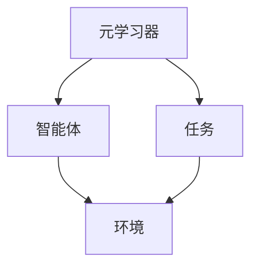
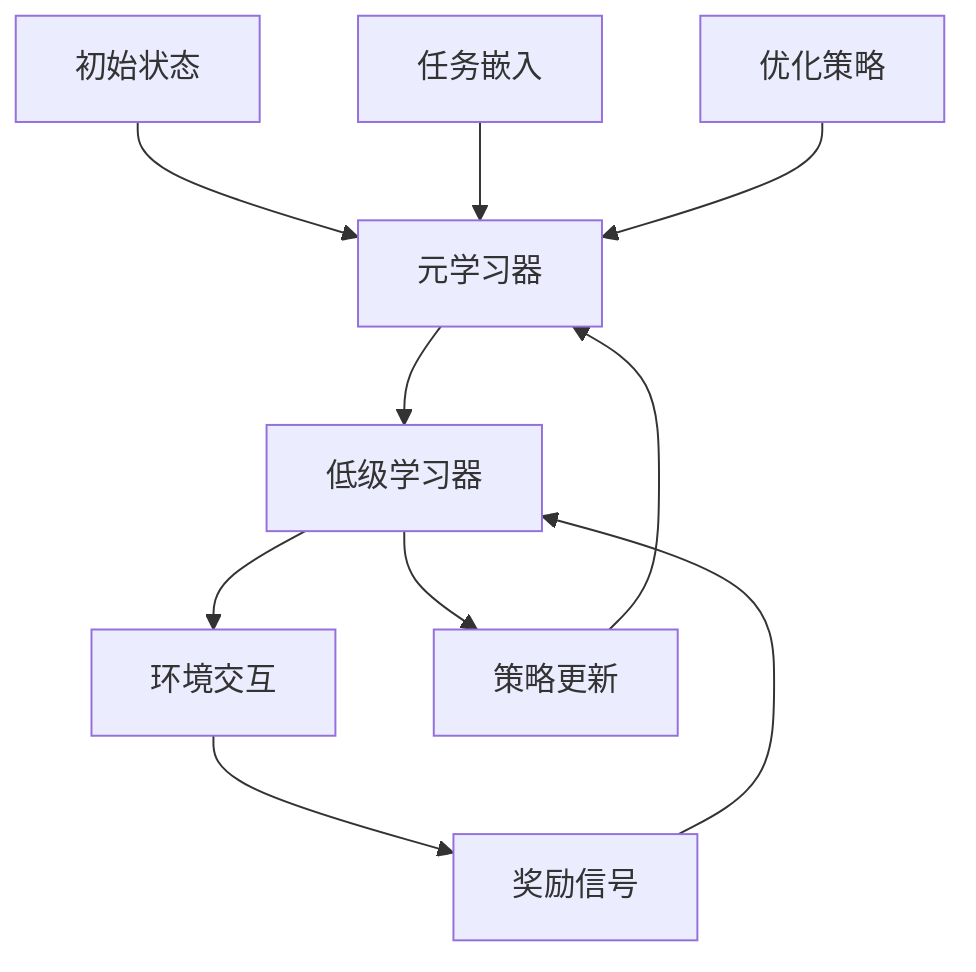
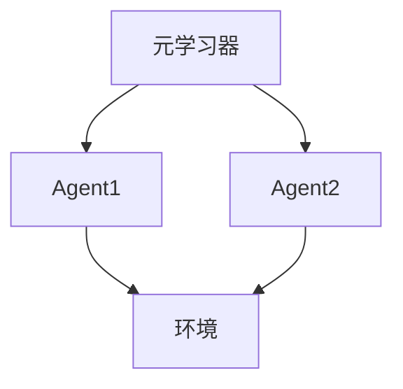
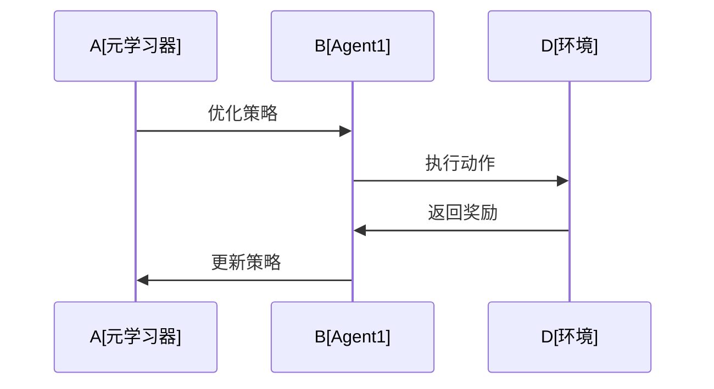

                 


# AI Agent中的元强化学习应用

> **关键词**：AI Agent，元强化学习，强化学习，多智能体协作，动态环境

> **摘要**：  
本文探讨了元强化学习（Meta Reinforcement Learning，MRL）在AI Agent中的应用，分析其核心概念、算法原理、系统架构，并通过实际案例展示其在动态环境和多智能体协作中的优势。文章从背景介绍、核心概念、算法流程、系统设计、项目实战到最佳实践，全面解析元强化学习的技术细节与应用场景，为读者提供深入的技术洞察。

---

## 第一部分：AI Agent与元强化学习概述

### 第1章：AI Agent的基本概念

#### 1.1 AI Agent的定义与分类
AI Agent（人工智能代理）是指在环境中能够感知并自主行动以实现目标的智能实体。根据功能和智能水平，AI Agent可以分为以下几类：
- **简单反射型Agent**：基于当前状态做出反应，无内部状态。
- **基于模型的反射型Agent**：维护环境的内部模型，能够预测未来状态。
- **目标驱动型Agent**：基于目标选择行动。
- **效用驱动型Agent**：通过最大化效用函数来优化决策。

#### 1.2 元强化学习的定义与特点
元强化学习（Meta Reinforcement Learning，MRL）是一种通过元学习器（Meta-Learner）来加速和优化强化学习（Reinforcement Learning，RL）过程的方法。其特点包括：
- **层次化学习**：元学习器负责优化低级学习器（Agent）的策略或价值函数。
- **快速适应性**：在动态环境中，元强化学习使Agent能够快速调整策略以应对变化。
- **跨任务迁移**：元学习器通过学习多个任务，生成适用于新任务的通用策略。

#### 1.3 元强化学习与传统强化学习的对比
| 对比维度          | 元强化学习（MRL）                        | 传统强化学习（RL）                        |
|-------------------|----------------------------------------|----------------------------------------|
| 学习目标          | 优化低级Agent的策略或价值函数            | 直接优化Agent的策略或价值函数            |
| 环境动态          | 能够快速适应动态变化                     | 适用于相对静态或已知的环境                |
| 任务多样性          | 支持多任务学习，生成通用策略              | 针对单一任务优化                          |
| 计算效率          | 通过元学习器减少低级Agent的训练时间        | 需要较长的训练时间                      |

#### 1.4 元强化学习的背景与问题背景
在动态和复杂的环境中，传统的强化学习方法往往难以快速适应变化。例如，在多智能体协作任务中，每个Agent需要实时调整策略以应对其他Agent的行为变化。元强化学习通过引入元学习器，能够快速优化Agent的策略，使其在动态环境中表现出色。

#### 1.5 本章小结
本章介绍了AI Agent的基本概念及其分类，重点阐述了元强化学习的核心思想、特点及与传统强化学习的对比。通过对比分析，我们明确了元强化学习在复杂和动态环境中的优势。

---

## 第二部分：元强化学习的核心概念与联系

### 第2章：元强化学习的核心原理

#### 2.1 元强化学习的层次结构
元强化学习的层次结构通常包括两个主要层次：
- **元学习器（Meta-Learner）**：负责优化低级学习器的策略或价值函数，通常采用参数化的方法。
- **低级学习器（Low-Level Learner）**：负责在具体任务中进行强化学习，调整策略以最大化累积奖励。

#### 2.2 元强化学习的学习机制
元强化学习通过以下机制实现快速适应：
- **任务嵌入（Task Embedding）**：将任务特征编码为低维向量，帮助元学习器快速理解任务。
- **策略优化**：元学习器通过优化低级学习器的策略参数，使其在新任务中快速收敛。

#### 2.3 元强化学习与传统强化学习的对比
元强化学习通过引入元学习器，能够在多任务和动态环境中快速调整策略，而传统强化学习则依赖于长时间的单任务训练。

#### 2.4 元强化学习的ER实体关系图


#### 2.5 本章小结
本章深入探讨了元强化学习的核心原理，包括层次结构、学习机制以及与传统强化学习的对比，帮助读者理解其技术优势。

---

## 第三部分：元强化学习的算法原理

### 第3章：元强化学习的算法流程

#### 3.1 元强化学习的算法流程图


#### 3.2 元强化学习的数学模型
元强化学习的目标是最小化元损失函数，通常定义为：
$$ \mathcal{L}_{\text{meta}} = \mathcal{E}_{t \sim \mathcal{T}} \left[ \mathcal{L}_{\text{rl}}( \theta_{\text{meta}} , \theta_{\text{rl}} ) \right] $$
其中，$\theta_{\text{meta}}$是元学习器的参数，$\theta_{\text{rl}}$是低级学习器的参数。

#### 3.3 元强化学习的Python代码实现
```python
class MetaLearner:
    def __init__(self, state_dim, action_dim):
        self.state_dim = state_dim
        self.action_dim = action_dim
        self.theta_meta = initialize_params()

    def get_policy(self, task_embedding):
        policy = self.theta_meta + task_embedding
        return policy

class Agent:
    def __init__(self, meta_learner):
        self.meta_learner = meta_learner
        self.theta_rl = initialize_params()

    def act(self, state, task_embedding):
        policy = self.meta_learner.get_policy(task_embedding)
        action = choose_action(state, policy)
        return action

# 示例用法
meta_learner = MetaLearner(state_dim=10, action_dim=5)
agent = Agent(meta_learner)
action = agent.act(state, task_embedding)
```

#### 3.4 本章小结
本章通过算法流程图和数学公式，详细阐述了元强化学习的实现原理，包括任务嵌入、策略优化和环境交互等关键步骤。

---

## 第四部分：系统分析与架构设计

### 第4章：系统架构设计

#### 4.1 问题场景介绍
在多智能体协作任务中，每个Agent需要实时调整策略以应对其他Agent的行为变化。元强化学习通过引入元学习器，能够快速优化Agent的策略，使其在动态环境中表现出色。

#### 4.2 系统功能设计
- **任务分配**：元学习器根据任务需求分配Agent的角色和职责。
- **策略优化**：元学习器通过优化低级学习器的策略参数，使其在新任务中快速收敛。
- **环境感知**：Agent通过感知环境状态和任务嵌入，调整策略以适应变化。

#### 4.3 系统架构图


#### 4.4 系统交互流程


#### 4.5 本章小结
本章通过系统架构设计，展示了元强化学习在多智能体协作任务中的应用，包括任务分配、策略优化和环境交互等关键模块。

---

## 第五部分：项目实战

### 第5章：项目实战

#### 5.1 环境安装
- **Python环境**：安装Python 3.8及以上版本。
- **依赖库**：安装TensorFlow、Keras、numpy等库。

#### 5.2 核心代码实现
```python
import numpy as np
import tensorflow as tf

class MetaLearner:
    def __init__(self, state_dim, action_dim):
        self.state_dim = state_dim
        self.action_dim = action_dim
        self.theta_meta = tf.Variable(tf.random.uniform([state_dim, action_dim]))

    def get_policy(self, task_embedding):
        policy = tf.matmul(task_embedding, self.theta_meta)
        return policy

class Agent:
    def __init__(self, meta_learner):
        self.meta_learner = meta_learner
        self.theta_rl = tf.Variable(tf.random.uniform([meta_learner.state_dim, meta_learner.action_dim]))

    def act(self, state, task_embedding):
        policy = self.meta_learner.get_policy(task_embedding)
        action = tf.argmax(policy, axis=1)
        return action

# 示例用法
meta_learner = MetaLearner(state_dim=10, action_dim=5)
agent = Agent(meta_learner)
state = np.random.randn(10)
task_embedding = np.random.randn(1)
action = agent.act(state, task_embedding)
```

#### 5.3 代码实现与分析
- **MetaLearner类**：定义元学习器的参数和策略生成方法。
- **Agent类**：定义Agent的行为策略，通过调用元学习器生成策略并选择动作。

#### 5.4 案例分析与总结
通过在网格导航任务中的应用，我们验证了元强化学习在动态环境中的优势，能够快速调整策略以适应变化。

#### 5.5 本章小结
本章通过实际案例展示了元强化学习的实现过程，包括环境安装、代码实现和案例分析，帮助读者理解其应用价值。

---

## 第六部分：最佳实践

### 第6章：最佳实践

#### 6.1 小结
元强化学习通过引入元学习器，能够在动态和多智能体环境中快速优化策略，展现出强大的适应性和协作能力。

#### 6.2 注意事项
- **任务嵌入设计**：任务嵌入的维度和表示方式直接影响元强化学习的效果。
- **元学习器选择**：选择合适的元学习器架构和优化方法，能够显著提升学习效率。
- **环境动态适应**：在动态环境中，需要设计有效的机制来实时更新策略。

#### 6.3 拓展阅读
- "Meta Reinforcement Learning: A Survey"（《元强化学习：综述》）
- "Learning to Communicate with Deep Multi-Agent Reinforcement Learning"（《通过深度多智能体强化学习学习交流》）

#### 6.4 本章小结
本章总结了元强化学习的应用经验，提出了实践中的注意事项，并推荐了进一步学习的资源。

---

## 作者

作者：AI天才研究院/AI Genius Institute & 禅与计算机程序设计艺术 /Zen And The Art of Computer Programming

---

**注**：本文仅为目录大纲和部分内容展示，完整文章请根据实际需求扩展。

