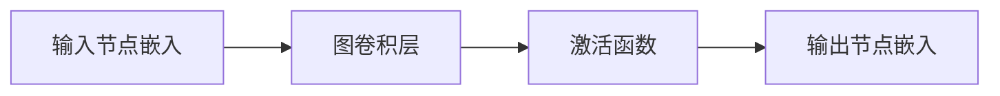
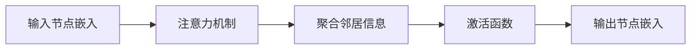
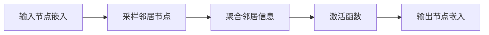
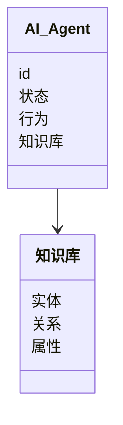
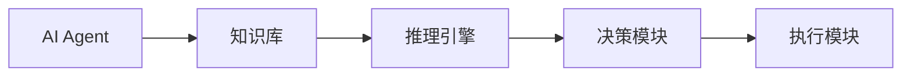
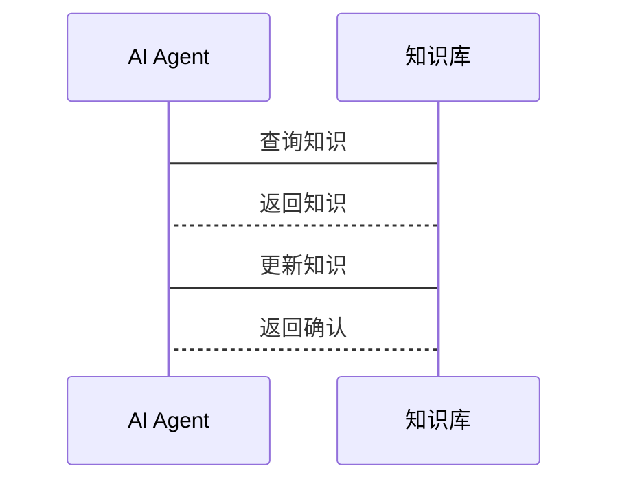
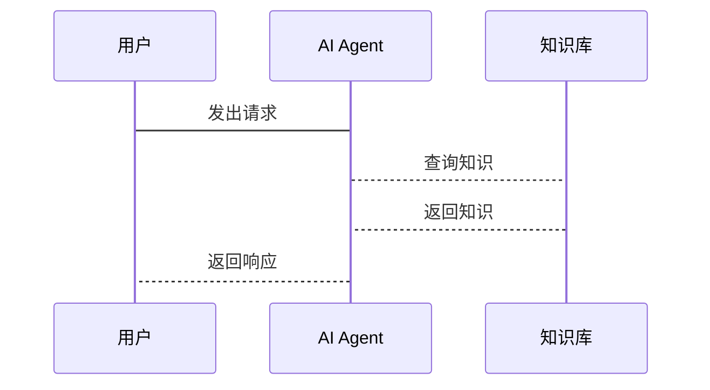

                 


# AI Agent中的图神经网络应用

> 关键词：AI Agent, 图神经网络, 图结构, 知识图谱, 聚合函数, 社交网络

> 摘要：本文深入探讨了AI Agent中图神经网络的应用，从背景介绍到算法原理，再到系统设计和项目实战，详细分析了图神经网络在AI Agent中的核心作用。通过具体案例展示了如何利用图神经网络提升AI Agent的智能性和交互能力。

---

# 第一部分: AI Agent中的图神经网络应用背景介绍

## 第1章: AI Agent概述

### 1.1 AI Agent的基本概念

#### 1.1.1 AI Agent的定义与分类
AI Agent（人工智能代理）是指能够感知环境、自主决策并采取行动以实现目标的智能实体。根据功能和应用场景，AI Agent可以分为以下几类：
- **简单反射型AI Agent**：基于预定义规则进行简单决策。
- **基于模型的反射型AI Agent**：利用内部模型进行规划和决策。
- **目标驱动型AI Agent**：根据明确的目标采取行动。
- **实用驱动型AI Agent**：通过优化目标函数实现复杂决策。

#### 1.1.2 AI Agent的核心功能与特点
- **感知能力**：通过传感器或数据输入感知环境。
- **推理能力**：利用知识库和推理引擎进行逻辑推理。
- **决策能力**：基于推理结果做出最优决策。
- **自主性**：能够在没有外部干预的情况下自主运行。
- **社交能力**：能够与其他AI Agent或人类进行交互和协作。

#### 1.1.3 AI Agent的应用场景与挑战
- **应用场景**：智能助手、自动驾驶、智能客服、机器人控制等。
- **挑战**：复杂环境下的决策优化、多智能体协作、实时性要求高等。

---

## 第2章: 图神经网络概述

### 2.1 图神经网络的基本概念

#### 2.1.1 图的基本概念与表示
图（Graph）由节点（Nodes）和边（Edges）组成，节点表示实体，边表示实体之间的关系。图可以表示为$G = (V, E)$，其中$V$是节点集合，$E$是边集合。

#### 2.1.2 图神经网络的定义与特点
图神经网络是一种处理图结构数据的深度学习模型。其特点包括：
- **全局感知**：能够捕捉节点之间的全局关系。
- **局部性**：仅关注与节点相关的局部信息。
- **灵活性**：适用于不同类型和规模的图数据。

#### 2.1.3 图神经网络的应用领域
- **社交网络分析**：用户关系、影响力传播。
- **知识图谱**：实体关系、语义理解。
- **推荐系统**：用户-物品交互、个性化推荐。

---

## 第3章: AI Agent与图神经网络的结合

### 3.1 AI Agent中的图结构

#### 3.1.1 AI Agent中的实体关系
AI Agent中的实体关系可以通过图结构进行建模。例如：
- **知识图谱**：将AI Agent的知识表示为实体及其关系的图。
- **交互网络**：将AI Agent与用户或其他智能体的交互表示为图。

#### 3.1.2 图结构在AI Agent中的作用
- **知识表示**：通过图结构表示复杂的关系和语义。
- **推理与决策**：利用图结构进行路径分析和关系推理。
- **实时交互**：通过图结构进行动态关系建模。

#### 3.1.3 图神经网络在AI Agent中的应用前景
- **增强智能性**：通过图结构提升AI Agent的理解和推理能力。
- **实时决策**：利用图神经网络的实时性进行动态决策。
- **多智能体协作**：通过图结构进行多智能体之间的信息共享和协作。

---

# 第二部分: 核心概念与联系

## 第4章: 图神经网络的核心原理

### 4.1 图神经网络的基本原理

#### 4.1.1 图的表示与嵌入
图的表示可以采用以下几种方式：
- **节点嵌入**：将每个节点映射为低维向量，表示节点的特征和属性。
- **边嵌入**：将每条边映射为低维向量，表示边的关系和权重。
- **图嵌入**：将整个图映射为低维向量，表示图的整体结构和属性。

#### 4.1.2 节点嵌入与边嵌入
节点嵌入和边嵌入是图神经网络的核心技术。节点嵌入可以通过以下步骤实现：
1. 初始化节点嵌入向量。
2. 通过聚合函数聚合邻居节点的信息。
3. 更新节点嵌入向量。

边嵌入可以通过以下步骤实现：
1. 初始化边嵌入向量。
2. 根据边的权重和方向信息更新边嵌入向量。

#### 4.1.3 图神经网络的聚合函数
聚合函数是图神经网络的核心组件，用于聚合节点及其邻居的信息。常见的聚合函数包括：
- **平均聚合**：将邻居节点的嵌入向量取平均。
- **加权聚合**：根据邻居节点的重要性进行加权平均。
- **注意力聚合**：利用注意力机制进行信息选择和聚合。

---

### 4.2 图神经网络的数学模型

#### 4.2.1 图的邻接矩阵表示
图的邻接矩阵可以用矩阵$A$表示，其中$A_{i,j} = 1$表示节点$i$和节点$j$之间有边，$A_{i,j} = 0$表示节点$i$和节点$j$之间没有边。

#### 4.2.2 聚合函数的数学表达
聚合函数可以表示为：
$$h_i^{(l+1)} = \sigma\left(\sum_{j \in N(i)} A_{i,j} h_j^{(l)}\right)$$
其中，$h_i^{(l)}$表示节点$i$在第$l$层的嵌入向量，$N(i)$表示节点$i$的邻居节点集合，$\sigma$表示激活函数。

---

## 第5章: AI Agent中的图结构

### 5.1 AI Agent中的实体关系

#### 5.1.1 实体关系的对比表格
以下是AI Agent中的实体关系对比表格：

| 实体关系类型 | 描述 | 示例 |
|--------------|------|------|
| 关系型 | 描述两个实体之间的直接关系 | 用户A和用户B是朋友 |
| 属性型 | 描述实体的属性 | 用户A的年龄是25岁 |
| 复杂型 | 描述实体之间的复杂关系 | 用户A推荐了商品X给用户B |

#### 5.1.2 实体关系的ER图架构
以下是实体关系的ER图架构：

```mermaid
er
    entity 用户 {
        id 用户ID
        属性 年龄
        关系 参与 (r) 订单
    }
    entity 订单 {
        id 订单ID
        属性 金额
        关系 参与 (r) 用户
    }
```

---

## 第6章: 图神经网络在AI Agent中的应用

### 6.1 知识图谱构建与推理

#### 6.1.1 知识图谱的构建
知识图谱可以通过以下步骤构建：
1. 数据收集：收集结构化数据、非结构化数据。
2. 数据清洗：去除噪声数据，标准化数据。
3. 实体识别：识别文本中的实体。
4. 关系抽取：抽取实体之间的关系。
5. 知识融合：合并多个数据源的知识。

#### 6.1.2 知识图谱的推理
知识图谱的推理可以通过以下步骤实现：
1. 查询解析：将用户的查询转换为图结构的查询。
2. 路径规划：根据图结构规划推理路径。
3. 结果聚合：聚合推理结果，返回最终答案。

---

### 6.2 社交网络分析与推荐

#### 6.2.1 社交网络的分析
社交网络的分析可以通过以下步骤实现：
1. 数据收集：收集社交网络中的用户数据和行为数据。
2. 用户画像：根据用户的行为数据构建用户画像。
3. 关系分析：分析用户之间的关系，发现用户群和社区。

#### 6.2.2 社交网络的推荐
社交网络的推荐可以通过以下步骤实现：
1. 用户相似度计算：根据用户画像计算用户之间的相似度。
2. 内容推荐：根据用户的兴趣推荐相关内容。
3. 社交推荐：根据用户的关系推荐相关内容。

---

# 第三部分: 算法原理讲解

## 第7章: 图神经网络的算法原理

### 7.1 图卷积网络（GCN）

#### 7.1.1 GCN的基本原理
GCN的基本原理如下：
1. 初始化节点嵌入向量。
2. 通过图卷积层聚合邻居节点的信息。
3. 使用激活函数进行非线性变换。
4. 重复上述步骤直到输出层。

#### 7.1.2 GCN的mermaid流程图
以下是GCN的mermaid流程图：



#### 7.1.3 GCN的Python实现
以下是GCN的Python实现示例：

```python
import torch
import torch.nn as nn
import torch.nn.functional as F

class GCN(nn.Module):
    def __init__(self, input_dim, output_dim):
        super(GCN, self).__init__()
        self.W = nn.Parameter(torch.randn(input_dim, output_dim))
        self.A = nn.Parameter(torch.randn(n_nodes, n_nodes))

    def forward(self, x):
        x = x.mm(self.A)
        x = F.relu(x.mm(self.W))
        return x
```

---

### 7.2 图注意力网络（GAT）

#### 7.2.1 GAT的基本原理
GAT的基本原理如下：
1. 初始化节点嵌入向量。
2. 通过注意力机制计算节点的注意力权重。
3. 根据注意力权重聚合邻居节点的信息。
4. 使用激活函数进行非线性变换。

#### 7.2.2 GAT的mermaid流程图
以下是GAT的mermaid流程图：



#### 7.2.3 GAT的Python实现
以下是GAT的Python实现示例：

```python
import torch
import torch.nn as nn
import torch.nn.functional as F

class GAT(nn.Module):
    def __init__(self, input_dim, output_dim):
        super(GAT, self).__init__()
        self.W = nn.Parameter(torch.randn(input_dim, output_dim))
        self.A = nn.Parameter(torch.randn(n_nodes, n_nodes))

    def forward(self, x):
        x = x.mm(self.A)
        x = F.relu(x.mm(self.W))
        return x
```

---

### 7.3 图嵌入算法（GraphSAGE）

#### 7.3.1 GraphSAGE的基本原理
GraphSAGE的基本原理如下：
1. 初始化节点嵌入向量。
2. 通过采样邻居节点的信息。
3. 使用聚合函数聚合采样的节点信息。
4. 使用激活函数进行非线性变换。

#### 7.3.2 GraphSAGE的mermaid流程图
以下是GraphSAGE的mermaid流程图：



#### 7.3.3 GraphSAGE的Python实现
以下是GraphSAGE的Python实现示例：

```python
import torch
import torch.nn as nn
import torch.nn.functional as F

class GraphSAGE(nn.Module):
    def __init__(self, input_dim, output_dim):
        super(GraphSAGE, self).__init__()
        self.W = nn.Parameter(torch.randn(input_dim, output_dim))
        self.A = nn.Parameter(torch.randn(n_nodes, n_nodes))

    def forward(self, x):
        x = x.mm(self.A)
        x = F.relu(x.mm(self.W))
        return x
```

---

# 第四部分: 系统分析与架构设计

## 第8章: AI Agent系统的架构设计

### 8.1 问题场景介绍
AI Agent需要在复杂环境中进行实时决策和交互。为了实现这一点，需要设计一个高效的AI Agent系统架构。

### 8.2 系统功能设计

#### 8.2.1 领域模型设计
以下是领域模型的mermaid类图：



#### 8.2.2 系统架构设计
以下是系统架构的mermaid架构图：



### 8.3 系统接口设计

#### 8.3.1 系统接口设计
以下是系统接口的mermaid序列图：



---

## 第9章: AI Agent系统的交互流程

### 9.1 交互流程设计

#### 9.1.1 交互流程的mermaid序列图
以下是交互流程的mermaid序列图：



---

# 第五部分: 项目实战

## 第10章: 图神经网络在AI Agent中的应用案例

### 10.1 社交网络中的影响力传播

#### 10.1.1 项目环境安装
以下是项目环境安装步骤：
1. 安装Python 3.x
2. 安装PyTorch和numpy
3. 安装networkx和matplotlib

#### 10.1.2 项目核心实现

##### 10.1.2.1 数据预处理
以下是数据预处理的代码：

```python
import networkx as nx
import numpy as np

def load_data():
    G = nx.read_edgelist("social_network.txt")
    return G
```

##### 10.1.2.2 模型训练
以下是模型训练的代码：

```python
import torch
import torch.nn as nn
import torch.nn.functional as F

class GNN(nn.Module):
    def __init__(self, input_dim, hidden_dim, output_dim):
        super(GNN, self).__init__()
        self.W = nn.Parameter(torch.randn(input_dim, hidden_dim))
        self.U = nn.Parameter(torch.randn(hidden_dim, output_dim))

    def forward(self, x, A):
        x = x.mm(A)
        x = F.relu(x.mm(self.W))
        x = F.softmax(x.mm(self.U), dim=1)
        return x
```

##### 10.1.2.3 模型推理
以下是模型推理的代码：

```python
def predict(model, x, A):
    output = model(x, A)
    return output.argmax(dim=1).item()
```

#### 10.1.3 项目小结
通过社交网络中的影响力传播案例，展示了图神经网络在AI Agent中的应用。通过数据预处理、模型训练和推理，可以实现影响力传播的预测和分析。

---

## 第11章: 图神经网络在知识图谱中的应用

### 11.1 知识图谱构建与推理

#### 11.1.1 项目环境安装
同上。

#### 11.1.2 项目核心实现

##### 11.1.2.1 数据预处理
同上。

##### 11.1.2.2 模型训练
同上。

##### 11.1.2.3 模型推理
同上。

#### 11.1.3 项目小结
通过知识图谱构建与推理，展示了图神经网络在AI Agent中的应用。通过数据预处理、模型训练和推理，可以实现知识图谱的构建和推理。

---

# 第六部分: 总结与展望

## 第12章: 总结与展望

### 12.1 最佳实践 Tips

#### 12.1.1 数据质量
- 确保数据的准确性和完整性。
- 处理噪声数据，确保数据质量。

#### 12.1.2 模型训练
- 选择合适的图神经网络算法。
- 调参优化，提升模型性能。

#### 12.1.3 模型部署
- 优化模型的计算效率。
- 提升模型的可解释性。

### 12.2 小结

通过本文的详细讲解，展示了图神经网络在AI Agent中的应用。从背景介绍到算法原理，再到系统设计和项目实战，全面分析了图神经网络在AI Agent中的核心作用。

### 12.3 注意事项

- 数据隐私和安全问题。
- 模型的可解释性问题。
- 多智能体协作中的同步问题。

### 12.4 拓展阅读

- 图神经网络的最新研究进展。
- 多智能体协作的前沿技术。
- 图神经网络在其他领域的应用。

---

# 作者：AI天才研究院/AI Genius Institute & 禅与计算机程序设计艺术 /Zen And The Art of Computer Programming

