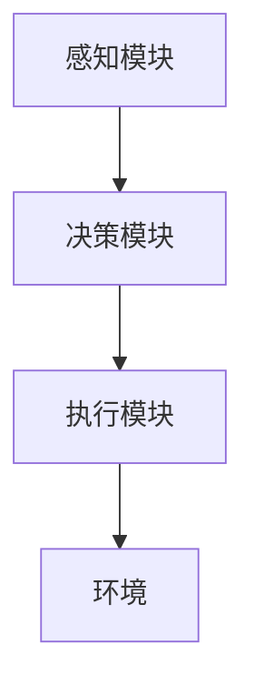
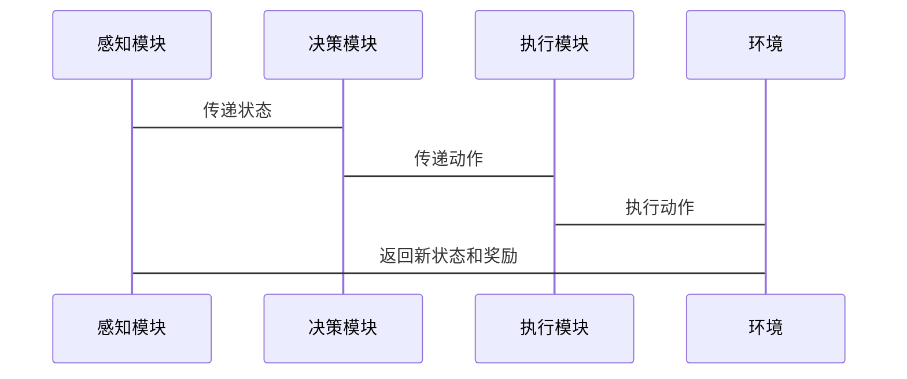

                 


# AI Agent中的强化学习与探索策略优化

## 关键词：AI Agent、强化学习、探索策略优化、DQN、ε-greedy、状态空间、动作空间

## 摘要：本文详细探讨了AI Agent中的强化学习与探索策略优化，从基本概念到核心算法，再到实际应用，全面解析了如何通过优化探索策略提升AI Agent的性能。通过分析Q-learning和DQN算法，以及ε-greedy、UCB等探索策略，本文为AI Agent的设计与实现提供了理论支持和实践指导。

---

# 第一部分: AI Agent中的强化学习与探索策略优化基础

## 第1章: AI Agent与强化学习概述

### 1.1 AI Agent的基本概念
#### 1.1.1 什么是AI Agent
AI Agent（人工智能代理）是指能够感知环境、自主决策并采取行动的智能体。它可以是一个软件程序、机器人或其他智能系统，旨在通过与环境交互来实现特定目标。

#### 1.1.2 AI Agent的核心特点
- **自主性**：AI Agent能够自主决策，无需外部干预。
- **反应性**：能够实时感知环境并做出反应。
- **目标导向性**：所有行为都以实现特定目标为导向。
- **学习能力**：通过经验改进性能。

#### 1.1.3 AI Agent的应用场景
- **游戏AI**：如棋类游戏中的AI代理。
- **推荐系统**：根据用户行为推荐内容。
- **机器人控制**：如自动驾驶汽车。
- **智能助手**：如Siri、Alexa等。

---

### 1.2 强化学习的基本概念
#### 1.2.1 强化学习的定义
强化学习（Reinforcement Learning, RL）是一种机器学习范式，通过智能体与环境交互，学习采取最优策略以最大化累计奖励。

#### 1.2.2 强化学习的核心要素
- **状态（State）**：环境在某一时刻的描述。
- **动作（Action）**：智能体采取的行为。
- **奖励（Reward）**：智能体采取动作后获得的反馈。
- **策略（Policy）**：智能体选择动作的规则。
- **值函数（Value Function）**：评估状态或动作价值的函数。

#### 1.2.3 强化学习与监督学习的区别
| 特性 | 监督学习 | 强化学习 |
|------|----------|----------|
| 数据 | 标签数据 | 奖励信号 |
| 目标 | 最小化损失 | 最大化累计奖励 |
| 交互 | 无交互 | 有交互 |

---

### 1.3 探索策略优化的重要性
#### 1.3.1 探索策略的定义
探索策略是指智能体在未知环境中尝试不同动作，以发现最优路径或策略的过程。

#### 1.3.2 探索策略在AI Agent中的作用
- **避免盲目行动**：通过探索减少随机性，提高决策的准确性。
- **适应复杂环境**：在动态环境中，探索策略帮助智能体快速调整策略。

#### 1.3.3 优化探索策略的意义
- 提高学习效率。
- 提升智能体的决策质量。
- 增强智能体的泛化能力。

---

### 1.4 本章小结
本章介绍了AI Agent的基本概念、强化学习的核心要素以及探索策略的重要性，为后续章节奠定了基础。

---

## 第2章: 强化学习的核心原理

### 2.1 强化学习的基本框架
#### 2.1.1 状态空间
状态空间是智能体可能遇到的所有状态的集合。例如，在迷宫问题中，状态可以是迷宫中的每个格子。

#### 2.1.2 动作空间
动作空间是智能体在每个状态下可以执行的所有动作的集合。例如，在迷宫问题中，动作可以是“左”、“右”、“上”、“下”。

#### 2.1.3 奖励机制
奖励机制是智能体行为的反馈机制，通过奖励或惩罚来引导智能体做出最优决策。

---

### 2.2 Q-learning算法
#### 2.2.1 Q-learning的基本原理
Q-learning是一种基于值函数的强化学习算法，通过更新Q值表来学习最优策略。

#### 2.2.2 Q-learning的数学模型
Q值更新公式：
$$ Q(s, a) \leftarrow Q(s, a) + \alpha [r + \gamma \max Q(s', a') - Q(s, a)] $$
其中：
- $\alpha$ 是学习率。
- $\gamma$ 是折扣因子。
- $s$ 是当前状态。
- $a$ 是当前动作。
- $s'$ 是下一个状态。
- $r$ 是奖励。

#### 2.2.3 Q-learning的优缺点
- 优点：简单易实现。
- 缺点：需要离散状态和动作空间。

---

### 2.3 DQN算法
#### 2.3.1 DQN的提出背景
DQN（Deep Q-Network）是为了解决高维状态空间问题而提出的深度强化学习算法。

#### 2.3.2 DQN的核心思想
使用深度神经网络近似Q值函数，通过经验回放和目标网络提升学习稳定性。

#### 2.3.3 DQN的网络结构
- **输入层**：接收状态信息。
- **隐藏层**：提取特征。
- **输出层**：输出每个动作的Q值。

---

### 2.4 本章小结
本章详细介绍了强化学习的基本框架、Q-learning算法和DQN算法，为后续章节的探索策略优化奠定了理论基础。

---

## 第3章: 探索策略的核心概念与算法

### 3.1 探索策略的基本概念
#### 3.1.1 探索与利用的平衡
探索策略的核心在于在探索新动作和利用已知最优动作之间找到平衡点。

#### 3.1.2 探索策略的目标
- 提高智能体的适应能力。
- 提升智能体的学习效率。

#### 3.1.3 探索策略的分类
- **贪婪策略**：以概率选择最优动作。
- **随机策略**：随机选择动作。

---

### 3.2 常见的探索策略算法
#### 3.2.1 ε-greedy算法
ε-greedy算法通过在每次选择动作时，以概率ε选择随机动作，以概率1-ε选择当前最优动作。

#### 3.2.2 上界信心算法（UCB）
UCB算法通过平衡探索和利用，选择具有最高上界信心的动作。

#### 3.2.3 Thompson Sampling算法
Thompson Sampling算法通过概率分布选择动作，动态调整探索策略。

---

### 3.3 探索策略的优缺点对比
| 策略 | 优点 | 缺点 |
|------|------|------|
| ε-greedy | 实现简单 | 需要手动设置ε值 |
| UCB | 自适应性强 | 计算复杂 |
| Thompson Sampling | 动态调整 | 需要概率建模 |

---

### 3.4 本章小结
本章分析了常见探索策略的优缺点，为后续章节的策略优化提供了参考。

---

## 第4章: 强化学习在AI Agent中的应用

### 4.1 AI Agent中的状态空间设计
#### 4.1.1 状态空间的定义
状态空间是AI Agent在环境中可能遇到的所有状态的集合。

#### 4.1.2 状态空间的构建方法
- **离散化**：将连续状态离散化为离散状态。
- **特征提取**：提取状态的关键特征。

---

### 4.2 AI Agent中的动作空间设计
#### 4.2.1 动作空间的定义
动作空间是AI Agent在每个状态下可以执行的所有动作的集合。

#### 4.2.2 动作空间的构建方法
- **离散化**：将连续动作离散化为离散动作。
- **动作优先级**：根据优先级排序动作。

---

### 4.3 AI Agent中的奖励机制设计
#### 4.3.1 奖励机制的定义
奖励机制是AI Agent行为的反馈机制，通过奖励或惩罚来引导智能体做出最优决策。

#### 4.3.2 奖励机制的设计原则
- **明确性**：奖励应明确指向目标。
- **及时性**：奖励应及时给予。
- **一致性**：奖励应一致。

---

### 4.4 本章小结
本章讨论了AI Agent中的状态空间、动作空间和奖励机制设计，为强化学习的应用提供了指导。

---

## 第5章: AI Agent的系统架构设计

### 5.1 系统架构设计
#### 5.1.1 系统功能模块
- **感知模块**：接收环境反馈。
- **决策模块**：执行强化学习算法。
- **执行模块**：执行动作。

#### 5.1.2 系统架构图


---

### 5.2 系统接口设计
- **输入接口**：接收环境状态。
- **输出接口**：输出动作。

---

### 5.3 系统交互流程


---

### 5.4 本章小结
本章详细讨论了AI Agent的系统架构设计，为后续章节的项目实现提供了指导。

---

## 第6章: 项目实战

### 6.1 环境配置
- **Python版本**：3.8及以上。
- **依赖库**：安装TensorFlow、Keras、OpenAI Gym等。

---

### 6.2 系统核心实现源代码
```python
import gym
import numpy as np

# 初始化环境
env = gym.make('CartPole-v0')
env.seed(42)

# 超参数设置
gamma = 0.99
epsilon = 1.0
epsilon_min = 0.01
epsilon_decay = 0.995
learning_rate = 0.001

# 神经网络模型
model = Sequential()
model.add(Dense(32, activation='relu', input_dim=4))
model.add(Dense(2, activation='linear'))
model.compile(optimizer=Adam(lr=learning_rate), loss='mse')

# 训练过程
for episode in range(1000):
    state = env.reset()
    while True:
        # 探索策略
        if np.random.random() < epsilon:
            action = env.action_space.sample()
        else:
            q_values = model.predict(np.array([state]))
            action = np.argmax(q_values[0])
        
        # 执行动作
        next_state, reward, done, _ = env.step(action)
        
        # 记忆经验
        target = q_values.copy()
        if done:
            target[0][action] = reward
        else:
            next_q_values = model.predict(np.array([next_state]))
            target[0][action] = reward + gamma * np.max(next_q_values[0])
        
        # 更新Q值
        model.fit(np.array([state]), target, epochs=1, verbose=0)
        
        # 更新参数
        state = next_state
        epsilon = max(epsilon_min, epsilon * epsilon_decay)
        
        if done:
            break
```

---

### 6.3 代码应用解读与分析
- **环境配置**：使用OpenAI Gym的CartPole环境。
- **神经网络模型**：使用Keras构建DQN网络。
- **训练过程**：通过不断迭代，优化Q值表。

---

### 6.4 实际案例分析
在CartPole环境中，通过训练，AI Agent能够保持杆子平衡，最终达到稳定状态。

---

### 6.5 本章小结
本章通过实际项目展示了AI Agent的实现过程，包括环境配置、模型构建和训练过程。

---

## 第7章: 扩展与展望

### 7.1 研究热点
- **多智能体协作**：研究多个AI Agent协作的强化学习方法。
- **复杂环境建模**：探索更高维状态空间的建模方法。

---

### 7.2 未来趋势
- **强化学习与博弈论结合**：研究智能体在博弈环境中的决策优化。
- **强化学习与深度学习结合**：探索更高效的深度强化学习算法。

---

### 7.3 最佳实践 tips
- **合理设置超参数**：如ε值、学习率等。
- **选择合适的算法**：根据问题选择适合的强化学习算法。
- **持续优化模型**：通过回放记忆和目标网络提升学习效果。

---

### 7.4 本章小结
本章讨论了强化学习与探索策略优化的未来研究方向，并总结了实际应用中的注意事项。

---

## 作者：AI天才研究院/AI Genius Institute & 禅与计算机程序设计艺术 /Zen And The Art of Computer Programming

---

本文通过详细分析AI Agent中的强化学习与探索策略优化，为读者提供了从理论到实践的全面指导。通过系统架构设计和项目实战，帮助读者更好地理解如何优化AI Agent的性能。希望本文能为相关领域的研究和应用提供有价值的参考。

