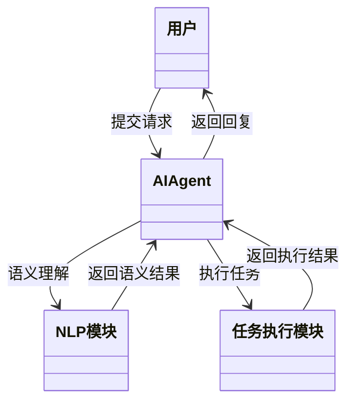
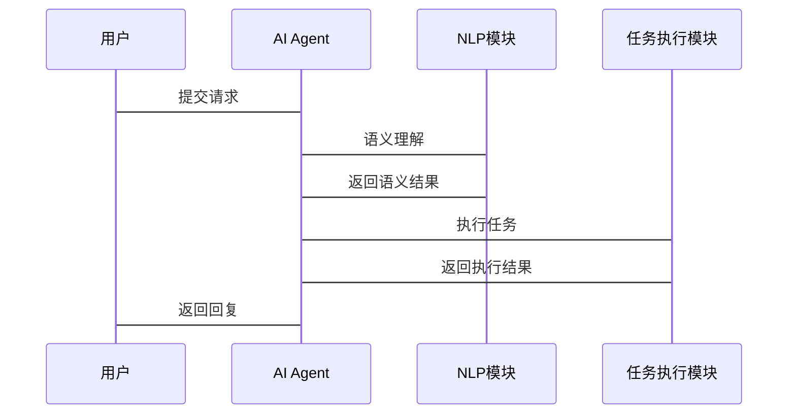

                 


# AI Agent中的自然语言处理应用

> 关键词：自然语言处理、AI Agent、NLP算法、系统架构、项目实战

> 摘要：本文详细探讨了自然语言处理（NLP）在AI Agent中的应用，从核心概念、算法原理到系统架构和项目实战，全面解析了NLP如何赋能AI Agent的语义理解与人机交互能力。文章结合实际案例，深入分析了NLP在信息抽取、情感分析和对话生成等任务中的具体应用，并提供了详细的代码实现和系统设计，帮助读者全面理解AI Agent中的自然语言处理技术。

---

# 第1章: 自然语言处理的背景与AI Agent的概念

## 1.1 自然语言处理的背景

### 1.1.1 自然语言处理的定义

自然语言处理（Natural Language Processing，NLP）是计算机科学与人工智能领域的重要分支，旨在研究如何让计算机理解和处理人类语言。NLP的目标是实现人与计算机之间的有效沟通，使计算机能够理解、解析、生成和操作人类语言。

### 1.1.2 自然语言处理的发展历程

1. **早期阶段（20世纪50年代-60年代）**：基于规则的NLP系统，如 SHRDLU 和 ELIZA。
2. **统计学习阶段（20世纪90年代）**：利用统计模型，如隐马尔可夫模型（HMM）和条件随机场（CRF）。
3. **深度学习阶段（2010年至今）**：基于神经网络的NLP模型，如词嵌入（Word2Vec）、循环神经网络（RNN）和Transformer模型。

### 1.1.3 自然语言处理的核心任务

- **词法分析**：分词、词性标注。
- **句法分析**：语法树构建、依存关系分析。
- **语义分析**：实体识别、关系抽取、语义角色标注。
- **文本生成**：文本摘要、机器翻译、对话生成。

## 1.2 AI Agent的基本概念

### 1.2.1 AI Agent的定义

AI Agent（人工智能代理）是指能够感知环境、自主决策并执行任务的智能实体。AI Agent可以是软件程序、机器人或其他智能系统，其核心能力包括感知、推理、决策和执行。

### 1.2.2 AI Agent的分类

- **简单反射型Agent**：基于简单的规则做出反应。
- **基于模型的反应型Agent**：利用环境模型进行决策。
- **目标驱动型Agent**：基于目标进行规划和执行。
- **效用驱动型Agent**：基于效用函数优化决策。

### 1.2.3 AI Agent与传统程序的区别

- **自主性**：AI Agent能够自主决策，而传统程序依赖于外部指令。
- **反应性**：AI Agent能够实时感知环境并做出反应，而传统程序基于预定义逻辑。
- **学习能力**：AI Agent能够通过经验改进性能，而传统程序无法学习。

## 1.3 自然语言处理与AI Agent的结合

### 1.3.1 自然语言处理在AI Agent中的作用

- 提供语义理解能力，使AI Agent能够理解人类语言。
- 支持人机交互，使AI Agent能够通过自然语言与用户沟通。
- 增强AI Agent的任务执行能力，使其能够处理复杂的语言任务。

### 1.3.2 AI Agent中的自然语言处理应用场景

- **对话系统**：智能客服、虚拟助手。
- **信息抽取**：从文本中提取关键信息。
- **情感分析**：分析文本情感倾向。
- **文本生成**：自动生成文本内容。

### 1.3.3 自然语言处理与AI Agent的未来发展

随着NLP技术的进步，AI Agent将具备更强的语义理解和生成能力，实现更自然的人机交互。未来的AI Agent将更加智能化，能够处理多种语言、理解上下文，并具备推理能力。

---

# 第2章: 自然语言处理的核心概念与AI Agent的联系

## 2.1 自然语言处理的核心概念

### 2.1.1 词嵌入

词嵌入是一种将词表示为低维向量的方法，常用技术包括Word2Vec、GloVe和FastText。

### 2.1.2 语言模型

语言模型通过概率分布预测下一个词，常用模型包括n-gram模型、循环神经网络（RNN）和Transformer模型。

### 2.1.3 机器翻译

机器翻译通过将一种语言翻译成另一种语言，常用技术包括基于统计的机器翻译和神经机器翻译。

## 2.2 AI Agent中的自然语言处理应用

### 2.2.1 信息抽取

信息抽取从文本中提取实体、关系和事件信息，常用于知识图谱构建和问答系统。

### 2.2.2 情感分析

情感分析识别文本中的情感倾向，常用于社交媒体分析和产品评价。

### 2.2.3 对话生成

对话生成通过生成自然的对话回复，常用于智能客服和虚拟助手。

## 2.3 自然语言处理与AI Agent的联系

### 2.3.1 自然语言处理为AI Agent提供语义理解能力

NLP技术使AI Agent能够理解用户输入的自然语言文本。

### 2.3.2 AI Agent通过自然语言处理实现人机交互

AI Agent利用NLP技术与用户进行自然语言对话，提供服务。

### 2.3.3 自然语言处理在AI Agent中的具体应用案例

- **智能客服**：通过NLP技术理解用户问题并生成回答。
- **虚拟助手**：通过NLP技术实现语音交互和任务执行。

## 2.4 本章小结

本章介绍了自然语言处理的核心概念，并分析了其在AI Agent中的具体应用，强调了NLP技术对AI Agent语义理解和人机交互的重要性。

---

# 第3章: 自然语言处理的核心算法与AI Agent的结合

## 3.1 自然语言处理的核心算法

### 3.1.1 词嵌入算法

词嵌入算法通过训练模型将词表示为低维向量，常用算法包括Word2Vec、GloVe和FastText。

### 3.1.2 语言模型算法

语言模型算法通过概率分布预测下一个词，常用模型包括n-gram模型、循环神经网络（RNN）和Transformer模型。

### 3.1.3 机器翻译算法

机器翻译算法通过将一种语言翻译成另一种语言，常用技术包括基于统计的机器翻译和神经机器翻译。

## 3.2 AI Agent中的自然语言处理算法应用

### 3.2.1 信息抽取算法

信息抽取算法从文本中提取实体、关系和事件信息，常用于知识图谱构建和问答系统。

### 3.2.2 情感分析算法

情感分析算法识别文本中的情感倾向，常用于社交媒体分析和产品评价。

### 3.2.3 对话生成算法

对话生成算法通过生成自然的对话回复，常用于智能客服和虚拟助手。

## 3.3 自然语言处理算法与AI Agent的结合

### 3.3.1 基于词嵌入的AI Agent语义理解

AI Agent利用词嵌入技术理解文本语义，实现信息抽取和情感分析。

### 3.3.2 基于语言模型的AI Agent对话生成

AI Agent利用语言模型生成对话回复，实现自然语言对话。

### 3.3.3 基于机器翻译的AI Agent多语言支持

AI Agent利用机器翻译技术支持多种语言交互。

## 3.4 本章小结

本章介绍了自然语言处理的核心算法，并分析了其在AI Agent中的具体应用，强调了NLP算法对AI Agent语义理解和人机交互的重要性。

---

# 第4章: 自然语言处理的数学模型与AI Agent的实现

## 4.1 自然语言处理的数学模型

### 4.1.1 词嵌入的数学模型

词嵌入模型通过训练目标函数将词表示为低维向量。

$$ \text{目标函数} = \sum_{i=1}^n \log p(w_i) $$

其中，$p(w_i)$是词$w_i$的概率。

### 4.1.2 语言模型的数学模型

语言模型通过概率分布预测下一个词，常用模型包括n-gram模型、循环神经网络（RNN）和Transformer模型。

$$ P(w_1, w_2, \dots, w_n) = \prod_{i=1}^n P(w_i | w_1, w_2, \dots, w_{i-1}) $$

### 4.1.3 机器翻译的数学模型

机器翻译模型通过将源语言翻译成目标语言，常用技术包括基于统计的机器翻译和神经机器翻译。

$$ \text{翻译模型} = \argmax_{y} P(y|x) $$

其中，$x$是源语言句子，$y$是目标语言句子。

## 4.2 AI Agent中的自然语言处理数学模型应用

### 4.2.1 信息抽取的数学模型

信息抽取模型通过概率分布识别文本中的实体和关系。

$$ P(\text{实体}|w) = \frac{\text{计数}(\text{实体},w)}{\text{总词数}(w)} $$

### 4.2.2 情感分析的数学模型

情感分析模型通过分类算法识别文本情感倾向。

$$ \text{分类器} = \argmax_{y \in \{正, 负\}} P(y|\text{文本}) $$

### 4.2.3 对话生成的数学模型

对话生成模型通过生成模型生成对话回复。

$$ \text{生成模型} = \argmax_{y} P(y|x) $$

其中，$x$是输入文本，$y$是生成回复。

## 4.3 本章小结

本章介绍了自然语言处理的数学模型，并分析了其在AI Agent中的具体应用，强调了数学模型对AI Agent语义理解和人机交互的重要性。

---

# 第5章: 自然语言处理的系统分析与架构设计

## 5.1 系统分析

### 5.1.1 问题场景介绍

以一个智能客服系统为例，用户通过自然语言与AI Agent交互，AI Agent通过NLP技术理解用户需求并生成回复。

### 5.1.2 系统功能设计

- 用户输入：支持文本和语音输入。
- 语义理解：通过NLP技术理解用户需求。
- 任务执行：根据理解的需求执行相应任务。
- 回馈输出：生成自然语言回复。

## 5.2 系统架构设计

### 5.2.1 领域模型设计

使用Mermaid类图展示领域模型：



### 5.2.2 系统架构设计

使用Mermaid架构图展示系统架构：


### 5.2.3 系统接口设计

- **输入接口**：用户输入接口，支持文本和语音输入。
- **输出接口**：生成回复接口，支持文本和语音输出。
- **API接口**：与其他系统交互的接口。

### 5.2.4 系统交互设计

使用Mermaid序列图展示系统交互：



## 5.3 本章小结

本章通过对AI Agent系统的分析与架构设计，展示了NLP技术在系统中的具体应用，强调了系统设计的重要性。

---

# 第6章: 自然语言处理的项目实战

## 6.1 环境安装

### 6.1.1 安装Python环境

```bash
python --version
pip install --upgrade pip
```

### 6.1.2 安装NLP库

```bash
pip install numpy
pip install scikit-learn
pip install transformers
```

## 6.2 系统核心实现

### 6.2.1 信息抽取实现

```python
from transformers import pipeline

ner = pipeline("ner")
result = ner("This is a test sentence.")
print(result)
```

### 6.2.2 情感分析实现

```python
from transformers import pipeline

sentiment = pipeline("sentiment-analysis")
result = sentiment("This is a positive sentence.")
print(result)
```

### 6.2.3 对话生成实现

```python
from transformers import pipeline

text_generator = pipeline("text-generation")
result = text_generator("Hello, how are you?")
print(result)
```

## 6.3 代码应用解读与分析

### 6.3.1 信息抽取代码解读

```python
from transformers import pipeline

ner = pipeline("ner")
result = ner("This is a test sentence.")
print(result)
```

上述代码使用了Transformers库中的命名实体识别（NER）模型，能够识别文本中的实体信息。

### 6.3.2 情感分析代码解读

```python
from transformers import pipeline

sentiment = pipeline("sentiment-analysis")
result = sentiment("This is a positive sentence.")
print(result)
```

上述代码使用了Transformers库中的情感分析模型，能够识别文本的情感倾向。

### 6.3.3 对话生成代码解读

```python
from transformers import pipeline

text_generator = pipeline("text-generation")
result = text_generator("Hello, how are you?")
print(result)
```

上述代码使用了Transformers库中的文本生成模型，能够生成自然语言对话回复。

## 6.4 案例分析与总结

通过上述代码实现，我们可以看到NLP技术在AI Agent中的具体应用。信息抽取、情感分析和对话生成等任务的实现，展示了NLP技术在AI Agent中的重要性。

---

# 第7章: 自然语言处理的最佳实践

## 7.1 小结

本文详细探讨了自然语言处理在AI Agent中的应用，从核心概念、算法原理到系统架构和项目实战，全面解析了NLP如何赋能AI Agent的语义理解与人机交互能力。

## 7.2 注意事项

- **数据质量**：确保训练数据的质量和多样性。
- **模型选择**：根据任务需求选择合适的NLP模型。
- **系统优化**：优化系统架构和性能，提升用户体验。

## 7.3 拓展阅读

- **书籍推荐**：
  - 《自然语言处理入门》
  - 《深度学习入门：基于Python的理论与实践》
- **论文推荐**：
  - "Attention Is All You Need"
  - "BERT: Pre-training of Deep Bidirectional Transformers for NLP"

---

# 作者

作者：AI天才研究院/AI Genius Institute & 禅与计算机程序设计艺术/Zen And The Art of Computer Programming

