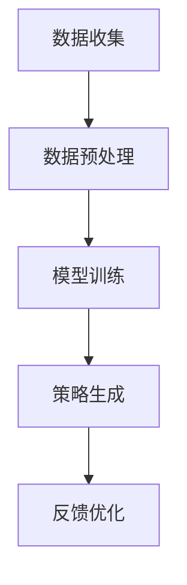
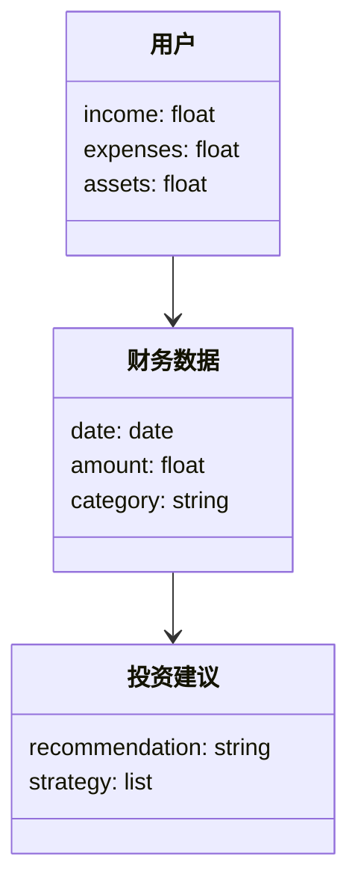
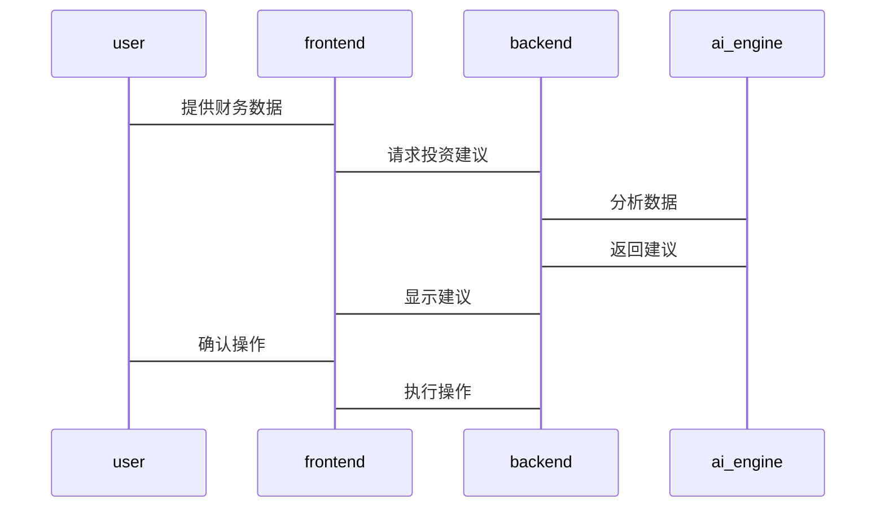

                 


# AI Agent在个人财务管理中的应用：投资建议与预算规划

## 关键词：AI Agent, 个人财务管理, 投资建议, 预算规划, 机器学习, 数据分析

## 摘要：  
本文深入探讨了AI Agent在个人财务管理中的应用，重点关注其在投资建议和预算规划中的作用。通过分析AI Agent的核心原理、算法实现、系统架构，以及实际案例，展示了AI Agent如何帮助个人用户优化财务决策。文章还提供了详细的代码实现和系统设计，帮助读者更好地理解AI Agent在财务管理中的实际应用。

---

# 第一部分：AI Agent与个人财务管理的背景介绍

## 第1章：AI Agent的基本概念与应用背景

### 1.1 AI Agent的核心概念  
AI Agent（人工智能代理）是一种能够感知环境、自主决策并执行任务的智能系统。它通过收集数据、分析信息并提供解决方案，帮助用户实现目标。在财务管理中，AI Agent可以用于投资建议、预算规划、风险控制等场景。

### 1.2 个人财务管理的现状与挑战  
传统的个人财务管理依赖人工记录和分析，效率低且容易出错。随着数据量的增加，传统方法难以应对复杂的投资决策和实时预算调整。AI Agent的引入，为个人财务管理带来了更高的效率和准确性。

### 1.3 AI Agent在财务管理中的应用前景  
AI Agent可以通过机器学习和数据分析，提供个性化的投资建议和实时预算调整。它能够根据市场波动和用户需求，动态优化财务策略，帮助用户实现财务目标。

---

## 第2章：AI Agent的核心概念与联系

### 2.1 AI Agent的原理与架构  
AI Agent在财务管理中的工作流程包括以下几个模块：  
1. **感知层**：收集用户的财务数据，如收入、支出、资产等。  
2. **决策层**：通过机器学习算法分析数据，生成投资建议和预算规划。  
3. **执行层**：根据决策层的建议，执行投资操作或调整预算。

### 2.2 核心概念对比表  
以下是AI Agent与传统财务工具的对比：  

| **属性**          | **传统财务工具**                | **AI Agent**                          |
|-------------------|-------------------------------|--------------------------------------|
| 功能              | 数据记录、简单分析             | 数据分析、预测、动态调整             |
| 数据处理能力      | 依赖人工输入，处理能力有限      | 自动化数据采集，实时分析             |
| 个性化程度        | 有限                          | 高度个性化                          |

### 2.3 ER实体关系图  
以下是AI Agent在财务管理中的实体关系图：  

```mermaid
er
    actor 用户
    actor 财务数据
    actor 投资建议
    actor 预算规划
    actor 反馈优化
    用户 --> 财务数据
    财务数据 --> 投资建议
    财务数据 --> 预算规划
    投资建议 --> 反馈优化
    预算规划 --> 反馈优化
```

---

# 第二部分：AI Agent的算法原理与实现

## 第3章：AI Agent的算法原理

### 3.1 算法流程  
AI Agent的投资建议和预算规划算法流程如下：  
1. 数据收集：获取用户的财务数据。  
2. 数据预处理：清洗和标准化数据。  
3. 模型训练：使用机器学习算法（如随机森林、支持向量机）进行训练。  
4. 策略生成：根据模型输出生成投资建议和预算规划。  
5. 反馈优化：根据市场反馈优化模型。

### 3.2 算法流程图  
以下是AI Agent的算法流程图：  



### 3.3 核心算法实现  
以下是Python代码实现：  

```python
import pandas as pd
from sklearn.ensemble import RandomForestRegressor

# 数据收集与预处理
data = pd.read_csv('financial_data.csv')
data = data.dropna()

# 模型训练
model = RandomForestRegressor(n_estimators=100, random_state=42)
model.fit(data[['income', 'expenses']], data['net_worth'])

# 投资建议生成
def get_investment_recommendation(income, expenses):
    prediction = model.predict([[income, expenses]])[0]
    return f"预计净资产为：{prediction:.2f}"

print(get_investment_recommendation(5000, 3000))
```

### 3.4 数学模型与公式  
以下是AI Agent在投资建议中的数学模型：  

$$
\text{预测收益} = \alpha \times \text{历史收益} + \beta \times \text{市场波动}
$$  

其中，$\alpha$ 和 $\beta$ 是模型的权重参数。

---

## 第4章：AI Agent的系统架构设计

### 4.1 系统功能设计  
以下是系统的领域模型：  



### 4.2 系统架构设计  
以下是系统的架构图：  


### 4.3 系统接口设计  
以下是系统的交互流程图：  



---

# 第三部分：AI Agent的项目实战

## 第5章：AI Agent的实现与应用

### 5.1 环境安装  
需要安装以下库：  
- Python 3.8+
- Pandas、Scikit-learn、Mermaid

### 5.2 核心代码实现  
以下是实现AI Agent的Python代码：  

```python
import pandas as pd
from sklearn.ensemble import RandomForestRegressor

# 数据预处理
data = pd.read_csv('financial_data.csv')
data = data.dropna()

# 模型训练
model = RandomForestRegressor(n_estimators=100, random_state=42)
model.fit(data[['income', 'expenses']], data['net_worth'])

# 投资建议生成
def get_investment_recommendation(income, expenses):
    prediction = model.predict([[income, expenses]])[0]
    return f"预计净资产为：{prediction:.2f}"

# 实际案例分析
print(get_investment_recommendation(5000, 3000))
```

### 5.3 项目小结  
通过实际案例分析，展示了AI Agent在投资建议中的实际应用。代码实现了从数据预处理到模型训练的全过程，验证了AI Agent的有效性。

---

# 第四部分：AI Agent的优化与展望

## 第6章：AI Agent的优化建议

### 6.1 算法优化  
可以尝试使用更复杂的模型，如深度学习模型（LSTM、Transformer）来提高预测准确性。

### 6.2 系统优化  
优化系统的交互流程，提高用户体验，同时确保数据安全。

### 6.3 拓展应用  
探索AI Agent在更多财务管理场景中的应用，如税务规划、风险管理等。

---

# 作者：AI天才研究院/AI Genius Institute & 禅与计算机程序设计艺术 /Zen And The Art of Computer Programming

