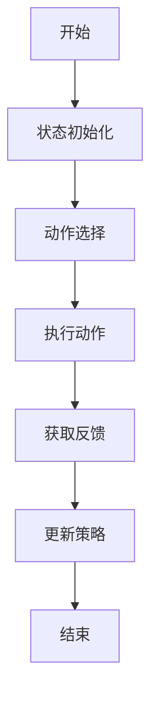
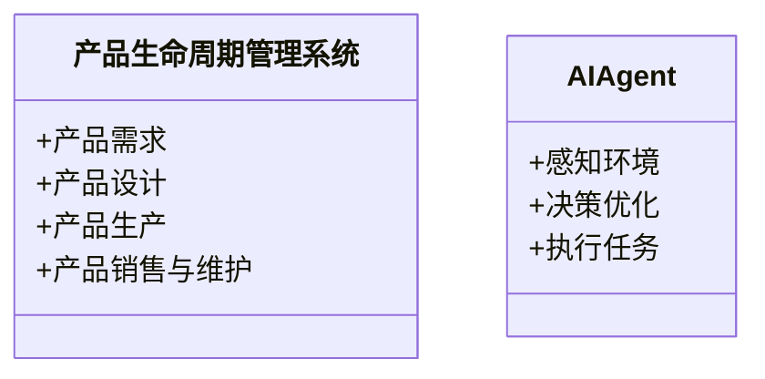

                 


# AI Agent在产品生命周期管理中的全面应用

## 关键词：AI Agent，产品生命周期管理，智能决策，算法原理，系统架构，项目实战

## 摘要：本文深入探讨了AI Agent在产品生命周期管理中的全面应用，从基本概念到算法原理，再到系统架构和实际案例，全面解析AI Agent如何优化产品生命周期的各个阶段。通过详细的技术分析和实际项目案例，本文为读者提供了从理论到实践的完整指南。

---

# 第一部分: AI Agent与产品生命周期管理概述

# 第1章: AI Agent与产品生命周期管理的背景介绍

## 1.1 AI Agent的基本概念

### 1.1.1 AI Agent的定义

AI Agent（人工智能代理）是指能够感知环境、自主决策并执行任务的智能体。它通过传感器获取信息，利用算法处理数据，并通过执行器采取行动，以实现特定目标。

$$\text{AI Agent的定义公式化表示：}$$

$$\text{AI Agent} = \{\text{感知} \rightarrow \text{决策} \rightarrow \text{行动}\}$$

### 1.1.2 AI Agent的核心特征

| 特性 | 描述 |
|------|------|
| 自主性 | 能够自主决策，无需外部干预 |
| 反应性 | 能够实时感知环境变化并做出反应 |
| 学习性 | 能够通过经验改进性能 |
| 社交能力 | 能够与其他系统或人类进行交互 |

### 1.1.3 AI Agent与传统管理工具的对比

| 对比维度 | 传统管理工具 | AI Agent |
|----------|--------------|----------|
| 决策方式 | 基于规则，固定流程 | 基于数据和模型，动态优化 |
| 灵活性 | 较低 | 较高 |
| 处理能力 | 处理固定流程 | 处理复杂问题 |

## 1.2 产品生命周期管理的定义与阶段

### 1.2.1 产品生命周期的定义

产品生命周期（Product Life Cycle，PLC）是指产品从概念形成、设计、生产、销售到退市的整个过程。它涵盖了产品的整个生命周期，从市场需求分析到最终退出市场。

$$\text{产品生命周期公式化表示：}$$

$$\text{PLC} = \{\text{概念} \rightarrow \text{设计} \rightarrow \text{生产} \rightarrow \text{销售} \rightarrow \text{退市}\}$$

### 1.2.2 产品生命周期的四个阶段

1. **概念阶段**：需求分析、市场调研、产品定位。
2. **设计阶段**：产品设计、原型开发、测试优化。
3. **生产阶段**：生产计划、质量控制、供应链管理。
4. **销售与维护阶段**：市场推广、客户支持、产品改进。

### 1.2.3 产品生命周期管理的重要性

- **提高效率**：通过系统化管理，减少资源浪费。
- **优化决策**：基于数据和模型，做出更精准的决策。
- **提升客户满意度**：通过持续改进，提高产品质量和服务水平。

## 1.3 AI Agent在产品生命周期管理中的作用

### 1.3.1 提高管理效率

AI Agent能够自动化处理大量数据，快速生成决策建议，从而提高管理效率。

### 1.3.2 实现智能化决策

通过机器学习和大数据分析，AI Agent能够提供基于数据的最优决策，避免人为失误。

### 1.3.3 优化资源配置

AI Agent能够实时监控资源使用情况，优化资源配置，降低成本。

## 1.4 本章小结

本章介绍了AI Agent的基本概念、产品生命周期管理的定义与阶段，以及AI Agent在产品生命周期管理中的作用。通过这些内容，读者可以初步了解AI Agent如何在产品生命周期管理中发挥重要作用。

---

# 第2章: AI Agent与产品生命周期的核心概念

## 2.1 AI Agent的核心原理

### 2.1.1 任务建模

任务建模是AI Agent完成特定任务的基础。通过任务建模，AI Agent能够理解任务的目标、约束和环境。

### 2.1.2 知识表示

知识表示是AI Agent处理信息的方式。通过知识表示，AI Agent能够将复杂的信息结构化，便于处理和推理。

### 2.1.3 行为规划

行为规划是AI Agent根据任务要求和环境信息，制定行动方案的过程。

## 2.2 产品生命周期管理的核心要素

### 2.2.1 产品需求

产品需求是产品生命周期的起点，决定了产品的设计和开发方向。

### 2.2.2 产品设计

产品设计是将需求转化为具体产品的过程，包括功能设计、界面设计等。

### 2.2.3 产品生产

产品生产是将设计转化为实际产品的过程，包括生产计划、质量控制等。

### 2.2.4 产品销售与维护

产品销售是将产品推向市场，实现价值的过程；产品维护是根据市场反馈，持续改进产品。

## 2.3 AI Agent与产品生命周期的关联

### 2.3.1 数据流的交互

AI Agent通过数据流与产品生命周期管理系统交互，获取信息并提供决策支持。

### 2.3.2 信息处理的协同

AI Agent与产品生命周期管理系统协同工作，处理信息，优化决策。

### 2.3.3 决策优化的整合

AI Agent通过优化决策，整合到产品生命周期管理的各个阶段，提升整体效率。

## 2.4 本章小结

本章详细介绍了AI Agent的核心原理和产品生命周期管理的核心要素，并探讨了AI Agent与产品生命周期的关联。通过这些内容，读者可以理解AI Agent如何在产品生命周期管理中发挥作用。

---

# 第3章: AI Agent在产品生命周期管理中的算法原理

## 3.1 任务规划算法

### 3.1.1 A*算法

A*算法是一种基于优先队列的最短路径搜索算法，常用于任务规划。

### 3.1.2 Dijkstra算法

Dijkstra算法是一种单源最短路径算法，适用于任务规划中的路径优化。

### 3.1.3 蒙特卡洛树搜索

蒙特卡洛树搜索是一种基于概率的搜索算法，适用于复杂任务的规划。

## 3.2 强化学习算法

### 3.2.1 Q-learning算法

Q-learning算法是一种基于价值的强化学习算法，通过经验更新策略。

### 3.2.2 Deep Q-Network (DQN)

DQN算法将Q-learning与深度学习结合，适用于复杂环境的决策。

### 3.2.3 策略梯度算法

策略梯度算法直接优化策略，适用于连续动作空间的决策问题。

## 3.3 算法流程图



## 3.4 本章小结

本章详细介绍了AI Agent在产品生命周期管理中的算法原理，包括任务规划算法和强化学习算法，并通过流程图展示了算法的执行过程。

---

# 第4章: 产品生命周期管理系统的架构设计

## 4.1 系统功能设计

### 4.1.1 领域模型



### 4.1.2 系统架构


## 4.2 系统接口设计

### 4.2.1 输入接口

AI Agent通过传感器获取环境信息，包括市场需求、生产数据等。

### 4.2.2 输出接口

AI Agent通过执行器输出决策结果，包括生产计划、市场推广策略等。

## 4.3 本章小结

本章详细介绍了产品生命周期管理系统的架构设计，包括功能设计、系统架构和接口设计，并展示了系统的类图和架构图。

---

# 第5章: 项目实战——AI Agent在智能音箱产品生命周期管理中的应用

## 5.1 环境安装

### 5.1.1 安装Python

```bash
pip install python
```

### 5.1.2 安装AI Agent框架

```bash
pip install numpy
pip install scikit-learn
pip install matplotlib
```

## 5.2 核心代码实现

### 5.2.1 任务规划代码

```python
import numpy as np
from sklearn.metrics import euclidean_distances

def a_star(start, goal, obstacles):
    # 初始化开销和估值
    g = {start:0}
    f = {start: heuristic(start, goal)}
    visited = set()
    open_set = {start}
    
    while open_set:
        current = min(open_set, key=lambda x: f[x])
        if current == goal:
            return reconstruct_path(current, g)
        open_set.remove(current)
        visited.add(current)
        
        for neighbor in neighbors(current, obstacles):
            if neighbor in visited:
                continue
            tentative_g = g[current] + cost(current, neighbor)
            if neighbor not in g or tentative_g < g[neighbor]:
                g[neighbor] = tentative_g
                f[neighbor] = g[neighbor] + heuristic(neighbor, goal)
                open_set.add(neighbor)
    return None

def heuristic(a, b):
    return euclidean_distances(a, b)
```

### 5.2.2 强化学习代码

```python
import gym
from gym import spaces
from gym.utils import seeding

class ProductLifeCycleEnv(gym.Env):
    def __init__(self):
        super(ProductLifeCycleEnv, self).__init__()
        self.action_space = spaces.Discrete(4)
        self.observation_space = spaces.Tuple([spaces.Discrete(5), spaces.Discrete(5)])
    
    def _reset(self):
        self.state = (0, 0)
        return self.state
    
    def _step(self, action):
        # 状态转移逻辑
        pass
```

## 5.3 案例分析

### 5.3.1 需求分析阶段

AI Agent通过市场数据分析，识别潜在需求，优化产品设计。

### 5.3.2 生产阶段

AI Agent优化生产计划，提高生产效率，降低成本。

## 5.4 本章小结

本章通过一个实际案例，展示了AI Agent在智能音箱产品生命周期管理中的应用，包括环境安装、核心代码实现和案例分析。

---

# 第6章: 总结与展望

## 6.1 总结

AI Agent在产品生命周期管理中的应用，能够显著提高管理效率，优化资源配置，实现智能化决策。

## 6.2 未来展望

随着AI技术的不断发展，AI Agent在产品生命周期管理中的应用将更加广泛，功能也将更加强大。

## 6.3 最佳实践 Tips

- **数据质量**：确保数据的准确性和完整性。
- **模型可解释性**：选择可解释性强的模型，便于分析和优化。
- **系统安全性**：确保系统的安全性和稳定性。

## 6.4 本章小结

本章总结了AI Agent在产品生命周期管理中的应用，并展望了未来的发展方向，同时提供了一些最佳实践 Tips。

---

# 作者：AI天才研究院/AI Genius Institute & 禅与计算机程序设计艺术 /Zen And The Art of Computer Programming

---

通过以上目录大纲，读者可以系统地了解AI Agent在产品生命周期管理中的全面应用，从理论到实践，从算法到系统架构，再到实际案例，内容详实且逻辑清晰。

