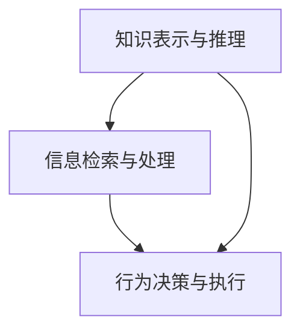
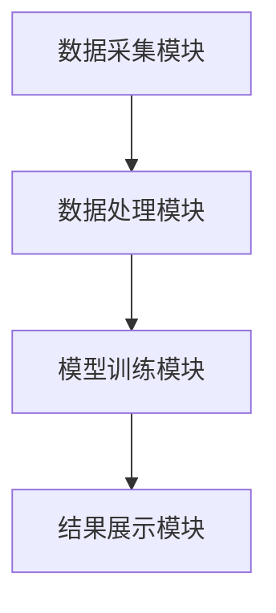
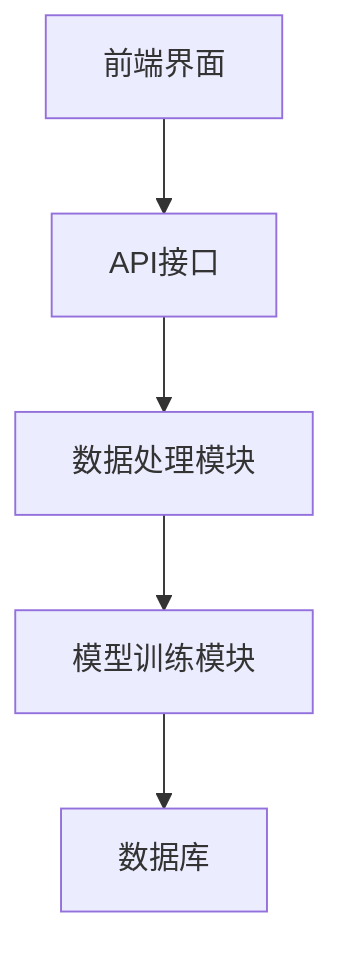

                 


# AI Agent在企业专利分析与技术趋势预测中的应用

## 关键词：AI Agent, 企业专利分析, 技术趋势预测, 自然语言处理, 机器学习, 专利数据挖掘

## 摘要：  
随着人工智能技术的快速发展，AI Agent（智能代理）在企业专利分析与技术趋势预测中的应用越来越广泛。本文将详细介绍AI Agent的基本概念、核心原理及其在专利数据分析中的应用。通过自然语言处理、机器学习等技术，AI Agent能够高效地进行专利数据挖掘、技术热点识别和未来趋势预测，为企业制定技术创新策略提供有力支持。本文还将结合实际案例，探讨AI Agent在企业专利分析中的具体应用场景和技术实现方法。

---

# 第1章 AI Agent与企业专利分析概述

## 1.1 AI Agent的基本概念  
AI Agent是一种智能代理系统，能够通过感知环境、自主决策并执行任务来实现特定目标。与传统数据分析工具相比，AI Agent具有以下核心特征：  
1. **自主性**：能够独立执行任务，无需人工干预。  
2. **反应性**：能够实时感知环境变化并做出响应。  
3. **学习能力**：通过机器学习技术不断优化自身性能。  

## 1.2 企业专利分析的背景与意义  
专利分析是企业制定技术创新战略的重要工具。通过分析专利数据，企业可以识别技术热点、评估竞争对手的技术布局、预测技术发展趋势，并制定相应的研发策略。  

### 1.2.1 专利分析的重要性  
- **技术布局分析**：帮助企业了解自身技术在行业中的位置。  
- **竞争对手分析**：通过分析竞争对手的专利布局，制定针对性的研发策略。  
- **技术趋势预测**：帮助企业提前布局未来的技术发展方向。  

## 1.3 AI Agent在专利分析中的应用前景  
AI Agent能够通过自然语言处理、机器学习等技术，高效地处理海量专利数据，为企业提供智能化的专利分析服务。  

### 1.3.1 AI Agent的优势  
- **高效性**：能够快速处理海量专利数据。  
- **准确性**：通过机器学习算法提高分析结果的准确性。  
- **实时性**：能够实时跟踪技术发展趋势。  

---

# 第2章 AI Agent的核心原理与技术  

## 2.1 AI Agent的体系结构  
AI Agent的体系结构通常包括以下三个模块：  
1. **知识表示与推理**：通过知识图谱或逻辑推理技术，构建专利领域的知识体系。  
2. **信息检索与处理**：利用自然语言处理技术，从专利文本中提取关键词、分类信息等。  
3. **行为决策与执行**：根据分析结果，制定决策并执行相关任务。  

### 2.1.1 AI Agent的体系结构图  


## 2.2 自然语言处理在专利分析中的应用  
自然语言处理（NLP）技术在专利分析中主要用于专利文本的理解与处理。  

### 2.2.1 专利文本的特征提取  
- **分词**：将专利文本中的关键词进行分词处理。  
- **关键词提取**：提取专利文本中的核心关键词，用于分类和检索。  
- **文本相似度计算**：通过余弦相似度或TF-IDF等方法，计算专利之间的相似性。  

### 2.2.2 专利分类与检索  
通过NLP技术，AI Agent可以自动对专利进行分类，并根据用户需求快速检索相关专利。  

## 2.3 机器学习在技术趋势预测中的作用  
机器学习技术在技术趋势预测中主要用于发现数据中的隐含规律。  

### 2.3.1 常见的机器学习算法  
- **支持向量机（SVM）**：用于分类和回归分析。  
- **随机森林（Random Forest）**：用于特征重要性分析和分类预测。  
- **LSTM（长短期记忆网络）**：用于时间序列预测。  

---

# 第3章 专利数据分析与预处理  

## 3.1 专利数据的获取与清洗  
### 3.1.1 数据来源与获取方法  
- **公开专利数据库**：如USPTO、EPO等。  
- **爬虫技术**：从专利网站中抓取专利数据。  

### 3.1.2 数据清洗的必要性  
- **去重**：去除重复的专利记录。  
- **去噪**：去除无效或错误的数据。  
- **标准化**：统一数据格式和编码。  

### 3.1.3 数据清洗的实现代码  
```python
import pandas as pd

# 假设patent_data为原始数据框
# 去重
patent_data.drop_duplicates(subset=['patent_id'], keep='first', inplace=True)

# 去噪
# 假设noise_column为需要清洗的列
patent_data[noise_column].replace({'noise_value': None}, inplace=True)

# 标准化
patent_data['date'] = pd.to_datetime(patent_data['date'])
```

## 3.2 专利文本的特征提取  
### 3.2.1 文本分词与关键词提取  
- **分词工具**：如jieba（中文）或nltk（英文）。  
- **关键词提取**：使用TF-IDF方法提取关键词。  

### 3.2.2 专利分类与技术领域识别  
- **分类方法**：基于关键词的分类或基于向量的分类。  
- **技术领域识别**：通过预定义的分类体系（如IPC分类）进行分类。  

---

# 第4章 基于AI Agent的技术趋势预测算法  

## 4.1 时间序列分析方法  
时间序列分析是一种常用的预测方法，适用于技术趋势的短期预测。  

### 4.1.1 ARIMA模型  
ARIMA（自回归积分滑动平均模型）是一种常用的时间序列预测模型。其数学公式如下：  
$$ ARIMA(p, d, q) $$  
其中，$p$ 表示自回归阶数，$d$ 表示差分阶数，$q$ 表示移动平均阶数。  

### 4.1.2 LSTM网络  
LSTM（长短期记忆网络）是一种基于深度学习的时间序列预测模型。其核心思想是通过门控机制捕捉长期依赖关系。  

## 4.2 基于机器学习的分类与回归算法  
### 4.2.1 分类算法  
- **支持向量机（SVM）**：用于分类任务。  
- **随机森林**：用于特征重要性分析。  

### 4.2.2 回归算法  
- **线性回归**：用于简单的线性趋势预测。  
- **XGBoost**：用于复杂的非线性趋势预测。  

---

# 第5章 系统架构设计与实现  

## 5.1 系统功能设计  
AI Agent系统的功能模块包括：  
1. **数据采集模块**：从专利数据库中获取专利数据。  
2. **数据处理模块**：对专利数据进行清洗和特征提取。  
3. **模型训练模块**：基于机器学习算法训练预测模型。  
4. **结果展示模块**：将预测结果以可视化形式呈现。  

### 5.1.1 系统功能模块图  


## 5.2 系统架构设计  
### 5.2.1 系统架构图  


---

# 第6章 项目实战：AI Agent系统实现  

## 6.1 环境安装与配置  
- **Python环境**：安装Python 3.8以上版本。  
- **依赖库安装**：使用pip安装numpy、pandas、scikit-learn等库。  

## 6.2 系统核心实现  
### 6.2.1 数据处理模块  
```python
import pandas as pd
from sklearn.feature_extraction.text import TfidfVectorizer

# 数据清洗
def clean_data(data):
    data.dropna(inplace=True)
    return data

# 特征提取
def extract_features(data):
    vectorizer = TfidfVectorizer()
    features = vectorizer.fit_transform(data['text'])
    return features
```

### 6.2.2 模型训练模块  
```python
from sklearn.svm import SVC
from sklearn.model_selection import train_test_split

# 数据分割
X_train, X_test, y_train, y_test = train_test_split(features, data['label'], test_size=0.2)

# 模型训练
model = SVC()
model.fit(X_train, y_train)

# 模型预测
y_pred = model.predict(X_test)
```

---

# 第7章 高级主题与最佳实践  

## 7.1 模型优化与可扩展性设计  
- **超参数调优**：使用网格搜索优化模型性能。  
- **分布式计算**：利用分布式计算框架（如Spark）处理海量数据。  

## 7.2 实际应用案例分析  
通过实际案例分析，验证AI Agent在专利分析中的应用效果。  

## 7.3 最佳实践 tips  
- **数据预处理**：确保数据质量是模型性能的基础。  
- **模型选择**：根据具体场景选择合适的算法。  
- **结果验证**：通过交叉验证和可视化分析验证模型的准确性。  

---

# 第8章 总结与展望  

## 8.1 本章总结  
本文详细介绍了AI Agent在企业专利分析与技术趋势预测中的应用，从基本概念到系统实现，全面探讨了AI Agent的核心技术与应用场景。  

## 8.2 未来展望  
未来，随着AI技术的不断发展，AI Agent在专利分析中的应用将更加广泛。结合区块链、知识图谱等技术，AI Agent将为企业提供更加智能化、个性化的专利分析服务。

---

# 作者：AI天才研究院 & 禅与计算机程序设计艺术

---

以上是《AI Agent在企业专利分析与技术趋势预测中的应用》的技术博客文章目录大纲，结合了逻辑清晰的结构、技术细节的深度分析和实际案例的讲解，旨在为企业技术人员和研究人员提供有价值的参考和指导。

