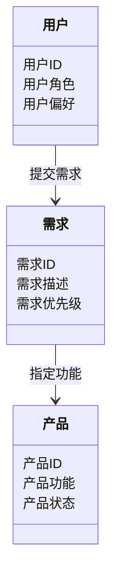
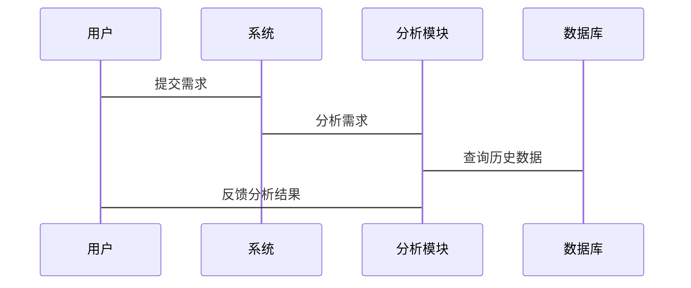

                 


# AI Agent在企业产品生命周期管理中的应用

## 关键词：
AI Agent, 企业产品生命周期, 知识表示, 自然语言处理, 机器学习, 强化学习

## 摘要：
本文详细探讨了AI Agent在企业产品生命周期管理中的应用，从背景、核心概念到算法原理、系统架构，再到项目实战，全面解析了AI Agent如何提升企业产品管理的效率与精准度。通过实际案例分析，本文展示了AI Agent在需求分析、产品设计、生产交付和维护优化等阶段中的具体应用，并展望了未来的发展趋势。

---

## 第一部分: AI Agent与企业产品生命周期管理概述

### 第1章: AI Agent与企业产品生命周期管理概述

#### 1.1 AI Agent的基本概念
##### 1.1.1 AI Agent的定义
AI Agent（人工智能代理）是指能够感知环境、自主决策并执行任务的智能体。它通过传感器获取信息，利用推理能力解决问题，并通过执行器与环境交互。AI Agent的核心特征包括自主性、反应性、目标导向性和社会性。

##### 1.1.2 AI Agent的核心特征
- **自主性**：AI Agent能够自主决策，无需外部干预。
- **反应性**：能够实时感知环境变化并做出响应。
- **目标导向性**：以实现特定目标为导向。
- **社会性**：能够与其他系统或人类进行协作。

##### 1.1.3 AI Agent与传统自动化工具的区别
传统自动化工具基于预定义规则执行任务，而AI Agent能够学习和适应环境，具备更强的灵活性和智能性。

#### 1.2 企业产品生命周期管理的定义
##### 1.2.1 产品生命周期的四个阶段
- **需求分析**：确定产品目标和用户需求。
- **产品设计**：设计产品的功能和架构。
- **生产与交付**：将产品推向市场。
- **维护与优化**：根据反馈进行改进。

##### 1.2.2 企业产品生命周期管理的重要性
有效管理产品生命周期能够提高产品质量和市场竞争力，降低开发成本和风险。

##### 1.2.3 传统产品生命周期管理的挑战
- **信息孤岛**：各部门之间数据不通，难以协同。
- **效率低下**：人工处理大量重复性工作，效率低。
- **决策滞后**：依赖人工分析，难以快速响应变化。

#### 1.3 AI Agent在企业产品生命周期管理中的应用背景
##### 1.3.1 企业数字化转型的驱动因素
数字化转型要求企业采用新技术提升效率和竞争力，AI Agent成为重要工具。

##### 1.3.2 AI技术对企业管理的深远影响
AI技术能够优化企业流程、提升决策能力，推动管理方式的创新。

##### 1.3.3 AI Agent在企业产品生命周期管理中的潜在价值
通过自动化、智能化的方式，AI Agent能够显著提升产品管理的效率和精准度。

---

### 第2章: AI Agent的核心概念与原理

#### 2.1 AI Agent的核心概念
##### 2.1.1 知识表示与推理
知识表示是将信息以计算机可理解的形式表示，推理则是根据知识进行逻辑推导。

##### 2.1.2 自然语言处理（NLP）
NLP技术使AI Agent能够理解和生成人类语言，提升人机交互能力。

##### 2.1.3 问题解决与决策优化
AI Agent通过分析问题、生成解决方案并优化决策，帮助企业在复杂环境中做出最佳选择。

#### 2.2 AI Agent的算法原理
##### 2.2.1 基于规则的AI Agent
基于规则的AI Agent通过预定义的规则进行推理和决策，适用于规则明确的场景。

##### 2.2.2 基于机器学习的AI Agent
基于机器学习的AI Agent通过学习数据模式，自动优化决策策略，适用于复杂场景。

##### 2.2.3 基于强化学习的AI Agent
基于强化学习的AI Agent通过与环境互动，不断优化决策策略，适用于动态变化的环境。

#### 2.3 AI Agent在企业产品生命周期管理中的应用
##### 2.3.1 AI Agent在需求分析中的应用
AI Agent通过分析市场数据和用户反馈，辅助制定产品需求。

##### 2.3.2 AI Agent在产品设计中的应用
AI Agent通过优化设计参数，辅助生成产品设计方案。

##### 2.3.3 AI Agent在生产与交付中的应用
AI Agent通过监控生产过程，实时调整资源分配，确保生产顺利进行。

##### 2.3.4 AI Agent在产品维护与优化中的应用
AI Agent通过分析用户反馈，辅助制定产品优化方案。

---

### 第3章: AI Agent在企业产品生命周期管理中的核心算法

#### 3.1 知识表示与推理算法
##### 3.1.1 语义网络表示
语义网络通过节点和边表示概念及其关系，帮助AI Agent理解语义信息。

##### 3.1.2 知识推理算法
- **前向推理**：从已知事实推导出新结论。
- **反向推理**：从目标推导出必要条件。

##### 3.1.3 逻辑推理与不确定性处理
- **逻辑推理**：基于逻辑规则进行推理。
- **概率推理**：处理不确定性问题。

#### 3.2 基于机器学习的AI Agent算法
##### 3.2.1 监督学习算法
- **分类算法**：用于分类任务，如需求分析中的用户分类。
- **回归算法**：用于预测任务，如需求优先级预测。

##### 3.2.2 无监督学习算法
- **聚类算法**：用于发现数据中的潜在模式，如用户反馈聚类。

##### 3.2.3 深度学习算法
- **神经网络**：用于复杂模式识别，如自然语言处理任务。

#### 3.3 基于强化学习的AI Agent算法
##### 3.3.1 强化学习的基本原理
强化学习通过奖励机制，使AI Agent学习最优策略。

##### 3.3.2 Q-Learning算法
Q-Learning是一种经典的强化学习算法，适用于离散动作空间。

##### 3.3.3 Deep Q-Networks（DQN）
DQN通过深度神经网络近似Q值函数，适用于连续动作空间。

---

### 第4章: 系统分析与架构设计

#### 4.1 系统功能设计
##### 4.1.1 领域模型
领域模型是系统功能设计的基础，通过Mermaid类图展示各实体及其关系。



##### 4.1.2 系统架构设计
系统架构设计通过Mermaid架构图展示系统的整体结构。


##### 4.1.3 接口设计
接口设计通过Mermaid序列图展示系统与外部系统的交互过程。



---

### 第5章: 项目实战

#### 5.1 环境安装
##### 5.1.1 Python环境安装
使用Anaconda或虚拟环境安装Python 3.8及以上版本。

##### 5.1.2 库依赖安装
安装必要的库，如numpy、pandas、scikit-learn、tensorflow等。

#### 5.2 核心代码实现
##### 5.2.1 需求分析模块
```python
import numpy as np
from sklearn.feature_extraction.text import TfidfVectorizer
from sklearn.naive_bayes import MultinomialNB

# 数据预处理
vectorizer = TfidfVectorizer()
X = vectorizer.fit_transform(documents)
y = labels

# 模型训练
model = MultinomialNB()
model.fit(X, y)

# 预测
new_document = ["用户需求描述"]
new_X = vectorizer.transform([new_document])
prediction = model.predict(new_X)
print(prediction)
```

##### 5.2.2 产品设计模块
```python
import tensorflow as tf
from tensorflow.keras import layers

# 定义模型
model = tf.keras.Sequential()
model.add(layers.Dense(64, activation='relu', input_shape=(input_dim,)))
model.add(layers.Dense(output_dim, activation='softmax'))

# 编译模型
model.compile(optimizer='adam', loss='sparse_categorical_crossentropy', metrics=['accuracy'])

# 训练
model.fit(X_train, y_train, epochs=10, batch_size=32)
```

#### 5.3 实际案例分析
##### 5.3.1 案例背景
某企业希望优化其产品需求分析流程，减少需求变更带来的成本。

##### 5.3.2 数据收集
收集过去三年的需求文档、用户反馈和市场分析报告。

##### 5.3.3 模型训练
使用机器学习模型对需求文档进行分类，识别高优先级需求。

##### 5.3.4 模型部署
将训练好的模型部署到企业管理系统中，实时辅助需求分析。

##### 5.3.5 效果评估
通过对比人工分析和AI Agent辅助分析的结果，评估模型的准确性和效率。

---

### 第6章: 总结与展望

#### 6.1 总结
本文详细探讨了AI Agent在企业产品生命周期管理中的应用，从理论到实践，全面展示了其在各个阶段的价值。

#### 6.2 未来展望
随着AI技术的进步，AI Agent将在企业产品管理中发挥更大的作用，特别是在动态环境下的实时决策和复杂问题的解决。

#### 6.3 最佳实践
- **数据质量**：确保数据的准确性和完整性。
- **模型优化**：定期更新模型，适应环境变化。
- **人机协作**：结合人类专家的知识，提升系统效果。

---

作者：AI天才研究院 & 禅与计算机程序设计艺术

