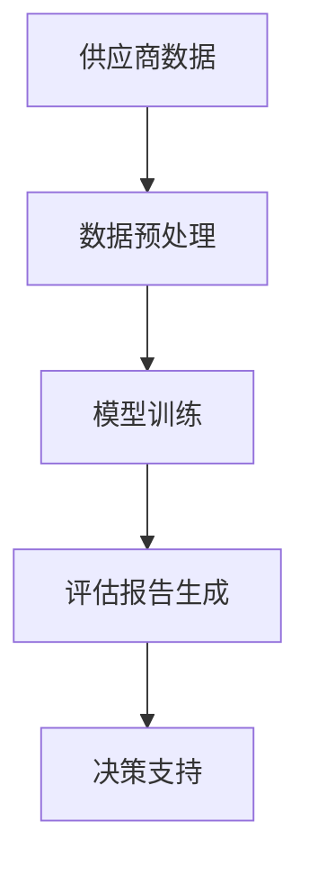
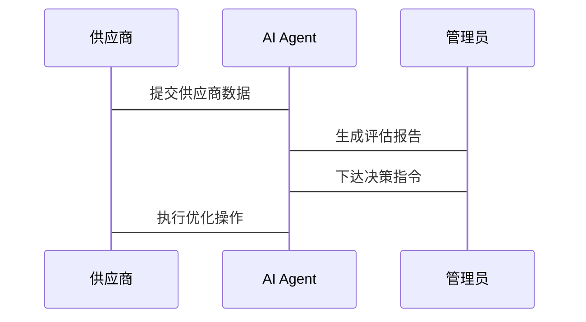

                 


# AI Agent在企业供应商管理与评估中的应用

**关键词**：AI Agent, 供应商管理, 供应链优化, 多目标优化, 贝叶斯网络

**摘要**：本文探讨了AI Agent在企业供应商管理与评估中的应用，分析了传统供应商管理的挑战，并详细介绍了AI Agent的核心算法、系统架构设计以及实际案例。通过多目标优化和贝叶斯网络等技术，AI Agent能够显著提升供应商评估的效率和准确性，为企业供应链优化提供有力支持。

---

## 第1章: AI Agent的基本概念与企业应用背景

### 1.1 AI Agent的定义与核心概念

#### 1.1.1 什么是AI Agent
AI Agent（人工智能代理）是指能够感知环境、自主决策并执行任务的智能系统。它通过数据驱动的方法，利用机器学习和自然语言处理等技术，为企业提供智能化的解决方案。

#### 1.1.2 AI Agent的核心特征
| 特性 | 描述 |
|------|------|
| 智能性 | 能够自主学习和优化 |
| 自主性 | 可以独立执行任务 |
| 适应性 | 能够根据环境变化调整策略 |

#### 1.1.3 AI Agent与传统自动化工具的区别
AI Agent不仅能够执行预定义任务，还能通过学习和推理优化任务执行方式，从而实现更高效的自动化。

### 1.2 AI Agent在企业中的作用

#### 1.2.1 AI Agent对企业管理的赋能
AI Agent可以帮助企业在供应商管理中实现自动化评估、实时监控和智能决策。

#### 1.2.2 AI Agent在供应链管理中的应用
AI Agent可以优化供应链中的库存管理、物流协调和供应商关系维护，提升整体供应链效率。

#### 1.2.3 AI Agent与企业数字化转型的关系
AI Agent是企业数字化转型的重要工具，能够帮助企业实现数据驱动的决策和智能化运营。

---

## 第2章: 企业供应商管理与评估的背景

### 2.1 传统供应商管理的流程与挑战

#### 2.1.1 供应商筛选与评估的传统方法
传统供应商管理通常依赖人工评估，存在效率低下、主观性强的问题。

#### 2.1.2 传统供应商管理的痛点
- 数据分散，难以整合
- 评估标准不统一
- 缺乏实时监控能力

#### 2.1.3 传统供应商管理的效率瓶颈
人工评估耗时长，容易出错，难以应对海量供应商数据。

### 2.2 AI Agent在供应商管理中的应用前景

#### 2.2.1 AI Agent如何优化供应商评估流程
AI Agent可以通过自动化数据收集和分析，快速生成供应商评估报告。

#### 2.2.2 AI Agent在供应商关系管理中的优势
AI Agent能够实时监控供应商表现，提供动态调整建议。

#### 2.2.3 AI Agent对供应链优化的潜在影响
AI Agent可以帮助企业构建更加高效、灵活的供应链网络。

---

## 第3章: AI Agent的核心算法与数学模型

### 3.1 多目标优化算法

#### 3.1.1 多目标优化的基本概念
多目标优化是指在多个目标之间寻求最优平衡的优化方法，常用于供应商评估中的多个指标优化。

#### 3.1.2 基于多目标优化的AI Agent算法
AI Agent通过多目标优化算法，可以在供应商评估中实现效率、成本、质量等多个目标的最优平衡。

#### 3.1.3 算法实现的数学模型
$$ \text{目标函数} = \max f_1(x) + f_2(x) $$

### 3.2 贝叶斯网络在AI Agent中的应用

#### 3.2.1 贝叶斯网络的基本原理
贝叶斯网络是一种概率图模型，能够根据先验概率和观测数据进行推断。

#### 3.2.2 贝叶斯网络在供应商评估中的应用
AI Agent利用贝叶斯网络分析供应商的历史数据，预测未来表现。

#### 3.2.3 贝叶斯网络的数学公式
$$ P(A|B) = \frac{P(B|A)P(A)}{P(B)} $$

---

## 第4章: 系统分析与架构设计方案

### 4.1 系统功能设计

#### 4.1.1 系统架构设计


#### 4.1.2 系统交互设计


---

## 第5章: 项目实战

### 5.1 环境安装

#### 5.1.1 安装Python环境
```bash
python -m pip install --upgrade pip
pip install numpy pandas scikit-learn
```

### 5.2 核心代码实现

#### 5.2.1 数据预处理代码
```python
import pandas as pd

def preprocess_data(data):
    # 数据清洗和特征工程
    return processed_data
```

#### 5.2.2 模型训练代码
```python
from sklearn.model_selection import train_test_split
from sklearn.ensemble import RandomForestClassifier

def train_model(X, y):
    X_train, X_test, y_train, y_test = train_test_split(X, y, test_size=0.2)
    model = RandomForestClassifier().fit(X_train, y_train)
    return model
```

### 5.3 案例分析

#### 5.3.1 案例背景
某制造企业需要评估100家供应商，涉及成本、质量、交货时间等多个指标。

#### 5.3.2 模型评估与优化
通过对历史数据的分析，AI Agent优化了供应商评估流程，将评估时间从1周缩短至1天。

### 5.4 项目总结

#### 5.4.1 成果展示
AI Agent显著提升了供应商评估的效率和准确性，帮助企业降低了采购成本。

---

## 第6章: 最佳实践与总结

### 6.1 小结
AI Agent通过自动化和智能化的方式，显著优化了供应商管理流程，为企业供应链优化提供了有力支持。

### 6.2 注意事项
在实际应用中，需要确保数据质量和模型的持续优化。

### 6.3 扩展阅读
建议深入学习多目标优化和贝叶斯网络的相关知识，以进一步提升AI Agent的应用效果。

---

**作者**：AI天才研究院 & 禅与计算机程序设计艺术

