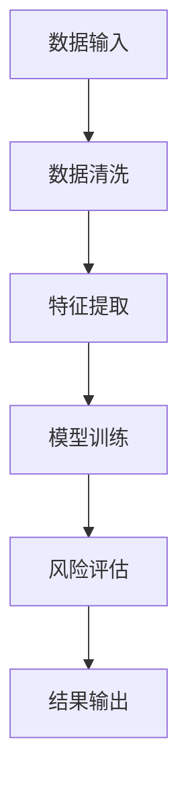
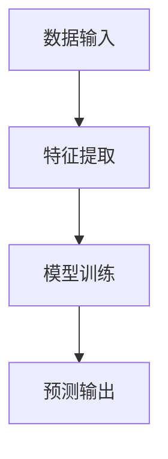
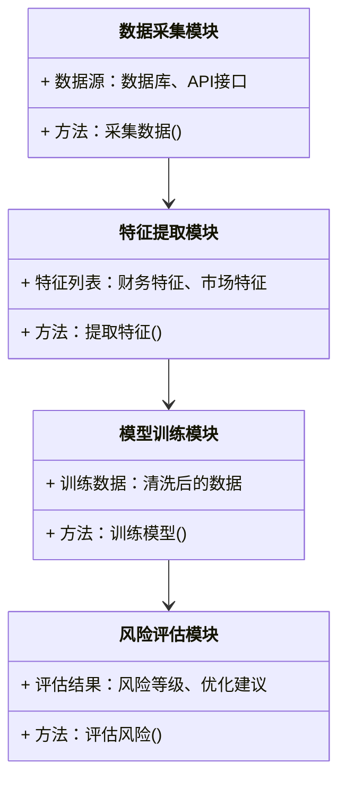
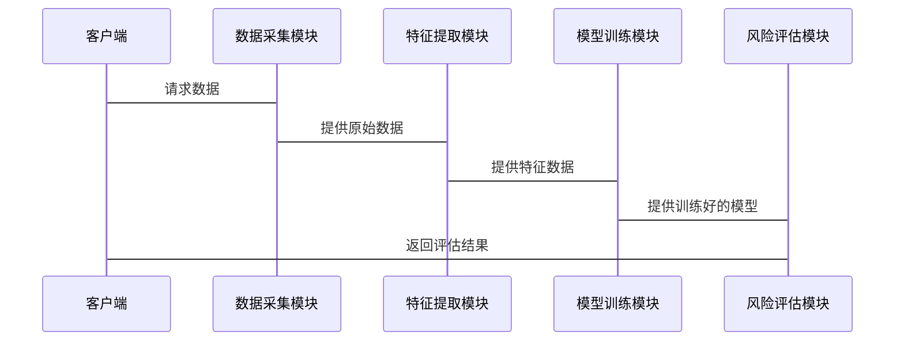

                 


# AI Agent在企业供应商风险评估与管理中的应用

## 关键词：AI Agent, 供应商风险评估, 供应链管理, 机器学习, 自然语言处理, 知识图谱

## 摘要：  
随着全球供应链的复杂化，企业对供应商的风险评估与管理需求日益增长。AI Agent作为一种智能代理技术，能够通过机器学习、自然语言处理和知识图谱等技术手段，帮助企业实现供应商风险的智能化评估与管理。本文将详细探讨AI Agent在企业供应商风险评估中的应用，包括其核心算法、系统架构、项目实战以及实际案例分析。通过本文，读者将能够理解AI Agent如何通过智能化的方式优化供应链管理，降低企业风险。

---

# 第一部分: AI Agent与企业供应商风险评估概述

## 第1章: AI Agent与企业供应商风险评估概述

### 1.1 AI Agent的基本概念

#### 1.1.1 AI Agent的定义
AI Agent（人工智能代理）是指能够感知环境、自主决策并执行任务的智能实体。它通过传感器获取信息，利用算法进行分析和推理，并通过执行器完成目标。

#### 1.1.2 AI Agent的核心特点
- **自主性**：能够自主决策和行动。
- **反应性**：能够实时感知环境变化并做出反应。
- **学习能力**：通过机器学习算法不断优化自身模型。
- **可扩展性**：能够处理不同类型和规模的任务。

#### 1.1.3 AI Agent在企业中的应用背景
在企业环境中，AI Agent广泛应用于自动化决策、风险管理、供应链优化等领域。特别是在供应商管理中，AI Agent能够帮助企业实时监控供应商的动态，评估其风险，并提出优化建议。

### 1.2 企业供应商风险评估的背景与挑战

#### 1.2.1 供应商风险评估的重要性
供应商是企业供应链的核心组成部分，供应商的稳定性直接影响企业的运营效率和成本控制。因此，评估供应商的风险（如财务风险、供应链风险、合规风险等）至关重要。

#### 1.2.2 传统供应商风险评估的局限性
- **数据分散**：传统方法依赖于人工收集和分析数据，效率低下且容易出错。
- **主观性**：评估结果往往受到人为因素的影响，缺乏客观性。
- **实时性差**：传统方法难以实现对供应商风险的实时监控和预警。

#### 1.2.3 AI Agent在供应商风险评估中的优势
- **自动化**：AI Agent能够自动采集和分析供应商数据，提高效率。
- **精准性**：通过机器学习算法，AI Agent能够从海量数据中提取关键信息，提升评估的准确性。
- **实时性**：AI Agent能够实时监控供应商的动态，及时发现潜在风险。

### 1.3 AI Agent在供应商风险评估中的应用前景

#### 1.3.1 AI Agent技术的发展趋势
随着人工智能技术的不断进步，AI Agent在企业中的应用将更加广泛和深入。未来的AI Agent将具备更强的自主学习能力和跨领域应用能力。

#### 1.3.2 企业供应商风险评估的未来方向
未来的供应商风险评估将更加注重数据的实时性和全面性，同时结合区块链等技术，实现供应商信息的可信共享。

#### 1.3.3 AI Agent在供应链管理中的潜在价值
AI Agent能够通过实时监控和预测分析，帮助企业优化供应链管理，降低运营成本，提升供应链的弹性。

### 1.4 本章小结
本章介绍了AI Agent的基本概念和特点，并重点分析了企业供应商风险评估的背景、挑战和AI Agent的应用优势。通过AI Agent技术，企业能够实现供应商风险评估的自动化、精准化和实时化。

---

# 第二部分: AI Agent的核心概念与原理

## 第2章: AI Agent的核心概念与原理

### 2.1 AI Agent的定义与分类

#### 2.1.1 AI Agent的定义
AI Agent是一种能够感知环境、自主决策并执行任务的智能实体，它通过传感器获取信息，利用算法进行分析和推理，并通过执行器完成目标。

#### 2.1.2 AI Agent的分类
AI Agent可以根据功能、智能水平和应用场景进行分类：
- **按功能**：分为决策型AI Agent和执行型AI Agent。
- **按智能水平**：分为规则驱动型、基于机器学习型和通用型AI Agent。
- **按应用场景**：分为供应链管理、金融投资、医疗诊断等领域的AI Agent。

#### 2.1.3 各类AI Agent的特点
- **规则驱动型AI Agent**：基于预定义的规则进行决策，适用于任务简单且规则明确的场景。
- **基于机器学习型AI Agent**：通过机器学习算法不断优化自身的决策模型，适用于复杂且动态变化的场景。
- **通用型AI Agent**：具备广泛的应用能力，能够适应多种不同的任务和场景。

### 2.2 AI Agent的核心算法与技术

#### 2.2.1 机器学习算法
机器学习是AI Agent的核心技术之一，常用的算法包括：
- **线性回归**：用于预测连续型变量。
- **支持向量机（SVM）**：用于分类和回归任务。
- **随机森林**：用于分类、回归和特征重要性分析。

#### 2.2.2 自然语言处理技术
自然语言处理（NLP）技术用于AI Agent对文本数据的分析和理解，常用技术包括：
- **文本分类**：对文本进行主题分类。
- **实体识别**：从文本中提取关键实体。
- **情感分析**：分析文本中的情感倾向。

#### 2.2.3 知识图谱与推理引擎
知识图谱用于构建领域知识库，推理引擎用于基于知识图谱进行逻辑推理。

### 2.3 AI Agent在供应商风险评估中的工作原理

#### 2.3.1 数据采集与处理
AI Agent通过多种渠道采集供应商数据，包括财务数据、市场数据、新闻数据等。数据采集后需要进行清洗和预处理。

#### 2.3.2 风险评估模型的构建
基于机器学习算法，构建供应商风险评估模型。常用的模型包括逻辑回归、随机森林和XGBoost。

#### 2.3.3 风险评估结果的输出
AI Agent根据模型预测结果生成风险评估报告，并提供相应的优化建议。

### 2.4 AI Agent的核心算法流程图



### 2.5 本章小结
本章详细介绍了AI Agent的核心概念、分类和工作原理，并通过流程图展示了AI Agent在供应商风险评估中的算法流程。

---

# 第三部分: AI Agent的算法原理与数学模型

## 第3章: AI Agent的算法原理与数学模型

### 3.1 机器学习算法在AI Agent中的应用

#### 3.1.1 线性回归
线性回归是一种用于预测连续型变量的算法，其数学模型为：
$$ y = \beta_0 + \beta_1x + \epsilon $$
其中，$y$ 是目标变量，$x$ 是自变量，$\beta_0$ 和 $\beta_1$ 是模型参数，$\epsilon$ 是误差项。

#### 3.1.2 支持向量机（SVM）
支持向量机是一种用于分类和回归的算法，其核心思想是通过构建超平面将数据分成不同的类别。

#### 3.1.3 随机森林
随机森林是一种基于决策树的集成学习算法，其数学模型如下：
$$ y = \text{预测值} $$

### 3.2 算法流程图



### 3.3 数学模型与公式

#### 3.3.1 线性回归模型
$$ y = \beta_0 + \beta_1x + \epsilon $$

#### 3.3.2 支持向量机
$$ \text{max} \frac{1}{2}\|w\|^2 $$
$$ \text{subject to} \quad y_i(w \cdot x_i + b) \geq 1, \forall i $$

### 3.4 本章小结
本章详细介绍了机器学习算法在AI Agent中的应用，并通过流程图和数学公式展示了算法的工作原理。

---

# 第四部分: 系统分析与架构设计方案

## 第4章: 系统分析与架构设计方案

### 4.1 问题场景介绍
供应商风险评估系统需要实时监控供应商的财务状况、市场表现和合规性，帮助企业识别潜在风险。

### 4.2 系统功能设计

#### 4.2.1 领域模型（Mermaid类图）


### 4.3 系统架构设计（Mermaid架构图）


### 4.4 系统接口设计
系统接口包括数据采集接口、特征提取接口、模型训练接口和风险评估接口。

### 4.5 系统交互（Mermaid序列图）



### 4.6 本章小结
本章通过系统分析与架构设计，展示了AI Agent在供应商风险评估中的整体架构和各模块之间的交互过程。

---

# 第五部分: 项目实战

## 第5章: 项目实战

### 5.1 环境安装

```python
# 安装所需的Python库
pip install numpy pandas scikit-learn
```

### 5.2 系统核心实现源代码

```python
import numpy as np
import pandas as pd
from sklearn.model_selection import train_test_split
from sklearn.linear_model import LinearRegression

# 数据清洗
def data_cleaning(data):
    data.dropna(inplace=True)
    return data

# 特征提取
def feature_extraction(data):
    features = data[['revenue', 'profit', 'growth_rate']]
    return features

# 模型训练
def model_training(features, labels):
    X_train, X_test, y_train, y_test = train_test_split(features, labels, test_size=0.2)
    model = LinearRegression()
    model.fit(X_train, y_train)
    return model

# 风险评估
def risk_assessment(model, new_data):
    predicted_risk = model.predict(new_data)
    return predicted_risk
```

### 5.3 代码应用解读与分析
上述代码展示了AI Agent在供应商风险评估中的核心实现过程，包括数据清洗、特征提取、模型训练和风险评估。

### 5.4 实际案例分析

#### 5.4.1 案例背景
某企业希望通过AI Agent技术优化其供应商风险评估流程。

#### 5.4.2 数据准备
企业提供了供应商的财务数据、市场数据和新闻数据。

#### 5.4.3 数据分析
通过机器学习算法，企业识别出部分供应商存在较高的财务风险。

#### 5.4.4 风险评估结果
AI Agent生成了风险评估报告，并提出了优化建议。

### 5.5 项目小结
通过本项目，企业成功实现了供应商风险评估的智能化，显著提高了评估效率和准确性。

---

# 第六部分: 总结与展望

## 第6章: 总结与展望

### 6.1 本章总结
本文详细探讨了AI Agent在企业供应商风险评估中的应用，包括其核心算法、系统架构、项目实战和实际案例分析。

### 6.2 技术展望
随着人工智能技术的不断进步，AI Agent在供应商风险评估中的应用将更加广泛和深入。未来的AI Agent将具备更强的自主学习能力和跨领域应用能力。

### 6.3 实际应用中的注意事项
在实际应用中，企业需要注意数据隐私、模型可解释性和算法的实时性。

### 6.4 拓展阅读
推荐读者进一步阅读以下书籍和论文：
- 《机器学习实战》
- 《深度学习》
- 《知识图谱与推理》

### 6.5 本章小结
本章总结了本文的主要内容，并展望了AI Agent技术的未来发展。

---

# 作者：AI天才研究院/AI Genius Institute & 禅与计算机程序设计艺术 /Zen And The Art of Computer Programming

