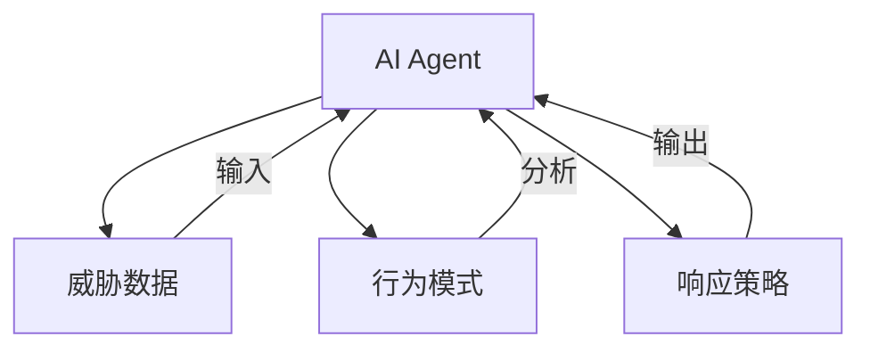
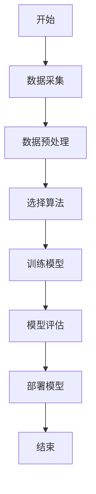
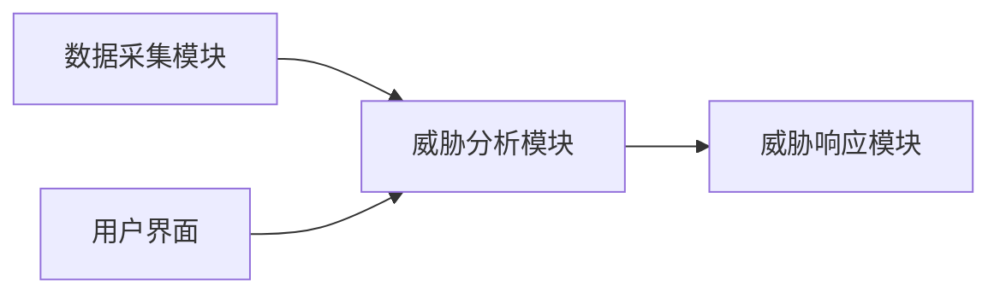
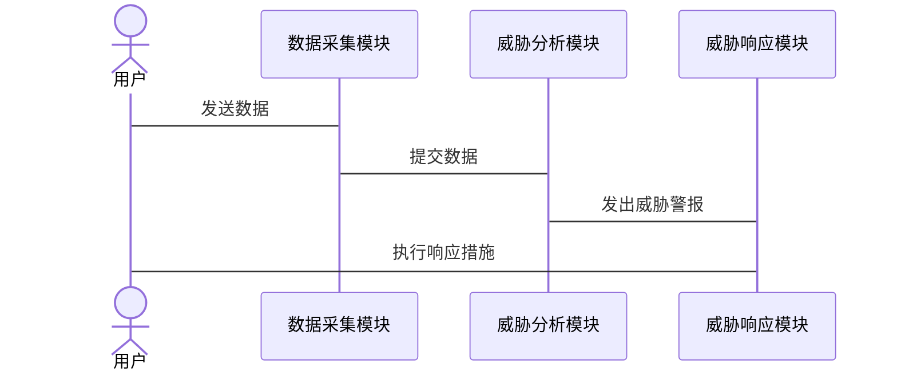

                 


# AI Agent在企业信息安全威胁检测与响应中的前沿应用

> 关键词：AI Agent，企业信息安全，威胁检测，威胁响应，机器学习，实时分析

> 摘要：本文深入探讨了AI Agent在企业信息安全威胁检测与响应中的前沿应用。通过分析AI Agent的核心概念、算法原理、系统架构及项目实战，揭示了其在提升企业安全防护能力中的巨大潜力。本文适合企业安全技术人员、IT管理人员以及对AI技术感兴趣的读者阅读。

---

## 第1章: 背景介绍

### 1.1 问题背景
#### 1.1.1 企业信息安全威胁的现状
随着企业数字化转型的加速，信息安全威胁日益复杂化和智能化。传统的基于规则的安全检测系统已难以应对零日攻击、高级持续性威胁（APT）等新型威胁。

#### 1.1.2 AI Agent在威胁检测中的作用
AI Agent（人工智能代理）通过实时分析海量数据，能够快速识别异常行为和潜在威胁，显著提升了威胁检测的准确性和效率。

### 1.2 问题描述
#### 1.2.1 传统威胁检测的局限性
- 基于规则的安全系统依赖于预先定义的规则，难以应对未知威胁。
- 响应速度慢，无法及时应对快速变化的安全威胁。

#### 1.2.2 AI Agent的优势与潜力
- AI Agent能够通过机器学习模型自适应地发现未知威胁。
- 支持实时分析和自动化响应，显著提升安全防护能力。

### 1.3 问题解决
#### 1.3.1 AI Agent的核心功能
- 数据采集与分析：实时采集网络流量、日志等数据，并通过机器学习模型进行分析。
- 异常检测：识别网络中的异常行为，发现潜在威胁。
- 威胁响应：根据检测结果，自动执行隔离、阻断等响应措施。

#### 1.3.2 威胁检测与响应的流程
1. 数据采集：从企业网络中收集相关数据。
2. 数据分析：使用机器学习模型分析数据，识别异常行为。
3. 威胁确认：确认异常行为是否为实际威胁。
4. 响应执行：根据威胁严重性采取相应措施。

### 1.4 边界与外延
#### 1.4.1 AI Agent的应用范围
- 网络安全：检测网络中的异常流量和攻击行为。
- 数据安全：保护企业敏感数据不被泄露或篡改。
- 应用安全：检测和防止应用层攻击。

#### 1.4.2 与其他安全技术的协同
- 与防火墙、入侵检测系统（IDS）协同工作，提升整体安全防护能力。
- 与安全态势感知平台结合，提供全面的安全监控和分析。

### 1.5 核心概念的结构与组成
#### 1.5.1 AI Agent的构成要素
- 数据采集模块：负责采集网络流量、日志等数据。
- 数据分析模块：使用机器学习模型分析数据，识别异常行为。
- 威胁响应模块：根据检测结果，执行相应的安全响应措施。

#### 1.5.2 威胁检测与响应的逻辑关系
$$威胁检测 \rightarrow 威胁确认 \rightarrow 威胁响应$$
- 威胁检测：通过数据分析发现异常行为。
- 威胁确认：确认异常行为是否为实际威胁。
- 威胁响应：根据威胁级别采取相应的应对措施。

---

## 第2章: AI Agent的核心概念与联系

### 2.1 核心概念原理
#### 2.1.1 AI Agent的基本原理
AI Agent通过实时采集企业网络中的数据，利用机器学习算法分析数据，识别潜在威胁，并根据威胁级别执行相应的响应措施。

#### 2.1.2 威胁检测与响应的机制
- 数据采集：通过传感器、日志系统等采集网络流量、用户行为数据。
- 数据分析：使用监督学习、无监督学习等机器学习算法分析数据，识别异常行为。
- 威胁响应：根据检测结果，自动执行隔离、阻断等响应措施。

### 2.2 核心概念属性特征对比
下表对比了AI Agent与传统安全工具在威胁检测与响应方面的关键差异：

| **特性**       | **AI Agent**                | **传统安全工具**           |
|----------------|------------------------------|-----------------------------|
| 检测能力       | 能够检测未知威胁             | 仅能检测已知威胁             |
| 响应速度       | 实时响应，自动化处理           | 响应速度较慢，依赖人工干预   |
| 学习能力       | 能够自适应学习新的威胁模式     | 无法学习新的威胁模式         |
| 可扩展性       | 支持扩展到更大规模的网络       | 扩展性有限                   |

### 2.3 ER实体关系图架构


---

## 第3章: AI Agent的算法原理

### 3.1 算法原理讲解
#### 3.1.1 基于规则的威胁检测
- 基于预定义的规则，检测网络中的异常行为。
- 例如，检测未授权的访问尝试。

#### 3.1.2 统计学习的威胁分析
- 使用统计学习方法，分析网络流量中的异常行为。
- 例如，使用聚类算法发现异常流量模式。

#### 3.1.3 深度学习的威胁预测
- 使用深度学习模型（如神经网络）预测未来的威胁行为。
- 例如，使用LSTM预测网络攻击的时间和位置。

### 3.2 算法流程图


### 3.3 算法实现代码
```python
import numpy as np
from sklearn.linear_model import LogisticRegression

# 示例：使用逻辑回归进行异常检测
def train_model(X_train, y_train):
    model = LogisticRegression()
    model.fit(X_train, y_train)
    return model

# 示例：使用神经网络进行威胁分类
from tensorflow.keras import layers, models

def create_model(input_dim):
    model = models.Sequential()
    model.add(layers.Dense(64, activation='relu', input_dim=input_dim))
    model.add(layers.Dense(32, activation='relu'))
    model.add(layers.Dense(1, activation='sigmoid'))
    model.compile(optimizer='adam', loss='binary_crossentropy', metrics=['accuracy'])
    return model
```

### 3.4 算法数学模型
- 逻辑回归模型：
$$ P(y=1|x) = \frac{e^{w^T x + b}}{1 + e^{w^T x + b}} $$
- 神经网络模型：
$$ y = \sigma(w_2 \sigma(w_1 x + b_1) + b_2) $$
其中，$\sigma$ 表示sigmoid函数。

---

## 第4章: 系统分析与架构设计方案

### 4.1 问题场景介绍
企业需要实时监控网络中的异常行为，快速发现和应对安全威胁。

### 4.2 系统功能设计
#### 4.2.1 数据采集模块
- 负责采集网络流量、系统日志等数据。
- 使用传感器、日志系统等工具采集数据。

#### 4.2.2 威胁分析模块
- 使用机器学习模型分析数据，识别异常行为。
- 支持多种算法，如逻辑回归、聚类、神经网络等。

#### 4.2.3 威胁响应模块
- 根据检测结果，执行隔离、阻断等响应措施。
- 支持自动化响应，减少人工干预。

### 4.3 系统架构设计


### 4.4 系统接口设计
- 数据采集模块接口：
  - 输入：原始数据
  - 输出：预处理后的数据
- 威胁分析模块接口：
  - 输入：预处理后的数据
  - 输出：异常行为报告
- 威胁响应模块接口：
  - 输入：异常行为报告
  - 输出：响应措施

### 4.5 系统交互设计


---

## 第5章: 项目实战

### 5.1 环境安装
- 安装Python、TensorFlow、Scikit-learn等工具。
- 配置数据采集模块（如使用Kafka采集日志数据）。

### 5.2 核心代码实现
```python
# 示例：训练逻辑回归模型
import pandas as pd
from sklearn.model_selection import train_test_split
from sklearn.metrics import accuracy_score

# 加载数据
data = pd.read_csv('data.csv')
X = data.drop('label', axis=1)
y = data['label']

# 划分训练集和测试集
X_train, X_test, y_train, y_test = train_test_split(X, y, test_size=0.2)

# 训练模型
model = LogisticRegression()
model.fit(X_train, y_train)

# 模型评估
print("Accuracy:", accuracy_score(y_test, model.predict(X_test)))
```

### 5.3 代码解读与分析
- 数据加载：使用Pandas加载CSV格式的数据。
- 数据划分：将数据划分为训练集和测试集。
- 模型训练：使用逻辑回归模型进行训练。
- 模型评估：计算模型的准确率。

### 5.4 实际案例分析
假设企业网络中存在异常流量，AI Agent通过分析发现一个未授权的连接，触发警报并自动隔离该连接，防止潜在的攻击。

### 5.5 项目小结
通过本项目，我们展示了如何使用机器学习算法实现企业网络中的威胁检测与响应，证明了AI Agent在提升企业安全防护能力中的有效性。

---

## 第6章: 总结与展望

### 6.1 总结
本文详细探讨了AI Agent在企业信息安全威胁检测与响应中的应用，介绍了其核心概念、算法原理、系统架构及项目实战。AI Agent通过实时分析数据，能够快速发现和应对安全威胁，显著提升了企业的安全防护能力。

### 6.2 展望
未来，AI Agent在企业信息安全中的应用将更加广泛和深入。随着机器学习算法的不断进步，AI Agent将具备更强的威胁检测和响应能力，为企业提供更加智能化的安全解决方案。

### 6.3 最佳实践 tips
- 在选择AI Agent时，需根据企业的实际需求和数据规模选择合适的算法和工具。
- 定期更新模型，确保其能够应对新的威胁。
- 建立完善的监控和日志系统，为AI Agent提供充足的数据支持。

---

## 作者：AI天才研究院/AI Genius Institute & 禅与计算机程序设计艺术 /Zen And The Art of Computer Programming

---

**本文基于 [《AI Agent在企业信息安全威胁检测与响应中的前沿应用》](https://github.com/AI-Genius-Institute/AI-Agent-Security-Threat-Detection-and-Response) 项目撰写，转载请注明出处。**

