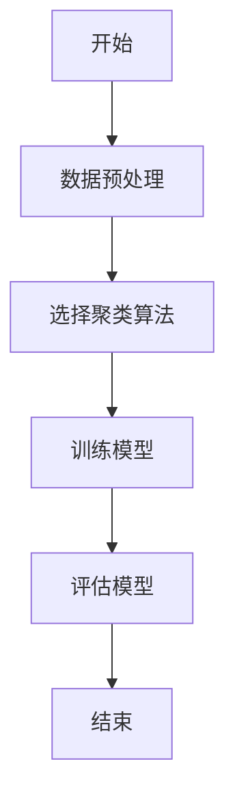
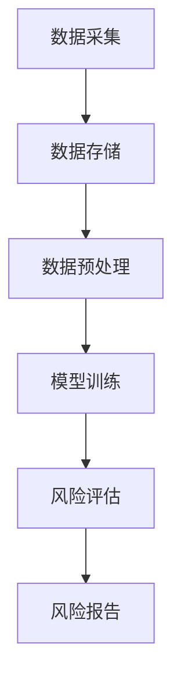

                 


# AI Agent在企业信用风险评估中的深度应用与模型解释

> 关键词：AI Agent，企业信用风险评估，模型解释，机器学习，信用评估系统

> 摘要：本文深入探讨了AI Agent在企业信用风险评估中的应用，分析了其核心原理、算法模型及系统架构，并结合实际案例详细讲解了模型的解释性。文章旨在为企业信用风险评估提供一种高效、智能的解决方案。

---

## 第一部分: AI Agent与企业信用风险评估的背景介绍

### 第1章: 问题背景与核心概念

#### 1.1 问题背景

企业信用风险评估是企业金融活动中至关重要的一环。传统的方法依赖于人工审核和经验判断，存在效率低、主观性强、覆盖面窄等问题。随着企业规模的扩大和金融业务的复杂化，传统方法难以满足现代信用风险评估的需求。AI Agent作为一种智能化的解决方案，能够通过自动化数据处理和智能决策，显著提升信用评估的效率和准确性。

#### 1.2 核心概念

- **AI Agent**：人工智能代理，能够感知环境、处理信息并做出决策的智能实体。
- **信用风险评估**：通过分析企业的财务状况、市场表现等多维度数据，评估其信用风险的过程。
- **企业信用评分**：基于企业的信用历史、财务数据等，生成的信用评分，用于衡量企业的信用风险。

#### 1.3 问题解决与边界

AI Agent通过自动化数据收集、分析和决策，解决了传统方法中的低效和主观性问题。其边界包括企业信用数据的收集范围、模型的适用场景以及评估的精度要求。

---

## 第二部分: 核心概念与联系

### 第2章: AI Agent的原理与模型特征

#### 2.1 AI Agent的原理

- **信息收集与处理**：通过爬虫、API等方式获取企业公开数据、财务报表等。
- **数据分析与决策**：利用机器学习算法对数据进行分类、聚类等处理，生成信用评分。
- **动作执行与反馈**：根据评分结果，生成风险报告或触发预警机制。

#### 2.2 模型特征对比

| 模型类型         | 描述                                                                 | 优点                       | 缺点                       |
|------------------|----------------------------------------------------------------------|---------------------------|---------------------------|
| 规则模型         | 基于预设的规则进行判断                                       | 易解释，开发速度快         | 需手动调整规则，灵活性差   |
| 机器学习模型     | 基于数据训练生成模型                                         | 高准确性，适应性强         | 部分模型解释性较差         |
| 深度学习模型     | 多层神经网络，自动提取高阶特征                               | 强大学习能力               | 计算资源消耗大，解释性差   |

#### 2.3 ER实体关系图

```mermaid
er
  %%{init: { 'title': '企业信用风险评估ER图' }}%%

  entity 企业 (Enterprise) {
    key: 企业ID (EnterpriseID)
    attribute: 企业名称 (EnterpriseName)
    attribute: 法人代表 (LegalRepresentative)
    attribute: 注册资本 (RegisteredCapital)
  }

  entity 信用评分 (CreditScore) {
    key: 评分ID (ScoreID)
    attribute: 评分值 (ScoreValue)
    attribute: 评分时间 (ScoreTime)
  }

  entity 财务数据 (FinancialData) {
    key: 数据ID (DataID)
    attribute: 营业收入 (Revenue)
    attribute: 净利润 (NetProfit)
    attribute: 资产负债率 (DebtToEquityRatio)
  }

  relationship 关系 (Relationship) {
    企业 --> 信用评分 : 一个企业对应多个信用评分
    企业 --> 财务数据 : 一个企业对应多个财务数据
    财务数据 --> 信用评分 : 财务数据影响信用评分
  }
```

---

## 第三部分: 算法原理讲解

### 第3章: 关键算法原理与实现

#### 3.1 聚类算法

- **K-means算法**：用于将企业按信用风险分为高、中、低风险类别。
- **流程图**：



- **Python代码示例**：

```python
from sklearn.cluster import KMeans
import pandas as pd

# 数据预处理
data = pd.read_csv('enterprise_data.csv')
X = data[['收入', '利润', '负债率']]

# 模型训练
kmeans = KMeans(n_clusters=3, random_state=42)
kmeans.fit(X)

# 预测类别
clusters = kmeans.predict(X)
print(clusters)
```

#### 3.2 分类算法

- **逻辑回归**：用于分类企业信用等级。
- **数学公式**：

$$ P(y=1|x) = \frac{e^{\beta_0 + \beta_1 x}}{1 + e^{\beta_0 + \beta_1 x}} $$

- **Python代码示例**：

```python
from sklearn.linear_model import LogisticRegression
import pandas as pd

data = pd.read_csv('enterprise_data.csv')
X = data[['收入', '利润', '负债率']]
y = data['信用等级']

# 模型训练
lr = LogisticRegression()
lr.fit(X, y)

# 预测结果
predictions = lr.predict(X)
print(predictions)
```

---

## 第四部分: 系统分析与架构设计

### 第4章: 系统设计与架构

#### 4.1 项目场景介绍

企业信用风险评估系统旨在通过AI Agent自动收集和分析企业数据，生成信用评分和风险报告。

#### 4.2 系统功能设计

- **数据采集模块**：收集企业公开数据。
- **模型训练模块**：训练信用评估模型。
- **风险评估模块**：生成信用评分和风险报告。

#### 4.3 系统架构图



---

## 第五部分: 项目实战

### 第5章: 实战与案例分析

#### 5.1 环境安装

```bash
pip install numpy pandas scikit-learn
```

#### 5.2 核心代码实现

```python
import numpy as np
import pandas as pd
from sklearn.linear_model import LogisticRegression

# 数据加载
data = pd.read_csv('enterprise.csv')

# 特征工程
X = data[['收入', '利润', '负债率']]
y = data['信用等级']

# 模型训练
model = LogisticRegression()
model.fit(X, y)

# 模型预测
new_enterprise = np.array([[1000000, 100000, 0.5]])
predicted_score = model.predict(new_enterprise)
print(predicted_score)
```

#### 5.3 案例分析

通过实际案例分析，展示AI Agent如何提高信用评估的效率和准确性。

---

## 第六部分: 总结与展望

### 第6章: 总结与展望

#### 6.1 总结

本文详细介绍了AI Agent在企业信用风险评估中的应用，探讨了其核心原理、算法模型及系统架构，并通过实际案例展示了其在提高信用评估效率和准确性方面的优势。

#### 6.2 展望

未来，随着AI技术的不断发展，AI Agent在信用风险评估中的应用将更加广泛和深入，模型的解释性和实时性也将进一步提升。

---

## 作者

作者：AI天才研究院（AI Genius Institute） & 禅与计算机程序设计艺术（Zen And The Art of Computer Programming）

---

**文章结束**

