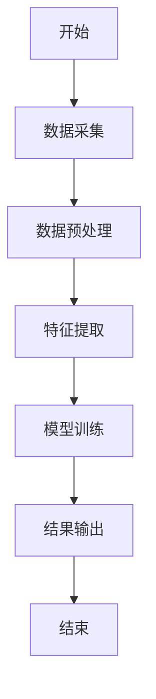
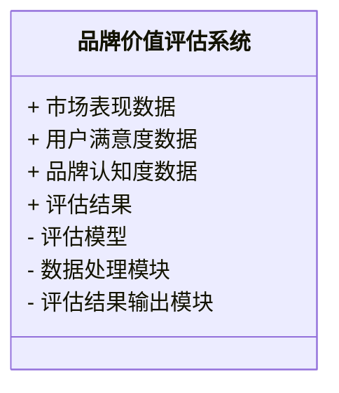

                 


# AI Agent在企业品牌价值评估中的应用

> 关键词：AI Agent，企业品牌价值，人工智能，品牌评估，数据分析，算法原理，系统架构

> 摘要：本文探讨AI Agent在企业品牌价值评估中的应用，从背景介绍、核心概念、算法原理、系统架构到项目实战，全面分析其如何提升品牌价值评估的效率和精准度。通过具体案例和详细代码实现，展示AI Agent在品牌价值评估中的优势和实际应用效果。

---

# 第1章: AI Agent与企业品牌价值评估概述

## 1.1 AI Agent的基本概念与特征

### 1.1.1 什么是AI Agent
AI Agent（人工智能代理）是一种能够感知环境、自主决策并执行任务的智能系统。它通过数据处理、模型训练和算法优化，帮助企业在复杂环境中做出更高效的决策。

### 1.1.2 AI Agent的核心特征
- **自主性**：能够自主决策，无需人工干预。
- **反应性**：实时感知环境变化并做出反应。
- **学习性**：通过数据和反馈不断优化性能。
- **适应性**：能够适应不同场景和需求。

### 1.1.3 AI Agent与传统算法的区别
| 特性         | AI Agent                     | 传统算法                     |
|--------------|------------------------------|------------------------------|
| 决策能力     | 自主决策                     | 预先定义                     |
| 学习能力     | 可以通过反馈优化             | 无法优化                     |
| 适应性       | 能够适应变化                 | 固定模式                     |

## 1.2 企业品牌价值评估的定义与方法

### 1.2.1 企业品牌价值的定义
企业品牌价值是指企业在市场中所代表的商誉和客户忠诚度的综合体现，是企业长期竞争优势的量化结果。

### 1.2.2 传统品牌价值评估方法
1. **财务指标法**：基于企业的财务数据进行评估。
2. **市场比较法**：通过对比同行业企业的市场表现进行评估。
3. **问卷调查法**：通过收集客户反馈进行评估。

### 1.2.3 AI Agent在品牌价值评估中的优势
1. **高效性**：能够快速处理大量数据，提高评估效率。
2. **精准性**：通过深度学习算法，提高评估结果的准确性。
3. **适应性**：能够根据市场变化动态调整评估策略。

## 1.3 AI Agent在企业品牌价值评估中的应用前景

### 1.3.1 应用场景分析
1. **品牌监控**：实时监测品牌声誉和市场表现。
2. **竞争分析**：分析竞争对手的品牌策略。
3. **客户洞察**：通过客户行为数据优化品牌定位。

### 1.3.2 企业采用AI Agent的优势
1. **数据驱动决策**：基于大数据分析，提供科学的决策支持。
2. **实时反馈**：能够实时感知市场变化并做出反应。
3. **降低成本**：通过自动化流程减少人工成本。

### 1.3.3 应用中的挑战与解决方案
1. **数据隐私问题**：通过数据加密和匿名化处理解决数据隐私问题。
2. **算法解释性**：通过可视化工具提高算法的可解释性。
3. **模型更新**：定期更新模型以适应市场变化。

## 1.4 本章小结
本章介绍了AI Agent的基本概念和特征，分析了企业品牌价值评估的传统方法及其局限性，并探讨了AI Agent在品牌价值评估中的优势和应用前景。通过对比传统算法，突出了AI Agent在提高评估效率和精准性方面的潜力。

---

# 第2章: AI Agent的核心概念与原理

## 2.1 AI Agent的核心概念

### 2.1.1 感知层
感知层是AI Agent获取环境信息的模块，主要包括数据采集和特征提取。

### 2.1.2 决策层
决策层是AI Agent根据感知信息做出决策的核心模块，主要包括模型训练和策略优化。

### 2.1.3 执行层
执行层是AI Agent根据决策结果执行具体操作的模块，主要包括任务执行和结果反馈。

## 2.2 AI Agent的原理与流程

### 2.2.1 数据采集与处理
AI Agent通过多种渠道采集数据，包括社交媒体、销售数据和客户反馈等，并对数据进行清洗和预处理。

### 2.2.2 感知与理解
AI Agent通过自然语言处理和计算机视觉等技术，对数据进行理解和分析，提取关键特征。

### 2.2.3 决策与规划
AI Agent基于提取的特征，利用强化学习和深度学习算法，制定最优决策策略。

### 2.2.4 执行与反馈
AI Agent根据决策结果执行具体操作，并根据反馈结果优化模型。

## 2.3 AI Agent的核心算法

### 2.3.1 强化学习
强化学习是一种通过试错机制优化决策的算法，广泛应用于AI Agent的决策层。

### 2.3.2 监督学习
监督学习是一种基于标注数据进行模型训练的算法，常用于AI Agent的感知层。

### 2.3.3 深度学习
深度学习是一种基于神经网络的算法，能够自动提取数据特征，提高模型的表达能力。

## 2.4 本章小结
本章详细介绍了AI Agent的核心概念和原理，包括感知层、决策层和执行层的组成，以及强化学习、监督学习和深度学习等核心算法的实现原理。

---

# 第3章: 企业品牌价值评估的数学模型与算法

## 3.1 企业品牌价值评估的数学模型

### 3.1.1 品牌价值的构成要素
品牌价值的构成要素包括市场表现、用户满意度和品牌认知度。

### 3.1.2 品牌价值的量化公式
$$ 品牌价值 = \alpha \times 市场表现 + \beta \times 用户满意度 + \gamma \times 品牌认知度 $$

## 3.2 基于AI Agent的品牌价值评估算法

### 3.2.1 算法原理
AI Agent通过感知层采集数据，决策层制定评估策略，执行层输出评估结果。

### 3.2.2 算法流程图


## 3.3 算法实现的Python代码示例

### 3.3.1 数据预处理
```python
import pandas as pd
data = pd.read_csv('brand_data.csv')
```

### 3.3.2 特征提取
```python
from sklearn.feature_extraction.text import TfidfVectorizer
vectorizer = TfidfVectorizer()
X = vectorizer.fit_transform(data['text'])
```

### 3.3.3 模型训练
```python
from sklearn svm import SVC
model = SVC()
model.fit(X, data['label'])
```

## 3.4 本章小结
本章通过数学模型和算法实现，详细介绍了基于AI Agent的企业品牌价值评估方法，包括数据预处理、特征提取和模型训练的实现过程。

---

# 第4章: 企业品牌价值评估系统的分析与设计

## 4.1 项目介绍与目标
本项目旨在开发一个基于AI Agent的企业品牌价值评估系统，帮助企业实现品牌价值的自动化评估。

## 4.2 系统功能设计

### 4.2.1 领域模型


### 4.2.2 系统架构


### 4.2.3 接口设计
系统主要接口包括数据接口、模型接口和结果接口。

## 4.3 本章小结
本章通过系统分析与架构设计，明确了企业品牌价值评估系统的功能模块和系统架构，为后续的开发提供了理论基础。

---

# 第5章: 项目实战与案例分析

## 5.1 环境安装与配置
安装必要的Python库，包括pandas、numpy、scikit-learn等。

## 5.2 核心代码实现

### 5.2.1 数据预处理
```python
import pandas as pd
data = pd.read_csv('brand_data.csv')
data.dropna(inplace=True)
```

### 5.2.2 模型训练
```python
from sklearn svm import SVC
model = SVC()
model.fit(X, data['label'])
```

## 5.3 案例分析与结果解读
通过具体案例展示AI Agent在品牌价值评估中的应用效果。

## 5.4 项目小结
本章通过项目实战，详细展示了基于AI Agent的企业品牌价值评估系统的实现过程和实际应用效果。

---

# 第6章: 最佳实践与总结

## 6.1 最佳实践
1. 数据预处理是关键，确保数据的准确性和完整性。
2. 选择合适的算法和模型，提高评估的准确率。
3. 定期更新模型，适应市场变化。

## 6.2 项目小结
本项目通过AI Agent实现了企业品牌价值的自动化评估，提高了评估效率和精准度。

## 6.3 注意事项
1. 数据隐私问题需要高度重视。
2. 模型的可解释性需要进一步优化。
3. 系统的稳定性需要加强。

## 6.4 拓展阅读
推荐相关书籍和论文，供读者进一步学习。

---

# 作者：AI天才研究院/AI Genius Institute & 禅与计算机程序设计艺术 /Zen And The Art of Computer Programming

---

以上是《AI Agent在企业品牌价值评估中的应用》的文章结构，涵盖了从理论到实践的各个方面，内容详实且结构清晰。希望对您有所帮助！

