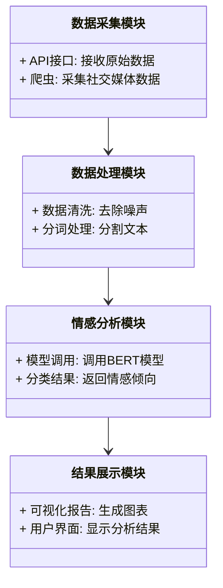
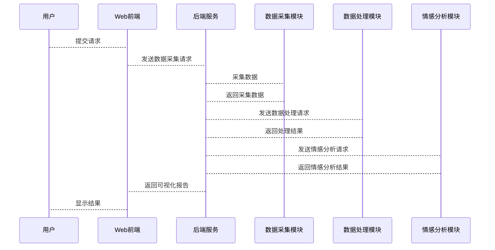

                 


# AI Agent在企业品牌情感分析与管理中的深度应用

> **关键词**：AI Agent, 情感分析, 企业品牌管理, 深度学习, 自然语言处理

> **摘要**：本文深入探讨了AI Agent在企业品牌情感分析与管理中的应用，从情感分析的核心概念到具体实现，再到系统架构设计，结合实际案例分析，展示了如何利用AI技术提升品牌管理效率和准确性。通过详细的技术分析和实践指导，为读者提供了从理论到实践的全面指南。

---

# 第1章: 企业品牌情感分析的背景与挑战

## 1.1 什么是企业品牌情感分析

### 1.1.1 品牌情感分析的定义
品牌情感分析是通过自然语言处理技术，对消费者在社交媒体、评论、问卷等渠道表达的文本数据进行分析，识别其中的情感倾向（如正面、负面或中性），并提取关键情感特征，帮助企业在品牌管理中做出数据驱动的决策。

### 1.1.2 品牌情感分析的重要性
- **舆情监控**：实时掌握消费者对品牌的态度，及时发现并处理负面舆情。
- **市场洞察**：了解消费者需求和偏好，优化产品和服务策略。
- **竞争优势**：通过情感分析，企业可以快速响应市场变化，提升竞争力。

### 1.1.3 情感分析的核心要素
- **文本数据**：来源包括社交媒体、评论网站、客服对话等。
- **情感倾向**：分为正面、负面、中性三类。
- **情感强度**：情感的强烈程度，用于衡量消费者的态度程度。

## 1.2 AI Agent在品牌管理中的作用

### 1.2.1 AI Agent的基本概念
AI Agent是一种智能代理系统，能够感知环境、理解任务需求，并通过自主决策和执行任务来实现目标。在品牌管理中，AI Agent可以作为辅助工具，帮助分析和处理大量文本数据。

### 1.2.2 AI Agent在品牌管理中的优势
- **高效性**：AI Agent可以快速处理大量数据，提高分析效率。
- **准确性**：基于深度学习模型，AI Agent能够提供高精度的情感分析结果。
- **实时性**：AI Agent可以实时监控社交媒体等动态数据，及时反馈品牌舆情。

### 1.2.3 AI Agent与传统品牌管理的区别
- **自动化**：AI Agent能够自动化处理数据，减少人工干预。
- **智能化**：AI Agent具备学习和适应能力，能够根据反馈优化分析结果。
- **数据驱动**：AI Agent依赖大数据分析，而传统管理更多依赖经验和直觉。

## 1.3 当前品牌情感分析的主要挑战

### 1.3.1 数据质量与多样性问题
- 数据可能存在噪声、重复或不完整，影响分析结果。
- 数据来源多样化（如社交媒体、评论网站等），需要统一处理。

### 1.3.2 情感分析的准确性与可解释性
- 情感分析模型的准确性受数据质量和算法影响，存在误判风险。
- 情感分析结果需要可解释，以便企业采取针对性措施。

### 1.3.3 实时性与动态变化的应对
- 品牌舆情可能随时变化，需要实时监控和快速响应。
- 动态数据处理对系统架构和算法效率提出更高要求。

## 1.4 本章小结
本章介绍了品牌情感分析的基本概念、AI Agent在品牌管理中的作用，以及当前面临的主要挑战。情感分析在帮助企业优化品牌管理方面具有重要意义，而AI Agent的引入进一步提升了分析的效率和准确性。

---

# 第2章: 情感分析的核心概念与原理

## 2.1 情感分析的基本原理

### 2.1.1 基于规则的情感分析
- **规则设定**：通过预定义关键词和规则，判断文本的情感倾向。
- **优点**：简单易实现，适用于特定场景。
- **缺点**：缺乏灵活性，难以应对复杂语境。

### 2.1.2 基于统计模型的情感分析
- **统计方法**：利用文本特征（如词频、TF-IDF）进行分类。
- **优点**：能够处理大规模数据，结果相对稳定。
- **缺点**：依赖特征工程，难以捕捉语义信息。

### 2.1.3 基于深度学习的情感分析
- **深度学习模型**：如LSTM、Transformer等，能够学习文本的语义特征。
- **优点**：能够处理复杂语境，准确捕捉情感倾向。
- **缺点**：需要大量数据和计算资源，模型训练时间较长。

## 2.2 情感分析的分类与实现方法

### 2.2.1 文本分类与情感分析的关系
- **文本分类**：将文本划分为不同的类别（如情感类别）。
- **情感分析**：可以看作是一种特殊的文本分类任务。

### 2.2.2 常见的情感分类任务
- **二分类**：正面与负面情感分类。
- **多分类**：正面、负面、中性三分类。
- **情感强度分析**：判断情感的强烈程度。

### 2.2.3 情感分析的实现流程
1. 数据预处理：清洗数据，提取特征。
2. 模型训练：选择合适的算法训练模型。
3. 模型评估：通过准确率、召回率等指标评估模型性能。
4. 模型优化：调整参数，优化模型效果。

## 2.3 AI Agent在情感分析中的应用

### 2.3.1 AI Agent的核心功能
- **数据采集**：实时采集社交媒体、评论等数据。
- **情感分析**：对数据进行情感分类和强度分析。
- **结果展示**：生成可视化报告，帮助企业决策。

### 2.3.2 AI Agent与情感分析的结合
- **自动化处理**：AI Agent可以自动采集和分析数据，实时反馈情感结果。
- **智能化优化**：AI Agent能够学习用户反馈，优化情感分析模型。

### 2.3.3 AI Agent在品牌管理中的具体应用
- **舆情监控**：实时监控品牌在社交媒体上的口碑。
- **竞争对手分析**：分析竞争对手的品牌情感。
- **客户反馈分析**：优化产品和服务质量。

## 2.4 本章小结
本章详细介绍了情感分析的基本原理和实现方法，并探讨了AI Agent在情感分析中的应用。情感分析作为品牌管理的重要工具，能够帮助企业更好地理解消费者需求和市场趋势。

---

# 第3章: 情感分析的算法原理与实现

## 3.1 情感分析的主要算法

### 3.1.1 传统机器学习算法
- **支持向量机（SVM）**：适用于小规模数据。
- **随机森林**：适用于特征工程复杂的场景。

### 3.1.2 深度学习算法
- **LSTM**：适合处理序列数据，捕捉上下文信息。
- **Transformer**：基于自注意力机制，适用于长文本处理。
- **BERT**：预训练模型，通过微调任务实现情感分析。

### 3.1.3 基于预训练模型的微调
- **预训练模型**：如BERT、GPT等，具有强大的语义理解能力。
- **微调任务**：针对特定任务（如情感分类）进行模型调整。

## 3.2 基于深度学习的情感分析模型

### 3.2.1 LSTM模型
- **结构**：由输入门、遗忘门和输出门组成。
- **公式**：
  - 遗忘门：$f_t = \sigma(W_f x_t + U_f h_{t-1} + b_f)$
  - 输入门：$i_t = \sigma(W_i x_t + U_i h_{t-1} + b_i)$
  - 输出门：$o_t = \sigma(W_o x_t + U_o h_{t-1} + b_o)$
  - 状态更新：$h_t = f_t \cdot c_{t-1} + i_t \cdot x_t$
- **优点**：适合处理序列数据，捕捉时序信息。

### 3.2.2 Transformer模型
- **自注意力机制**：通过计算词与词之间的相关性，捕捉全局信息。
- **公式**：
  - 查询：$Q = W_q h$
  - 键：$K = W_k h$
  - 值：$V = W_v h$
  - 注意力得分：$score = \text{softmax}(\frac{QK^T}{\sqrt{d}})$
  - 加权求和：$output = score V$

### 3.2.3 BERT模型
- **预训练目标**：通过遮蔽词和预测下一个词的任务，学习上下文信息。
- **微调任务**：在情感分类任务上，对BERT进行微调。

## 3.3 情感分析的算法实现流程

### 3.3.1 数据预处理
- **分词**：将文本分割为单词或短语。
- **去除停用词**：移除无意义的词汇（如“的”、“是”）。
- **特征提取**：提取文本的向量表示（如词嵌入）。

### 3.3.2 模型训练
- **数据集划分**：将数据划分为训练集、验证集和测试集。
- **模型选择**：选择合适的算法（如LSTM、BERT）进行训练。
- **超参数调优**：优化学习率、批次大小等参数。

### 3.3.3 模型评估与优化
- **评估指标**：准确率、精确率、召回率、F1值。
- **优化方法**：通过交叉验证、网格搜索等方法优化模型。

## 3.4 AI Agent的情感分析模块实现

### 3.4.1 模块功能设计
- **数据输入**：接收文本数据。
- **模型调用**：调用情感分析模型进行分类。
- **结果输出**：返回情感倾向和强度。

### 3.4.2 模块实现流程
1. **数据预处理**：清洗和分词。
2. **模型选择**：选择合适的深度学习模型。
3. **模型训练**：进行微调或直接使用预训练模型。
4. **结果分析**：输出情感结果。

### 3.4.3 模块优化与调优
- **数据增强**：通过数据增强技术（如同义词替换）提高模型鲁棒性。
- **模型优化**：使用早停法防止过拟合。
- **性能监控**：实时监控模型性能，及时优化。

## 3.5 本章小结
本章详细介绍了情感分析的主要算法，包括传统机器学习和深度学习模型，并探讨了AI Agent的情感分析模块实现。深度学习模型在情感分析中表现优异，但需要大量数据和计算资源。

---

# 第4章: 企业品牌情感分析的系统架构设计

## 4.1 系统总体架构

### 4.1.1 系统功能模块划分
- **数据采集模块**：负责采集社交媒体、评论网站等数据。
- **数据处理模块**：对数据进行清洗、分词和特征提取。
- **情感分析模块**：对数据进行情感分类和强度分析。
- **结果展示与管理模块**：生成可视化报告，便于企业决策。

### 4.1.2 系统组件关系
- 数据采集模块与数据处理模块交互，完成数据预处理。
- 数据处理模块与情感分析模块交互，提供处理后的数据。
- 情感分析模块与结果展示模块交互，输出分析结果。

### 4.1.3 系统架构的可扩展性
- **模块化设计**：各模块相对独立，便于扩展和维护。
- **接口设计**：模块之间通过API进行交互，支持多种数据格式。

## 4.2 系统功能设计

### 4.2.1 数据采集模块
- **功能**：实时采集社交媒体、评论网站等数据。
- **实现**：使用API接口或爬虫技术进行数据采集。

### 4.2.2 数据处理模块
- **功能**：清洗数据，去除噪声，进行分词和特征提取。
- **实现**：使用自然语言处理库（如NLTK、spaCy）进行文本处理。

### 4.2.3 情感分析模块
- **功能**：对数据进行情感分类和强度分析。
- **实现**：基于深度学习模型（如BERT、LSTM）进行情感分析。

### 4.2.4 结果展示与管理模块
- **功能**：生成可视化报告，提供情感分析结果的直观展示。
- **实现**：使用数据可视化工具（如Matplotlib、Tableau）进行图表绘制。

## 4.3 系统架构的实现方案

### 4.3.1 技术选型
- **前端**：React或Vue.js，用于构建用户界面。
- **后端**：Python的Flask或Django框架，用于处理API请求。
- **深度学习模型**：使用Keras或TensorFlow框架进行模型训练和部署。
- **数据存储**：使用关系型数据库（如MySQL）或NoSQL数据库（如MongoDB）存储数据。

### 4.3.2 模块间的接口设计
- **数据采集模块**：通过API向数据处理模块发送原始数据。
- **数据处理模块**：通过队列或消息队列（如RabbitMQ）向情感分析模块传递处理后的数据。
- **情感分析模块**：通过RESTful API向结果展示模块返回情感分析结果。

### 4.3.3 系统性能优化
- **分布式计算**：使用多线程或分布式框架（如Dask、Spark）进行并行计算。
- **缓存技术**：使用缓存（如Redis）减少重复计算，提高系统响应速度。
- **负载均衡**：通过负载均衡技术（如Nginx）分担系统压力，提高系统可用性。

## 4.4 本章小结
本章详细介绍了企业品牌情感分析系统的总体架构和功能设计，并探讨了系统实现的具体方案。通过模块化设计和优化技术，可以构建一个高效、可扩展的系统架构。

---

# 第5章: 项目实战——基于AI Agent的情感分析系统开发

## 5.1 项目需求分析

### 5.1.1 项目目标
- 开发一个基于AI Agent的企业品牌情感分析系统，实现数据采集、情感分析和结果展示功能。

### 5.1.2 项目范围
- 数据来源：社交媒体、评论网站。
- 分析范围：品牌情感分析、竞争对手分析、客户反馈分析。
- 输出形式：可视化报告、情感趋势图。

### 5.1.3 项目技术
- **数据采集**：使用API接口或爬虫技术。
- **情感分析**：基于BERT模型进行微调。
- **结果展示**：使用D3.js进行数据可视化。

## 5.2 系统功能设计

### 5.2.1 领域模型


### 5.2.2 系统架构
```mermaid
architecturalDiagram
    component Web前端 {
        location: browser
    }
    component 后端服务 {
        location: server
        contains 数据采集模块, 数据处理模块, 情感分析模块
    }
    component 数据存储 {
        location: database
    }
    Web前端 --> 后端服务: 发送请求
    后端服务 --> 数据存储: 存储数据
    后端服务 --> 数据采集模块: 采集数据
    后端服务 --> 数据处理模块: 处理数据
    后端服务 --> 情感分析模块: 分析情感
```

### 5.2.3 系统接口设计
- **数据采集接口**：`GET /api/data`，接收原始数据。
- **数据处理接口**：`POST /api/process`，处理数据并返回处理结果。
- **情感分析接口**：`POST /api/sentiment`，接收处理后的数据并返回情感分析结果。
- **结果展示接口**：`GET /api/results`，返回可视化报告。

### 5.2.4 系统交互流程


## 5.3 项目实现

### 5.3.1 环境安装
- **Python**：安装最新版本的Python。
- **依赖库**：
  - `transformers`：用于加载和使用预训练模型。
  - `tensorflow`：用于模型训练和部署。
  - `flask`：用于构建Web服务。
  - `requests`：用于API请求。
  - `beautifulsoup4`：用于网页数据抓取。

### 5.3.2 核心实现代码

#### 数据采集模块
```python
import requests
from bs4 import BeautifulSoup

def fetch_data(url):
    response = requests.get(url)
    soup = BeautifulSoup(response.text, 'html.parser')
    texts = [text.text for text in soup.find_all('div', class_='text')]
    return texts

# 示例调用
url = 'https://example.com/comments'
comments = fetch_data(url)
print(comments)
```

#### 数据处理模块
```python
from transformers import BertTokenizer, TFBertModel
import tensorflow as tf

def preprocess(text):
    tokenizer = BertTokenizer.from_pretrained('bert-base-uncased')
    inputs = tokenizer(text, return_tensors='tf', padding=True, truncation=True)
    return inputs.input_ids, inputs.attention_mask

# 示例调用
text = "This product is amazing!"
input_ids, attention_mask = preprocess(text)
print(input_ids, attention_mask)
```

#### 情感分析模块
```python
from transformers import BertForSequenceClassification
import tensorflow as tf

def sentiment_analysis(text):
    model = BertForSequenceClassification.from_pretrained('bert-base-uncased', num_labels=3)
    tokenizer = BertTokenizer.from_pretrained('bert-base-uncased')
    inputs = tokenizer(text, return_tensors='tf')
    outputs = model(**inputs)
    prediction = tf.argmax(outputs.logits, axis=1)
    return prediction.numpy()[0]

# 示例调用
text = "This product is amazing!"
result = sentiment_analysis(text)
print(result)  # 0 for negative, 1 for positive, 2 for neutral
```

#### 结果展示模块
```python
import matplotlib.pyplot as plt

def visualize_results(results):
    plt.figure(figsize=(10, 6))
    plt.bar(results['category'], results['count'])
    plt.title('Sentiment Analysis Results')
    plt.xlabel('Sentiment')
    plt.ylabel('Count')
    plt.show()

# 示例调用
results = {
    'category': ['Negative', 'Neutral', 'Positive'],
    'count': [20, 50, 30]
}
visualize_results(results)
```

## 5.4 项目小结
本章通过一个实际项目展示了基于AI Agent的情感分析系统的开发过程。从数据采集到结果展示，详细介绍了各模块的实现方法和代码示例。通过该项目，读者可以掌握从理论到实践的完整开发流程。

---

# 作者：AI天才研究院/AI Genius Institute & 禅与计算机程序设计艺术 /Zen And The Art of Computer Programming

---

以上是《AI Agent在企业品牌情感分析与管理中的深度应用》的完整文章内容，涵盖了从理论到实践的各个方面，结合实际案例和技术实现，为读者提供了全面的指导。

