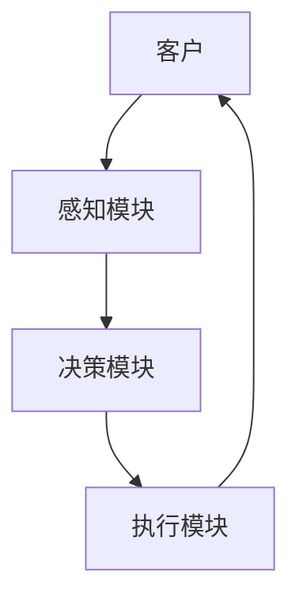

                 


# AI Agent在企业客户体验个性化中的角色

> **关键词**：AI Agent, 客户体验, 个性化服务, 人工智能, 机器学习, 自然语言处理

> **摘要**：  
本文探讨了AI Agent在企业客户体验个性化中的核心角色。通过分析AI Agent的基本概念、算法原理、系统架构及其在实际项目中的应用，本文详细阐述了如何利用AI Agent技术提升客户体验的个性化水平。文章从背景介绍、核心概念、算法原理、系统设计到项目实战，层层递进，深入剖析了AI Agent在企业客户体验中的应用价值和未来发展方向。

---

## 第1章: AI Agent的基本概念与背景

### 1.1 AI Agent的定义与特点

AI Agent（人工智能代理）是一种能够感知环境、自主决策并执行任务的智能实体。它通过数据驱动的方式，结合机器学习和自然语言处理技术，为企业提供智能化的客户体验解决方案。

**特点：**

1. **自主性**：AI Agent能够独立决策和行动，无需人工干预。
2. **反应性**：能够实时感知环境变化并做出响应。
3. **学习能力**：通过机器学习不断优化自身行为。
4. **个性化**：根据客户需求定制服务流程。

---

### 1.2 AI Agent在客户体验中的应用背景

随着客户对个性化服务的需求不断增长，传统客服系统已难以满足复杂多变的服务需求。AI Agent凭借其智能化和个性化能力，成为提升客户体验的重要工具。

**需求增长：**

- 客户希望获得个性化的服务体验，包括定制化推荐、实时反馈等。
- 企业需要提高客户满意度和忠诚度，降低服务成本。

**AI Agent的优势：**

- 提供7x24小时的实时服务。
- 根据客户行为数据，动态调整服务策略。
- 支持多渠道交互，包括语音、文本和图形界面。

---

## 第2章: AI Agent的核心概念与联系

### 2.1 AI Agent的核心概念

AI Agent的工作流程分为三个主要模块：感知、决策和执行。

#### 2.1.1 感知模块

感知模块负责收集和分析客户的行为数据，构建客户画像。以下是感知模块的关键特征对比：

| 特征       | 描述                               |
|------------|------------------------------------|
| 数据来源   | 用户行为数据、历史记录、实时交互 |
| 数据类型   | 文本、语音、图像、结构化数据     |
| 分析方法   | 机器学习、自然语言处理           |

#### 2.1.2 决策模块

决策模块基于感知模块提供的数据，利用算法生成最优决策。以下是决策模块的特征对比：

| 特征       | 描述                               |
|------------|------------------------------------|
| 决策依据   | 客户画像、历史行为、实时需求     |
| 算法类型   | 强化学习、监督学习、聚类算法     |
| 输出结果   | 个性化推荐、服务策略建议         |

#### 2.1.3 执行模块

执行模块负责根据决策模块的输出，执行具体的操作，例如发送推荐信息或调整服务流程。

---

### 2.2 AI Agent的核心原理

AI Agent的核心原理是通过数据驱动的方式，构建客户画像，并利用智能算法生成个性化服务策略。

#### 2.2.1 数据驱动的客户画像构建

客户画像是AI Agent的核心输入，它基于客户的交互数据和行为特征构建。以下是客户画像的构建过程：

1. **数据收集**：收集客户的交互数据，包括点击、浏览、购买记录等。
2. **数据清洗**：去除噪声数据，确保数据质量。
3. **特征提取**：提取关键特征，例如兴趣偏好、消费习惯。
4. **模型训练**：利用机器学习模型训练客户画像。

---

### 2.3 AI Agent与相关技术的对比

以下是AI Agent与相关技术的对比：

| 技术         | 描述                               | 与AI Agent的联系                     |
|--------------|------------------------------------|--------------------------------------|
| 传统AI       | 基于规则的系统，无法自主学习       | AI Agent是基于学习的自主代理         |
| 机器学习     | 数据驱动的模型训练技术             | AI Agent的核心算法之一              |
| 自然语言处理 | 文本分析和生成技术                 | AI Agent用于智能对话和文本处理       |

---

## 第3章: AI Agent的核心算法原理

### 3.1 强化学习算法

强化学习是一种通过试错机制优化决策的算法。以下是强化学习的基本流程：

1. **状态识别**：识别当前环境的状态。
2. **动作选择**：基于当前状态选择一个动作。
3. **奖励机制**：根据动作的结果获得奖励或惩罚。
4. **策略优化**：根据奖励优化策略。

以下是强化学习的Python代码示例：

```python
# 简单的强化学习示例
import numpy as np

# 初始化环境
class Environment:
    def __init__(self):
        self.state = 0

# 初始化智能体
class Agent:
    def __init__(self, actions):
        self.actions = actions
        self.learning_rate = 0.1

    def choose_action(self, state):
        # 随机选择动作
        return np.random.choice(self.actions)

    def learn(self, state, action, reward):
        # 简单的Q-learning算法
        pass

# 训练过程
env = Environment()
actions = [0, 1]
agent = Agent(actions)

for episode in range(100):
    state = env.state
    action = agent.choose_action(state)
    reward = 1 if action == 1 else 0
    agent.learn(state, action, reward)
```

---

### 3.2 监督学习算法

监督学习是一种基于标签数据训练模型的算法。以下是监督学习的基本流程：

1. **数据准备**：收集带标签的数据。
2. **模型训练**：利用训练数据训练模型。
3. **模型评估**：通过测试数据评估模型性能。
4. **模型部署**：将模型应用于实际场景。

以下是监督学习的Python代码示例：

```python
# 简单的监督学习示例
from sklearn.tree import DecisionTreeClassifier

# 数据准备
X = [[2, 3], [5, 4], [6, 7], [8, 9]]
y = [0, 1, 1, 0]

# 模型训练
model = DecisionTreeClassifier()
model.fit(X, y)

# 预测
new_X = [[7, 8]]
print(model.predict(new_X))
```

---

## 第4章: AI Agent的系统架构设计

### 4.1 系统功能设计

以下是AI Agent的系统功能模块：

- **用户画像模块**：构建客户的详细画像。
- **个性化推荐模块**：根据客户画像生成个性化推荐。
- **实时反馈模块**：根据客户反馈动态调整服务策略。

---

### 4.2 系统架构设计

以下是AI Agent的系统架构图：



---

## 第5章: 项目实战

### 5.1 电商客户体验优化案例

以下是电商客户体验优化的Python代码示例：

```python
# 简单的电商推荐系统
from sklearn.cluster import KMeans

# 数据准备
customers = [[10, 5, 3], [2, 8, 9], [15, 1, 4], [7, 2, 6]]

# 模型训练
model = KMeans(n_clusters=2)
model.fit(customers)

# 预测
new_customer = [8, 4, 5]
print(model.predict([new_customer]))
```

---

## 第6章: 总结与展望

### 6.1 总结

本文详细探讨了AI Agent在企业客户体验个性化中的角色，从背景介绍、核心概念、算法原理到系统设计和项目实战，全面剖析了AI Agent的应用价值。

### 6.2 未来展望

随着人工智能技术的不断进步，AI Agent在客户体验中的应用将更加广泛和深入。未来，AI Agent将结合更多先进技术，如区块链和边缘计算，为企业提供更智能、更个性化的服务。

---

## 作者

**作者：AI天才研究院/AI Genius Institute & 禅与计算机程序设计艺术 /Zen And The Art of Computer Programming**

---

以上是关于《AI Agent在企业客户体验个性化中的角色》的技术博客文章的完整思考和撰写过程。

