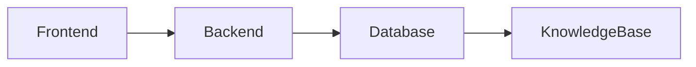

                 


# AI Agent在企业客户服务自动化中的角色

> 关键词：AI Agent, 企业客户服务, 自动化, 自然语言处理, 机器学习, 知识图谱

> 摘要：AI Agent（人工智能代理）作为一种智能化的自动化工具，正在逐步改变企业客户服务的方式。本文将从AI Agent的基本概念出发，探讨其在企业客户服务自动化中的角色与应用。通过分析AI Agent的核心技术，包括自然语言处理、机器学习与知识图谱，结合实际应用场景，揭示AI Agent如何帮助企业实现高效、智能的客户服务。同时，本文还将详细讲解AI Agent的算法实现、系统架构设计及项目实战，为读者提供全面而深入的技术洞察。

---

## 第一部分: AI Agent与企业客户服务自动化概述

### 第1章: AI Agent的基本概念与背景

#### 1.1 AI Agent的定义与核心概念
- 什么是AI Agent？
  - AI Agent的定义：AI Agent是一种能够感知环境并采取行动以实现目标的智能实体。
  - 核心特征：自主性、反应性、目标导向、社会性。
- AI Agent与传统自动化的区别：
  - 传统自动化：基于规则的机械执行。
  - AI Agent：具备学习、推理和决策能力。

#### 1.2 企业客户服务自动化的背景
- 企业客户服务的传统模式：
  - 人工客服：效率低、成本高、服务一致性差。
  - 半自动化模式：依赖固定规则，缺乏灵活性。
- AI Agent在企业客户服务中的角色：
  - 提供24/7的实时响应。
  - 处理复杂问题，减少人工干预。
  - 提升客户体验，增强客户满意度。

---

### 第2章: AI Agent在企业客户服务中的作用

#### 2.1 AI Agent的核心功能
- 自动响应与问题解决：
  - 处理常见问题，如订单查询、技术支持等。
  - 通过NLP技术理解客户需求。
- 数据分析与决策支持：
  - 分析客户行为数据，提供个性化服务。
  - 基于机器学习模型预测客户需求。
- 个性化服务与用户体验优化：
  - 根据客户历史数据推荐产品或服务。
  - 优化交互流程，提升客户满意度。

#### 2.2 AI Agent在客户服务中的应用场景
- 售前咨询与客户支持：
  - 在线聊天机器人提供实时咨询。
  - 多轮对话处理复杂问题。
- 售后服务与投诉处理：
  - 自动处理客户投诉，分类归档。
  - 提供解决方案和后续跟踪。
- 客户关系管理与忠诚度提升：
  - 分析客户反馈，优化服务策略。
  - 通过个性化推荐增强客户粘性。

#### 2.3 AI Agent的优势与挑战
- 优势：
  - 提高效率，降低成本。
  - 实现智能化、个性化的客户服务。
- 挑战：
  - 数据隐私与安全问题。
  - 技术实现复杂性。
  - 用户体验与技术平衡的难题。

---

## 第二部分: AI Agent的核心技术与原理

### 第3章: AI Agent的核心算法与实现

#### 3.1 自然语言处理（NLP）技术
- NLP的基本概念：
  - NLP的目标：让计算机理解人类语言。
  - 常见任务：分词、句法分析、情感分析等。
- 常见的NLP算法与模型：
  - 传统算法：基于规则的分词、TF-IDF。
  - 深度学习模型：BERT、GPT。
- NLP在AI Agent中的应用：
  - 文本理解与意图识别。
  - 多轮对话管理。

#### 3.2 机器学习与深度学习
- 机器学习的基本原理：
  - 监督学习、无监督学习、强化学习。
- 深度学习的核心算法：
  - 卷积神经网络（CNN）、循环神经网络（RNN）、Transformer。
- 机器学习在AI Agent中的应用：
  - 客户需求预测。
  - 自动分类与标签生成。

#### 3.3 知识图谱与对话管理
- 知识图谱的构建与应用：
  - 知识图谱的概念：将实体及其关系表示为图结构。
  - 知识图谱的构建流程：数据采集、实体识别、关系抽取。
- 对话管理的原理与实现：
  - 对话状态跟踪。
  - 响应生成与策略优化。

---

### 第4章: AI Agent的算法实现与流程图

#### 4.1 基于规则的分类算法
- 算法原理：
  - 基于预定义规则对文本进行分类。
  - 例如：关键词匹配、正则表达式。
- 流程图：
  ```mermaid
  graph TD
      A[开始] --> B[输入文本]
      B --> C[提取关键词]
      C --> D[匹配规则库]
      D --> E[输出结果]
      E --> F[结束]
  ```
- 代码实现：
  ```python
  def classify(text):
      keywords = ['订单', '查询', '问题']
      for keyword in keywords:
          if keyword in text:
              return keyword
      return '其他'
  ```

#### 4.2 基于机器学习的分类算法
- 算法原理：
  - 使用训练好的模型对文本进行分类。
  - 例如：使用预训练的BERT模型进行文本分类。
- 流程图：
  ```mermaid
  graph TD
      A[开始] --> B[输入文本]
      B --> C[特征提取]
      C --> D[模型预测]
      D --> E[输出结果]
      E --> F[结束]
  ```
- 代码实现：
  ```python
  import torch
  model = torch.load('bert_class.pth')
  def predict_class(text):
      features = extract_features(text)
      with torch.no_grad():
          outputs = model(features)
          return torch.argmax(outputs).item()
  ```

#### 4.3 对话管理算法
- 对话管理的流程：
  - 状态跟踪、上下文理解、意图识别。
- 流程图：
  ```mermaid
  graph TD
      A[开始] --> B[输入文本]
      B --> C[理解意图]
      C --> D[获取上下文]
      D --> E[生成响应]
      E --> F[结束]
  ```
- 代码实现：
  ```python
  def generate_response(text, context):
      intent = classify_intent(text)
      response = get_response(intent, context)
      return response
  ```

---

## 第三部分: 系统分析与架构设计

### 第5章: 系统分析与需求分析

#### 5.1 问题场景介绍
- 客户服务自动化的问题与挑战：
  - 人工成本高。
  - 服务质量不稳定。
  - 客户需求多样化。
- AI Agent在客户服务中的应用需求：
  - 提供7×24小时服务。
  - 处理复杂问题。
  - 提升客户体验。

#### 5.2 领域模型设计
- 领域模型类图：
  ```mermaid
  classDiagram
      class Customer {
          id: int
          name: string
          history: list
      }
      class Intent {
          id: int
          name: string
          description: string
      }
      class Text {
          content: string
          intent: Intent
      }
  ```

---

### 第6章: 系统架构设计

#### 6.1 系统架构设计
- 分层架构设计：
  - 前端层：用户交互界面。
  - 业务逻辑层：处理客户请求。
  - 数据访问层：与知识库交互。
- 微服务架构：
  - 前端服务：处理用户请求。
  - 后端服务：负责业务逻辑。
  - 数据库服务：存储客户数据。

#### 6.2 系统架构图


---

## 第四部分: 项目实战

### 第7章: 项目实战与案例分析

#### 7.1 环境安装与配置
- 安装Python、TensorFlow、Keras等工具。
- 安装NLP库：spaCy、NLTK、HanLP。

#### 7.2 核心功能实现
- 实现文本分类功能：
  ```python
  def classify(text):
      # 文本预处理
      # 特征提取
      # 模型预测
      return result
  ```
- 实现对话管理功能：
  ```python
  def generate_response(text, context):
      # 意图识别
      # 上下文处理
      # 响应生成
      return response
  ```

#### 7.3 项目实战案例
- 案例分析：电商客服自动化。
- 实际应用：订单查询、售后服务。

---

## 第五部分: 总结与展望

### 第8章: 总结与最佳实践

#### 8.1 总结
- AI Agent在企业客户服务中的优势。
- 技术实现的核心要点。
- 应用中的注意事项。

#### 8.2 最佳实践
- 数据质量的重要性。
- 系统设计的可扩展性。
- 用户体验的持续优化。

#### 8.3 小结
- AI Agent正在改变企业客户服务的方式。
- 未来的发展方向：多模态交互、情感计算。

---

## 作者：AI天才研究院 & 禅与计算机程序设计艺术

---

这篇文章通过系统化的分析，详细阐述了AI Agent在企业客户服务自动化中的角色与应用。从技术原理到实际案例，再到系统设计，为读者提供了一个全面而深入的技术视角。

