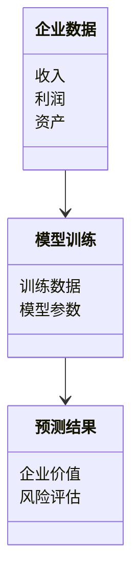
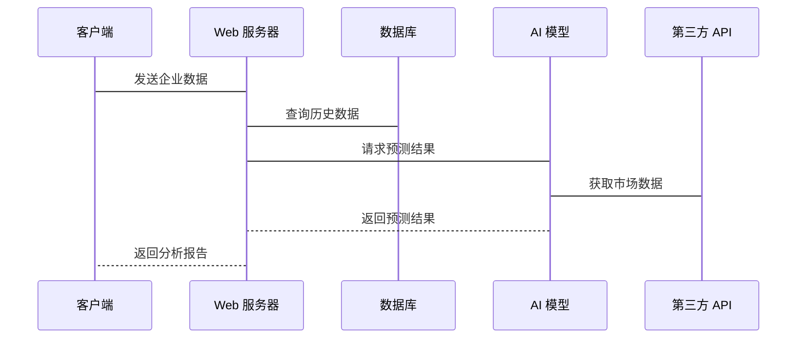

                 


# AI Agent在企业并购分析与尽职调查中的作用

## 关键词
- 企业并购
- 尽职调查
- AI Agent
- 机器学习
- 数据分析

## 摘要
随着企业并购活动的日益频繁和复杂化，传统的尽职调查方法逐渐暴露出效率低下、成本高昂以及信息不全等问题。人工智能（AI）技术的快速发展为解决这些问题提供了新的可能性。AI Agent（人工智能代理）作为一种能够自主感知、分析和决策的智能系统，在企业并购分析与尽职调查中展现出巨大潜力。本文将从AI Agent的基本概念出发，详细探讨其在企业并购中的具体应用，包括数据收集与分析、风险评估与预测、智能决策支持等方面。同时，本文还将分析AI Agent的算法原理、系统架构，并通过实际案例展示其在企业并购中的实际应用效果。

---

## 第1章: 企业并购与尽职调查的基本概念

### 1.1 企业并购的基本概念
企业并购是企业之间通过购买、出售资产或股份以实现资源优化配置和战略发展的过程。并购活动通常涉及复杂的法律、财务和市场分析，是一项高风险、高回报的商业行为。

#### 1.1.1 企业并购的定义与类型
- **定义**：企业并购是指一家企业通过购买另一家企业的全部或部分资产、股权，或通过合并等方式，将另一家企业整合到自身业务中的行为。
- **类型**：
  - **横向并购**：同一行业内的企业并购。
  - **纵向并购**：产业链上下游的企业并购。
  - **混合并购**：无直接关联的企业并购。

#### 1.1.2 并购的主要驱动因素
- **市场扩展**：通过并购快速进入新市场。
- **成本节约**：通过规模效应降低成本。
- **技术获取**：通过并购获取关键技术或专利。
- **竞争优势**：通过并购增强市场地位。

#### 1.1.3 并购的基本流程与阶段
1. **战略规划**：明确并购目标和战略意图。
2. **目标筛选**：识别潜在并购目标。
3. **尽职调查**：对目标企业进行全面评估。
4. **估值与谈判**：确定并购价格并进行谈判。
5. **整合与实施**：完成并购后的业务整合。

### 1.2 尽职调查的核心作用
尽职调查是企业并购过程中至关重要的一环，其目的是通过全面、深入的调查，评估目标企业的财务状况、法律风险、市场竞争力等，为并购决策提供依据。

#### 1.2.1 尽职调查的定义与目标
- **定义**：尽职调查是指在企业并购过程中，对目标企业进行全面、系统的调查和评估。
- **目标**：
  - 识别潜在风险和问题。
  - 评估目标企业的实际价值。
  - 为并购决策提供数据支持。

#### 1.2.2 尽职调查的关键环节
1. **财务尽职调查**：评估目标企业的财务状况，包括收入、利润、资产负债等。
2. **法律尽职调查**：审查目标企业的法律合规性，包括合同、知识产权、诉讼等。
3. **业务尽职调查**：评估目标企业的市场地位、竞争优势和管理团队。

#### 1.2.3 尽职调查对并购决策的影响
- **降低风险**：通过识别潜在问题，减少并购后的损失。
- **提高估值准确性**：基于全面的调查结果，制定合理的估值策略。
- **支持谈判策略**：根据调查结果，制定更有利的谈判策略。

### 1.3 AI Agent在企业并购中的应用背景
随着企业并购活动的复杂化，传统的尽职调查方法逐渐暴露出效率低下、成本高昂以及信息不全等问题。AI Agent作为一种智能化工具，能够通过自动化数据处理、智能分析和实时反馈，显著提升尽职调查的效率和准确性。

#### 1.3.1 传统尽职调查的局限性
- **效率低下**：传统尽职调查依赖人工分析，耗时且容易出错。
- **成本高昂**：需要大量的人力和资源投入。
- **信息不全**：难以获取全面的市场和行业数据。

#### 1.3.2 AI技术对企业并购的支持作用
- **数据处理能力**：AI能够快速处理海量数据，提供实时分析结果。
- **智能决策支持**：通过机器学习算法，AI能够预测并购后的潜在风险和收益。
- **自动化流程**：AI可以自动化完成数据收集、分析和报告生成，显著降低成本。

#### 1.3.3 AI Agent在尽职调查中的潜在价值
- **提高效率**：AI Agent能够快速完成数据收集和分析，缩短尽职调查的时间。
- **增强准确性**：通过机器学习模型，AI Agent能够提供更精准的分析结果。
- **实时监控**：AI Agent可以实时跟踪市场动态和企业信息，提供动态支持。

---

## 第2章: AI Agent的核心概念与技术原理

### 2.1 AI Agent的基本概念
AI Agent是一种能够自主感知环境、分析问题、做出决策并执行任务的智能系统。在企业并购中，AI Agent可以用于数据收集、风险评估和决策支持等多个环节。

#### 2.1.1 AI Agent的定义与分类
- **定义**：AI Agent是指具有智能特性的软件或系统，能够根据环境信息自主决策并执行任务。
- **分类**：
  - **简单反射型Agent**：基于规则的简单决策。
  - **基于模型的反射型Agent**：基于知识库和模型进行决策。
  - **目标驱动型Agent**：以特定目标为导向进行决策和行动。

#### 2.1.2 AI Agent的主要特征
- **自主性**：能够在没有人工干预的情况下自主运行。
- **反应性**：能够实时感知环境变化并做出反应。
- **学习能力**：能够通过数据学习和优化决策模型。

#### 2.1.3 AI Agent与传统AI的区别
- **传统AI**：基于规则的决策系统，通常需要人工干预。
- **AI Agent**：具有自主决策和执行能力，能够在复杂环境中独立完成任务。

### 2.2 AI Agent在企业并购中的关键功能
在企业并购中，AI Agent可以发挥以下关键作用：

#### 2.2.1 数据收集与分析能力
- **数据来源**：包括目标企业的财务报表、市场报告、新闻资讯等。
- **数据清洗**：通过AI技术自动识别和处理数据中的噪声和错误。
- **数据分析**：利用机器学习算法对数据进行深度分析，提取有价值的信息。

#### 2.2.2 风险评估与预警机制
- **风险识别**：通过自然语言处理（NLP）技术，识别目标企业的潜在风险。
- **风险评估**：基于历史数据和市场趋势，评估并购后的潜在风险。
- **预警机制**：实时监控市场动态，及时预警潜在风险。

#### 2.2.3 智能决策支持功能
- **决策支持**：基于数据分析结果，提供并购决策的建议和优化方案。
- **情景模拟**：通过机器学习模型，模拟不同并购方案的潜在结果，帮助决策者做出最优选择。

### 2.3 AI Agent的核心技术原理
AI Agent的核心技术包括自然语言处理（NLP）、机器学习和数据挖掘等。

#### 2.3.1 自然语言处理技术
- **文本分析**：通过NLP技术，对目标企业的新闻、公告等文本进行分析，提取关键词和情感倾向。
- **信息抽取**：从非结构化数据中提取有用的信息，如财务数据、市场趋势等。

#### 2.3.2 机器学习算法
- **监督学习**：基于历史数据，训练分类模型，识别潜在风险。
- **无监督学习**：通过聚类分析，发现数据中的隐藏模式。
- **深度学习**：利用神经网络模型，进行复杂的数据分析和预测。

#### 2.3.3 数据挖掘与分析方法
- **数据清洗**：去除无效数据，确保分析结果的准确性。
- **数据建模**：基于数据建立预测模型，评估并购后的潜在收益和风险。

---

## 第3章: AI Agent在尽职调查中的具体应用

### 3.1 数据收集与整理
在企业并购的尽职调查中，数据收集与整理是关键的第一步。

#### 3.1.1 数据来源的多样性
- **财务数据**：包括收入、利润、资产负债表等。
- **市场数据**：包括行业趋势、竞争对手分析等。
- **法律数据**：包括合同、知识产权、诉讼记录等。

#### 3.1.2 数据清洗与预处理
- **数据清洗**：去除重复、错误或缺失的数据。
- **数据标准化**：将不同来源的数据统一格式。
- **数据增强**：通过数据增强技术，提升数据质量。

#### 3.1.3 数据存储与管理
- **数据库管理**：使用关系型数据库存储结构化数据。
- **大数据处理**：利用Hadoop、Spark等工具处理海量数据。
- **数据可视化**：通过图表和仪表盘，直观展示数据。

### 3.2 风险识别与评估
在尽职调查中，风险识别与评估是核心环节。

#### 3.2.1 财务风险分析
- **财务指标分析**：计算目标企业的盈利能力、偿债能力等指标。
- **财务预测模型**：基于历史数据，预测并购后的财务表现。

#### 3.2.2 市场风险评估
- **市场趋势分析**：通过NLP技术，分析行业趋势和市场动态。
- **竞争分析**：评估目标企业在市场中的竞争地位。

#### 3.2.3 法律风险识别
- **合同审查**：自动识别合同中的潜在风险。
- **知识产权分析**：评估目标企业的专利和知识产权状况。

### 3.3 价值评估与预测
通过AI Agent，可以对目标企业的价值进行科学评估。

#### 3.3.1 企业价值评估模型
- **DCF模型**：通过现金流折现法评估企业价值。
- **相对估值法**：基于可比企业的估值进行评估。

#### 3.3.2 并购收益预测
- **收益预测模型**：基于历史数据和市场趋势，预测并购后的收益。
- **协同效应分析**：评估并购后的协同效应，如成本节约、收入增长等。

#### 3.3.3 并购后的协同效应分析
- **协同效应识别**：通过数据分析，识别并购后的潜在协同效应。
- **协同效应量化**：通过模型计算协同效应的具体数值。

---

## 第4章: AI Agent的算法原理与实现

### 4.1 算法选择与优化
在企业并购的分析中，选择合适的算法是关键。

#### 4.1.1 传统机器学习算法
- **线性回归**：用于预测目标企业的财务指标。
- **逻辑回归**：用于分类问题，如识别潜在风险。
- **决策树**：用于分类和回归问题，适合处理复杂的决策问题。

#### 4.1.2 深度学习算法
- **神经网络**：用于复杂的模式识别。
- **卷积神经网络（CNN）**：用于图像和文本的特征提取。
- **循环神经网络（RNN）**：用于时间序列数据的分析。

#### 4.1.3 算法性能对比与优化
- **性能对比**：比较不同算法的准确性和效率。
- **优化策略**：通过超参数调优和模型剪枝，提升算法性能。

### 4.2 AI Agent的实现步骤

#### 4.2.1 数据准备
- **数据清洗**：去除无效数据，确保数据质量。
- **特征提取**：从数据中提取有用的特征，如财务指标、市场趋势等。

#### 4.2.2 模型训练
- **训练数据集**：将数据分为训练集和测试集。
- **模型训练**：使用训练数据训练机器学习模型。
- **模型评估**：通过测试数据评估模型的性能。

#### 4.2.3 模型部署
- **API接口**：将模型封装成API，方便调用。
- **实时分析**：通过API接口，实时分析目标企业的数据。

### 4.3 代码实现与分析
以下是一个简单的Python代码示例，用于训练一个用于企业价值评估的机器学习模型。

#### 4.3.1 环境安装
```bash
pip install numpy pandas scikit-learn
```

#### 4.3.2 核心代码实现
```python
import numpy as np
import pandas as pd
from sklearn.model_selection import train_test_split
from sklearn.linear_model import LinearRegression

# 加载数据
data = pd.read_csv('企业数据.csv')

# 特征与目标变量分离
X = data[['收入', '利润', '资产']].values
y = data['企业价值'].values

# 数据分割
X_train, X_test, y_train, y_test = train_test_split(X, y, test_size=0.2, random_state=42)

# 训练模型
model = LinearRegression()
model.fit(X_train, y_train)

# 模型预测
y_pred = model.predict(X_test)

# 模型评估
score = model.score(X_test, y_test)
print(f'模型评分：{score}')
```

#### 4.3.3 实际案例分析
假设我们有一个目标企业，其收入为100万元，利润为20万元，资产为500万元。我们可以通过上述模型预测其企业价值。

```python
# 预测企业价值
target = np.array([[100, 20, 500]])
value_pred = model.predict(target)
print(f'预测企业价值：{value_pred[0]}')
```

---

## 第5章: 系统分析与架构设计方案

### 5.1 系统功能设计
AI Agent在企业并购中的系统功能设计如下：

#### 5.1.1 领域模型


#### 5.1.2 系统架构


#### 5.1.3 系统交互


### 5.2 系统接口设计
系统接口设计包括以下几个方面：

#### 5.2.1 数据接口
- **输入接口**：接收目标企业的数据，如财务数据、市场数据等。
- **输出接口**：返回分析结果，如企业价值、风险评估等。

#### 5.2.2 模型接口
- **训练接口**：接收训练数据，训练机器学习模型。
- **预测接口**：接收目标数据，返回预测结果。

#### 5.2.3 用户接口
- **Web接口**：提供用户友好的界面，方便用户提交数据和查看结果。
- **API接口**：提供程序matic调用的接口，方便与其他系统集成。

---

## 第6章: 项目实战

### 6.1 环境安装
在开始项目之前，需要安装必要的工具和库。

#### 6.1.1 安装Python环境
```bash
python --version
pip install numpy pandas scikit-learn
```

#### 6.1.2 安装机器学习库
```bash
pip install scikit-learn xgboost
```

#### 6.1.3 安装数据可视化库
```bash
pip install matplotlib seaborn
```

### 6.2 系统核心实现源代码
以下是一个完整的Python代码示例，展示如何使用AI Agent进行企业价值评估。

#### 6.2.1 数据加载与预处理
```python
import pandas as pd
import numpy as np
from sklearn.model_selection import train_test_split
from sklearn.ensemble import RandomForestRegressor
from sklearn.metrics import mean_squared_error

# 加载数据
data = pd.read_csv('企业数据.csv')

# 特征与目标变量分离
X = data[['收入', '利润', '资产', '员工数量']].values
y = data['企业价值'].values

# 数据分割
X_train, X_test, y_train, y_test = train_test_split(X, y, test_size=0.2, random_state=42)
```

#### 6.2.2 模型训练与优化
```python
# 训练模型
model = RandomForestRegressor(n_estimators=100, random_state=42)
model.fit(X_train, y_train)

# 模型预测
y_pred = model.predict(X_test)

# 模型评估
mse = mean_squared_error(y_test, y_pred)
rmse = np.sqrt(mse)
print(f'Mean Squared Error: {mse}')
print(f'Root Mean Squared Error: {rmse}')
```

#### 6.2.3 模型部署与应用
```python
# 预测企业价值
target = np.array([[100, 20, 500, 50]])
value_pred = model.predict(target)
print(f'预测企业价值：{value_pred[0]}')
```

### 6.3 实际案例分析
假设我们有一个目标企业，其收入为100万元，利润为20万元，资产为500万元，员工数量为50人。我们可以通过上述模型预测其企业价值。

#### 6.3.1 数据输入
```python
target = np.array([[100, 20, 500, 50]])
```

#### 6.3.2 模型预测
```python
value_pred = model.predict(target)
print(f'预测企业价值：{value_pred[0]}')
```

#### 6.3.3 结果分析
- **预测结果**：假设模型预测的企业价值为2000万元。
- **分析**：通过对比历史数据和市场趋势，验证预测结果的合理性。

### 6.4 项目小结
通过上述项目的实现，我们可以看到AI Agent在企业并购分析中的巨大潜力。通过机器学习模型，我们可以快速、准确地评估目标企业的价值，识别潜在风险，并为并购决策提供有力支持。

---

## 第7章: 最佳实践与小结

### 7.1 最佳实践
在实际应用中，需要注意以下几点：

#### 7.1.1 数据质量
- 确保数据的准确性和完整性。
- 处理数据中的噪声和缺失值。

#### 7.1.2 模型选择
- 根据具体问题选择合适的算法。
- 通过交叉验证评估模型性能。

#### 7.1.3 系统安全
- 确保系统的安全性和稳定性。
- 防范数据泄露和网络攻击。

### 7.2 小结
AI Agent在企业并购分析与尽职调查中的应用，不仅提高了效率，还显著降低了风险。通过智能化的分析和决策支持，AI Agent能够帮助企业在复杂的并购过程中做出更加明智的决策。

### 7.3 注意事项
- 在实际应用中，AI Agent的结果需要结合人工判断。
- 确保数据的合法性和合规性。
- 定期更新模型和数据，保持系统的准确性。

### 7.4 拓展阅读
- 《机器学习实战》
- 《企业并购与风险管理》
- 《人工智能与商业应用》

---

## 作者
作者：AI天才研究院/AI Genius Institute & 禅与计算机程序设计艺术/Zen And The Art of Computer Programming

