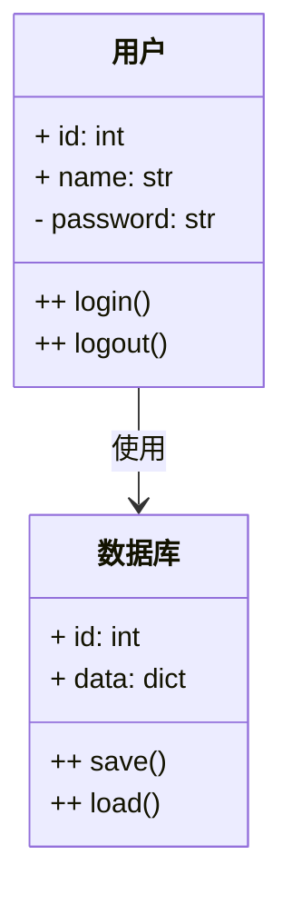
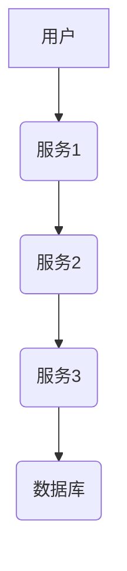
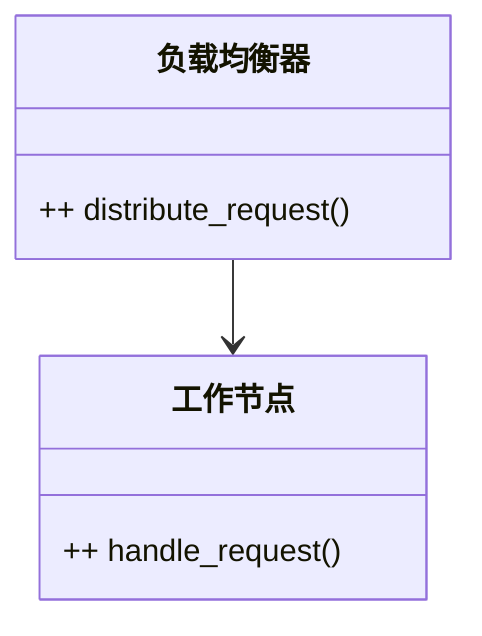
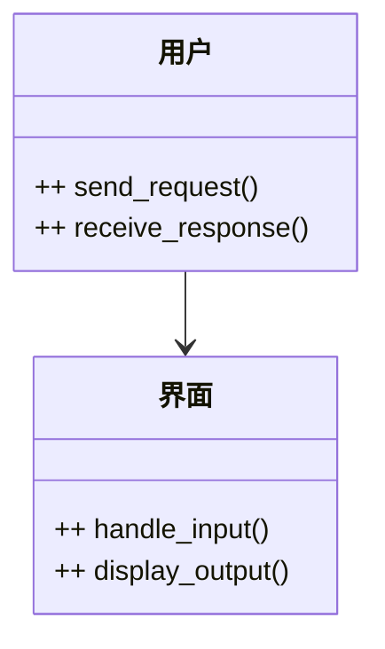
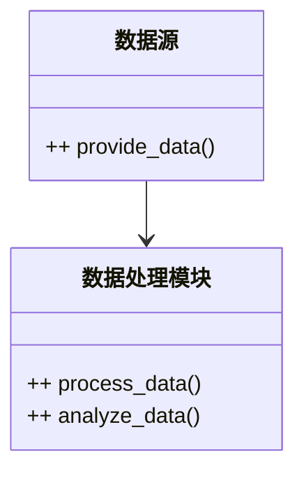
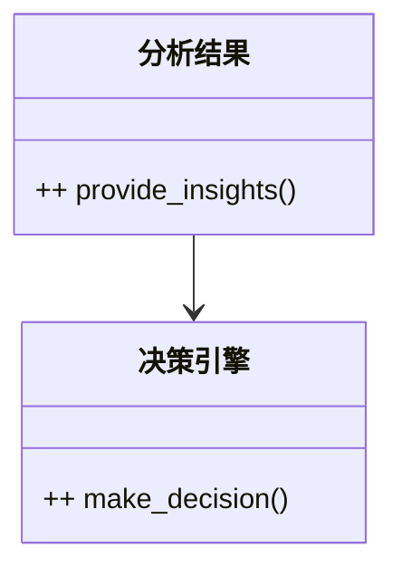
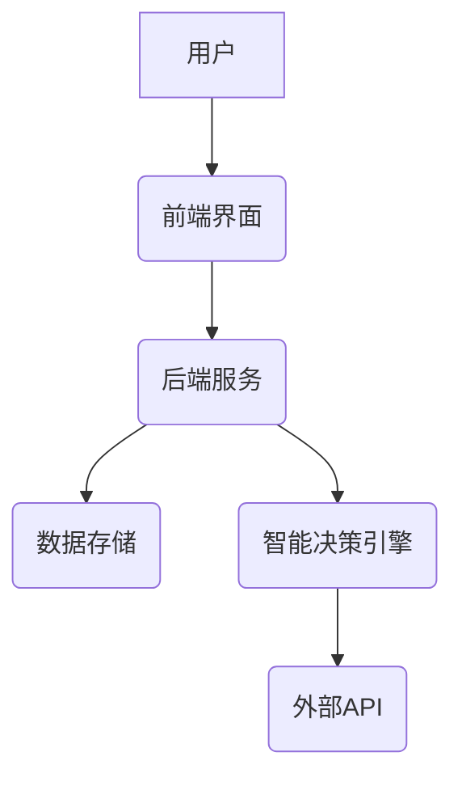

                 


# AI Agent在企业数字化转型中的催化作用：从战略到落地

## 关键词
AI Agent，企业数字化转型，人工智能，自动化流程，智能决策支持

## 摘要
随着企业数字化转型的深入推进，AI Agent（人工智能代理）在其中发挥着越来越重要的催化作用。AI Agent不仅能够帮助企业在数字化转型中实现智能化、自动化，还能通过其强大的决策能力和学习能力，为企业提供高效的支持。本文将从AI Agent的核心概念、算法原理、系统架构设计、项目实战等多个方面进行深入分析，探讨其在企业数字化转型中的具体应用和落地策略。

---

# 第1章: AI Agent与企业数字化转型概述

## 1.1 AI Agent的基本概念

### 1.1.1 什么是AI Agent
AI Agent，即人工智能代理，是一种能够感知环境、自主决策并执行任务的智能系统。它可以理解为一种“智能体”，通过与环境的交互，实现特定的目标。AI Agent的核心在于其自主性和智能性，能够在复杂环境中做出最优决策。

### 1.1.2 AI Agent的核心特征
- **自主性**：能够独立感知环境并自主决策。
- **反应性**：能够实时感知环境变化并做出反应。
- **学习性**：能够通过经验不断优化自身算法。
- **社交能力**：能够与人和其他系统进行有效交互。

### 1.1.3 AI Agent与传统IT系统的区别
传统IT系统通常基于固定的规则和流程，而AI Agent具备学习和自适应能力，能够根据环境变化动态调整行为。这种区别使得AI Agent在企业数字化转型中更具灵活性和适应性。

## 1.2 企业数字化转型的背景与挑战

### 1.2.1 数字化转型的定义与目标
数字化转型是指利用数字技术（如人工智能、大数据、云计算等）对企业的产品、服务、流程和商业模式进行全面改造，以实现业务的创新和效率提升。

### 1.2.2 企业数字化转型中的主要挑战
- **数据孤岛问题**：企业内部数据分散，难以统一管理和分析。
- **技术集成难度大**：不同系统之间的兼容性和集成性较差。
- **人才短缺**：具备数字化转型所需技能的人才较为匮乏。
- **成本与风险**：数字化转型需要大量投入，且存在失败风险。

### 1.2.3 AI Agent在数字化转型中的作用
AI Agent能够通过自动化、智能化的方式，帮助企业解决数据孤岛、技术集成等问题，同时提升效率和降低成本。其在数字化转型中的作用主要体现在智能客服、智能决策支持和自动化流程管理等方面。

## 1.3 AI Agent在企业中的应用场景

### 1.3.1 智能客服与客户体验优化
AI Agent可以通过自然语言处理技术，为企业提供智能客服解决方案。它能够理解客户的问题，快速响应并解决问题，从而提升客户满意度。

### 1.3.2 智能决策支持
AI Agent能够通过机器学习和数据分析，为企业提供智能决策支持。例如，在供应链管理中，AI Agent可以通过预测需求，优化库存管理。

### 1.3.3 自动化流程管理
AI Agent可以自动化处理企业中的重复性任务，例如自动填写表格、自动审批流程等，从而提高工作效率。

## 1.4 本章小结
本章从AI Agent的基本概念出发，探讨了其在企业数字化转型中的重要性。通过分析企业数字化转型的背景与挑战，揭示了AI Agent在智能客服、智能决策支持和自动化流程管理中的应用场景。

---

# 第2章: AI Agent的核心原理

## 2.1 AI Agent的技术基础

### 2.1.1 机器学习与深度学习
机器学习是AI Agent的核心技术之一，它使AI Agent能够通过数据学习并做出预测。深度学习作为一种机器学习技术，通过多层神经网络来模拟人类的思维方式。

### 2.1.2 自然语言处理
自然语言处理（NLP）使AI Agent能够理解和生成人类语言。通过NLP技术，AI Agent可以与用户进行自然的对话交互。

### 2.1.3 强化学习
强化学习是一种通过试错机制来优化决策的技术。AI Agent可以通过强化学习，不断优化其决策策略。

## 2.2 AI Agent的工作原理

### 2.2.1 感知与理解
AI Agent通过传感器或API感知环境，并利用自然语言处理等技术理解环境中的信息。

### 2.2.2 决策与执行
AI Agent基于感知到的信息，通过机器学习模型做出决策，并通过执行器将决策转化为行动。

### 2.2.3 学习与优化
AI Agent通过强化学习等技术不断优化自身的决策模型，以提高其在复杂环境中的表现。

## 2.3 AI Agent的算法与模型

### 2.3.1 决策树算法
决策树是一种常用的机器学习算法，适用于分类和回归问题。以下是决策树算法的简单实现示例：

```python
class DecisionTree:
    def __init__(self):
        pass

    def fit(self, X, y):
        pass

    def predict(self, X):
        pass
```

### 2.3.2 强化学习算法
强化学习算法通过试错机制优化决策。以下是Q-Learning算法的简单实现示例：

```python
class QLearning:
    def __init__(self, actions, epsilon=0.1, alpha=0.1):
        self.actions = actions
        self.epsilon = epsilon
        self.alpha = alpha
        self.q = {}

    def get_q(self, state, action):
        return self.q.get((state, action), 0)

    def update_q(self, state, action, reward, next_state):
        q = self.get_q(state, action)
        max_next_q = max([self.get_q(next_state, a) for a in self.actions])
        new_q = q + self.alpha * (reward + max_next_q - q)
        self.q[(state, action)] = new_q
```

### 2.3.3 联合概率图模型
联合概率图模型通过概率推理进行决策。以下是一个简单的联合概率图模型示例：

$$ P(A|B) = \frac{P(A,B)}{P(B)} $$

## 2.4 本章小结
本章详细介绍了AI Agent的核心技术基础，包括机器学习、自然语言处理和强化学习。通过分析AI Agent的工作原理和算法模型，揭示了其在企业数字化转型中的技术优势。

---

# 第3章: AI Agent的系统架构与设计

## 3.1 系统架构设计概述

### 3.1.1 分层架构
分层架构将系统划分为多个层次，每一层负责不同的功能。以下是分层架构的类图：



### 3.1.2 微服务架构
微服务架构将系统划分为多个小型服务，每个服务负责不同的功能。以下是微服务架构的架构图：



### 3.1.3 可扩展性设计
可扩展性设计通过水平扩展来提高系统的处理能力。以下是可扩展性设计的类图：



## 3.2 系统功能设计

### 3.2.1 用户交互界面
用户交互界面是用户与系统之间的接口。以下是用户交互界面的类图：



### 3.2.2 数据处理与分析
数据处理与分析模块负责对数据进行处理和分析。以下是数据处理与分析的类图：



### 3.2.3 智能决策引擎
智能决策引擎负责根据分析结果做出决策。以下是智能决策引擎的类图：



## 3.3 系统架构图



## 3.4 本章小结
本章详细介绍了AI Agent的系统架构与设计，包括分层架构、微服务架构和可扩展性设计。通过类图和流程图，展示了系统的各个模块及其交互关系。

---

# 第4章: AI Agent的算法实现与数学模型

## 4.1 决策树算法实现

### 4.1.1 决策树的构建过程
决策树的构建过程包括数据预处理、特征选择、决策树生成等步骤。以下是决策树算法的简单实现示例：

```python
class DecisionTree:
    def __init__(self):
        self.tree = {}

    def fit(self, X, y):
        pass

    def predict(self, X):
        pass
```

### 4.1.2 决策树的数学模型
决策树的数学模型可以通过概率论和信息论来描述。以下是一个简单的决策树模型：

$$ P(y|X) = \prod_{i=1}^{n} P(x_i | y, x_{i-1}) $$

## 4.2 强化学习算法实现

### 4.2.1 Q-Learning算法
Q-Learning算法是一种常用的强化学习算法，适用于离散动作空间。以下是Q-Learning算法的简单实现示例：

```python
class QLearning:
    def __init__(self, actions, epsilon=0.1, alpha=0.1):
        self.actions = actions
        self.epsilon = epsilon
        self.alpha = alpha
        self.q = {}

    def get_q(self, state, action):
        return self.q.get((state, action), 0)

    def update_q(self, state, action, reward, next_state):
        q = self.get_q(state, action)
        max_next_q = max([self.get_q(next_state, a) for a in self.actions])
        new_q = q + self.alpha * (reward + max_next_q - q)
        self.q[(state, action)] = new_q
```

### 4.2.2 强化学习的数学模型
强化学习的数学模型可以通过马尔可夫决策过程（MDP）来描述。以下是一个简单的强化学习模型：

$$ Q(s, a) = Q(s, a) + \alpha [r + \max Q(s', a') - Q(s, a)] $$

## 4.3 联合概率图模型

### 4.3.1 联合概率图的构建
联合概率图模型通过概率推理进行决策。以下是联合概率图模型的简单实现示例：

```python
class JointProbabilityModel:
    def __init__(self):
        pass

    def fit(self, data):
        pass

    def predict(self, X):
        pass
```

### 4.3.2 联合概率图的数学模型
联合概率图的数学模型可以通过概率分布来描述。以下是一个简单的联合概率分布模型：

$$ P(A,B) = P(A|B) \cdot P(B) $$

## 4.4 本章小结
本章详细介绍了AI Agent的算法实现与数学模型，包括决策树、强化学习和联合概率图模型。通过代码示例和数学公式，展示了这些算法在实际应用中的实现细节。

---

# 第5章: AI Agent的项目实战

## 5.1 项目背景与目标

### 5.1.1 项目背景
本项目旨在通过AI Agent技术，帮助企业实现智能客服和客户体验优化。

### 5.1.2 项目目标
- 实现智能客服系统
- 提升客户满意度
- 降低人工客服成本

## 5.2 项目实施步骤

### 5.2.1 环境安装
首先需要安装Python和相关库：

```bash
pip install numpy
pip install scikit-learn
pip install transformers
```

### 5.2.2 系统实现

#### 5.2.2.1 用户交互界面
以下是用户交互界面的代码实现：

```python
class UI:
    def __init__(self):
        self.input = input
        self.print = print

    def start(self):
        while True:
            user_input = self.input("请输入问题：")
            response = self.get_response(user_input)
            self.print(response)

    def get_response(self, user_input):
        # 实现具体的响应逻辑
        pass
```

#### 5.2.2.2 自然语言处理模块
以下是自然语言处理模块的代码实现：

```python
class NLPProcessor:
    def __init__(self):
        self.model = load_model()

    def process(self, text):
        pass
```

#### 5.2.2.3 智能决策引擎
以下是智能决策引擎的代码实现：

```python
class DecisionEngine:
    def __init__(self):
        pass

    def make_decision(self, input_data):
        pass
```

### 5.2.3 系统测试与优化
系统测试包括单元测试、集成测试和性能测试。以下是单元测试示例：

```python
import unittest

class TestDecisionEngine(unittest.TestCase):
    def test_make_decision(self):
        engine = DecisionEngine()
        self.assertEqual(engine.make_decision("yes"), "success")

if __name__ == "__main__":
    unittest.main()
```

## 5.3 项目小结
本章通过一个具体的项目案例，详细介绍了AI Agent的项目实施步骤。从环境安装到系统实现，再到系统测试，展示了AI Agent技术在实际应用中的落地过程。

---

# 第6章: AI Agent的最佳实践与总结

## 6.1 最佳实践

### 6.1.1 小结
AI Agent在企业数字化转型中具有重要的催化作用。通过智能化、自动化的方式，帮助企业提升效率和降低成本。

### 6.1.2 注意事项
- 数据隐私与安全问题
- 系统集成与兼容性问题
- 人才培养与团队建设

### 6.1.3 拓展阅读
建议读者进一步阅读相关书籍和论文，深入了解AI Agent的技术细节和应用案例。

## 6.2 本章总结
本章通过总结AI Agent在企业数字化转型中的应用，提出了最佳实践建议，并指出了未来的研究方向。

---

作者：AI天才研究院/AI Genius Institute & 禅与计算机程序设计艺术/Zen And The Art of Computer Programming

