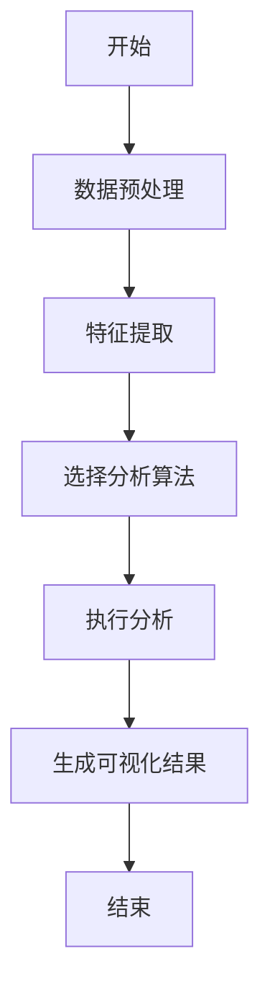
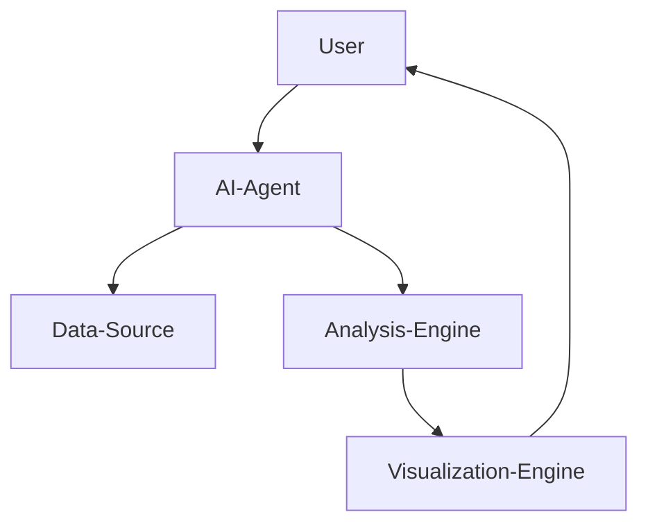
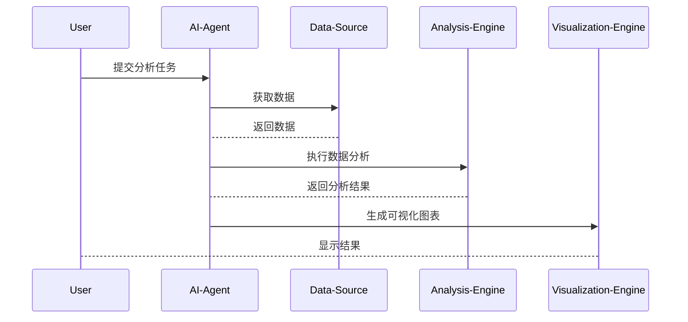

                 


# AI Agent在企业数据分析与可视化中的应用

## 关键词：AI Agent, 数据分析, 数据可视化, 企业应用, 算法原理, 系统架构, 项目实战

## 摘要：本文深入探讨了AI Agent在企业数据分析与可视化中的应用，从背景介绍、核心概念、算法原理到系统架构设计和项目实战，全面解析了如何利用AI Agent提升企业的数据分析能力与可视化效果。文章结合实际案例，详细阐述了AI Agent的工作原理、算法实现以及系统设计，为读者提供了全面的理论与实践指导。

---

## 第1章: AI Agent与企业数据分析的背景介绍

### 1.1 问题背景与描述
#### 1.1.1 数据分析与可视化的挑战
在当今数据驱动的时代，企业面临着海量数据的处理和分析问题。传统的数据分析方法效率低下，难以满足实时性和复杂性的要求。数据可视化作为数据分析的重要环节，也面临着如何将复杂数据直观呈现的挑战。

#### 1.1.2 AI Agent在数据分析中的作用
AI Agent作为一种智能代理，能够自动执行数据分析任务，提供实时反馈和优化建议。它能够处理大量数据，发现潜在模式，并通过可视化工具将结果呈现给用户，大大提升了数据分析的效率和准确性。

#### 1.1.3 企业数据分析的现状与痛点
企业目前的数据分析主要依赖人工操作，存在效率低、成本高、结果不够精准等问题。数据可视化工具虽然能够将数据呈现出来，但缺乏智能化和自动化的能力，难以满足企业对实时分析和决策支持的需求。

---

### 1.2 AI Agent的核心概念与定义
#### 1.2.1 AI Agent的基本定义
AI Agent是一种智能代理，能够感知环境、理解数据、执行任务并做出决策。在数据分析与可视化中，AI Agent能够自动处理数据、生成报告和可视化图表，并提供决策支持。

#### 1.2.2 数据分析与可视化的核心要素
数据分析的核心要素包括数据采集、数据清洗、数据建模和数据解释。数据可视化则关注如何将数据以直观的方式呈现，帮助用户更好地理解和决策。

#### 1.2.3 AI Agent与数据分析的结合
AI Agent通过整合数据分析和数据可视化技术，能够实现从数据处理到结果呈现的自动化流程，为企业提供高效、智能的数据分析服务。

---

### 1.3 问题解决与边界
#### 1.3.1 AI Agent如何解决数据分析问题
AI Agent能够自动执行数据分析任务，发现数据中的潜在模式，并通过可视化工具将结果呈现给用户。它能够实时监控数据变化，提供动态的分析结果，帮助企业在复杂环境中做出快速决策。

#### 1.3.2 应用场景与边界
AI Agent在企业数据分析中的应用场景包括销售预测、客户行为分析、供应链优化等。其边界主要在于数据的实时性、准确性和系统的可扩展性。

#### 1.3.3 核心要素与组成结构
AI Agent的核心要素包括数据源、数据分析算法、数据可视化工具和用户界面。其组成结构包括数据采集模块、数据分析模块、数据可视化模块和用户交互模块。

---

## 第2章: AI Agent的核心概念与原理

### 2.1 核心概念原理
#### 2.1.1 数据分析与AI Agent的关系
AI Agent通过集成数据分析算法，能够自动处理数据、提取特征并生成分析结果。数据分析是AI Agent实现智能决策的基础。

#### 2.1.2 AI Agent的基本工作原理
AI Agent通过感知环境、接收数据、执行分析任务、生成可视化结果并反馈给用户。它能够根据用户需求动态调整分析策略。

#### 2.1.3 数据可视化的核心算法
数据可视化算法包括数据清洗、数据变换、数据聚合和数据呈现等步骤。AI Agent能够自动选择合适的可视化方法，生成直观的图表。

---

### 2.2 核心概念属性特征对比表

| **属性**       | **数据分析**                | **数据可视化**                |
|----------------|-----------------------------|-----------------------------|
| **输入**       | 原始数据、结构化数据        | 数据分析结果、可视化指令      |
| **输出**       | 数据模型、分析报告          | 可视化图表、数据仪表盘        |
| **目标**       | 发现数据规律、支持决策      | 展示数据、辅助理解            |
| **技术**       | 机器学习、统计分析          | 图表生成、数据挖掘            |

---

### 2.3 ER实体关系图

```mermaid
erDiagram
    user {
        +id : int
        +name : string
        +role : string
    }
    data_source {
        +id : int
        +name : string
        +type : string
    }
    analysis_task {
        +id : int
        +name : string
        +status : string
    }
    visualization_result {
        +id : int
        +type : string
        +content : bytes
    }
    user --> analysis_task : 提交任务
    analysis_task --> data_source : 使用数据源
    analysis_task --> visualization_result : 生成结果
```

---

## 第3章: AI Agent的算法原理与数学模型

### 3.1 数据分析与可视化的算法原理
#### 3.1.1 数据预处理与特征提取
数据预处理包括数据清洗、数据转换和数据归约。特征提取则是从数据中提取有用的信息，例如使用主成分分析（PCA）进行降维。

#### 3.1.2 数据分析算法选择
常用的分析算法包括回归分析、聚类分析、分类分析和时间序列分析。AI Agent能够根据数据特点自动选择合适的算法。

#### 3.1.3 数据可视化算法实现
数据可视化算法包括散点图、折线图、柱状图等。AI Agent能够根据分析结果自动选择最佳的可视化方式。

---

### 3.2 算法流程图



---

### 3.3 数学模型与公式

#### 3.3.1 数据分析的基本公式
$$
y = \beta_0 + \beta_1x + \epsilon
$$

其中，$y$ 是目标变量，$x$ 是自变量，$\beta_0$ 和 $\beta_1$ 是回归系数，$\epsilon$ 是误差项。

#### 3.3.2 数据可视化的数学模型
$$
\text{可视化效果} = f(\text{数据分析结果})
$$

#### 3.3.3 示例：线性回归分析
假设我们有以下数据：
| x | y |
|---|---|
| 1 | 2 |
| 2 | 3 |
| 3 | 4 |

线性回归的模型为：
$$
y = 1 + 1x
$$

---

## 第4章: 系统分析与架构设计

### 4.1 系统功能设计
#### 4.1.1 数据采集模块
负责从多种数据源（如数据库、API）采集数据，并进行初步清洗。

#### 4.1.2 数据处理模块
对采集到的数据进行预处理、特征提取和数据转换。

#### 4.1.3 数据分析模块
根据用户需求选择合适的分析算法，执行数据分析任务。

#### 4.1.4 数据可视化模块
根据分析结果生成可视化图表，并将结果呈现给用户。

---

### 4.2 系统架构设计



---

### 4.3 系统接口设计
#### 4.3.1 数据接口
- 数据采集接口：用于从数据库或API获取数据。
- 数据处理接口：用于数据清洗和特征提取。

#### 4.3.2 用户接口
- 用户输入接口：用户输入分析任务需求。
- 结果展示接口：显示分析结果和可视化图表。

#### 4.3.3 API接口
- 分析任务API：供其他系统调用，执行数据分析任务。
- 可视化结果API：返回可视化图表的数据。

---

### 4.4 系统交互流程



---

## 第5章: 项目实战与实现

### 5.1 环境安装与配置
#### 5.1.1 Python环境安装
安装Python 3.8及以上版本，并配置虚拟环境。

#### 5.1.2 数据分析库安装
安装Pandas、NumPy、Scikit-learn等库。

#### 5.1.3 可视化工具安装
安装Matplotlib、Seaborn等可视化库。

---

### 5.2 核心代码实现

#### 5.2.1 数据采集模块
```python
import pandas as pd
from sqlalchemy import create_engine

# 从数据库获取数据
engine = create_engine('sqlite:///data.db')
data = pd.read_sql('SELECT * FROM sales', engine)
```

#### 5.2.2 数据处理模块
```python
# 数据清洗
data.dropna(inplace=True)
data['date'] = pd.to_datetime(data['date'])
```

#### 5.2.3 数据分析模块
```python
# 线性回归分析
from sklearn.linear_model import LinearRegression

model = LinearRegression()
model.fit(data[['x']], data['y'])
```

#### 5.2.4 数据可视化模块
```python
import matplotlib.pyplot as plt

plt.scatter(data['x'], data['y'])
plt.plot(data['x'], model.predict(data[['x']]), color='red')
plt.show()
```

---

### 5.3 项目实战小结
通过实际案例，我们展示了AI Agent如何在企业数据分析与可视化中发挥作用。从数据采集到结果呈现，整个流程实现了自动化和智能化，大大提升了数据分析的效率和准确性。

---

## 作者：AI天才研究院/AI Genius Institute & 禅与计算机程序设计艺术 /Zen And The Art of Computer Programming

---

本文详细介绍了AI Agent在企业数据分析与可视化中的应用，从背景介绍到系统设计，再到项目实战，为读者提供了全面的理论与实践指导。通过本文的学习，读者可以深入了解AI Agent的核心概念、算法原理和系统架构，并能够通过实际案例掌握AI Agent的实现方法。

