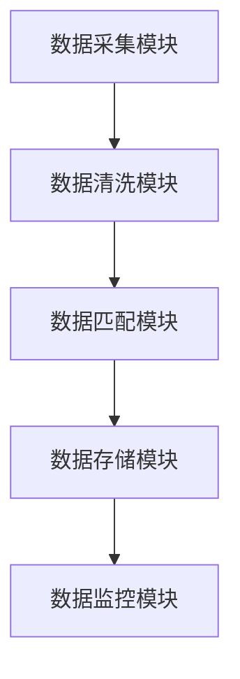
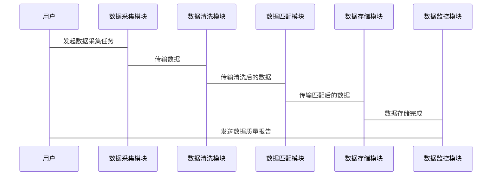

                 

# AI Agent在企业数据质量评估与自动化治理中的应用

关键词：AI Agent, 企业数据质量, 数据治理, 人工智能, 数据质量管理, 数据清洗

摘要：随着企业数字化转型的深入，数据质量管理的重要性日益凸显。传统的数据治理方法依赖人工操作，效率低下且容易出错。而AI Agent作为一种智能代理，能够通过自主学习和推理，实现数据质量管理的自动化与智能化。本文将详细探讨AI Agent在企业数据质量评估与自动化治理中的应用，分析其核心概念、技术实现、系统架构以及实际案例，为企业数据治理提供新的思路和解决方案。

---

## 第1章 数据质量管理的背景与挑战

### 1.1 数据质量管理的背景
随着企业数字化转型的推进，数据成为企业最重要的资产之一。然而，数据的来源多样、格式复杂、质量参差不齐，导致数据质量管理成为一项艰巨的任务。数据质量管理的目标是确保数据的准确性、完整性、一致性和及时性，为企业决策提供可靠支持。

### 1.2 数据质量管理的挑战
- **数据来源多样**：企业数据可能来自不同的系统、数据库或外部来源，数据格式和标准不一致，导致数据清洗和整合的复杂性。
- **数据量庞大**：现代企业每天产生的数据量巨大，人工处理效率低下。
- **数据质量问题**：数据中的错误、重复、缺失等问题直接影响数据分析的结果。
- **数据治理成本高**：传统数据治理依赖人工操作，时间和成本高昂。

### 1.3 AI Agent在数据治理中的应用前景
AI Agent是一种智能代理，能够自主学习、推理和决策。其在数据质量管理中的应用前景广阔，主要体现在以下几个方面：
- **自动化数据清洗**：AI Agent可以通过机器学习算法自动识别和纠正数据中的错误。
- **智能数据匹配**：通过自然语言处理和知识图谱技术，AI Agent能够自动匹配和整合不同来源的数据。
- **实时数据监控**：AI Agent可以实时监控数据流，快速发现并处理数据质量问题。

---

## 第2章 数据质量管理的核心概念与方法

### 2.1 数据质量的五个核心维度
数据质量可以从以下五个维度进行评估：
1. **准确性**：数据是否真实反映业务事实。
2. **完整性**：数据是否包含所有必要信息。
3. **一致性**：数据是否在不同系统中保持一致。
4. **及时性**：数据是否及时更新。
5. **可追溯性**：数据是否可追溯来源。

### 2.2 数据清洗的实现方法
数据清洗是数据质量管理中的关键步骤，主要包括以下步骤：
1. **数据去重**：通过算法识别并删除重复数据。
2. **数据标准化**：将数据格式统一化，例如日期格式、货币单位等。
3. **数据纠错**：通过机器学习模型识别并纠正数据中的错误。
4. **数据填充**：对缺失数据进行补充，例如使用均值、中位数或最近值填充。

### 2.3 数据质量管理的系统架构
数据质量管理系统的架构通常包括以下模块：
1. **数据采集模块**：从多个数据源采集数据。
2. **数据清洗模块**：对采集的数据进行清洗和预处理。
3. **数据匹配模块**：通过算法匹配同一实体在不同系统中的数据。
4. **数据存储模块**：将处理后的数据存储到数据库中。
5. **数据监控模块**：实时监控数据质量，发现异常及时告警。

---

## 第3章 AI Agent的核心概念与技术实现

### 3.1 AI Agent的基本原理
AI Agent是一种智能代理，能够通过感知环境、自主决策和执行任务来实现目标。其核心原理包括：
1. **知识表示**：通过知识图谱或数据库表示任务相关的知识。
2. **推理机制**：基于知识库进行推理，生成决策。
3. **行为决策**：根据推理结果执行具体任务。

### 3.2 AI Agent在数据质量管理中的实现
AI Agent在数据质量管理中的实现主要包括以下几个步骤：
1. **数据感知**：通过数据采集模块感知数据源中的数据。
2. **数据分析**：使用机器学习算法分析数据质量。
3. **决策制定**：基于分析结果制定数据清洗策略。
4. **任务执行**：根据策略执行数据清洗任务。

### 3.3 AI Agent与传统数据治理工具的对比
| 对比维度 | AI Agent | 传统数据治理工具 |
|----------|-----------|------------------|
| 自动化程度 | 高 | 低 |
| 决策能力 | 强大，基于机器学习 | 基于固定规则 |
| 处理效率 | 高，支持实时处理 | 低，依赖人工操作 |

---

## 第4章 AI Agent在数据质量管理中的应用实践

### 4.1 数据清洗的AI Agent实现
以数据清洗为例，AI Agent可以通过以下步骤实现：
1. **数据采集**：从多个数据源采集数据。
2. **数据分析**：使用自然语言处理技术识别数据中的错误。
3. **数据清洗**：基于机器学习模型自动纠正数据错误。
4. **数据存储**：将清洗后的数据存储到目标数据库。

### 4.2 数据匹配的AI Agent实现
数据匹配是AI Agent在数据质量管理中的另一个重要应用。例如，在企业合并过程中，AI Agent可以通过知识图谱技术匹配同一实体在不同系统中的数据。

### 4.3 实际案例分析
以某电商平台为例，AI Agent可以通过以下步骤实现数据质量管理：
1. **数据采集**：从订单系统、库存系统等数据源采集数据。
2. **数据清洗**：识别并纠正数据中的错误，例如重复订单、库存数据不一致等问题。
3. **数据匹配**：匹配订单和库存数据，确保数据一致性。
4. **数据监控**：实时监控数据质量，发现异常及时告警。

---

## 第5章 数据质量管理系统的架构设计

### 5.1 系统功能设计
数据质量管理系统的功能模块包括：
1. **数据采集模块**：从多个数据源采集数据。
2. **数据清洗模块**：对数据进行清洗和预处理。
3. **数据匹配模块**：通过算法匹配同一实体在不同系统中的数据。
4. **数据存储模块**：将处理后的数据存储到数据库中。
5. **数据监控模块**：实时监控数据质量，发现异常及时告警。

### 5.2 系统架构设计
以下是数据质量管理系统的架构图：

### 5.3 系统接口设计
数据质量管理系统的接口设计如下：
1. **数据采集接口**：从数据源获取数据。
2. **数据清洗接口**：对数据进行清洗和预处理。
3. **数据匹配接口**：匹配同一实体在不同系统中的数据。
4. **数据监控接口**：实时监控数据质量，发现异常及时告警。

### 5.4 系统交互设计
以下是数据质量管理系统的交互序列图：

---

## 第6章 总结与展望

### 6.1 本章总结
本文详细探讨了AI Agent在企业数据质量评估与自动化治理中的应用，分析了其核心概念、技术实现、系统架构以及实际案例。通过AI Agent的引入，企业可以显著提高数据质量管理的效率和准确性。

### 6.2 未来展望
随着人工智能技术的不断发展，AI Agent在数据质量管理中的应用前景广阔。未来的研究方向可能包括：
- 更智能的数据清洗算法。
- 更高效的数据匹配技术。
- 更强大的数据监控系统。

---

作者：AI天才研究院/AI Genius Institute & 禅与计算机程序设计艺术 /Zen And The Art of Computer Programming

