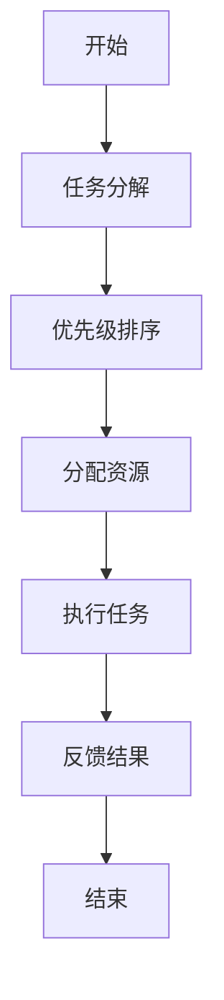
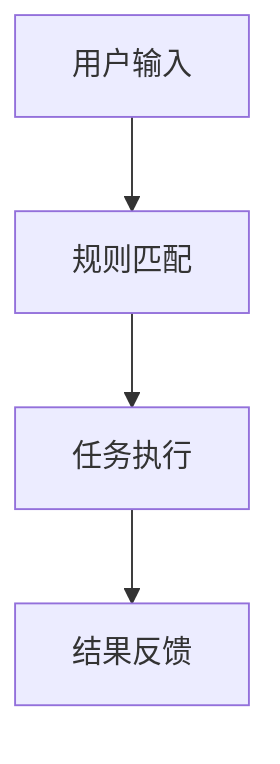
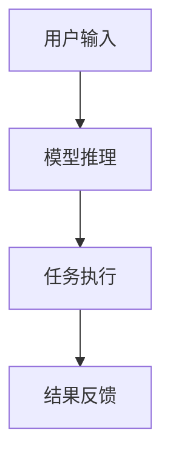
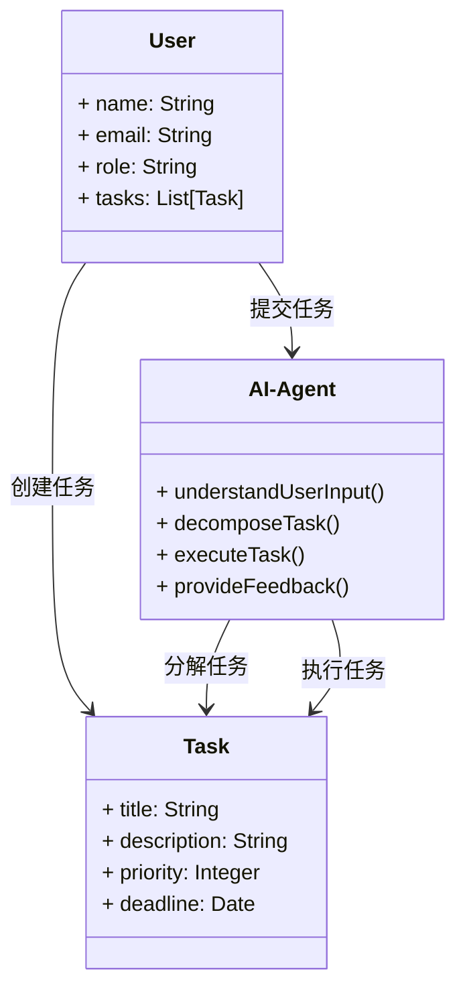
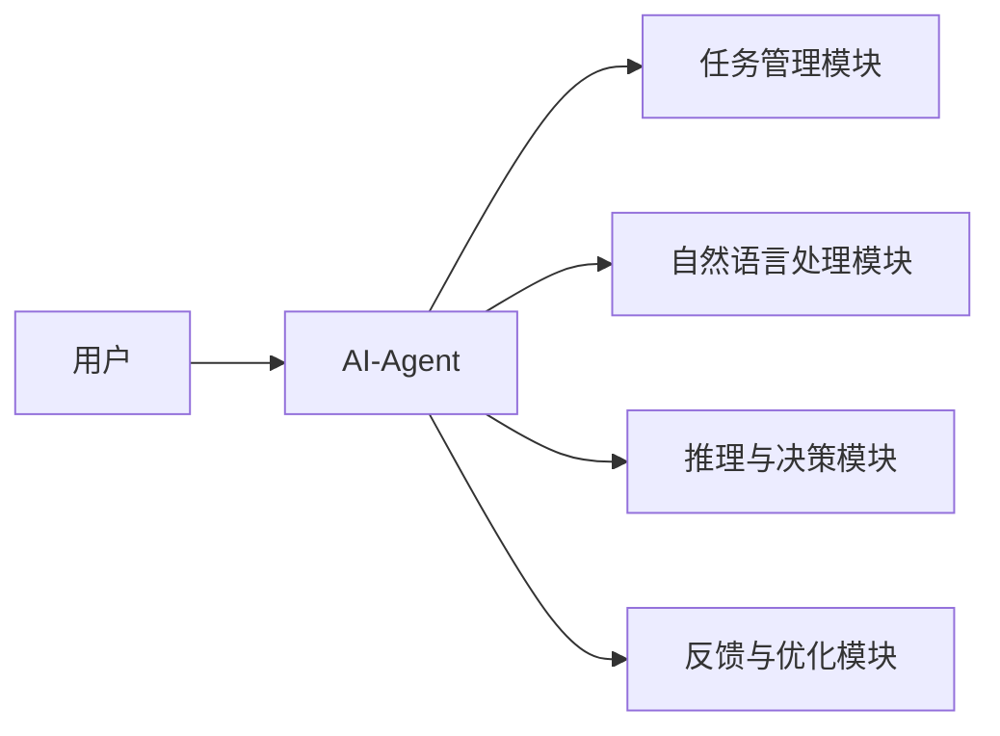
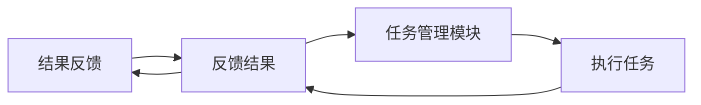

                 


# AI Agent在企业智能办公中的全面应用

## 关键词：AI Agent，企业办公，智能办公，自然语言处理，任务分解，反馈优化，系统架构

## 摘要：  
本文系统地探讨了AI Agent在企业智能办公中的应用，从基本概念到算法原理，再到系统架构和实际案例，全面分析了AI Agent如何提升企业办公效率和智能化水平。文章结合理论与实践，详细阐述了AI Agent的任务分解、自然语言处理、推理决策和反馈优化等核心原理，并通过实际案例展示了其在企业办公中的具体应用场景。最后，本文总结了AI Agent在企业智能办公中的优势和未来发展方向。

---

# 第一部分: AI Agent在企业智能办公中的背景与概念

# 第1章: AI Agent的基本概念与背景

## 1.1 AI Agent的定义与核心特征

### 1.1.1 AI Agent的定义  
AI Agent（人工智能代理）是指能够感知环境、自主决策并执行任务的智能实体。它能够通过学习和推理，为用户提供智能化的服务。AI Agent的核心在于其智能性，能够理解用户需求、优化任务执行流程，并通过反馈不断改进服务质量。

### 1.1.2 AI Agent的核心特征  
- **自主性**：AI Agent能够自主决策，无需人工干预。  
- **反应性**：能够实时感知环境变化并做出响应。  
- **学习性**：通过数据和反馈不断优化自身能力。  
- **适应性**：能够根据环境变化调整行为策略。  

### 1.1.3 AI Agent与传统办公工具的区别  
传统的办公工具（如邮件客户端、日历管理软件）是静态的工具，仅能执行预设功能。而AI Agent能够动态理解用户需求，主动提供解决方案，并通过反馈不断优化服务。

## 1.2 AI Agent在企业办公中的应用背景

### 1.2.1 企业办公自动化的发展历程  
从早期的手动办公到基于规则的自动化办公，再到如今的智能化办公，AI Agent的出现标志着企业办公进入了一个全新的智能化阶段。

### 1.2.2 当前企业办公的主要痛点  
- **效率低下**：人工处理重复性任务耗时耗力。  
- **信息孤岛**：各部门之间数据不通，难以协同工作。  
- **决策滞后**：依赖人工分析，难以快速做出决策。  
- **用户体验差**：传统工具难以满足个性化需求。  

### 1.2.3 AI Agent的出现与解决方案  
AI Agent通过智能化的手段，能够自动处理任务、整合数据、优化决策流程，从而解决传统办公工具的痛点，提升企业效率和用户体验。

## 1.3 本章小结  
本章从AI Agent的基本概念出发，分析了其在企业办公中的应用背景和优势，为后续章节的深入探讨奠定了基础。

---

# 第二部分: AI Agent的核心概念与原理

# 第2章: AI Agent的核心概念与原理

## 2.1 AI Agent的任务分解与执行流程

### 2.1.1 任务分解的基本原则  
任务分解是AI Agent的核心能力之一。它需要将复杂的任务分解为多个简单的子任务，并根据优先级进行排序。

### 2.1.2 任务执行的流程图  


### 2.1.3 任务优先级的确定方法  
任务优先级的确定需要考虑任务的重要性和紧急性，常用的方法包括加权评分法和优先级矩阵法。

## 2.2 自然语言处理在AI Agent中的应用

### 2.2.1 NLP的基本概念  
自然语言处理（NLP）是AI Agent理解用户需求的核心技术，能够将自然语言转化为计算机可理解的结构化数据。

### 2.2.2 NLP在任务理解中的作用  
通过NLP技术，AI Agent能够准确理解用户的意图，例如将“帮我安排明天的会议”转化为具体的任务执行步骤。

### 2.2.3 NLP在结果反馈中的应用  
AI Agent通过NLP技术生成自然语言的反馈，例如“会议已经安排在明天上午10点，参会人员已通知。”

## 2.3 AI Agent的推理与决策机制

### 2.3.1 推理的基本原理  
推理是AI Agent基于已有信息做出合理推断的过程。例如，如果用户提到“我需要一份报告”，AI Agent会推理出用户可能需要的数据来源和格式。

### 2.3.2 决策的算法选择  
常用的决策算法包括基于规则的决策树和基于模型的随机森林。选择哪种算法取决于任务的复杂性和数据的规模。

### 2.3.3 推理与决策的优化方法  
通过机器学习和强化学习，AI Agent能够不断优化其推理和决策能力，提高任务执行的准确性和效率。

## 2.4 AI Agent的反馈与优化机制

### 2.4.1 反馈机制的基本原理  
反馈机制是AI Agent改进自身能力的重要手段。通过用户的反馈，AI Agent能够调整其行为策略，例如“这个结果是否符合你的预期？”

### 2.4.2 基于反馈的优化算法  
常用的优化算法包括梯度下降和遗传算法。这些算法能够帮助AI Agent找到最优的解决方案。

### 2.4.3 反馈机制的实现案例  
例如，当用户对AI Agent的反馈结果不满意时，AI Agent会根据反馈重新调整其决策策略，以提供更符合用户需求的服务。

## 2.5 本章小结  
本章详细介绍了AI Agent的核心概念，包括任务分解、自然语言处理、推理决策和反馈优化。这些内容为后续章节的系统设计和实现奠定了理论基础。

---

# 第三部分: AI Agent的算法原理与数学模型

# 第3章: AI Agent的算法原理

## 3.1 基于规则的AI Agent算法

### 3.1.1 基于规则算法的基本原理  
基于规则的算法通过预设的规则来执行任务。例如，当用户输入“请帮我安排会议”时，AI Agent会根据预设的规则生成会议安排。

### 3.1.2 基于规则算法的实现流程  


### 3.1.3 基于规则算法的优缺点  
优点是简单易懂，适用于规则明确的任务；缺点是灵活性差，难以应对复杂场景。

## 3.2 基于模型的AI Agent算法

### 3.2.1 基于模型算法的基本原理  
基于模型的算法通过构建数学模型来执行任务。例如，使用机器学习模型预测用户的需求。

### 3.2.2 基于模型算法的实现流程  


### 3.2.3 基于模型算法的优缺点  
优点是灵活性高，适用于复杂任务；缺点是实现复杂，需要大量数据支持。

## 3.3 本章小结  
本章详细介绍了AI Agent的两种主要算法：基于规则的算法和基于模型的算法。这些算法为AI Agent的任务执行提供了理论支持。

---

# 第四部分: AI Agent的系统分析与架构设计

# 第4章: AI Agent的系统分析与架构设计

## 4.1 问题场景介绍

### 4.1.1 企业智能办公的场景分析  
企业智能办公涉及任务管理、信息检索、日程安排等多个场景。

### 4.1.2 AI Agent在企业办公中的应用案例  
例如，AI Agent可以帮助企业员工自动安排会议、管理邮件、跟踪项目进度等。

## 4.2 系统功能设计

### 4.2.1 领域模型设计  


### 4.2.2 系统架构设计  


### 4.2.3 系统接口设计  
系统接口包括用户输入接口、任务执行接口和结果反馈接口。这些接口通过API实现交互。

### 4.2.4 系统交互流程图  


## 4.3 本章小结  
本章通过系统分析和架构设计，详细阐述了AI Agent在企业智能办公中的实现方式，为后续章节的项目实战奠定了基础。

---

# 第五部分: AI Agent的项目实战

# 第5章: AI Agent的项目实战

## 5.1 环境安装与配置

### 5.1.1 环境要求  
需要安装Python 3.8及以上版本，以及相关的库如numpy、pandas、scikit-learn等。

### 5.1.2 安装步骤  
```bash
pip install numpy pandas scikit-learn
```

## 5.2 核心代码实现

### 5.2.1 任务分解模块  
```python
def decompose_task(task_str):
    # 任务分解逻辑
    pass
```

### 5.2.2 自然语言处理模块  
```python
from sklearn.feature_extraction.text import TfidfVectorizer
vectorizer = TfidfVectorizer()
```

### 5.2.3 反馈优化模块  
```python
def optimize_feedback(feedback):
    # 反馈优化逻辑
    pass
```

## 5.3 实际案例分析

### 5.3.1 智能日程安排系统  
AI Agent可以帮助用户自动安排会议，整合日历数据，优化会议时间。

### 5.3.2 项目进度跟踪系统  
AI Agent可以通过分析项目数据，预测项目进度，并提供改进建议。

## 5.4 项目小结  
本章通过具体的项目实战，详细展示了AI Agent在企业智能办公中的实现过程和应用案例。

---

# 第六部分: AI Agent的最佳实践与总结

# 第6章: AI Agent的最佳实践

## 6.1 最佳实践 tips

### 6.1.1 数据安全与隐私保护  
确保用户数据的安全性和隐私性，避免数据泄露。

### 6.1.2 模型优化与维护  
定期优化AI Agent的模型，确保其准确性和效率。

### 6.1.3 人机协作与用户体验  
注重人机协作的体验，确保AI Agent能够真正提升用户的工作效率。

## 6.2 本章小结  
本章总结了AI Agent在企业智能办公中的最佳实践，为读者提供了实际应用的指导。

---

作者：AI天才研究院/AI Genius Institute & 禅与计算机程序设计艺术 /Zen And The Art of Computer Programming

---

**注**：以上内容为文章的目录和部分核心章节内容，完整文章需要根据上述目录进一步扩展每章的具体内容，确保每章都有足够的细节和案例支持。

