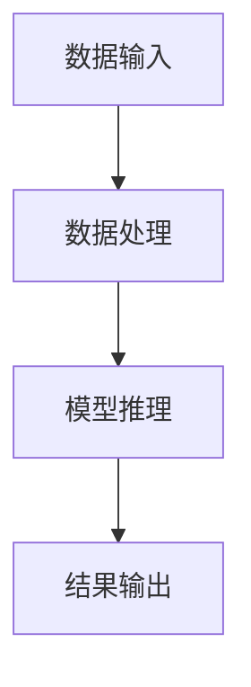

                 


# AI Agent在企业法律合规检查中的应用

> 关键词：AI Agent，企业合规，法律检查，自然语言处理，机器学习，知识图谱

> 摘要：随着企业对法律合规要求的日益严格，AI Agent（人工智能代理）在企业法律合规检查中的应用变得越来越重要。本文详细探讨了AI Agent在企业法律合规检查中的核心概念、技术实现、系统架构以及实际应用场景。通过分析AI Agent在合同审查、数据隐私保护等方面的优势，本文为读者提供了从理论到实践的全面解读。

---

## 第一部分: AI Agent在企业法律合规检查中的应用概述

### 第1章: AI Agent与企业法律合规概述

#### 1.1 AI Agent的基本概念

##### 1.1.1 AI Agent的定义
AI Agent（人工智能代理）是一种能够感知环境、自主决策并执行任务的智能实体。它能够通过学习和推理，自动完成复杂任务，帮助人类更高效地解决问题。AI Agent的核心在于其智能性，能够理解上下文、识别问题并提供解决方案。

##### 1.1.2 AI Agent的核心特征
- **自主性**：能够在没有人工干预的情况下独立运行。
- **反应性**：能够实时感知环境变化并做出反应。
- **学习能力**：通过机器学习算法不断优化自身性能。
- **推理能力**：能够基于已有知识进行逻辑推理和决策。

##### 1.1.3 AI Agent与传统法律合规工具的对比
传统的法律合规工具通常依赖人工操作，效率低下且容易出错。AI Agent通过自动化处理和智能分析，显著提高了合规检查的效率和准确性。例如，AI Agent可以在几秒钟内完成一份复杂合同的审查，而人工审查可能需要数小时。

#### 1.2 企业法律合规检查的现状与挑战

##### 1.2.1 企业法律合规的基本概念
企业法律合规是指企业在经营活动中遵守相关法律法规、行业标准和企业内部规章制度。合规检查是确保企业行为符合法律要求的重要手段。

##### 1.2.2 传统法律合规检查的痛点
- **效率低**：人工检查耗时长，成本高。
- **准确性差**：依赖个人经验，容易出现疏漏。
- **覆盖范围有限**：难以应对海量的法律文件和复杂的规定。

##### 1.2.3 数字化合规检查的必要性
随着企业规模的扩大和法律法规的日益复杂，传统的合规检查方式已经难以满足需求。数字化合规检查通过AI技术实现自动化和智能化，能够显著提升效率和准确性。

#### 1.3 AI Agent在法律合规中的应用前景

##### 1.3.1 AI Agent在法律合规中的优势
- **高效性**：AI Agent能够快速处理大量法律文件，显著缩短合规检查的时间。
- **准确性**：通过机器学习算法，AI Agent能够准确识别合规风险。
- **可扩展性**：AI Agent能够同时处理多个任务，适用于大规模合规检查。

##### 1.3.2 企业对AI Agent的需求分析
企业对AI Agent的需求主要体现在以下几个方面：
- **自动化处理**：减少人工干预，降低合规成本。
- **实时监控**：快速识别合规风险，确保企业行为始终符合法规要求。
- **智能化决策**：基于数据和规则提供最优解决方案。

##### 1.3.3 AI Agent在法律合规中的未来趋势
未来的AI Agent将更加智能化和人性化，能够理解复杂的法律语境，并提供个性化的合规建议。同时，随着技术的进步，AI Agent将与企业管理系统更加深度集成，实现合规检查的全流程自动化。

---

## 第2章: AI Agent的核心技术与实现原理

### 2.1 AI Agent的核心技术

#### 2.1.1 自然语言处理（NLP）
NLP是AI Agent实现法律合规检查的基础技术之一。通过NLP，AI Agent能够理解法律文件中的文本内容，并提取关键信息。

##### 2.1.1.1 NLP的核心技术
- **分词**：将文本分割成词语或短语。
- **实体识别**：识别文本中的命名实体（如人名、地名、组织名）。
- **情感分析**：分析文本的情感倾向。
- **语义理解**：理解文本的深层含义。

##### 2.1.1.2 NLP在法律合规中的应用
例如，在合同审查中，AI Agent可以通过NLP技术提取合同中的关键条款，如违约责任、履行期限等。

#### 2.1.2 机器学习与深度学习
机器学习和深度学习是AI Agent实现智能决策的核心技术。通过训练模型，AI Agent能够从大量数据中学习规律，并做出预测和决策。

##### 2.1.2.1 机器学习的核心算法
- **支持向量机（SVM）**：用于分类任务。
- **随机森林**：用于分类和回归任务。
- **神经网络**：用于复杂模式识别。

##### 2.1.2.2 深度学习的核心算法
- **卷积神经网络（CNN）**：用于图像识别和文本分类。
- **循环神经网络（RNN）**：用于序列数据处理。
- ** transformer**：用于自然语言处理任务。

##### 2.1.2.3 机器学习在法律合规中的应用
例如，在合规风险评估中，AI Agent可以通过机器学习模型预测合同条款是否符合法规要求。

#### 2.1.3 知识图谱与规则引擎
知识图谱和规则引擎是AI Agent实现法律合规检查的高级技术。通过构建知识图谱，AI Agent能够理解法律术语和规则，并通过规则引擎进行推理和决策。

##### 2.1.3.1 知识图谱的核心概念
- **实体**：知识图谱中的基本单元，表示具体事物。
- **关系**：描述实体之间的关联。
- **属性**：描述实体的特征。

##### 2.1.3.2 知识图谱在法律合规中的应用
例如，在数据隐私保护中，AI Agent可以通过知识图谱识别敏感数据，并根据相关法规制定保护策略。

---

### 2.2 AI Agent的实现原理

#### 2.2.1 数据输入与预处理
AI Agent的输入数据通常包括法律文件、企业规章制度等。数据预处理包括文本清洗、分词、实体识别等步骤。

##### 2.2.1.1 数据预处理的流程
1. **文本清洗**：去除无关信息，提取有用内容。
2. **分词**：将文本分割成词语或短语。
3. **实体识别**：识别文本中的命名实体。

#### 2.2.2 模型训练与优化
AI Agent的核心是机器学习模型。模型训练需要大量标注数据，并通过优化算法提高模型性能。

##### 2.2.2.1 模型训练的流程
1. **数据标注**：对输入数据进行人工标注，建立训练集和测试集。
2. **模型选择**：根据任务需求选择合适的模型。
3. **模型训练**：使用训练数据优化模型参数。
4. **模型评估**：通过测试数据评估模型性能。

#### 2.2.3 结果输出与反馈机制
AI Agent在完成模型训练后，可以将结果输出，并通过反馈机制不断优化性能。

##### 2.2.3.1 结果输出的流程
1. **结果生成**：模型根据输入数据生成输出结果。
2. **结果解释**：将模型输出结果解释为人类可理解的形式。
3. **结果反馈**：将结果反馈给用户，并根据反馈优化模型。

---

### 2.3 AI Agent的法律合规能力

#### 2.3.1 合规规则的自动识别
AI Agent能够通过自然语言处理技术，自动识别法律文件中的合规规则。

##### 2.3.1.1 合规规则的识别流程
1. **文本理解**：通过NLP技术理解法律文件内容。
2. **规则提取**：从文本中提取合规规则。
3. **规则存储**：将提取的规则存储到知识图谱中。

#### 2.3.2 合规风险的智能评估
AI Agent可以通过机器学习模型，评估合同条款是否符合法规要求。

##### 2.3.2.1 风险评估的流程
1. **输入合同**：将合同文本输入AI Agent。
2. **模型推理**：模型根据合同内容进行推理。
3. **风险评分**：根据推理结果生成风险评分。
4. **结果输出**：输出风险评估结果。

#### 2.3.3 合规建议的自动生成
AI Agent可以根据评估结果，自动生成合规建议。

##### 2.3.3.1 合规建议的生成流程
1. **风险识别**：识别合同中的潜在风险。
2. **建议生成**：根据风险生成合规建议。
3. **建议输出**：将建议输出给用户。

---

## 第3章: AI Agent在法律合规中的应用场景

### 3.1 合同审查与合规检查

#### 3.1.1 合同条款的自动识别与分析
AI Agent可以通过自然语言处理技术，自动识别合同中的关键条款。

##### 3.1.1.1 关键条款的识别流程
1. **文本理解**：通过NLP技术理解合同内容。
2. **条款识别**：识别合同中的关键条款，如违约责任、履行期限等。
3. **条款分析**：分析条款的合规性。

#### 3.1.2 合同风险的智能评估
AI Agent可以通过机器学习模型，评估合同条款是否符合法规要求。

##### 3.1.2.1 风险评估的流程
1. **输入合同**：将合同文本输入AI Agent。
2. **模型推理**：模型根据合同内容进行推理。
3. **风险评分**：根据推理结果生成风险评分。
4. **结果输出**：输出风险评估结果。

#### 3.1.3 合同合规建议的生成
AI Agent可以根据评估结果，自动生成合规建议。

##### 3.1.3.1 合规建议的生成流程
1. **风险识别**：识别合同中的潜在风险。
2. **建议生成**：根据风险生成合规建议。
3. **建议输出**：将建议输出给用户。

### 3.2 数据隐私与合规管理

#### 3.2.1 数据隐私保护的AI解决方案
AI Agent可以通过知识图谱和规则引擎，识别敏感数据，并制定保护策略。

##### 3.2.1.1 数据隐私保护的流程
1. **数据识别**：识别敏感数据。
2. **数据分类**：将数据分类为敏感数据和非敏感数据。
3. **数据保护**：制定保护策略。

#### 3.2.2 数据分类与标签化
AI Agent可以通过自然语言处理技术，对数据进行分类和标签化。

##### 3.2.2.1 数据分类的流程
1. **数据清洗**：去除无关信息。
2. **数据分词**：将数据分割成词语或短语。
3. **数据分类**：根据分类标准对数据进行分类。

#### 3.2.3 数据合规
AI Agent可以通过机器学习模型，评估数据是否符合法规要求。

##### 3.2.3.1 数据合规的流程
1. **数据输入**：将数据输入AI Agent。
2. **模型推理**：模型根据数据内容进行推理。
3. **合规评估**：根据推理结果生成合规评估结果。
4. **结果输出**：输出合规评估结果。

---

## 第4章: AI Agent的系统架构与设计

### 4.1 系统架构设计

#### 4.1.1 系统功能模块
AI Agent的系统架构通常包括以下几个功能模块：
- **数据输入模块**：接收法律文件或其他输入数据。
- **数据处理模块**：对输入数据进行预处理。
- **模型推理模块**：通过机器学习模型进行推理。
- **结果输出模块**：将推理结果输出给用户。

#### 4.1.2 系统架构图
以下是AI Agent系统的架构图：



---

## 第5章: 项目实战与案例分析

### 5.1 项目实战

#### 5.1.1 环境安装
以下是安装AI Agent所需环境的步骤：
1. **安装Python**：确保安装了Python 3.6或更高版本。
2. **安装机器学习库**：安装Scikit-learn、TensorFlow等机器学习库。
3. **安装自然语言处理库**：安装spaCy、NLTK等NLP库。
4. **安装知识图谱库**：安装Neo4j、RDFlib等知识图谱库。

#### 5.1.2 核心代码实现
以下是AI Agent的核心代码实现：

```python
import spacy

nlp = spacy.load("en_core_web_sm")

def extract_entities(text):
    doc = nlp(text)
    entities = [ent.text for ent in doc.ents]
    return entities

text = "Apple Inc. was founded in 1971 by Steve Jobs."
entities = extract_entities(text)
print(entities)  # 输出：["Apple Inc.", "Steve Jobs"]
```

---

## 第6章: 总结与展望

### 6.1 总结
本文详细探讨了AI Agent在企业法律合规检查中的应用。通过自然语言处理、机器学习和知识图谱等技术，AI Agent能够高效、准确地完成合规检查任务。

### 6.2 未来展望
随着AI技术的不断发展，AI Agent在企业法律合规检查中的应用将更加广泛。未来的AI Agent将更加智能化和人性化，能够理解复杂的法律语境，并提供个性化的合规建议。

---

## 作者：AI天才研究院/AI Genius Institute & 禅与计算机程序设计艺术 /Zen And The Art of Computer Programming

