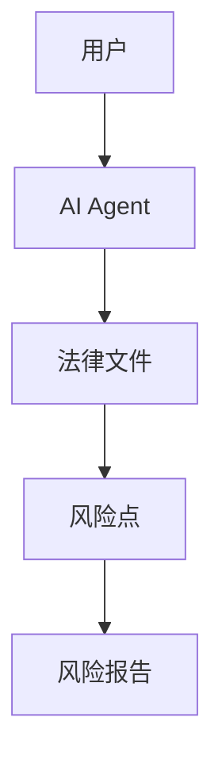

                 


# AI Agent在企业法律文件审查与风险识别中的应用

> 关键词：AI Agent, 法律文件审查, 风险识别, 自然语言处理, 机器学习, 企业法务

> 摘要：本文深入探讨了AI Agent在企业法律文件审查与风险识别中的应用，分析了传统法律文件审查的痛点与AI技术的潜力，详细讲解了AI Agent的核心概念、算法原理、系统架构设计以及实际项目实现。通过案例分析和最佳实践，展示了如何利用AI技术提升企业法律文件审查的效率与准确性。

---

# 第一部分: AI Agent在企业法律文件审查与风险识别中的应用概述

## 第1章: 背景介绍

### 1.1 问题背景

#### 1.1.1 企业法律文件审查的现状与挑战

企业每天需要处理大量的法律文件，包括合同、协议、合规文件等。这些文件的审查通常需要耗费大量时间，且容易出错。传统的人工审查方式存在以下问题：

- **效率低下**：人工审查需要逐字逐句阅读，耗时长，且容易遗漏关键点。
- **一致性不足**：不同律师对同一文件的理解可能存在差异，导致审查结果不一致。
- **成本高昂**：需要大量专业律师参与，人力成本高。

#### 1.1.2 传统法律文件审查的痛点与不足

- **信息量大**：法律文件通常内容复杂，涉及多个法律领域，人工审查难以快速准确识别关键条款。
- **风险高**：遗漏重要条款可能导致企业面临法律风险，例如违约、合规问题等。
- **缺乏标准化**：不同律师的审查标准不一，难以保证审查结果的统一性。

#### 1.1.3 AI技术在法律文件审查中的潜力

AI技术，尤其是自然语言处理（NLP）和机器学习，能够快速处理大量文本数据，准确识别关键条款和风险点。AI Agent可以通过自动化的方式辅助律师进行法律文件审查，显著提高效率和准确性。

---

### 1.2 问题描述

#### 1.2.1 法律文件审查的核心任务与目标

法律文件审查的核心任务包括：

- 识别合同中的关键条款，例如违约责任、知识产权条款、付款条件等。
- 检查文件是否符合相关法律法规。
- 识别潜在风险点，例如不合理的责任免除条款、模糊不清的条款等。

#### 1.2.2 风险识别在企业法律文件审查中的重要性

风险识别是法律文件审查的关键环节。通过识别潜在风险点，企业可以提前采取措施规避法律风险，例如修改合同条款、避免签订存在争议的协议等。

#### 1.2.3 AI Agent在法律文件审查中的应用场景

AI Agent可以应用于以下场景：

- **自动化审查**：快速扫描大量法律文件，识别关键条款和风险点。
- **辅助决策**：为律师提供风险评估和建议，帮助其做出更明智的决策。
- **持续学习**：通过不断学习新的法律法规和案例，提升审查的准确性和全面性。

---

### 1.3 问题解决

#### 1.3.1 AI Agent的基本概念与定义

AI Agent是一种智能代理系统，能够通过感知环境、理解需求并采取行动来实现特定目标。在法律文件审查中，AI Agent可以理解为一种智能工具，通过NLP和机器学习技术，帮助律师快速审查法律文件并识别风险点。

#### 1.3.2 AI Agent在法律文件审查中的功能与作用

- **文本分析**：通过NLP技术，AI Agent可以理解法律文件的内容，提取关键信息。
- **风险识别**：利用机器学习模型，AI Agent可以识别潜在的法律风险。
- **知识库构建**：AI Agent可以整合大量的法律法规和案例，形成知识库，辅助审查过程。

#### 1.3.3 AI Agent如何实现风险识别与预警

AI Agent通过以下步骤实现风险识别与预警：

1. **数据预处理**：清洗和标注法律文件数据。
2. **模型训练**：利用机器学习算法训练风险识别模型。
3. **实时分析**：当新的法律文件输入时，AI Agent通过模型分析识别潜在风险。
4. **风险预警**：根据风险程度，AI Agent向用户发出预警。

---

### 1.4 边界与外延

#### 1.4.1 AI Agent在法律文件审查中的应用边界

AI Agent的应用边界包括：

- **技术限制**：AI Agent的能力受限于NLP和机器学习技术的成熟度。
- **数据质量**：AI Agent的性能依赖于训练数据的质量和数量。
- **法律复杂性**：AI Agent难以处理极其复杂或涉及多个法律领域的文件。

#### 1.4.2 与其他法律技术工具的对比与区分

AI Agent与传统法律技术工具的对比：

| 对比维度          | AI Agent                          | 传统法律工具                          |
|-------------------|------------------------------------|----------------------------------------|
| 功能              | 自动化审查、风险识别、辅助决策    | 手动审查、条款识别                     |
| 效率              | 高效、快速                         | 低效、耗时                            |
| 智能性             | 具备学习和自适应能力               | 无智能性                              |
| 成本              | 一次性投入，长期成本低            | 长期依赖专业人员，成本高              |

#### 1.4.3 未来可能的扩展与发展方向

AI Agent在法律文件审查中的未来发展包括：

- **多语言支持**：支持多种语言的法律文件审查。
- **跨领域应用**：扩展到更多法律领域，如知识产权、合规等。
- **实时更新**：动态更新法律法规知识库，保持模型的准确性。

---

### 1.5 概念结构与核心要素

#### 1.5.1 AI Agent的构成要素与核心组件

AI Agent的核心组件包括：

- **自然语言处理（NLP）引擎**：用于理解和分析法律文本。
- **机器学习模型**：用于识别风险点和预测潜在问题。
- **知识库**：包含法律法规、案例和行业标准。
- **用户界面**：方便用户与AI Agent交互。

#### 1.5.2 法律文件审查的流程与关键环节

法律文件审查的流程包括：

1. **数据输入**：用户上传法律文件。
2. **文本分析**：AI Agent提取关键信息。
3. **风险识别**：模型识别潜在风险。
4. **结果输出**：生成风险报告并提供建议。

#### 1.5.3 风险识别的数学模型与算法框架

风险识别的数学模型可以采用支持向量机（SVM）或随机森林（Random Forest）等算法。模型通过特征提取和分类，识别文本中的风险点。

---

## 第2章: 核心概念与联系

### 2.1 AI Agent的原理与技术基础

#### 2.1.1 自然语言处理（NLP）在AI Agent中的应用

NLP技术在AI Agent中的应用包括：

- **文本分词**：将法律文件分解为词语或短语。
- **实体识别**：识别文本中的关键实体，如人名、机构名等。
- **句法分析**：分析句子结构，理解文本的语法关系。

#### 2.1.2 机器学习与深度学习在AI Agent中的作用

机器学习在AI Agent中的作用包括：

- **分类**：将法律文件分为不同类别，如合同类型、风险等级等。
- **聚类**：将相似的条款或风险点进行分组。
- **回归**：预测风险的严重程度。

#### 2.1.3 知识图谱与法律领域的结合

知识图谱在法律领域中的应用包括：

- **构建法律知识库**：整合法律法规、案例和行业标准。
- **关系抽取**：识别法律文件中的实体关系。
- **推理与问答**：基于知识图谱进行推理和回答问题。

---

### 2.2 核心概念对比与分析

#### 2.2.1 不同AI模型在法律文件审查中的对比分析

以下是对几种常见AI模型的对比分析：

| 模型类型       | 优点                           | 缺点                           |
|----------------|--------------------------------|---------------------------------|
| 支持向量机（SVM）| 分类准确率高，适合小数据集     | 对高维数据处理能力有限         |
| 随机森林（RF）  | 抗噪声能力强，适合非线性数据   | 对特征重要性分析不够直观       |
| LSTM           | 适合长文本分析                 | 训练时间较长，资源消耗大       |

#### 2.2.2 法律文件审查与风险识别的对比与联系

法律文件审查与风险识别的联系：

- **共同目标**：识别潜在风险点，确保法律合规。
- **数据来源**：均基于法律文件内容。
- **技术手段**：均依赖NLP和机器学习技术。

#### 2.2.3 AI Agent与其他法律技术工具的对比

AI Agent与其他法律技术工具的对比：

| 对比维度          | AI Agent                          | 传统法律工具                          |
|-------------------|------------------------------------|----------------------------------------|
| 功能              | 自动化审查、风险识别、辅助决策    | 手动审查、条款识别                     |
| 效率              | 高效、快速                         | 低效、耗时                            |
| 智能性             | 具备学习和自适应能力               | 无智能性                              |
| 成本              | 一次性投入，长期成本低            | 长期依赖专业人员，成本高              |

---

### 2.3 实体关系图与流程图

#### 2.3.1 法律文件审查的实体关系图（Mermaid）



---

## 第三部分: 算法原理

### 3.1 算法原理

#### 3.1.1 NLP模型的训练与优化

NLP模型的训练流程包括：

1. **数据预处理**：清洗、分词、去除停用词。
2. **特征提取**：提取文本特征，如TF-IDF。
3. **模型训练**：利用训练数据训练NLP模型。
4. **模型优化**：调整超参数，提升模型性能。

#### 3.1.2 机器学习模型的训练与优化

机器学习模型的训练流程包括：

1. **数据标注**：对法律文件中的风险点进行标注。
2. **特征工程**：提取文本特征，如词袋模型或词嵌入。
3. **模型选择**：选择合适的算法，如SVM或随机森林。
4. **模型训练**：利用标注数据训练模型。
5. **模型评估**：通过交叉验证评估模型性能。

#### 3.1.3 知识图谱的构建与应用

知识图谱的构建流程包括：

1. **数据收集**：收集法律法规、案例等数据。
2. **实体识别**：识别文本中的实体。
3. **关系抽取**：识别实体之间的关系。
4. **知识库构建**：构建知识图谱。
5. **应用推理**：基于知识图谱进行推理和问答。

---

## 第四部分: 系统分析与架构设计

### 4.1 系统分析

#### 4.1.1 问题场景介绍

问题场景包括：

- 用户上传法律文件。
- 系统对文件进行分析，识别风险点。
- 系统生成风险报告并提供建议。

#### 4.1.2 系统功能设计

系统功能设计包括：

- **文件上传**：用户上传法律文件。
- **文本分析**：系统对文件进行NLP分析。
- **风险识别**：系统识别潜在风险点。
- **风险报告**：系统生成风险报告。

#### 4.1.3 系统架构设计

系统架构设计包括：

- **前端**：用户界面，展示文件上传和风险报告。
- **后端**：AI Agent核心模块，负责文本分析和风险识别。
- **数据库**：存储法律法规知识库和历史数据。
- **接口设计**：定义前后端交互接口。

---

## 第五部分: 项目实战

### 5.1 环境安装

#### 5.1.1 环境配置

- **Python**：安装Python 3.8以上版本。
- **库安装**：安装必要的库，如NLTK、spaCy、Scikit-learn。

#### 5.1.2 数据集准备

- 下载法律文件数据集。
- 数据标注：对风险点进行标注。

---

### 5.2 系统核心实现

#### 5.2.1 核心代码实现

以下是AI Agent的核心代码示例：

```python
import numpy as np
from sklearn.feature_extraction.text import TfidfVectorizer
from sklearn.svm import SVC

# 数据预处理
def preprocess(text):
    # 分词、去除停用词等处理
    pass

# 特征提取
vectorizer = TfidfVectorizer()
X = vectorizer.fit_transform(documents)

# 模型训练
model = SVC()
model.fit(X, labels)

# 风险识别
def identify_risk(text):
    features = vectorizer.transform([text])
    prediction = model.predict(features)
    return prediction[0]
```

#### 5.2.2 代码解读与分析

- **preprocess**：文本预处理函数，用于分词和去除停用词。
- **vectorizer**：TF-IDF向量化，提取文本特征。
- **model**：SVM模型，用于分类。
- **identify_risk**：风险识别函数，输入文本，输出风险类别。

---

## 第六部分: 最佳实践

### 6.1 小结

AI Agent在企业法律文件审查与风险识别中的应用具有重要意义。通过NLP和机器学习技术，AI Agent能够显著提高审查效率和准确性，降低企业法律风险。

---

### 6.2 注意事项

- **数据隐私**：确保法律文件的数据隐私和合规性。
- **模型更新**：定期更新模型，保持其准确性。
- **用户培训**：对用户进行培训，确保其正确使用AI Agent。

---

### 6.3 拓展阅读

- **相关书籍**：《自然语言处理实战》、《机器学习实战》。
- **论文推荐**：推荐几篇关于AI在法律领域的研究论文。

---

# 作者：AI天才研究院/AI Genius Institute & 禅与计算机程序设计艺术 /Zen And The Art of Computer Programming

---

通过以上内容，您可以逐步完成整篇文章的撰写。如果需要更详细的内容扩展或特定部分的深入讲解，请随时告诉我！

