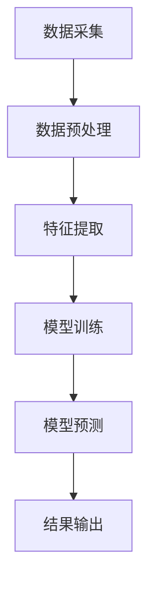
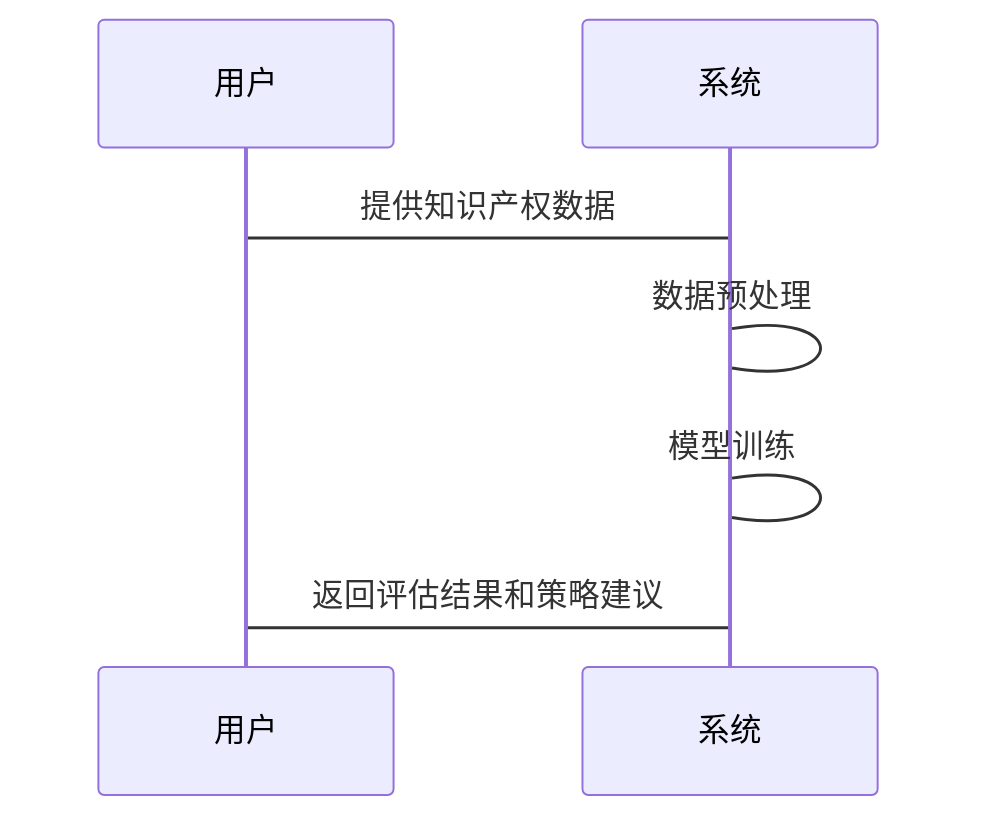

                 


# AI Agent在企业知识产权价值评估与运营策略制定中的应用

## 关键词：AI Agent, 知识产权, 价值评估, 运营策略, 智能决策

## 摘要：  
随着人工智能技术的快速发展，AI Agent（人工智能代理）在企业知识产权管理中的应用日益广泛。本文详细探讨了AI Agent如何在知识产权价值评估与运营策略制定中发挥关键作用，包括其核心原理、系统架构、实际应用场景以及未来发展趋势。通过结合理论分析与实践案例，本文旨在为企业提供一种高效、智能的知识产权管理解决方案。

---

## 第一部分：AI Agent与知识产权管理的背景与概述

### 第1章：知识产权管理的核心挑战

#### 1.1 知识产权的基本概念
- **定义与范围**：知识产权包括专利、商标、版权、商业秘密等，是企业的重要资产。
- **重要性**：知识产权的价值直接影响企业的市场竞争力和经济收益。
- **管理目标**：保护知识产权、提升其价值、制定有效的运营策略。

#### 1.2 AI Agent的基本概念
- **定义**：AI Agent是一种能够感知环境、自主决策并执行任务的智能系统。
- **特点**：智能性、自主性、反应性、社交能力。
- **与传统工具的区别**：AI Agent能够主动学习、优化决策并适应变化。

#### 1.3 AI Agent在知识产权管理中的应用前景
- **价值评估**：通过数据分析和机器学习模型，AI Agent能够快速评估知识产权的市场价值。
- **策略制定**：AI Agent可以分析市场趋势、竞争对手行为，为企业制定动态的知识产权运营策略。

---

## 第二部分：AI Agent在知识产权价值评估中的核心原理

### 第2章：知识产权价值评估的关键要素

#### 2.1 数据采集与处理
- **数据来源**：专利数据库、商标数据库、法律文件、市场报告等。
- **数据预处理**：清洗、去重、标准化，确保数据质量。

#### 2.2 智能分析与建模
- **机器学习模型**：使用回归分析、聚类分析、神经网络等方法，建立知识产权价值评估模型。
- **案例分析**：通过具体案例，展示AI Agent如何利用模型预测专利的市场价值。

#### 2.3 结果输出与决策支持
- **可视化报告**：生成图表和报告，直观展示评估结果。
- **决策建议**：基于评估结果，AI Agent提供最优的知识产权管理建议。

### 第3章：AI Agent在知识产权价值评估中的算法原理

#### 3.1 算法流程图


#### 3.2 核心算法实现
- **回归分析**：用于预测知识产权的价值。
  $$ y = \beta_0 + \beta_1x_1 + \beta_2x_2 + ... + \beta_nx_n $$
- **神经网络**：用于复杂模式识别。
  ```python
  model = Sequential()
  model.add(Dense(64, activation='relu', input_dim=10))
  model.add(Dense(1, activation='sigmoid'))
  model.compile(optimizer='adam', loss='binary_crossentropy')
  ```

---

## 第三部分：AI Agent在知识产权运营策略制定中的系统架构

### 第4章：系统架构设计

#### 4.1 系统功能模块
- **数据采集模块**：收集知识产权相关的数据。
- **分析模块**：利用AI算法进行价值评估和策略制定。
- **决策模块**：输出最优的运营策略。

#### 4.2 系统架构图


#### 4.3 接口设计与交互流程


---

## 第四部分：项目实战与案例分析

### 第5章：项目实战

#### 5.1 环境安装与配置
- **工具安装**：安装Python、TensorFlow、Scikit-learn等库。
  ```bash
  pip install numpy pandas scikit-learn tensorflow
  ```

#### 5.2 核心代码实现
- **数据预处理**：
  ```python
  import pandas as pd
  data = pd.read_csv('patent_data.csv')
  data = data.dropna().astype(float)
  ```

- **模型训练**：
  ```python
  from sklearn.linear_model import LinearRegression
  model = LinearRegression()
  model.fit(X_train, y_train)
  ```

#### 5.3 案例分析
- **案例背景**：某科技公司希望评估其专利组合的市场价值。
- **分析过程**：使用AI Agent进行数据清洗、特征提取、模型训练和预测。
- **结果解读**：AI Agent预测该专利组合的市场价值为1000万美元，建议优先保护核心专利。

---

## 第五部分：总结与展望

### 第6章：总结与最佳实践

#### 6.1 总结
- AI Agent在知识产权管理中的应用显著提高了效率和准确性。
- 通过机器学习模型，企业能够更科学地评估知识产权价值并制定运营策略。

#### 6.2 小结
- **注意事项**：数据隐私和模型准确性是需要重点关注的问题。
- **拓展阅读**：建议深入学习机器学习和知识产权管理的相关知识。

---

## 作者信息：  
作者：AI天才研究院 & 禅与计算机程序设计艺术

