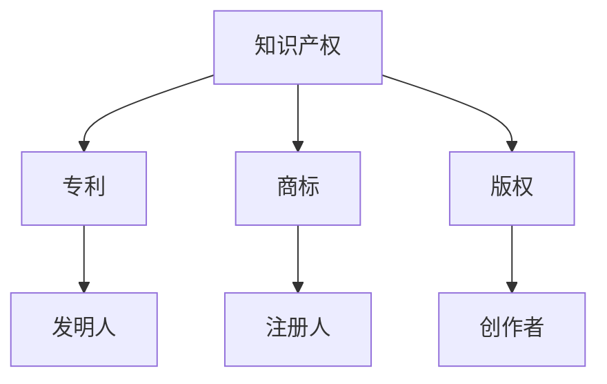
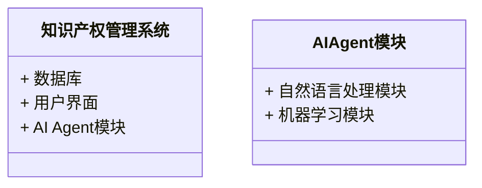
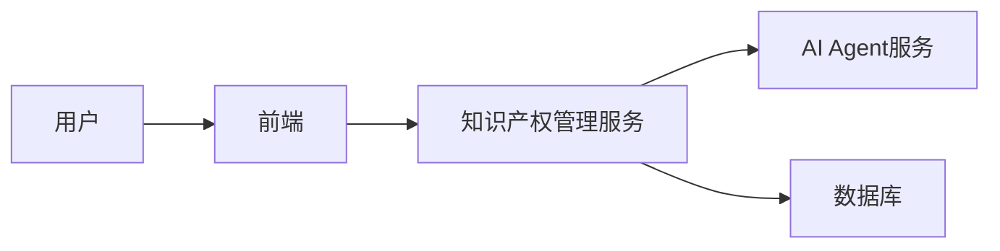

                 


# AI Agent在企业知识产权管理中的应用

> 关键词：AI Agent，知识产权管理，自然语言处理，机器学习，系统架构

> 摘要：本文探讨了AI Agent在企业知识产权管理中的应用，分析了其在专利检索、侵权分析等场景中的价值，并详细阐述了相关算法原理和系统架构设计，结合实际案例展示了AI Agent在知识产权管理中的实践应用。

---

## 第1章：AI Agent与知识产权管理概述

### 1.1 AI Agent的定义与核心概念

AI Agent，即人工智能代理，是一种能够感知环境、自主决策并执行任务的智能体。其核心特征包括自主性、反应性、目标导向和社会能力。与传统软件代理相比，AI Agent具备更强的自主学习和问题解决能力。

### 1.2 知识产权管理的背景与重要性

知识产权管理涉及专利、商标、版权等多个领域。企业在知识产权管理中面临数据量大、检索效率低、侵权风险高等问题。有效的知识产权管理能够提升企业竞争力，避免法律纠纷。

### 1.3 AI Agent在知识产权管理中的应用前景

AI Agent能够通过自然语言处理和机器学习技术，辅助企业进行知识产权检索、分析和保护。应用场景包括专利检索、侵权检测和知识产权布局优化。AI Agent的应用边界主要在于数据质量和模型准确性。

---

## 第2章：AI Agent与知识产权管理的核心概念

### 2.1 核心概念的定义与联系

知识产权管理涉及发明人、专利、商标等多个实体，AI Agent在其中扮演信息检索和分析的角色。核心概念包括知识产权实体关系、AI Agent的角色定位等。

### 2.2 实体关系图（ER图）



---

## 第3章：自然语言处理在知识产权管理中的应用

### 3.1 文本相似度计算

文本相似度是AI Agent进行知识产权检索的关键技术。余弦相似度公式为：
$$ \text{similarity} = \frac{\vec{A} \cdot \vec{B}}{|\vec{A}| |\vec{B}|} $$

### 3.2 基于向量空间模型的检索算法

检索流程包括文本预处理、向量构建和相似度计算。使用TF-IDF向量构建示例代码：

```python
from sklearn.feature_extraction.text import TfidfVectorizer

vectorizer = TfidfVectorizer()
tfidf_matrix = vectorizer.fit_transform(documents)
```

---

## 第4章：机器学习在知识产权保护中的应用

### 4.1 基于监督学习的分类模型

使用SVM或神经网络进行专利分类。训练流程包括数据标注、模型训练和评估。

### 4.2 基于深度学习的模型

利用预训练语言模型进行知识产权分析。代码示例：

```python
from transformers import pipeline

classifier = pipeline("text-classification", model="bert-base-uncased")
```

---

## 第5章：系统架构设计

### 5.1 系统功能设计

系统包括知识产权检索、分析和管理模块。领域模型类图如下：



### 5.2 系统架构设计

系统采用微服务架构，各模块协同工作。架构图如下：



---

## 第6章：项目实战

### 6.1 环境安装

安装必要的库：

```bash
pip install numpy sklearn transformers
```

### 6.2 核心代码实现

实现文本相似度计算：

```python
def compute_cosine_similarity(doc1, doc2):
    vectorizer = TfidfVectorizer()
    tfidf1 = vectorizer.fit_transform([doc1]).toarray()[0]
    tfidf2 = vectorizer.fit_transform([doc2]).toarray()[0]
    return np.dot(tfidf1, tfidf2) / (np.linalg.norm(tfidf1) * np.linalg.norm(tfidf2))
```

### 6.3 项目小结

通过实战项目，验证了AI Agent在知识产权管理中的有效性，同时积累了开发经验。

---

## 第7章：最佳实践与小结

### 7.1 小结

总结项目经验，强调数据质量和技术选型的重要性。

### 7.2 注意事项

数据隐私保护和模型优化是关键。建议使用分布式系统提高性能。

### 7.3 未来展望

未来，AI Agent将在知识产权管理中发挥更大作用，特别是在跨语言和跨领域应用中。

---

## 第8章：结论与展望

### 8.1 结论

本文详细探讨了AI Agent在知识产权管理中的应用，展示了其在提高效率和准确性方面的优势。

### 8.2 展望

随着技术进步，AI Agent将在知识产权管理中实现更智能化和自动化。

---

## 作者：AI天才研究院 & 禅与计算机程序设计艺术

---

这篇博客文章系统地探讨了AI Agent在企业知识产权管理中的应用，从理论到实践，结合具体案例和技术实现，为读者提供了全面的视角和深入的分析。

