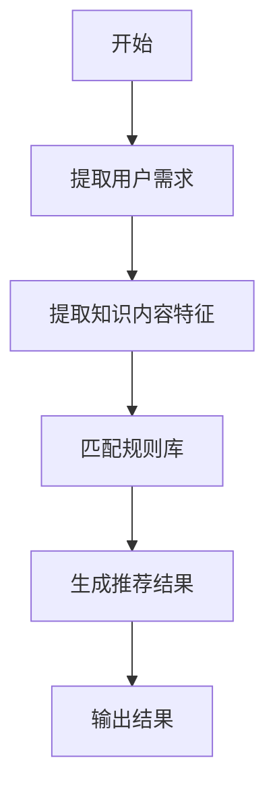

                 


```markdown
# AI Agent在企业知识付费与在线教育中的创新应用

> 关键词：AI Agent, 知识付费, 在线教育, 人工智能, 教育科技, 系统架构

> 摘要：本文探讨了AI Agent在企业知识付费与在线教育中的创新应用，详细分析了其核心概念、算法原理、系统架构及实际案例，展示了如何通过AI技术优化知识传播和学习体验。

---

## 第一部分: AI Agent在企业知识付费与在线教育中的创新应用概述

### 第1章: AI Agent的基本概念与背景

#### 1.1 问题背景
- **传统知识付费的痛点**：内容同质化严重，用户需求未精准匹配，转化率低。
- **在线教育的挑战**：课程质量参差不齐，学习体验不够个性化，教学效果难以量化。
- **AI技术的解决方案**：利用AI Agent实现精准匹配、个性化推荐和动态调整。

#### 1.2 问题描述
- **知识付费的现状**：内容泛滥，用户筛选成本高。
- **在线教育的困境**：难以大规模个性化教学。
- **AI Agent的角色**：作为智能助手，连接知识供需双方，优化匹配效率。

#### 1.3 问题解决
- **精准匹配**：AI Agent通过分析用户需求和内容特点，实现精准推荐。
- **个性化学习体验**：根据用户行为和反馈，动态调整学习路径。
- **数据驱动的优化**：利用数据反馈持续改进内容和教学方法。

#### 1.4 边界与外延
- **应用范围**：知识付费平台、在线教育系统。
- **与其他技术的区分**：AI Agent与传统推荐系统、自动化教学工具的区别。
- **未来发展**：向更智能化、自主化方向发展，实现更复杂的任务处理。

#### 1.5 核心概念结构与组成
- **核心要素**：用户需求分析、知识内容解析、AI Agent匹配逻辑。
- **系统构成**：知识库、用户画像、AI Agent引擎。
- **协同机制**：用户-知识-AI三者之间的信息交互与协同优化。

---

## 第2章: AI Agent的核心概念与联系

### 2.1 核心概念原理
- **AI Agent的工作原理**：基于规则或机器学习模型，分析用户需求和内容特征，生成匹配建议。
- **知识付费与在线教育的业务逻辑**：从内容生产到用户获取的全流程优化。
- **协同机制**：通过数据反馈不断优化匹配算法，提升用户满意度和转化率。

### 2.2 核心概念对比
| 对比维度       | 基于规则的AI Agent | 基于知识图谱的AI Agent | 基于强化学习的AI Agent |
|----------------|--------------------|------------------------|-------------------------|
| **原理**       | 预定义规则         | 知识图谱推理            | 动态策略优化           |
| **优势**       | 简单易实现         | 知识表达能力强          | 灵活性高               |
| **劣势**       | 鲁棒性差           | 需要大量知识构建         | 计算资源消耗大          |

### 2.3 ER实体关系图
```mermaid
erDiagram
    user {
        id
        name
        email
        preferences
    }
    knowledge_content {
        id
        title
        content
        author
        category
    }
    ai_agent {
        id
        rules
        knowledge_base
        user_profiles
    }
    user --> ai_agent: 提供反馈
    knowledge_content --> ai_agent: 提供内容特征
    ai_agent --> user: 提供推荐
```

---

## 第3章: AI Agent的算法原理与数学模型

### 3.1 基于规则的推理算法


### 3.2 Python代码实现
```python
def ai_agent_recommend(user_profile, knowledge_base):
    # 提取用户需求特征
    user_features = extract_features(user_profile)
    # 提取知识内容特征
    content_features = extract_features(knowledge_base)
    # 基于规则的匹配
    matched_content = []
    for content in content_features:
        if content.feature1 == user_features.feature1 and content.feature2 == user_features.feature2:
            matched_content.append(content)
    return matched_content

# 示例使用
user_input = {"preferences": ["技术", "机器学习"]}
knowledge_base = [
    {"title": "机器学习基础", "category": "技术"},
    {"title": "Python编程", "category": "技术"}
]
recommendations = ai_agent_recommend(user_input, knowledge_base)
print(recommendations)
```

### 3.3 数学模型
- **贝叶斯定理**：用于计算概率，帮助AI Agent做出最优决策。
  $$ P(A|B) = \frac{P(B|A)P(A)}{P(B)} $$
- **相似度计算**：使用余弦相似度匹配用户和内容。
  $$ \text{similarity} = \frac{\vec{u} \cdot \vec{k}}{|\vec{u}| |\vec{k}|} $$

---

## 第4章: 系统分析与架构设计

### 4.1 应用场景
- **知识付费平台**：推荐内容，提高用户粘性。
- **在线教育系统**：个性化教学，提升学习效果。

### 4.2 系统功能设计
- **知识库管理**：存储和管理知识内容。
- **用户行为分析**：收集和分析用户数据。
- **AI Agent交互**：实现智能推荐和动态调整。

### 4.3 系统架构图
```mermaid
graph TD
    User --> KnowledgeBase: 请求知识
    User --> AI_Agent: 提供反馈
    KnowledgeBase --> AI_Agent: 提供内容特征
    AI_Agent --> User: 提供推荐
```

---

## 第5章: 项目实战

### 5.1 环境安装
```bash
pip install numpy
pip install scikit-learn
pip install matplotlib
```

### 5.2 核心代码实现
```python
import numpy as np
from sklearn.metrics.pairwise import cosine_similarity

def main():
    # 示例数据
    user_input = np.array([1, 0, 1])
    knowledge_base = np.array([[1, 0, 1], [0, 1, 1], [1, 1, 0]])
    
    # 计算相似度
    similarities = cosine_similarity(user_input.reshape(1, -1), knowledge_base)
    
    # 找出最相似的内容
    best_match = np.argmax(similarities)
    print(f"推荐内容索引：{best_match}")

if __name__ == "__main__":
    main()
```

### 5.3 案例分析与解读
- **案例分析**：假设用户输入偏好“技术”和“机器学习”，系统推荐相关课程。
- **代码解读**：通过余弦相似度计算，找出与用户需求最匹配的内容。

### 5.4 项目小结
- **实现效果**：实现了基于规则和相似度的推荐系统。
- **优化方向**：引入机器学习模型，提升推荐精准度。

---

## 第6章: 最佳实践与总结

### 6.1 小结
- AI Agent在知识付费和在线教育中的应用，显著提升了用户体验和效率。

### 6.2 注意事项
- 数据隐私保护：确保用户数据的安全性。
- 算法可解释性：避免“黑箱”模型，提升用户信任度。

### 6.3 拓展阅读
- 《机器学习实战》：深入理解算法实现。
- 《设计人工智能系统》：系统性学习AI架构设计。

---

## 作者信息

作者：AI天才研究院/AI Genius Institute & 禅与计算机程序设计艺术 /Zen And The Art of Computer Programming

---

通过以上内容，我们详细探讨了AI Agent在企业知识付费与在线教育中的创新应用，从理论到实践，结合实际案例，展示了如何利用AI技术优化知识传播和学习体验。希望本文能为相关领域的研究和实践提供有价值的参考。
```

