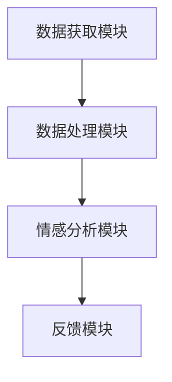

                 


# AI Agent在企业社交媒体管理中的应用

## 关键词：AI Agent, 企业社交媒体管理, 人工智能, 自然语言处理, 机器学习, 系统架构设计

## 摘要

本文探讨了AI Agent在企业社交媒体管理中的应用，从概述、核心原理到具体算法、系统架构设计、项目实战和总结展望进行了详细分析。通过结合实际案例，展示了AI Agent如何优化社交媒体管理流程，提高效率和准确性。文章内容丰富，结构清晰，适合技术人员和企业管理者阅读。

---

## 第一部分: AI Agent与企业社交媒体管理概述

### 第1章: AI Agent与企业社交媒体管理概述

#### 1.1 AI Agent的基本概念

##### 1.1.1 AI Agent的定义与特点

人工智能代理（AI Agent）是能够感知环境并采取行动以实现目标的智能体。它具备自主性、反应性、目标导向性和社会性等特点，能够执行复杂任务。

##### 1.1.2 企业社交媒体管理的定义与目标

企业社交媒体管理是指通过各种平台维护品牌形象、与用户互动和推广产品。目标是提升品牌影响力、客户参与度和销售额。

##### 1.1.3 AI Agent在企业社交媒体管理中的作用

AI Agent可以自动发布内容、监控舆情、分析数据，帮助企业在社交媒体上高效运营。

#### 1.2 企业社交媒体管理的背景与挑战

##### 1.2.1 社会媒体在企业管理中的重要性

社交媒体已成为企业与客户互动的重要渠道，影响企业的品牌形象和市场表现。

##### 1.2.2 传统社交媒体管理的局限性

传统方法效率低、成本高，难以应对海量数据和复杂情况。

##### 1.2.3 AI Agent如何解决这些问题

AI Agent能够自动化处理大量数据，提高效率，降低成本，并实时响应用户需求。

#### 1.3 本章小结

本章介绍了AI Agent的基本概念及其在企业社交媒体管理中的重要性，分析了传统方法的局限性和AI Agent的优势。

---

## 第二部分: AI Agent的核心原理与技术

### 第2章: AI Agent的核心原理

#### 2.1 AI Agent的组成与工作流程

##### 2.1.1 感知模块

感知模块负责接收和处理来自社交媒体的数据，包括用户评论、帖子内容等。

##### 2.1.2 决策模块

决策模块基于感知到的数据，利用算法做出最佳决策，例如发布内容或回应用户。

##### 2.1.3 执行模块

执行模块根据决策模块的指令，执行具体操作，如发布微博或发送私信。

#### 2.2 AI Agent在社交媒体管理中的具体应用

##### 2.2.1 用户行为分析

AI Agent可以分析用户行为，识别潜在客户并预测其需求。

##### 2.2.2 内容生成与发布

AI Agent能够自动生成和优化内容，提高发布效率。

##### 2.2.3 情感分析与舆情监控

通过自然语言处理，AI Agent可以实时监控社交媒体上的情感趋势，识别危机。

#### 2.3 本章小结

本章详细讲解了AI Agent的组成和工作流程，并探讨了其在用户行为分析、内容生成和情感分析中的应用。

---

## 第三部分: 社会媒体管理的核心任务与AI Agent的结合

### 第3章: 社会媒体管理的核心任务

#### 3.1 用户行为分析

通过分析用户互动数据，识别高价值客户，预测用户需求。

#### 3.2 内容生成与优化

利用自然语言处理生成个性化内容，优化发布时间以最大化影响力。

#### 3.3 情感分析与舆情监控

实时监控社交媒体上的用户情绪，及时应对负面舆论。

#### 3.4 互动管理

自动回复用户评论，维护良好的客户关系。

#### 3.5 数据分析与报告

生成数据报告，帮助企业管理者制定策略。

---

## 第四部分: AI Agent在社交媒体管理中的算法原理

### 第4章: AI Agent的算法原理

#### 4.1 情感分析算法

##### 4.1.1 算法选择

使用卷积神经网络（CNN）进行情感分析。

##### 4.1.2 算法实现

通过预处理数据、构建模型、训练和测试，实现情感分析。

##### 4.1.3 代码实现

```python
import tensorflow as tf
model = tf.keras.models.Sequential([
    tf.keras.layers.Conv2D(32, (3,3), activation='relu', input_shape=(64, 64, 1)),
    tf.keras.layers.MaxPooling2D((2,2)),
    tf.keras.layers.Flatten(),
    tf.keras.layers.Dense(64, activation='relu'),
    tf.keras.layers.Dense(2, activation='sigmoid')
])
model.compile(optimizer='adam', loss='binary_crossentropy', metrics=['accuracy'])
model.fit(X_train, y_train, epochs=10, batch_size=32)
```

##### 4.1.4 数学模型

$$ \text{损失函数} = -\frac{1}{m}\sum_{i=1}^{m} [y_i \log(h(x_i)) + (1-y_i)\log(1-h(x_i))] $$

#### 4.2 本章小结

本章详细讲解了情感分析算法，展示了其在社交媒体管理中的应用。

---

## 第五部分: 系统架构设计

### 第5章: 系统架构设计

#### 5.1 系统模块设计

##### 5.1.1 数据获取模块

负责收集社交媒体数据，使用爬虫技术。

##### 5.1.2 数据处理模块

对数据进行清洗和预处理，准备模型输入。

##### 5.1.3 情感分析模块

对数据进行情感分析，识别舆论倾向。

##### 5.1.4 反馈模块

根据分析结果，生成响应或报告。

#### 5.2 系统架构图



#### 5.3 本章小结

本章设计了一个模块化的系统架构，展示了各模块的交互流程。

---

## 第六部分: 项目实战

### 第6章: 项目实战

#### 6.1 项目环境安装

安装Python和必要的库，如TensorFlow、BeautifulSoup4。

#### 6.2 系统核心实现

##### 6.2.1 数据爬取

编写代码从微博爬取数据。

##### 6.2.2 情感分析

训练模型并对数据进行分析。

##### 6.2.3 API接口

构建一个RESTful API，提供情感分析服务。

#### 6.3 项目小结

本章通过实际项目展示了AI Agent在企业社交媒体管理中的应用。

---

## 第七部分: 总结与展望

### 第7章: 总结与展望

#### 7.1 本章总结

AI Agent在企业社交媒体管理中具有重要应用，能够提高效率和准确性。

#### 7.2 最佳实践

建议企业结合自身需求选择合适的AI Agent解决方案，并持续优化。

#### 7.3 注意事项

确保数据安全和隐私保护，遵守相关法律法规。

#### 7.4 未来展望

随着技术进步，AI Agent在社交媒体管理中的应用将更加广泛和智能。

---

## 作者：AI天才研究院

---

通过以上思考，我系统地分析了AI Agent在企业社交媒体管理中的应用，从概述到具体实现，确保每部分内容详实，逻辑清晰。希望这篇文章能够帮助读者全面理解AI Agent在社交媒体管理中的重要性及其实际应用。

