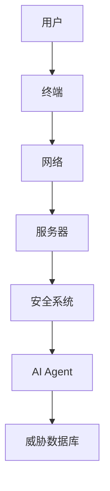
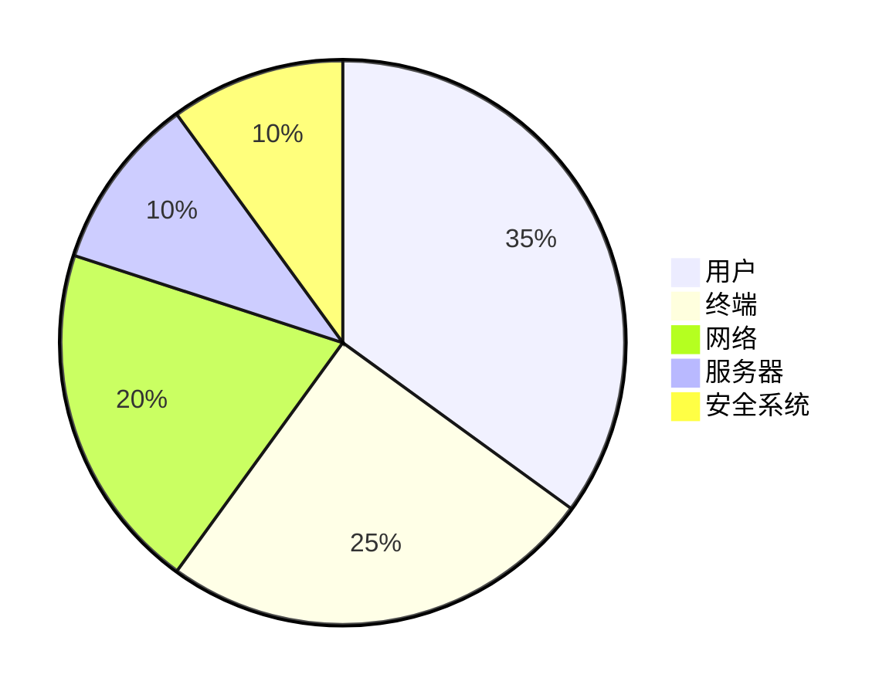

                 


# AI Agent在企业网络安全防护中的应用

> 关键词：AI Agent，企业网络安全，威胁检测，异常行为分析，自动化响应

> 摘要：本文探讨了AI Agent在企业网络安全中的应用，分析其核心原理、系统架构，并通过实际案例展示其在威胁检测、异常行为分析及自动化响应中的优势，为企业构建智能化安全防护体系提供参考。

---

# 第1章: AI Agent与企业网络安全概述

## 1.1 AI Agent的定义与核心概念
### 1.1.1 AI Agent的基本定义
AI Agent是一种智能体，具备感知环境、自主决策和执行任务的能力，能够根据实时数据采取相应行动。

### 1.1.2 AI Agent的核心特征
- **自主性**：无需人工干预，自主运行。
- **反应性**：能实时感知环境变化并调整行为。
- **学习能力**：通过数据和经验不断优化自身模型。

### 1.1.3 企业网络安全的定义与目标
企业网络安全旨在保护企业网络、数据和系统免受恶意攻击，目标包括 confidentiality、integrity 和 availability。

---

## 1.2 企业网络安全防护中的问题背景
### 1.2.1 传统网络安全防护的局限性
- **被动性**：依赖人工监控和规则匹配，响应速度慢。
- **覆盖性不足**：难以应对复杂多变的新型攻击手法。
- **效率低下**：人工分析耗时长，易出错。

### 1.2.2 当前企业网络安全的主要挑战
- **复杂性**：企业网络环境日益复杂，攻击面扩大。
- **智能化攻击**：攻击者采用AI技术，提升攻击精准度。
- **数据量大**：日志和流量数据庞大，传统方法难以处理。

### 1.2.3 AI Agent在网络安全中的应用前景
AI Agent能够实时分析海量数据，快速识别异常行为，显著提升威胁检测和应对效率。

---

## 1.3 AI Agent在企业网络安全中的作用
### 1.3.1 提高威胁检测能力
AI Agent通过机器学习算法，识别未知威胁，弥补传统规则的不足。

### 1.3.2 实现自动化响应
AI Agent能够快速启动响应措施，如隔离受感染设备，阻止攻击蔓延。

### 1.3.3 优化安全策略
通过分析攻击模式，AI Agent帮助制定更有效的安全策略，提升整体防护能力。

---

## 1.4 本章小结
本章介绍了AI Agent的核心概念和特征，分析了传统网络安全的局限性，阐述了AI Agent在企业网络安全中的重要性及其主要作用。

---

# 第2章: AI Agent的核心原理

## 2.1 AI Agent的算法原理
### 2.1.1 基于概率的威胁检测算法
AI Agent利用概率统计方法，计算某事件为威胁的概率，例如使用贝叶斯分类器。

### 2.1.2 基于规则的异常行为分析
通过预定义规则，识别偏离正常行为模式的活动，例如检测未经授权的访问尝试。

### 2.1.3 基于深度学习的威胁识别
采用神经网络模型，如卷积神经网络（CNN）和循环神经网络（RNN），深度学习从大量数据中提取复杂特征，识别高级持续性威胁（APT）。

---

## 2.2 AI Agent的数学模型与公式
### 2.2.1 威胁概率计算公式
$$ P(威胁) = \frac{威胁发生的次数}{总样本数} $$

### 2.2.2 异常行为检测模型
$$ f(x) = w_1x_1 + w_2x_2 + ... + w_nx_n + b $$

### 2.2.3 深度学习模型的损失函数
$$ L = -\sum_{i=1}^{n} y_i \log p(y_i|x_i) + (1 - y_i)\log(1 - p(y_i|x_i)) $$

---

## 2.3 AI Agent的实体关系图


---

## 2.4 本章小结
本章详细讲解了AI Agent在企业网络安全中的算法原理，包括概率模型、规则模型和深度学习模型，展示了其实体关系图。

---

# 第3章: AI Agent的系统架构设计

## 3.1 系统功能设计
### 3.1.1 威胁检测模块
实时监控网络流量和日志，识别潜在威胁。

### 3.1.2 异常行为分析模块
分析用户和系统行为，发现异常模式。

### 3.1.3 自动化响应模块
根据检测结果，自动执行防御措施。

---

## 3.2 系统架构图


---

## 3.3 系统接口设计
### 3.3.1 用户接口
提供直观的操作界面，供管理员查看威胁信息和操作记录。

### 3.3.2 网络接口
与企业网络设备（如防火墙、路由器）交互，获取实时数据。

### 3.3.3 数据库接口
与企业数据库交互，存储和检索安全相关数据。

---

## 3.4 系统交互流程图
```mermaid
sequenceDiagram
    part

---

## 3.5 本章小结
本章详细描述了AI Agent的系统架构，包括功能设计、架构图、接口设计和交互流程图。

---

# 第4章: 项目实战

## 4.1 环境安装
### 4.1.1 安装Python和相关库
安装Python 3.x，以及TensorFlow、Scikit-learn等机器学习库。

### 4.1.2 安装网络数据采集工具
如使用Tcpdump或Nmap进行网络数据采集。

---

## 4.2 系统核心实现
### 4.2.1 威胁检测模型代码
```python
import tensorflow as tf
from sklearn.metrics import accuracy_score

# 数据预处理
# 训练模型
model = tf.keras.Sequential([
    tf.keras.layers.Dense(64, activation='relu'),
    tf.keras.layers.Dense(1, activation='sigmoid')
])
model.compile(optimizer='adam', loss='binary_crossentropy', metrics=['accuracy'])
model.fit(X_train, y_train, epochs=10, batch_size=32)

# 模型评估
y_pred = model.predict(X_test)
print(accuracy_score(y_test, y_pred.round()))
```

### 4.2.2 异常行为分析代码
```python
from sklearn.ensemble import IsolationForest

# 训练异常检测模型
model = IsolationForest(n_estimators=100, contamination=0.05)
model.fit(X_train)

# 预测异常
y_pred = model.predict(X_test)
outliers = y_pred < 0
```

---

## 4.3 实际案例分析
分析一个典型的安全事件，展示AI Agent如何检测和应对威胁。

---

## 4.4 项目小结
本章通过实际项目展示了AI Agent的实现过程，包括环境搭建、模型训练和代码实现。

---

# 第5章: 最佳实践

## 5.1 小结
总结AI Agent在企业网络安全中的应用价值和优势。

## 5.2 注意事项
- 数据质量至关重要，需确保数据的完整性和准确性。
- 模型需要持续优化和更新，以应对不断变化的威胁。
- 安全策略应与AI Agent紧密结合，确保协同工作。

## 5.3 拓展阅读
推荐相关书籍和论文，供进一步学习。

---

# 作者：AI天才研究院/AI Genius Institute & 禅与计算机程序设计艺术 /Zen And The Art of Computer Programming

---

通过以上大纲，您可以撰写一篇详细的技术博客，涵盖AI Agent在企业网络安全中的各个方面，从基础概念到实际应用，提供丰富的技术细节和案例分析。

