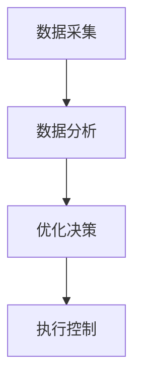
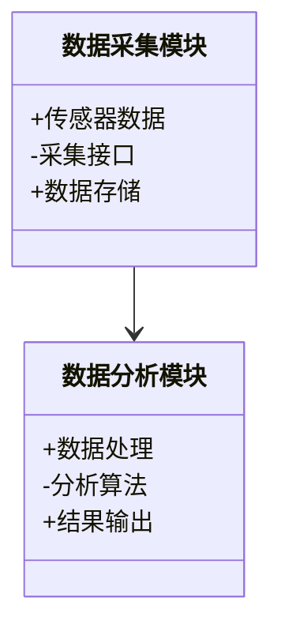
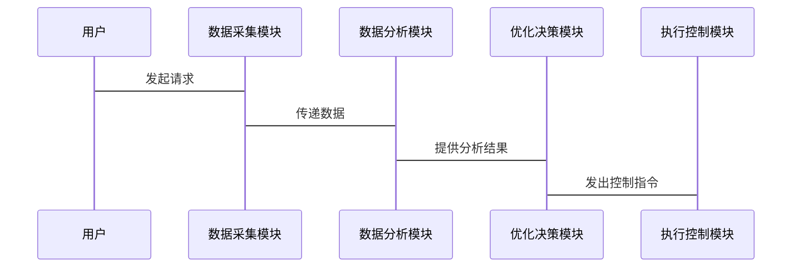

                 


# AI Agent在企业能源管理与节能减排中的应用

## 关键词：AI Agent, 企业能源管理, 节能减排, 机器学习, 能源优化, 碳排放, 智能化管理

## 摘要：本文探讨了AI Agent在企业能源管理与节能减排中的应用，详细分析了AI Agent的基本原理、核心技术及其在电力、热能和碳排放管理中的具体应用场景。通过系统架构设计和项目实战，展示了AI Agent如何帮助企业实现能源优化和减排目标，提供了丰富的技术细节和实际案例。

---

# 第1章: AI Agent与企业能源管理概述

## 1.1 AI Agent的基本概念

### 1.1.1 AI Agent的定义
AI Agent（人工智能代理）是一种能够感知环境、自主决策并执行任务的智能系统。它通过传感器获取数据，利用算法进行分析，做出最优决策，并通过执行器实现目标。

### 1.1.2 AI Agent的核心特征
- **自主性**：无需人工干预，自主完成任务。
- **反应性**：实时感知环境变化并做出反应。
- **学习能力**：通过数据优化决策模型。
- **协作性**：与其他系统或AI Agent协同工作。

### 1.1.3 AI Agent与传统能源管理的区别
传统能源管理依赖人工操作和固定规则，效率低且缺乏灵活性。AI Agent通过智能化决策和实时优化，显著提高了能源管理的效率和准确性。

## 1.2 企业能源管理的现状与挑战

### 1.2.1 传统能源管理的痛点
- 数据分散，难以整合。
- 缺乏实时监控，难以及时发现浪费。
- 优化策略单一，难以应对复杂场景。

### 1.2.2 数字化转型的必要性
随着能源成本上升和环保要求增加，企业需要通过数字化手段提高能源管理效率。

### 1.2.3 节能减排的目标与意义
节能减排不仅是环保要求，也是降低成本和提高企业竞争力的重要手段。

## 1.3 AI Agent在能源管理中的应用前景

### 1.3.1 AI Agent在能源管理中的优势
- 实时监控和优化。
- 数据驱动的精准决策。
- 自适应能力强。

### 1.3.2 AI Agent在节能减排中的潜力
通过优化能源使用，减少浪费，降低碳排放。

### 1.3.3 企业能源管理的未来趋势
智能化、数据化和协同化是未来能源管理的发展方向。

---

# 第2章: AI Agent的核心原理与技术

## 2.1 AI Agent的基本原理

### 2.1.1 AI Agent的感知机制
AI Agent通过传感器和数据采集系统获取环境信息，如温度、电力消耗等。

### 2.1.2 AI Agent的决策机制
利用机器学习模型分析数据，生成优化策略。

### 2.1.3 AI Agent的执行机制
通过执行器（如自动化设备）实施决策。

## 2.2 AI Agent的关键技术

### 2.2.1 机器学习算法
- **监督学习**：用于分类和预测。
- **无监督学习**：用于聚类和异常检测。

### 2.2.2 自然语言处理
用于分析文本数据，如报告和日志。

### 2.2.3 大数据分析
处理海量数据，提取有用信息。

## 2.3 AI Agent的数学模型与算法

### 2.3.1 AI Agent的数学模型
$$
\text{预测值} = \beta_0 + \beta_1 \times \text{输入特征} + \epsilon
$$

### 2.3.2 机器学习算法的实现
使用线性回归模型预测能源消耗：
$$
y = w x + b
$$

### 2.3.3 自然语言处理的流程
1. 数据预处理：分词、去除停用词。
2. 模型训练：使用Word2Vec生成词向量。
3. 应用：分析文本数据，生成摘要。

## 2.4 本章小结

---

# 第3章: AI Agent在企业能源管理中的应用场景

## 3.1 电力管理中的AI Agent应用

### 3.1.1 电力需求预测
使用时间序列模型预测用电量。

### 3.1.2 电力分配优化
通过优化算法分配电力资源。

### 3.1.3 电力浪费检测
实时监控，发现异常消耗。

## 3.2 热能管理中的AI Agent应用

### 3.2.1 热能需求预测
基于历史数据和天气预报进行预测。

### 3.2.2 热能分配优化
优化热能分配，减少浪费。

### 3.2.3 热能浪费检测
通过传感器数据发现异常消耗。

## 3.3 碳排放管理中的AI Agent应用

### 3.3.1 碳排放预测
使用机器学习模型预测排放量。

### 3.3.2 碳排放优化
优化能源使用，减少排放。

### 3.3.3 碳排放监测
实时监控排放数据，及时调整策略。

## 3.4 本章小结

---

# 第4章: AI Agent在企业能源管理中的系统架构设计

## 4.1 系统功能设计

### 4.1.1 系统功能模块划分
- 数据采集模块
- 数据分析模块
- 优化决策模块
- 执行控制模块

### 4.1.2 系统功能流程图


### 4.1.3 系统功能实现方式
采用微服务架构，各模块独立开发和部署。

## 4.2 系统架构设计

### 4.2.1 系统架构图


### 4.2.2 系统组件之间的关系
各模块通过API进行交互，数据采集模块向数据分析模块提供数据。

### 4.2.3 系统扩展性设计
采用模块化设计，方便新增功能和优化。

## 4.3 系统接口设计

### 4.3.1 系统内部接口
- 数据采集模块与数据分析模块的接口。
- 数据分析模块与优化决策模块的接口。

### 4.3.2 系统外部接口
- 用户界面（UI）接口。
- 第三方数据源接口。

### 4.3.3 接口交互流程图


## 4.4 本章小结

---

# 第5章: AI Agent在企业能源管理中的项目实战

## 5.1 项目环境安装

### 5.1.1 系统要求
- 操作系统：Linux/Windows
- 开发工具：Python、Jupyter Notebook
- 数据库：MySQL/PostgreSQL

### 5.1.2 安装步骤
1. 安装Python和相关库（如numpy、pandas、scikit-learn）。
2. 安装数据库和连接库。
3. 配置开发环境。

## 5.2 系统核心实现源代码

### 5.2.1 数据采集模块
```python
import pandas as pd
import requests

def fetch_data(api_key):
    response = requests.get(f'http://energy_api.com/data?api_key={api_key}')
    data = response.json()
    df = pd.DataFrame(data)
    return df
```

### 5.2.2 数据分析模块
```python
from sklearn.linear_model import LinearRegression

def train_model(X, y):
    model = LinearRegression()
    model.fit(X, y)
    return model
```

### 5.2.3 优化决策模块
```python
def optimize_energy_usage(model, current_usage):
    prediction = model.predict([current_usage])
    return prediction[0]
```

### 5.2.4 执行控制模块
```python
def control_system(predicted_usage):
    print(f"调整系统以达到预测使用量：{predicted_usage}")
```

## 5.3 案例分析

### 5.3.1 案例背景
某制造企业希望优化电力使用，减少碳排放。

### 5.3.2 数据分析与建模
使用历史用电数据训练线性回归模型，预测未来用电量。

### 5.3.3 实施优化
通过模型预测，调整生产线运行时间，减少高峰时段用电。

## 5.4 项目小结

---

# 第6章: 总结与未来展望

## 6.1 本章小结
本文详细探讨了AI Agent在企业能源管理中的应用，展示了其在节能减排中的巨大潜力。

## 6.2 未来展望
未来，AI Agent将与物联网、区块链等技术结合，进一步提升能源管理的智能化水平。

---

# 作者：AI天才研究院/AI Genius Institute & 禅与计算机程序设计艺术 /Zen And The Art of Computer Programming

