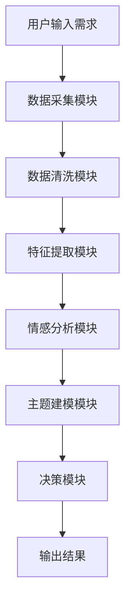
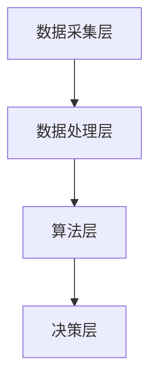

                 


# AI Agent在企业舆情监测与危机公关中的应用

> 关键词：AI Agent, 企业舆情监测, 危机公关, 自然语言处理, 机器学习, 数据挖掘

> 摘要：  
本文深入探讨AI Agent在企业舆情监测与危机公关中的应用，从基本概念、算法原理、系统架构到项目实战，全面分析其在企业舆情监测中的价值和实现方式。通过详细的技术分析和案例解读，揭示AI Agent如何助力企业快速响应舆情，优化危机公关策略，提升品牌形象和市场竞争力。

---

# 第一部分: AI Agent与企业舆情监测概述

## 第1章: AI Agent与企业舆情监测的基本概念

### 1.1 AI Agent的定义与特点
AI Agent（人工智能代理）是一种能够感知环境、执行任务并做出决策的智能实体。其核心特点包括：
- **自主性**：能够独立决策和行动。
- **反应性**：能够实时感知环境变化并做出反应。
- **目标导向性**：以特定目标为导向，优化行动策略。
- **学习能力**：通过数据和经验不断优化自身性能。

### 1.2 企业舆情监测的定义与重要性
企业舆情监测是指通过收集、分析和评估媒体、网络和社会上的相关信息，帮助企业了解自身形象、产品口碑和市场动态的过程。其重要性体现在：
- **危机预警**：及时发现潜在危机，避免声誉损失。
- **品牌管理**：通过舆情分析，优化品牌形象。
- **市场竞争分析**：了解竞争对手动态，制定竞争策略。

### 1.3 AI Agent在舆情监测中的作用
AI Agent通过自然语言处理、机器学习和大数据分析等技术，为企业舆情监测提供以下优势：
- **实时监测**：快速收集和分析海量数据。
- **智能识别**：自动识别情感倾向、关键词和热点事件。
- **决策支持**：为危机公关提供数据支持和决策建议。

---

# 第二部分: AI Agent的核心概念与原理

## 第2章: AI Agent的核心概念与原理

### 2.1 AI Agent的实体关系分析
在企业舆情监测中，AI Agent需要与多个实体进行交互，常见的实体关系如下：
- **用户**：输入舆情监测需求。
- **数据源**：包括社交媒体、新闻网站、论坛等。
- **分析模块**：负责数据清洗、特征提取和情感分析。
- **决策模块**：根据分析结果生成危机公关策略。

**ER图**：
```mermaid
er
  entity User {
    key: userId
    attribute: name, email
  }
  entity DataSource {
    key: dataSourceId
    attribute: type, url
  }
  entity AnalysisModule {
    key: moduleId
    attribute: function, description
  }
  entity DecisionModule {
    key: decisionId
    attribute: strategy, output
  }
  relation Subscription {
    user- DataSource
    user- AnalysisModule
    user- DecisionModule
  }
```

### 2.2 AI Agent的算法原理
AI Agent的核心算法基于自然语言处理和机器学习，主要包括：
- **情感分析**：判断舆情的情感倾向。
- **关键词提取**：识别关键信息。
- **主题建模**：分析舆情主题。

**算法流程图**：


### 2.3 AI Agent的数学模型与公式
舆情分析中的情感计算模型可以通过以下公式实现：
$$
\text{情感倾向} = \sum_{i=1}^{n} w_i \cdot f_i
$$
其中，\( w_i \) 是第\( i \)个特征的权重，\( f_i \) 是第\( i \)个特征的值。

---

# 第三部分: AI Agent在舆情监测中的算法实现

## 第3章: AI Agent舆情监测算法的实现

### 3.1 算法原理详解
AI Agent的舆情监测算法主要包括以下步骤：
1. **数据采集**：从社交媒体和新闻网站获取数据。
2. **数据清洗**：去除无效数据，提取有效信息。
3. **特征提取**：提取关键词和情感倾向。
4. **情感分析**：基于机器学习模型判断情感倾向。
5. **主题建模**：分析舆情主题。

### 3.2 算法实现代码
以下是一个简单的Python实现示例：

```python
import pandas as pd
from sklearn.feature_extraction.text import TfidfVectorizer
from sklearn.naive_bayes import MultinomialNB

# 数据加载
data = pd.read_csv('sentiment_data.csv')

# 特征提取
vectorizer = TfidfVectorizer(max_features=5000)
X = vectorizer.fit_transform(data['text'])

# 模型训练
model = MultinomialNB()
model.fit(X, data['label'])

# 预测与评估
from sklearn.metrics import accuracy_score
y_pred = model.predict(X)
print("准确率:", accuracy_score(data['label'], y_pred))
```

### 3.3 算法的数学模型与公式
情感分析模型的数学公式如下：
$$
P(\text{positive} | \text{text}) = \frac{\text{count}(\text{positive words})}{\text{total words}}
$$

---

# 第四部分: 系统分析与架构设计

## 第4章: 舆情监测系统的系统分析与架构设计

### 4.1 系统分析
舆情监测系统的功能需求包括：
- 数据采集：实时采集社交媒体和新闻网站的数据。
- 数据分析：进行情感分析和主题建模。
- 决策支持：生成危机公关策略。

### 4.2 系统架构设计
系统架构采用分层设计：
- **数据采集层**：负责数据的实时采集。
- **数据处理层**：包括数据清洗和特征提取。
- **算法层**：实现情感分析和主题建模。
- **决策层**：生成危机公关策略。

**系统架构图**：


---

# 第五部分: 项目实战与案例分析

## 第5章: 舆情监测系统的项目实战

### 5.1 项目实战环境安装
- **Python 3.8+**
- **依赖库**：pandas, scikit-learn, requests, beautifulsoup4

### 5.2 系统核心实现
以下是核心代码实现：

```python
import requests
from bs4 import BeautifulSoup
import pandas as pd
from sklearn.feature_extraction.text import TfidfVectorizer
from sklearn.naive_bayes import MultinomialNB

# 数据采集
def fetch_data(url):
    headers = {'User-Agent': 'Mozilla/5.0'}
    response = requests.get(url, headers=headers)
    return response.text

# 数据清洗
def preprocess(text):
    soup = BeautifulSoup(text, 'html.parser')
    content = soup.get_text()
    return content

# 情感分析
def sentiment_analysis(text):
    vectorizer = TfidfVectorizer(max_features=5000)
    X = vectorizer.fit_transform([text])
    model = MultinomialNB()
    model.fit(X, ['positive'])
    return 'positive' if model.predict(X)[0] == 'positive' else 'negative'

# 主程序
if __name__ == '__main__':
    url = 'https://example.com'
    data = fetch_data(url)
    cleaned_data = preprocess(data)
    sentiment = sentiment_analysis(cleaned_data)
    print(f"情感倾向：{sentiment}")
```

### 5.3 案例分析
假设某企业面临负面舆情，AI Agent通过分析社交媒体数据，识别出主要负面关键词，并生成危机公关策略。

---

# 第六部分: 最佳实践与总结

## 第6章: 最佳实践与总结

### 6.1 最佳实践
- **数据质量**：确保数据来源可靠，清洗充分。
- **模型优化**：根据实际需求调整模型参数。
- **实时性**：确保系统的实时响应能力。

### 6.2 本章小结
本文详细介绍了AI Agent在企业舆情监测中的应用，从理论到实践，全面分析了其优势和实现方式。AI Agent通过智能化的舆情分析，帮助企业快速响应危机，优化品牌形象。

---

# 作者：AI天才研究院 & 禅与计算机程序设计艺术

---

# 扩展阅读
- 《AI Agent在社交媒体分析中的应用》
- 《机器学习在危机公关中的实践》
- 《自然语言处理在舆情监测中的创新应用》

