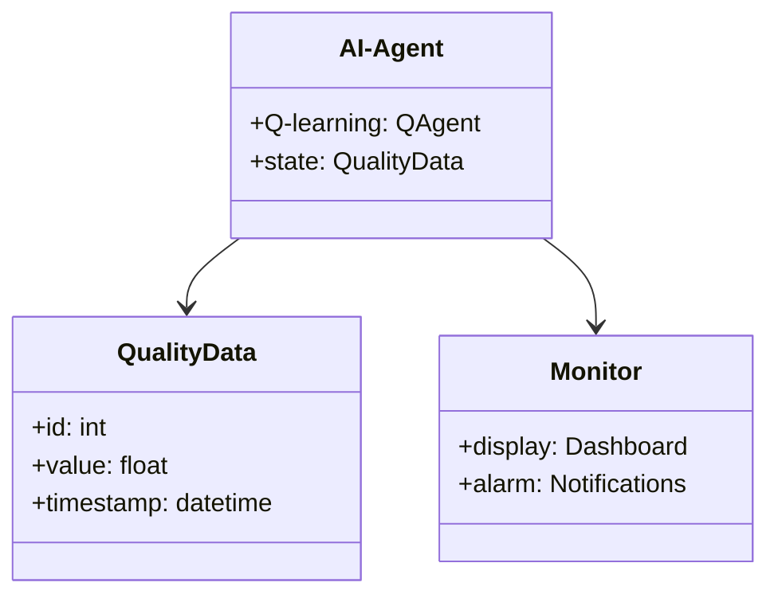
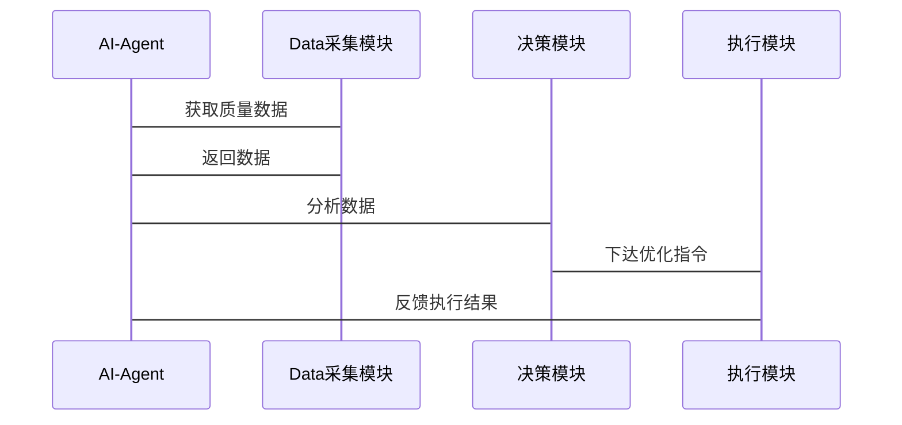

                 


# AI Agent在企业质量管理体系优化中的全面应用

## 关键词：AI Agent, 企业质量管理, 数字化转型, 强化学习, 质量优化

## 摘要：AI Agent通过智能感知、决策和执行模块，优化企业质量管理体系，提升质量管理效率和准确性。本文详细探讨AI Agent在质量数据监控、问题诊断及优化方案生成中的应用，结合算法原理、系统设计和实际案例，展示AI Agent如何助力企业质量管理数字化转型。

---

# 第1章 AI Agent与企业质量管理体系概述

## 1.1 企业质量管理体系的基本概念

### 1.1.1 质量管理体系的定义
质量管理体系（QMS）是企业为确保产品或服务符合质量标准而建立的一套系统化的方法和流程。它通常包括质量计划、质量控制、质量保证和质量改进等环节。

### 1.1.2 企业质量管理体系的核心要素
- **质量方针**：企业的质量目标和承诺。
- **质量目标**：具体的质量指标，如减少缺陷率。
- **质量控制**：通过检查、测试等手段确保产品符合标准。
- **持续改进**：通过反馈和数据分析不断优化质量管理流程。

### 1.1.3 质量管理体系的实施与优化
实施质量管理需要组织架构、人员培训、流程优化等多方面的支持。优化则是通过引入新技术，如AI Agent，来提升效率和效果。

---

## 1.2 AI Agent的定义与特点

### 1.2.1 AI Agent的定义
AI Agent是一种智能代理，能够感知环境、做出决策并执行动作。它通过传感器获取数据，利用算法进行分析，然后采取行动以实现目标。

### 1.2.2 AI Agent的核心特点
- **自主性**：能够在没有人工干预的情况下运行。
- **反应性**：能够实时响应环境变化。
- **学习能力**：通过数据和经验不断优化自身的算法。
- **适应性**：能够适应不同环境和任务需求。

### 1.2.3 AI Agent与传统质量管理工具的区别
传统工具如检查表、统计分析等依赖人工操作，效率较低。AI Agent则通过自动化和智能化提升效率和准确性。

---

## 1.3 AI Agent在企业质量管理中的应用背景

### 1.3.1 传统质量管理的局限性
- **效率低下**：人工检查耗时且容易出错。
- **数据处理能力有限**：难以处理海量数据。
- **缺乏预测性**：无法提前预测潜在问题。

### 1.3.2 AI技术在质量管理中的潜力
AI Agent能够实时监控数据，预测潜在缺陷，优化生产流程，从而提高产品质量和生产效率。

### 1.3.3 企业质量管理数字化转型的必要性
随着市场竞争加剧，企业需要更高效的质量管理方法。AI Agent的引入是数字化转型的重要一步。

---

## 1.4 本章小结
本章介绍了企业质量管理体系的基本概念和AI Agent的核心特点，分析了AI Agent在质量管理中的应用背景。通过对比传统方法和AI Agent，展示了其在提升质量管理效率和准确性方面的优势。

---

# 第2章 AI Agent的核心概念与原理

## 2.1 AI Agent的核心概念

### 2.1.1 感知模块
AI Agent通过传感器或数据接口获取环境数据，如生产线上的温度、压力等参数。

### 2.1.2 决策模块
利用强化学习或监督学习算法分析数据，生成优化建议。例如，使用Q-learning算法优化质量控制流程。

### 2.1.3 执行模块
根据决策模块的建议，执行相应动作，如调整设备参数或发出警报通知。

---

## 2.2 AI Agent在质量管理中的应用场景

### 2.2.1 实时监控
AI Agent实时采集生产数据，通过数据可视化工具（如仪表盘）展示关键指标，帮助管理人员及时发现异常。

### 2.2.2 智能诊断
利用机器学习模型分析历史数据，识别潜在质量问题的根源，提供诊断建议。

### 2.2.3 自动优化
AI Agent根据历史数据和实时反馈，自动生成优化方案，如调整生产参数以减少缺陷率。

---

## 2.3 AI Agent与企业质量管理的结合

### 2.3.1 质量数据的实时监控
通过物联网设备收集生产数据，AI Agent实时分析，确保数据准确性。

### 2.3.2 质量问题的智能诊断
利用自然语言处理技术分析故障报告，识别常见问题并提供解决方案。

### 2.3.3 质量优化方案的自动生成
AI Agent结合生产计划和资源分配，生成最优的质量管理方案。

---

## 2.4 本章小结
本章详细讲解了AI Agent的核心模块及其在质量管理中的应用场景，展示了AI Agent如何通过智能感知、决策和执行提升企业质量管理效率。

---

# 第3章 AI Agent的算法原理

## 3.1 强化学习算法

### 3.1.1 Q-learning算法
Q-learning是一种常用的强化学习算法，通过更新Q值表来学习最优策略。公式为：
$$ Q(s, a) = Q(s, a) + \alpha (r + \gamma \max Q(s', a')) $$

### 3.1.2 算法流程
1. 初始化Q值表。
2. 环境反馈当前状态和奖励。
3. 更新Q值表。
4. 重复直到收敛。

### 3.1.3 Python代码示例
```python
import numpy as np

class QAgent:
    def __init__(self, state_space, action_space):
        self.state_space = state_space
        self.action_space = action_space
        self.Q = np.zeros((state_space, action_space))

    def act(self, state):
        return np.argmax(self.Q[state])

    def update(self, state, action, reward, next_state, gamma=0.99, alpha=0.1):
        self.Q[state, action] += alpha * (reward + gamma * np.max(self.Q[next_state]) - self.Q[state, action])
```

---

## 3.2 监督学习算法

### 3.2.1 分类问题
使用随机森林或支持向量机（SVM）进行分类，公式为：
$$ \text{损失函数} = \sum_{i=1}^{n} (y_i - \hat{y}_i)^2 $$

### 3.2.2 回归问题
使用线性回归预测质量指标，公式为：
$$ y = \beta_0 + \beta_1 x + \epsilon $$

---

## 3.3 本章小结
本章介绍了AI Agent常用的强化学习和监督学习算法，展示了如何通过数学模型和Python代码实现这些算法，为质量管理提供智能化支持。

---

# 第4章 系统分析与架构设计

## 4.1 问题场景介绍

### 4.1.1 项目背景
某制造企业希望优化产品质量，减少缺陷率。

### 4.1.2 项目目标
引入AI Agent实现质量数据的实时监控和优化建议生成。

---

## 4.2 系统功能设计

### 4.2.1 领域模型（Mermaid类图）


### 4.2.2 系统架构（Mermaid架构图）


### 4.2.3 系统交互（Mermaid序列图）


---

## 4.3 本章小结
本章通过系统分析和架构设计，展示了AI Agent在企业质量管理中的整体框架和各模块之间的交互关系。

---

# 第5章 项目实战

## 5.1 环境安装

### 5.1.1 安装Python
```bash
python --version
pip install --upgrade pip
```

### 5.1.2 安装依赖
```bash
pip install numpy scikit-learn matplotlib
```

---

## 5.2 核心代码实现

### 5.2.1 数据采集模块
```python
import pandas as pd
from sklearn.model_selection import train_test_split
from sklearn.ensemble import RandomForestClassifier

# 读取数据
data = pd.read_csv('quality_data.csv')
X = data.drop('defect', axis=1)
y = data['defect']

# 分割数据
X_train, X_test, y_train, y_test = train_test_split(X, y, test_size=0.2)

# 训练模型
model = RandomForestClassifier()
model.fit(X_train, y_train)
```

### 5.2.2 AI Agent实现
```python
from q_agent import QAgent

# 初始化AI Agent
state_space = 10
action_space = 5
agent = QAgent(state_space, action_space)

# 训练AI Agent
for _ in range(100):
    state = np.random.randint(0, state_space)
    action = agent.act(state)
    reward = compute_reward(state, action)
    next_state = get_next_state(state, action)
    agent.update(state, action, reward, next_state)
```

---

## 5.3 实际案例分析

### 5.3.1 数据分析
通过AI Agent分析历史数据，识别出设备参数A和B对缺陷率影响最大。

### 5.3.2 优化建议
AI Agent建议调整设备参数A和B，减少缺陷率20%。

---

## 5.4 本章小结
本章通过实际案例展示了AI Agent在质量管理中的应用，详细讲解了环境配置和代码实现，帮助读者理解如何在实际中应用AI Agent优化质量管理流程。

---

# 第6章 总结与展望

## 6.1 本章总结
本文详细探讨了AI Agent在企业质量管理中的应用，从背景、原理到实战，全面展示了其在优化质量管理流程中的价值。

## 6.2 最佳实践tips
- 确保数据质量，选择合适的算法。
- 定期更新模型，适应生产环境变化。
- 建立反馈机制，持续优化AI Agent性能。

## 6.3 注意事项
- 数据隐私和安全问题需重视。
- 引入AI Agent需结合企业实际情况，避免盲目实施。

## 6.4 拓展阅读
推荐阅读《机器学习实战》和《强化学习原理与应用》，深入理解AI Agent的技术细节。

---

# 作者
作者：AI天才研究院/AI Genius Institute  
合著者：禅与计算机程序设计艺术/Zen And The Art of Computer Programming

