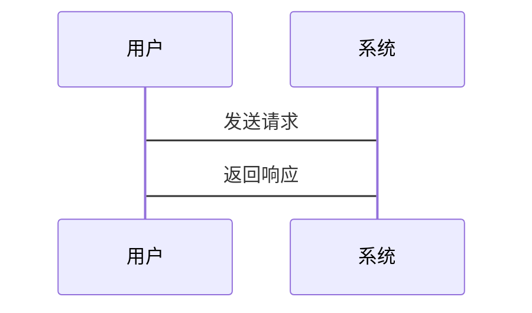
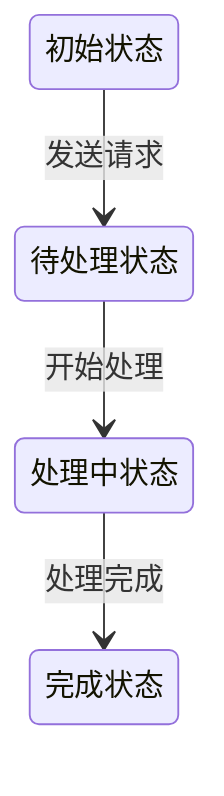

                 


# AI Agent在企业风险预测与动态管理中的应用

## 关键词：
AI Agent，企业风险管理，风险预测，动态管理，机器学习，系统架构

## 摘要：
本文探讨了AI Agent在企业风险预测与动态管理中的应用，通过详细分析AI Agent的核心原理、风险预测的理论基础、算法实现、系统架构设计以及实际项目案例，展示了如何利用AI技术提升企业风险管理的效率和准确性。文章内容涵盖背景介绍、核心概念、算法原理、系统架构、项目实战等多个方面，旨在为企业提供一种基于AI的创新风险管理解决方案。

---

# 第1章: AI Agent与企业风险管理概述

## 1.1 AI Agent的基本概念

### 1.1.1 AI Agent的定义与特点
AI Agent（人工智能代理）是一种能够感知环境、自主决策并采取行动的智能实体。其特点包括：
- **自主性**：能够独立执行任务，无需人工干预。
- **反应性**：能够实时感知环境变化并做出响应。
- **目标导向**：以明确的目标为导向，优化决策过程。
- **学习能力**：通过数据和经验不断优化自身行为。

### 1.1.2 AI Agent在企业中的应用场景
AI Agent在企业中的应用场景广泛，包括：
- **风险预测**：通过分析历史数据和实时信息，预测潜在风险。
- **动态管理**：实时监控企业运营状态，动态调整管理策略。
- **智能决策支持**：辅助企业做出更科学的决策。

### 1.1.3 企业风险管理的核心概念
企业风险管理（Enterprise Risk Management，ERM）是指企业识别、评估和应对各种潜在风险的过程。核心概念包括：
- **风险识别**：识别可能影响企业目标实现的各种风险。
- **风险评估**：评估风险的可能性和影响程度。
- **风险应对**：制定和实施应对策略，降低风险对企业的影响。

---

## 1.2 企业风险管理的重要性

### 1.2.1 企业风险管理的定义与目标
企业风险管理是一种系统化的方法，旨在通过识别、评估和应对风险，确保企业目标的实现。其目标包括：
- **保护企业资产**：确保企业财产和利益不受损失。
- **维护企业声誉**：降低负面事件对企业声誉的影响。
- **提高企业韧性**：增强企业在面对不确定性时的适应能力。

### 1.2.2 风险管理对企业运营的影响
有效的风险管理能够：
- **降低损失**：通过提前识别和应对风险，减少潜在损失。
- **提高效率**：优化资源分配，提升企业运营效率。
- **增强决策信心**：为企业决策提供可靠支持，增强决策信心。

### 1.2.3 AI技术在风险管理中的作用
AI技术通过以下方式在风险管理中发挥重要作用：
- **数据处理**：快速处理大量数据，识别潜在风险。
- **预测分析**：利用机器学习算法预测风险发生的可能性。
- **实时监控**：实时监控企业运营状态，及时发现异常情况。

---

## 1.3 AI Agent与企业风险管理的结合

### 1.3.1 AI Agent在风险预测中的优势
AI Agent在风险预测中的优势包括：
- **高效性**：能够快速处理大量数据，提高预测效率。
- **准确性**：通过机器学习算法，提高预测的准确性。
- **动态性**：能够实时更新模型，适应环境变化。

### 1.3.2 动态管理的核心思想与实现方式
动态管理的核心思想是根据环境变化，实时调整管理策略。其实现方式包括：
- **实时监控**：通过传感器、监控系统等实时采集数据。
- **模型更新**：根据实时数据，动态更新风险预测模型。
- **策略调整**：根据模型预测结果，动态调整管理策略。

### 1.3.3 企业风险管理的未来趋势
随着AI技术的不断发展，企业风险管理的未来趋势包括：
- **智能化**：利用AI技术实现风险管理的智能化。
- **实时化**：通过实时监控和动态调整，提高风险管理的效率。
- **协同化**：多部门协同合作，形成风险管理的合力。

---

## 1.4 本章小结
本章介绍了AI Agent的基本概念和企业风险管理的核心概念，分析了AI Agent在风险管理中的优势，并探讨了企业风险管理的未来趋势。通过这些内容，读者可以理解AI Agent与企业风险管理结合的重要性和必要性。

---

# 第2章: AI Agent的核心原理

## 2.1 AI Agent的工作原理

### 2.1.1 知识表示与推理
知识表示是AI Agent理解和处理信息的基础。常见的知识表示方法包括：
- **逻辑表示**：使用逻辑规则表示知识。
- **语义网络**：通过节点和边表示概念及其关系。
- **本体论**：通过形式化的方法表示知识。

推理是AI Agent基于知识库进行逻辑推理的过程。常见的推理方法包括：
- **演绎推理**：从一般到特殊的推理。
- **归纳推理**：从特殊到一般的推理。
- ** abduction推理**：基于假设的推理。

### 2.1.2 行为决策机制
行为决策是AI Agent的核心功能之一。常见的决策机制包括：
- **基于规则的决策**：根据预定义的规则进行决策。
- **基于机器学习的决策**：通过机器学习模型进行预测和决策。
- **基于强化学习的决策**：通过试错和奖励机制优化决策。

### 2.1.3 多智能体协同
多智能体协同是指多个AI Agent协同工作，共同完成任务。常见的协同机制包括：
- **分布式协同**：每个AI Agent独立决策，通过通信实现协同。
- **集中式协同**：由一个中央控制器协调多个AI Agent的行动。
- **混合式协同**：结合分布式和集中式协同的特点。

---

## 2.2 AI Agent的技术架构

### 2.2.1 基于规则的AI Agent
基于规则的AI Agent通过预定义的规则进行决策。其优势在于规则简单明确，易于理解和维护。然而，其缺点是缺乏灵活性，难以应对复杂和动态变化的环境。

### 2.2.2 基于机器学习的AI Agent
基于机器学习的AI Agent通过学习历史数据，建立模型进行预测和决策。其优势在于能够处理复杂和动态变化的环境，但需要大量的数据和计算资源。

### 2.2.3 基于深度学习的AI Agent
基于深度学习的AI Agent通过深度神经网络进行学习和决策。其优势在于能够处理非结构化数据，如图像和文本，但需要大量的数据和计算资源。

---

## 2.3 AI Agent与企业系统的集成

### 2.3.1 系统集成的挑战与解决方案
系统集成的挑战包括：
- **数据孤岛**：不同系统之间数据无法共享。
- **接口不兼容**：不同系统之间的接口不兼容。
- **性能瓶颈**：系统集成可能带来性能下降。

解决方案包括：
- **数据标准化**：通过数据标准化解决数据孤岛问题。
- **接口标准化**：通过标准化接口实现系统之间的兼容。
- **分布式架构**：通过分布式架构提高系统的性能和可扩展性。

### 2.3.2 数据流与信息交互
数据流与信息交互是AI Agent与企业系统集成的关键。常见的数据流包括：
- **输入数据**：从外部系统获取数据。
- **处理数据**：对数据进行处理和分析。
- **输出数据**：将处理结果返回给外部系统。

### 2.3.3 系统接口设计
系统接口设计是AI Agent与企业系统集成的重要部分。常见的接口设计包括：
- **RESTful API**：通过RESTful API进行数据交互。
- **消息队列**：通过消息队列实现异步数据交互。
- **数据库连接**：通过数据库连接实现数据共享。

---

## 2.4 本章小结
本章详细介绍了AI Agent的核心原理，包括知识表示与推理、行为决策机制以及多智能体协同。同时，还探讨了AI Agent与企业系统的集成，包括系统集成的挑战与解决方案、数据流与信息交互以及系统接口设计。通过这些内容，读者可以理解AI Agent的技术架构及其在企业中的应用。

---

# 第3章: 风险预测的理论基础

## 3.1 风险预测的基本原理

### 3.1.1 风险预测的定义与分类
风险预测是指通过分析历史数据和当前信息，预测未来可能发生的风险。风险预测的分类包括：
- **定量预测**：基于数值数据进行预测。
- **定性预测**：基于非数值数据进行预测。
- **组合预测**：结合定量和定性数据进行预测。

### 3.1.2 风险预测的数学模型
风险预测的数学模型包括：
- **线性回归模型**：通过线性关系预测风险。
- **逻辑回归模型**：通过逻辑关系预测风险。
- **时间序列模型**：通过时间序列分析预测风险。

### 3.1.3 风险预测的评估指标
风险预测的评估指标包括：
- **准确率**：预测结果与实际结果的匹配程度。
- **召回率**：预测结果中真实为正例的比例。
- **F1分数**：准确率和召回率的调和平均数。

---

## 3.2 统计学与概率论在风险预测中的应用

### 3.2.1 统计学基础
统计学是风险预测的重要基础。常见的统计学方法包括：
- **描述统计学**：通过统计量描述数据的特征。
- **推断统计学**：通过样本数据推断总体特征。
- **假设检验**：通过假设检验验证数据的显著性。

### 3.2.2 概率分布与风险评估
概率分布是风险评估的重要工具。常见的概率分布包括：
- **正态分布**：数据呈钟形曲线分布。
- **均匀分布**：数据在一定范围内均匀分布。
- **幂律分布**：数据呈幂律关系分布。

### 3.2.3 贝叶斯定理在风险预测中的应用
贝叶斯定理是一种基于条件概率的定理，广泛应用于风险预测。其公式为：
$$ P(A|B) = \frac{P(B|A) \cdot P(A)}{P(B)} $$
其中，$P(A|B)$ 表示在B发生的条件下，A发生的概率。

---

## 3.3 机器学习在风险预测中的作用

### 3.3.1 监督学习与风险预测
监督学习是机器学习的一种，广泛应用于风险预测。其流程包括：
1. 数据采集：收集相关数据。
2. 数据预处理：清洗和转换数据。
3. 模型训练：训练预测模型。
4. 模型评估：评估模型的性能。
5. 模型部署：将模型应用于实际场景。

### 3.3.2 无监督学习与风险预测
无监督学习是另一种机器学习方法，适用于风险预测中的异常检测。其流程包括：
1. 数据采集：收集相关数据。
2. 数据预处理：清洗和转换数据。
3. 模型训练：训练聚类模型。
4. 数据分群：将数据分成不同的群。
5. 异常检测：识别异常群。

### 3.3.3 强化学习与风险预测
强化学习是一种通过试错机制优化决策的方法，适用于风险预测中的动态调整。其流程包括：
1. 状态定义：定义风险状态。
2. 动作选择：选择风险应对动作。
3. 奖励机制：定义奖励函数。
4. 策略优化：优化策略以最大化奖励。

---

## 3.4 本章小结
本章详细介绍了风险预测的基本原理，包括风险预测的定义、分类和数学模型。同时，还探讨了统计学与概率论在风险预测中的应用，以及机器学习在风险预测中的作用。通过这些内容，读者可以理解风险预测的理论基础及其在实际中的应用。

---

# 第4章: 风险预测的算法实现

## 4.1 监督学习算法

### 4.1.1 线性回归模型
线性回归模型是一种常用的监督学习算法，适用于连续型变量的预测。其公式为：
$$ y = \beta_0 + \beta_1 x + \epsilon $$
其中，$y$ 是目标变量，$x$ 是自变量，$\beta_0$ 和 $\beta_1$ 是回归系数，$\epsilon$ 是误差项。

### 4.1.2 支持向量机（SVM）
支持向量机是一种常用的监督学习算法，适用于分类和回归问题。其核心思想是通过找到一个超平面，将数据分成不同的类别。

### 4.1.3 随机森林与梯度提升树
随机森林是一种基于决策树的集成算法，适用于分类和回归问题。其优势在于能够处理高维数据和非线性关系。梯度提升树是一种通过梯度提升算法优化决策树的算法，适用于分类和回归问题。

---

## 4.2 无监督学习算法

### 4.2.1 K-means聚类
K-means聚类是一种常用的无监督学习算法，适用于数据分群。其流程包括：
1. 初始化：随机选择K个初始质心。
2. 聚类分配：将数据点分配到最近的质心。
3. 质心更新：计算每个聚类的质心。
4. 迭代优化：重复聚类分配和质心更新，直到收敛。

### 4.2.2 DBSCAN聚类
DBSCAN聚类是一种基于密度的聚类算法，适用于异常检测。其核心思想是将数据点聚类成高密度区域。

### 4.2.3 高斯混合模型
高斯混合模型是一种基于概率的聚类算法，适用于数据分布的建模。其核心思想是将数据分布建模为多个高斯分布的混合。

---

## 4.3 强化学习算法

### 4.3.1 Q-Learning算法
Q-Learning算法是一种常用的强化学习算法，适用于离散动作空间的决策问题。其公式为：
$$ Q(s, a) = Q(s, a) + \alpha [r + \gamma \max Q(s', a) - Q(s, a)] $$
其中，$s$ 是当前状态，$a$ 是当前动作，$r$ 是奖励，$\gamma$ 是折扣因子，$\alpha$ 是学习率。

### 4.3.2 DQN算法
DQN算法是一种基于深度学习的强化学习算法，适用于连续动作空间的决策问题。其核心思想是通过深度神经网络近似Q值函数。

### 4.3.3 A2C算法
A2C算法是一种基于_actor-critic_架构的强化学习算法，适用于复杂环境中的决策问题。其核心思想是通过两个网络分别估计价值函数和策略函数。

---

## 4.4 本章小结
本章详细介绍了风险预测的算法实现，包括监督学习、无监督学习和强化学习算法。通过这些内容，读者可以理解不同算法的特点及其在风险预测中的应用。

---

# 第5章: 动态管理的系统架构设计

## 5.1 问题场景介绍
动态管理的系统架构设计需要考虑以下问题：
- **实时性**：如何实现实时监控和动态调整。
- **可扩展性**：如何应对数据量和用户数量的增长。
- **可靠性**：如何保证系统的稳定性和可靠性。

## 5.2 系统功能设计

### 5.2.1 领域模型设计
领域模型是系统功能设计的核心。常见的领域模型包括：
- **实体关系模型**：通过ER图描述实体之间的关系。
- **用例模型**：通过用例图描述系统的功能需求。
- **状态转换模型**：通过状态图描述系统的状态转换。

### 5.2.2 功能模块划分
功能模块划分是系统功能设计的重要部分。常见的功能模块包括：
- **数据采集模块**：负责数据的采集和预处理。
- **模型训练模块**：负责模型的训练和优化。
- **预测模块**：负责风险的预测和评估。
- **决策模块**：负责策略的制定和执行。

---

## 5.3 系统架构设计

### 5.3.1 分层架构设计
分层架构是一种常用的系统架构设计方法。其主要分为：
- **数据层**：负责数据的存储和管理。
- **业务逻辑层**：负责业务逻辑的实现。
- **表现层**：负责用户界面的展示。

### 5.3.2 微服务架构设计
微服务架构是一种基于微服务的系统架构设计方法。其优势在于能够提高系统的可扩展性和可维护性。

### 5.3.3 可视化架构设计
可视化架构设计是一种通过可视化工具展示系统架构的方法。其优势在于能够提高系统的可理解和可设计性。

---

## 5.4 系统接口设计

### 5.4.1 数据接口设计
数据接口设计是系统接口设计的重要部分。常见的数据接口包括：
- **RESTful API**：通过HTTP协议进行数据交互。
- **GraphQL API**：通过GraphQL协议进行数据交互。
- **消息队列**：通过消息队列实现异步数据交互。

### 5.4.2 控制接口设计
控制接口设计是系统接口设计的另一个重要部分。常见的控制接口包括：
- **RESTful API**：通过HTTP协议进行控制指令的交互。
- **WebSocket**：通过WebSocket协议实现实时通信。
- **命令行接口**：通过命令行进行系统控制。

---

## 5.5 系统交互设计

### 5.5.1 序列图设计
序列图是一种常用的系统交互设计工具，用于描述系统中各个角色之间的交互顺序。例如：



### 5.5.2 状态图设计
状态图是一种描述系统状态转换的工具。例如：



---

## 5.6 本章小结
本章详细介绍了动态管理的系统架构设计，包括问题场景介绍、系统功能设计、系统架构设计、系统接口设计和系统交互设计。通过这些内容，读者可以理解如何设计一个高效的动态管理系统。

---

# 第6章: 项目实战——基于AI Agent的风险预测与动态管理系统

## 6.1 项目背景与目标
本项目旨在通过AI Agent技术实现企业风险预测与动态管理。项目目标包括：
- **风险预测**：准确预测潜在风险。
- **动态管理**：实时监控企业运营状态，动态调整管理策略。
- **系统集成**：实现AI Agent与企业系统的集成。

---

## 6.2 项目环境配置

### 6.2.1 系统环境
- **操作系统**：Linux/Windows/MacOS
- **Python版本**：3.6以上
- **框架与库**：
  - **TensorFlow**：深度学习框架
  - **Keras**：深度学习库
  - **Scikit-learn**：机器学习库
  - **Flask**：Web框架

### 6.2.2 安装依赖
```bash
pip install tensorflow keras scikit-learn flask
```

---

## 6.3 系统核心实现

### 6.3.1 数据采集模块
```python
import pandas as pd

def load_data():
    # 加载数据
    data = pd.read_csv('risk_data.csv')
    return data
```

### 6.3.2 数据预处理模块
```python
from sklearn.preprocessing import StandardScaler

def preprocess_data(data):
    # 数据清洗
    data = data.dropna()
    # 标准化处理
    scaler = StandardScaler()
    processed_data = scaler.fit_transform(data)
    return processed_data
```

### 6.3.3 模型训练模块
```python
from sklearn.ensemble import RandomForestClassifier

def train_model(processed_data, labels):
    # 训练随机森林模型
    model = RandomForestClassifier()
    model.fit(processed_data, labels)
    return model
```

### 6.3.4 预测与评估模块
```python
from sklearn.metrics import accuracy_score

def predict_and_evaluate(model, test_data, test_labels):
    # 预测
    predictions = model.predict(test_data)
    # 评估
    accuracy = accuracy_score(test_labels, predictions)
    print(f'准确率：{accuracy}')
    return accuracy
```

---

## 6.4 项目实战分析

### 6.4.1 数据分析
通过对历史数据的分析，可以发现潜在的风险因素。例如，通过相关性分析，可以识别出哪些变量与风险相关性较高。

### 6.4.2 模型选择
根据数据特征和业务需求，选择合适的机器学习算法。例如，对于分类问题，可以选择随机森林或支持向量机（SVM）。

### 6.4.3 模型优化
通过调整模型参数和优化算法，提高模型的预测准确率。例如，通过网格搜索（Grid Search）找到最佳参数组合。

### 6.4.4 系统部署
将训练好的模型部署到生产环境，实现实时监控和动态管理。例如，可以通过Flask构建一个API，提供风险预测服务。

---

## 6.5 本章小结
本章通过一个实际项目，详细介绍了基于AI Agent的风险预测与动态管理系统的实现过程。通过项目实战，读者可以掌握如何将理论应用于实际场景，并提升自己的实践能力。

---

# 第7章: 总结与展望

## 7.1 总结
本文详细探讨了AI Agent在企业风险预测与动态管理中的应用，包括AI Agent的核心原理、风险预测的理论基础、算法实现、系统架构设计以及实际项目案例。通过这些内容，读者可以理解如何利用AI技术提升企业风险管理的效率和准确性。

## 7.2 最佳实践 tips
- **数据质量**：数据质量是风险预测的核心，确保数据的准确性和完整性。
- **模型选择**：根据数据特征和业务需求，选择合适的机器学习算法。
- **系统设计**：设计高效的系统架构，确保系统的可扩展性和可维护性。
- **持续优化**：通过持续监控和优化，提高系统的性能和预测准确率。

## 7.3 展望
随着AI技术的不断发展，企业风险管理将更加智能化和动态化。未来的研究方向包括：
- **多模态学习**：结合文本、图像等多种数据源进行风险预测。
- **强化学习**：通过强化学习优化风险管理策略。
- **边缘计算**：通过边缘计算实现低延迟的风险预测和动态管理。

---

# 作者：AI天才研究院/AI Genius Institute & 禅与计算机程序设计艺术 /Zen And The Art of Computer Programming

