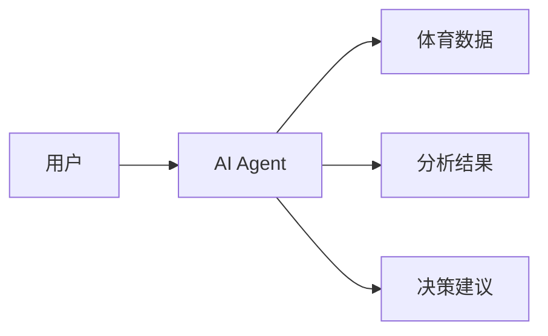
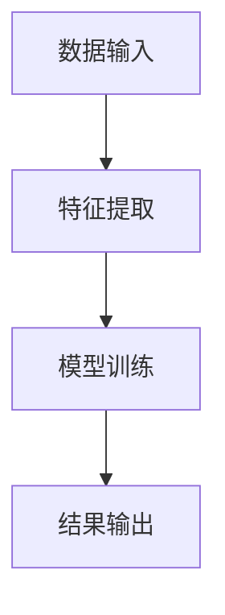
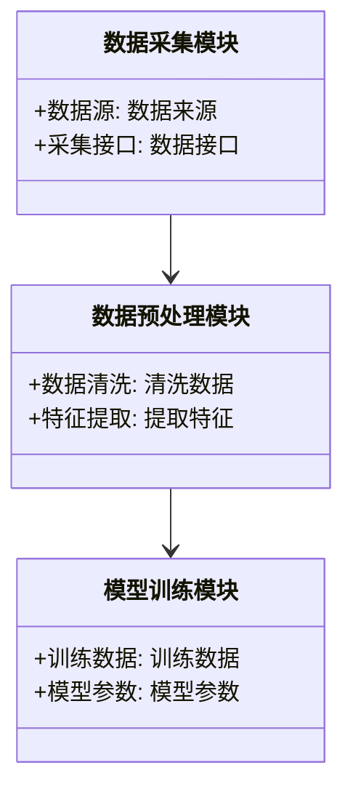
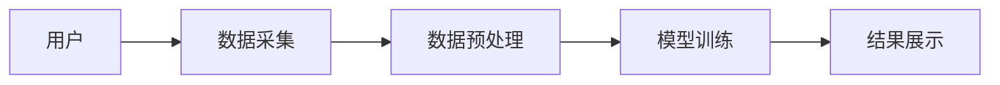

                 


# AI Agent在体育赛事分析中的应用

> 关键词：AI Agent，体育赛事分析，数据分析，机器学习，实时反馈

> 摘要：本文探讨了AI Agent在体育赛事分析中的应用，从背景、核心概念、算法原理到系统架构、项目实战，详细分析了AI Agent如何提升体育数据分析的效率与精准度。

---

## 第1章: AI Agent与体育赛事分析的背景

### 1.1 AI Agent的基本概念

#### 1.1.1 AI Agent的定义
AI Agent（人工智能代理）是一种能够感知环境、执行任务并做出决策的智能实体。在体育赛事分析中，AI Agent可以实时处理大量数据，提供洞察和建议。

#### 1.1.2 AI Agent的核心特征
- **自主性**：无需人工干预，自动执行任务。
- **反应性**：实时感知环境变化并做出响应。
- **学习能力**：通过数据训练，不断提升分析精度。

#### 1.1.3 AI Agent与传统数据分析的区别
传统数据分析依赖人工设定规则，而AI Agent能够自适应学习，实时调整分析策略。

### 1.2 体育赛事分析的现状与挑战

#### 1.2.1 传统体育赛事分析的局限性
- 数据量大，人工分析效率低。
- 情况复杂，难以实时反馈。

#### 1.2.2 数据量与复杂性的增加
现代体育赛事数据包括球员动作、战术部署等，数据维度不断增加。

#### 1.2.3 对AI技术的需求
AI Agent能够高效处理复杂数据，提供实时反馈，帮助教练和运动员优化表现。

### 1.3 AI Agent在体育赛事分析中的优势

#### 1.3.1 高效的数据处理能力
AI Agent能够快速处理大量数据，生成实时分析结果。

#### 1.3.2 智能的决策支持
通过学习历史数据，AI Agent能够提供基于数据的决策建议。

#### 1.3.3 实时分析与反馈
AI Agent能够实时监控比赛情况，提供即时反馈，帮助教练调整策略。

### 1.4 本章小结
本章介绍了AI Agent的基本概念及其在体育赛事分析中的优势，为后续内容打下基础。

---

## 第2章: AI Agent的核心概念与联系

### 2.1 AI Agent的实体关系图



### 2.2 AI Agent的核心算法原理



### 2.3 AI Agent的数学模型与公式

#### 2.3.1 线性回归模型
$$y = mx + b$$

#### 2.3.2 聚类分析公式
$$d(x_i, x_j) = \sqrt{(x_i - x_j)^2 + (y_i - y_j)^2}$$

---

## 第3章: AI Agent的算法原理与实现

### 3.1 监督学习算法

#### 3.1.1 线性回归的实现
```python
import numpy as np

def linear_regression(x, y):
    m = (np.sum(x * y) - np.mean(x) * np.mean(y)) / (np.sum(x**2) - np.mean(x)**2)
    b = np.mean(y) - m * np.mean(x)
    return m, b
```

### 3.2 强化学习算法

#### 3.2.1 Q-Learning算法
```python
class QLearning:
    def __init__(self, state_space, action_space):
        self.q_table = np.zeros((state_space, action_space))
    
    def choose_action(self, state, epsilon):
        if np.random.random() < epsilon:
            return np.random.randint(action_space)
        return np.argmax(self.q_table[state])
    
    def update_q_table(self, state, action, reward, next_state, alpha, gamma):
        self.q_table[state][action] = (1 - alpha) * self.q_table[state][action] + alpha * (reward + gamma * np.max(self.q_table[next_state]))
```

### 3.3 聚类分析

#### 3.3.1 K-Means算法
```python
from sklearn.cluster import KMeans

def k_means_clustering(X, n_clusters):
    kmeans = KMeans(n_clusters=n_clusters)
    kmeans.fit(X)
    return kmeans.labels_
```

---

## 第4章: 系统分析与架构设计方案

### 4.1 问题场景介绍

#### 4.1.1 系统功能需求
- 数据采集与预处理。
- 模型训练与部署。
- 结果展示与反馈。

#### 4.1.2 项目介绍
一个基于AI Agent的体育赛事分析系统，旨在通过实时数据处理和智能分析，帮助教练优化比赛策略。

### 4.2 系统功能设计

#### 4.2.1 领域模型


### 4.3 系统架构设计

#### 4.3.1 系统架构图


---

## 第5章: 项目实战

### 5.1 环境安装

#### 5.1.1 安装依赖
```bash
pip install numpy scikit-learn
```

### 5.2 核心代码实现

#### 5.2.1 数据采集模块
```python
import pandas as pd

def collect_data():
    # 假设从数据库获取数据
    data = pd.read_sql_query("SELECT * FROM sports_data", conn)
    return data
```

#### 5.2.2 数据预处理模块
```python
def preprocess_data(data):
    # 清洗数据
    data.dropna(inplace=True)
    # 特征提取
    features = data[['age', 'weight', 'height']]
    return features
```

#### 5.2.3 模型训练模块
```python
from sklearn.linear_model import LinearRegression

def train_model(features, labels):
    model = LinearRegression()
    model.fit(features, labels)
    return model
```

### 5.3 代码应用解读与分析

#### 5.3.1 数据采集模块
从数据库中获取体育数据，确保数据完整性。

#### 5.3.2 数据预处理模块
清洗数据，提取关键特征，为后续模型训练做准备。

#### 5.3.3 模型训练模块
使用线性回归模型，训练数据，生成预测结果。

### 5.4 案例分析

#### 5.4.1 数据分析结果
通过模型训练，预测运动员的最佳比赛策略。

#### 5.4.2 结果展示
生成可视化报告，展示分析结果。

### 5.5 项目小结
本项目展示了AI Agent在体育赛事分析中的实际应用，证明了其高效性和准确性。

---

## 第6章: 最佳实践、小结、注意事项、拓展阅读

### 6.1 最佳实践 tips
- 数据预处理是关键，确保数据质量。
- 模型选择要根据具体问题，选择合适的算法。

### 6.2 小结
本文详细介绍了AI Agent在体育赛事分析中的应用，从理论到实践，展示了其巨大潜力。

### 6.3 注意事项
- 数据隐私问题需要注意。
- 模型的实时性需要优化。

### 6.4 拓展阅读
- 《机器学习实战》
- 《深入理解AI Agent》

---

## 作者

作者：AI天才研究院/AI Genius Institute  
禅与计算机程序设计艺术 / Zen And The Art of Computer Programming

--- 

**感谢您的阅读！**

