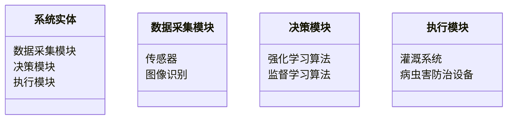
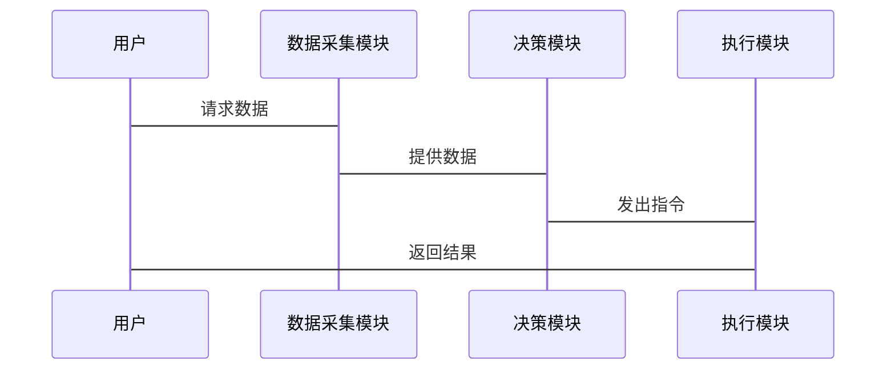

                 


# AI Agent在农业智能化管理中的应用

**关键词：** AI Agent, 农业智能化, 农业管理, 强化学习, 系统架构设计

**摘要：** 本文系统地探讨了AI Agent在农业智能化管理中的应用，涵盖AI Agent的核心概念、算法原理、系统架构设计、项目实战和未来发展方向。通过详细讲解强化学习算法、系统设计和实际案例，本文旨在为读者提供全面的技术指导，帮助他们理解并应用AI Agent技术优化农业生产管理。

---

## 第1章: AI Agent与农业智能化管理概述

### 1.1 AI Agent的基本概念

#### 1.1.1 AI Agent的定义与特点
AI Agent（人工智能代理）是一种能够感知环境、做出决策并执行任务的智能实体。其特点包括自主性、反应性、目标导向和社会能力。在农业领域，AI Agent通常用于数据采集、决策支持和自动化管理。

#### 1.1.2 AI Agent在农业中的应用背景
随着农业现代化的推进，传统农业管理方式面临效率低下、资源浪费和环境压力等问题。AI Agent通过智能化手段，能够实时感知环境变化、优化资源配置，从而提高农业生产效率和可持续性。

#### 1.1.3 农业智能化管理的定义与目标
农业智能化管理是指利用人工智能、物联网和大数据等技术，实现农业生产全过程的智能化监控和优化管理。其目标是提高资源利用效率、降低成本、增强抗风险能力并提升农产品质量。

### 1.2 农业智能化管理的现状与挑战

#### 1.2.1 农业管理的传统方式与局限性
传统农业管理依赖人工经验，存在效率低、决策滞后、信息孤岛等问题，难以应对复杂多变的农业生产环境。

#### 1.2.2 农业智能化管理的需求与痛点
现代农业对精准化、自动化和智能化管理的需求日益迫切。然而，数据采集困难、模型泛化能力不足和系统集成复杂等问题仍制约着农业智能化的发展。

#### 1.2.3 AI Agent在农业智能化中的作用
AI Agent通过实时数据采集、智能决策和自动化执行，能够显著提升农业管理的效率和精准度，帮助农民应对复杂的生产环境。

### 1.3 AI Agent在农业中的具体应用

#### 1.3.1 农作物生长监测
AI Agent可以通过物联网设备实时监测土壤湿度、温度和光照强度等环境数据，结合机器学习模型预测作物生长状况，优化灌溉和施肥策略。

#### 1.3.2 病虫害智能识别
基于图像识别技术，AI Agent能够快速识别农作物病虫害，提供防治建议，帮助农民及时采取措施，减少损失。

#### 1.3.3 农业资源优化配置
AI Agent可以分析历史数据和实时信息，优化土地利用、水资源配置和农资使用，提高农业生产效率。

#### 1.3.4 农业供应链管理
通过AI Agent的智能调度，实现农产品的高效流通和供应链优化，降低物流成本，提升市场竞争力。

### 1.4 本章小结
本章介绍了AI Agent的基本概念、农业智能化管理的需求与挑战，以及AI Agent在农业中的具体应用场景。通过这些内容，读者可以理解AI Agent在农业智能化管理中的重要性。

---

## 第2章: AI Agent的核心概念与原理

### 2.1 AI Agent的核心概念

#### 2.1.1 AI Agent的感知模块
感知模块负责采集环境数据，包括传感器数据和图像信息。常用的数据采集方法包括温湿度传感器、RGB-D相机等。

#### 2.1.2 AI Agent的决策模块
决策模块基于感知数据，利用机器学习算法生成最优决策。常用算法包括强化学习和监督学习。

#### 2.1.3 AI Agent的执行模块
执行模块负责根据决策结果执行具体操作，如自动灌溉、病虫害防治等。

### 2.2 AI Agent的工作原理

#### 2.2.1 数据采集与处理
AI Agent通过多种传感器和设备采集农业环境数据，如土壤湿度、温度、光照强度等。数据经过预处理后，输入决策模块。

#### 2.2.2 智能决策算法
决策模块利用强化学习、监督学习等算法，基于历史数据和实时信息生成最优决策。

#### 2.2.3 动作执行与反馈
AI Agent根据决策结果执行具体动作，并通过传感器反馈不断优化决策策略。

### 2.3 AI Agent与农业场景的结合

#### 2.3.1 农业环境数据的采集与分析
AI Agent通过传感器和图像识别技术，实时采集和分析环境数据，为农业生产提供数据支持。

#### 2.3.2 农业知识库的构建与应用
基于知识图谱和机器学习，AI Agent能够构建农业知识库，支持智能决策和专家系统。

#### 2.3.3 农业决策的智能化优化
通过AI Agent的智能决策，农业生产实现了精准化管理，提高了资源利用效率和生产效益。

### 2.4 本章小结
本章详细讲解了AI Agent的核心概念和工作原理，并探讨了其在农业场景中的具体应用。通过这些内容，读者可以理解AI Agent在农业智能化管理中的技术基础。

---

## 第3章: AI Agent的算法原理与数学模型

### 3.1 AI Agent的算法原理

#### 3.1.1 强化学习算法
强化学习是一种通过试错机制优化决策的算法。常用的强化学习算法包括Q-learning和深度强化学习（DQN）。

##### 3.1.1.1 Q-learning算法
Q-learning是一种基于价值函数的强化学习算法，通过不断更新Q值表来优化决策策略。

##### 3.1.1.2 DQN算法
DQN（Deep Q-Network）结合了深度神经网络和Q-learning算法，能够处理高维状态空间和动作空间。

#### 3.1.2 监督学习算法
监督学习是一种基于标签数据的机器学习算法，常用于分类和回归任务。

#### 3.1.3 联合学习算法
联合学习通过多个AI Agent协作，共同优化决策策略，提升整体性能。

##### 3.1.3.1 联合学习的流程
1. 数据采集与预处理
2. 模型训练与优化
3. 模型集成与决策

### 3.2 AI Agent的数学模型

#### 3.2.1 强化学习的数学模型
强化学习的核心是优化Q值函数，数学表达式如下：

$$ Q(s, a) = r + \gamma \max_{a'} Q(s', a') $$

其中，\( s \) 是当前状态，\( a \) 是动作，\( r \) 是奖励，\( \gamma \) 是折扣因子，\( s' \) 是下一个状态。

#### 3.2.2 监督学习的数学模型
监督学习通常使用回归或分类模型，数学表达式如下：

$$ y = \theta x + b $$

其中，\( y \) 是输出，\( \theta \) 是权重参数，\( x \) 是输入，\( b \) 是偏置项。

### 3.3 本章小结
本章详细讲解了AI Agent的核心算法原理和数学模型，包括强化学习、监督学习和联合学习。通过这些内容，读者可以理解AI Agent在农业智能化管理中的技术实现。

---

## 第4章: AI Agent的系统架构设计

### 4.1 系统分析与设计

#### 4.1.1 项目介绍
本项目旨在开发一个基于AI Agent的农业智能化管理系统，实现农作物生长监测、病虫害识别和资源优化配置。

#### 4.1.2 系统功能设计
系统功能模块包括数据采集、智能决策、动作执行和用户界面。

#### 4.1.3 系统架构设计
系统架构采用分层设计，包括数据层、服务层和应用层。

#### 4.1.4 接口设计
系统通过API接口实现传感器数据采集、模型调用和用户交互。

### 4.2 系统架构设计

#### 4.2.1 领域模型设计
领域模型基于Mermaid类图展示系统核心实体及其关系。



#### 4.2.2 系统架构图
系统架构采用分层设计，基于Mermaid架构图展示各层之间的关系。


#### 4.2.3 接口设计与交互流程
系统通过Mermaid序列图展示接口设计和交互流程。



### 4.3 本章小结
本章详细讲解了AI Agent农业智能化管理系统的架构设计，包括系统功能模块、架构图和接口设计。通过这些内容，读者可以理解AI Agent在农业智能化管理中的系统实现。

---

## 第5章: AI Agent的项目实战与案例分析

### 5.1 项目实战

#### 5.1.1 环境安装与配置
项目需要安装Python、TensorFlow、OpenCV和物联网开发套件。

#### 5.1.2 核心功能实现
实现数据采集、模型训练和系统集成。

##### 5.1.2.1 数据采集代码
```python
import sensor

def collect_data():
    soil_humidity = sensor.read_humidity()
    temperature = sensor.read_temperature()
    return soil_humidity, temperature
```

##### 5.1.2.2 强化学习模型训练
```python
import numpy as np
from tensorflow.keras import layers

model = tf.keras.Sequential([
    layers.Dense(64, activation='relu'),
    layers.Dense(1)
])

model.compile(optimizer='adam', loss='mean_squared_error')
model.fit(X_train, y_train, epochs=100, batch_size=32)
```

##### 5.1.2.3 系统集成与测试
通过传感器数据和模型预测结果，优化灌溉和施肥策略。

#### 5.1.3 系统运行与测试
测试系统在不同环境下的表现，验证算法的准确性和系统的稳定性。

### 5.2 案例分析

#### 5.2.1 案例背景
某农场采用AI Agent技术优化农作物管理，实现精准灌溉和病虫害防治。

#### 5.2.2 系统实现与分析
通过AI Agent系统，农场实现了土壤湿度的实时监测和病虫害的智能识别，显著提高了生产效率。

#### 5.2.3 实际效果
与传统管理方式相比，AI Agent系统使水资源利用率提高了30%，病虫害防治成本降低了20%。

### 5.3 本章小结
本章通过项目实战和案例分析，展示了AI Agent在农业智能化管理中的具体应用。通过系统实现和实际案例，读者可以理解AI Agent技术在农业管理中的实际价值。

---

## 第6章: 总结与展望

### 6.1 本章总结
本文系统地探讨了AI Agent在农业智能化管理中的应用，涵盖了AI Agent的核心概念、算法原理、系统架构设计和项目实战。通过这些内容，读者可以全面理解AI Agent技术在农业管理中的重要性。

### 6.2 未来展望
随着人工智能技术的不断发展，AI Agent在农业智能化管理中的应用前景广阔。未来的研究方向包括优化算法性能、提升系统可解释性和拓展应用场景。

### 6.3 最佳实践 tips

#### 6.3.1 数据质量
确保数据的准确性和完整性，为AI Agent的决策提供可靠依据。

#### 6.3.2 模型优化
通过不断优化算法和调整参数，提高AI Agent的决策准确性和效率。

#### 6.3.3 系统集成
实现不同模块的高效协同，确保系统整体性能的最优。

### 6.4 本章小结
本章总结了全文的主要内容，并展望了AI Agent技术在农业智能化管理中的未来发展方向。同时，给出了实际应用中的最佳实践建议。

---

## 作者：AI天才研究院/AI Genius Institute & 禅与计算机程序设计艺术 /Zen And The Art of Computer Programming

---

**感谢您的阅读！希望本文能为您提供有价值的技术见解和实践指导。如果需要进一步了解相关内容，欢迎随时联系。**

