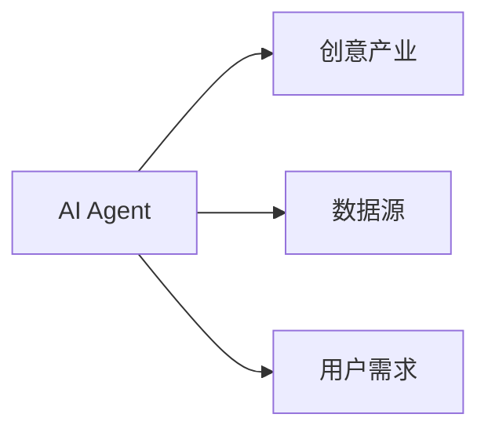
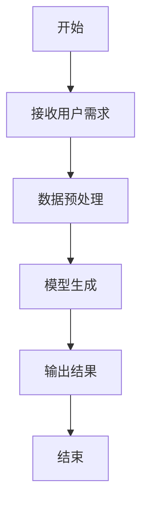
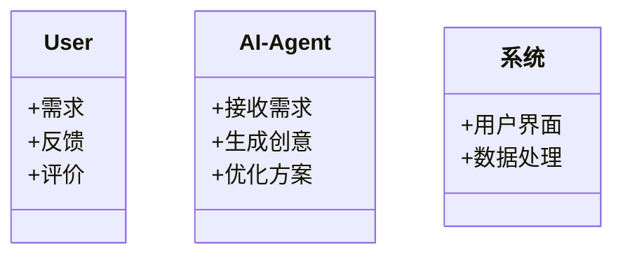
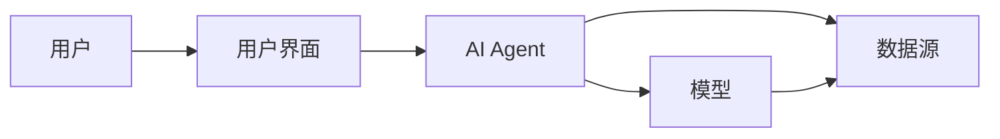
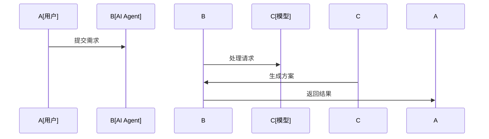

                 


# AI Agent在创意产业中的应用与限制

> 关键词：AI Agent, 创意产业, 创意生成, 人机协作, 技术限制

> 摘要：本文探讨AI Agent在广告、影视、设计等创意产业中的应用，分析其在创意生成、效率提升等方面的优势，同时揭示技术瓶颈、创意独特性、法律与伦理问题等限制，并提出优化策略与未来展望。

---

## 第一部分: 背景介绍

### 第1章: AI Agent的核心概念

#### 1.1 什么是AI Agent
- **定义**：AI Agent是一种智能实体，能够感知环境、自主决策并执行任务，以实现特定目标。
- **类型**：可编程Agent、反应式Agent、基于模型的规划Agent。
- **特点**：自主性、反应性、主动性、社会性。

#### 1.2 创意产业的定义与范围
- **创意产业**：包括广告、影视、设计、音乐等领域。
- **关键特征**：创造性、艺术性、情感共鸣。

#### 1.3 AI Agent与创意产业的结合
- **结合方式**：辅助创意生成、优化设计流程、提升效率。

### 第2章: 问题背景与描述

#### 2.1 创意产业的传统工作流程
- **现状**：依赖人工经验，效率低，创新受限。
- **痛点**：人才短缺，成本高昂，创意同质化。

#### 2.2 AI Agent的应用价值
- **优势**：24/7可用，快速迭代，海量数据处理。
- **目标**：提高效率，激发创新，降低成本。

#### 2.3 应用边界与技术限制
- **边界**：辅助而非取代人类，适用于可量化任务。
- **技术限制**：缺乏情感理解，处理复杂任务能力有限。

---

## 第二部分: 核心概念与联系

### 第3章: AI Agent的核心原理

#### 3.1 算法机制
- **生成模型**：如GPT、VAE、GAN。
- **推理引擎**：基于规则的推理或概率推理。

#### 3.2 人机协作模式
- **协同创作**：AI提供灵感，人类进行调整。
- **任务分解**：AI处理重复性任务，人类负责创意整合。

#### 3.3 创意生成过程
- **输入处理**：解析用户需求。
- **创意生成**：基于模型生成多个方案。
- **反馈优化**：根据用户反馈调整输出。

### 第4章: 实体关系图与对比分析

#### 4.1 实体关系图


#### 4.2 对比表
| 特性      | 传统方法        | AI Agent         |
|-----------|-----------------|------------------|
| 效率       | 低              | 高               |
| 创意       | 可能受限        | 更多样化          |
| 可扩展性    | 有限            | 强               |

---

## 第三部分: 算法原理讲解

### 第5章: 算法流程与代码实现

#### 5.1 算法流程图


#### 5.2 Python代码实现
```python
def creative_process(user_input):
    # 数据预处理
    processed_data = preprocess(user_input)
    # 模型生成
    result = generate(processed_data)
    return result

# 示例使用
user_input = "设计一个现代品牌标志"
output = creative_process(user_input)
print(output)
```

### 第6章: 数学模型与公式

#### 6.1 概率计算
$$ P(\text{选择创意}) = \frac{\text{创意的相关性}}{\text{总创意数}} $$

#### 6.2 损失函数
$$ L = -\sum_{i=1}^{n} y_i \log(p_i) $$

---

## 第四部分: 系统分析与架构设计

### 第7章: 系统功能设计

#### 7.1 领域模型


#### 7.2 系统架构图


### 第8章: 接口与交互设计

#### 8.1 系统接口
- **输入接口**：接收用户需求。
- **输出接口**：返回创意方案。

#### 8.2 交互流程


---

## 第五部分: 项目实战

### 第9章: 环境安装与代码实现

#### 9.1 环境安装
- Python 3.8+
- PyTorch、Hugging Face Transformers库

#### 9.2 核心代码
```python
from transformers import GPT2LMHeadModel, GPT2Tokenizer

model_name = 'gpt2-medium'
tokenizer = GPT2Tokenizer.from_pretrained(model_name)
model = GPT2LMHeadModel.from_pretrained(model_name)

def generate_creative(input_text):
    inputs = tokenizer.encode(input_text, return_tensors='pt')
    outputs = model.generate(inputs, max_length=500, temperature=0.7)
    return tokenizer.decode(outputs[0], skip_special_tokens=True)

# 示例
input_text = "设计一个环保主题的广告语"
output = generate_creative(input_text)
print(output)
```

### 第10章: 案例分析与优化

#### 10.1 应用案例
- 广告创意生成：AI生成多个广告文案，供人类选择优化。
- 视频剪辑辅助：AI建议镜头顺序和特效。

#### 10.2 性能优化
- 使用更高效的模型架构。
- 结合领域知识进行微调。

---

## 第六部分: 最佳实践与未来展望

### 第11章: 最佳实践

#### 11.1 技术优化建议
- 持续模型微调。
- 多模态模型的应用。

#### 11.2 创意协作模式
- 结合人类直觉和AI效率。
- 建立共创机制。

### 第12章: 未来展望

#### 12.1 技术趋势
- 更强的生成能力。
- 更自然的对话交互。

#### 12.2 产业影响
- 创意产业效率提升。
- 新职业的出现：AI创意指导。

---

## 作者

作者：AI天才研究院/AI Genius Institute & 禅与计算机程序设计艺术/Zen And The Art of Computer Programming

---

以上是《AI Agent在创意产业中的应用与限制》的完整目录和内容概要。接下来，我将按照上述结构撰写详细文章，确保每个部分都深入展开，涵盖背景、概念、算法、系统设计、项目实战以及未来展望。

