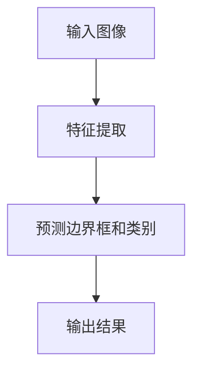
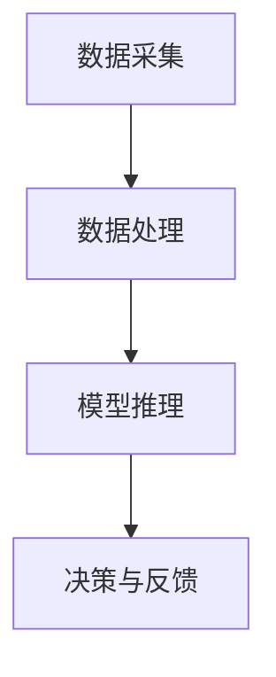

                 


# AI Agent在动物保护中的监测与追踪

## 关键词：AI Agent, 动物保护, 监测与追踪, 野生动物保护, 生态监测, 人工智能

## 摘要：
AI Agent（人工智能代理）在动物保护中的监测与追踪应用，为野生动物保护和生态监测提供了高效、精准的技术手段。本文详细探讨了AI Agent在动物保护中的核心概念、算法原理、系统架构，并通过实际案例展示了其在野生动物种群监测、反盗猎行动以及生态环境评估中的应用。文章还分析了AI Agent的优势与挑战，并提出了未来的研究方向。

---

# 第一部分: AI Agent与动物保护的背景介绍

## 第1章: AI Agent的基本概念与应用场景

### 1.1 AI Agent的核心概念
AI Agent是一种能够感知环境、自主决策并执行任务的智能实体。在动物保护领域，AI Agent可以用于监测和追踪野生动物的活动，帮助保护工作者及时发现非法捕猎、栖息地破坏等问题。

#### 1.1.1 AI Agent的定义
AI Agent是具备以下特征的智能系统：
- **自主性**：能够自主决策和执行任务。
- **反应性**：能够实时感知环境并做出反应。
- **学习能力**：能够通过数据学习和优化性能。

#### 1.1.2 AI Agent的核心特征
- **多模态感知**：能够同时处理图像、声音、地理位置等多种数据源。
- **实时性**：能够在动态环境中快速响应。
- **自适应性**：能够根据环境变化调整行为。

### 1.2 动物保护中的监测与追踪需求
野生动物保护面临以下关键问题：
- **非法捕猎**：非法猎捕和贩卖野生动物威胁物种生存。
- **栖息地破坏**：人类活动导致野生动物栖息地缩小。
- **生态平衡**：野生动物种群的动态变化需要实时监测。

#### 1.2.1 动物保护的核心问题
- 如何实时监测野生动物的活动？
- 如何快速响应非法捕猎行为？
- 如何保护濒危物种的栖息地？

#### 1.2.2 AI Agent在动物保护中的优势
- **高效性**：AI Agent能够快速处理大量数据，提高监测效率。
- **准确性**：通过深度学习算法，AI Agent能够准确识别野生动物及其行为。
- **实时性**：AI Agent可以在第一时间发现异常情况并发出警报。

---

## 第2章: AI Agent在动物保护中的应用场景

### 2.1 野生动物种群监测
AI Agent通过图像识别技术，能够自动识别和计数野生动物，帮助保护工作者了解种群动态。

#### 2.1.1 图像识别技术
AI Agent使用卷积神经网络（CNN）对野生动物图像进行分类和识别。

#### 2.1.2 种群动态分析
通过长期监测数据，AI Agent能够分析野生动物种群的变化趋势，预测潜在的生态风险。

### 2.2 反盗猎与非法捕猎监测
AI Agent结合无人机和地面传感器，实时监测保护区内的非法活动，帮助执法机构快速反应。

#### 2.2.1 无人机监测
AI Agent控制无人机在保护区上空飞行，拍摄高分辨率图像，识别非法捕猎者的活动。

#### 2.2.2 地面传感器数据融合
AI Agent整合地面传感器（如红外摄像头、声音传感器）的数据，识别非法捕猎的迹象。

### 2.3 生态环境评估与保护
AI Agent通过卫星图像和地理信息系统（GIS）分析，评估野生动物栖息地的变化，制定保护计划。

#### 2.3.1 生态环境评估
AI Agent使用卫星图像识别栖息地的退化情况，评估生态系统的健康状况。

#### 2.3.2 保护计划制定
AI Agent结合长期监测数据，提出保护濒危物种的具体措施。

---

## 第3章: AI Agent的核心算法与技术

### 3.1 图像识别算法
AI Agent使用深度学习模型进行图像识别，主要包括以下步骤：
1. **数据预处理**：对图像进行归一化、增强等处理。
2. **模型训练**：使用CNN模型（如ResNet、Faster R-CNN）训练图像分类器。
3. **目标检测**：通过YOLO等目标检测算法，识别图像中的野生动物。

#### 3.1.1 YOLO算法原理
YOLO是一种基于深度学习的目标检测算法，通过单个神经网络预测目标的位置和类别。其流程如下：



#### 3.1.2 模型训练代码示例
```python
import tensorflow as tf
from tensorflow.keras import layers

model = tf.keras.Sequential([
    layers.Conv2D(32, (3,3), activation='relu', input_shape=(224, 224, 3)),
    layers.MaxPooling2D((2,2)),
    layers.Conv2D(64, (3,3), activation='relu'),
    layers.MaxPooling2D((2,2)),
    layers.Flatten(),
    layers.Dense(128, activation='relu'),
    layers.Dense(num_classes, activation='softmax')
])

model.compile(optimizer='adam', loss='categorical_crossentropy', metrics=['accuracy'])
model.fit(train_images, train_labels, epochs=10, batch_size=32)
```

### 3.2 行为识别算法
AI Agent通过分析动物的行为模式，识别异常行为，如受伤、疾病或被猎捕。

#### 3.2.1 基于时间序列的异常检测
AI Agent使用长短期记忆网络（LSTM）分析动物行为的时间序列数据，识别异常行为。

#### 3.2.2 LSTM模型代码示例
```python
from tensorflow.keras.layers import LSTM, Dense, Dropout
from tensorflow.keras.models import Sequential

model = Sequential()
model.add(LSTM(64, return_sequences=True, input_shape=(timesteps, features)))
model.add(Dropout(0.2))
model.add(LSTM(32, return_sequences=False))
model.add(Dense(1, activation='sigmoid'))
model.compile(optimizer='adam', loss='binary_crossentropy', metrics=['accuracy'])
model.fit(X_train, y_train, epochs=5, batch_size=32)
```

### 3.3 实时监测与反馈机制
AI Agent通过边缘计算技术，实现对野生动物的实时监测和快速响应。

#### 3.3.1 边缘计算架构
AI Agent在边缘设备（如无人机、传感器节点）上部署轻量级模型，实现数据的实时处理和反馈。

---

## 第4章: 系统架构与实现

### 4.1 系统架构设计
AI Agent系统由以下几个模块组成：
1. **数据采集模块**：通过传感器、摄像头等设备采集数据。
2. **数据处理模块**：对采集到的数据进行预处理和特征提取。
3. **模型推理模块**：使用深度学习模型进行目标检测和行为识别。
4. **决策与反馈模块**：根据模型输出结果，发出警报或采取行动。

#### 4.1.1 系统架构图


### 4.2 系统实现细节
1. **数据采集**：使用无人机和地面传感器采集野生动物的图像和声音数据。
2. **数据处理**：对图像数据进行归一化、增强等处理，提取特征向量。
3. **模型推理**：部署预训练的深度学习模型，进行目标检测和行为识别。
4. **决策与反馈**：根据模型输出结果，发出警报或调整监测策略。

#### 4.2.1 系统实现代码示例
```python
import cv2
import numpy as np
from tensorflow.keras.models import load_model

# 加载预训练模型
model = load_model('animal_detector.h5')

# 读取图像数据
image = cv2.imread('input.jpg')
image = cv2.resize(image, (224, 224))
image = np.expand_dims(image, axis=0)

# 进行预测
prediction = model.predict(image)
```

---

## 第5章: 项目实战与案例分析

### 5.1 项目背景
某国家公园部署AI Agent系统，用于监测濒危物种的种群动态和反盗猎行动。

#### 5.1.1 项目目标
- 实时监测野生动物的活动。
- 及时发现并阻止非法捕猎行为。
- 保护濒危物种的栖息地。

### 5.2 项目实施步骤
1. **数据采集**：在保护区内部署摄像头和声音传感器，采集野生动物的图像和声音数据。
2. **模型训练**：使用收集到的数据训练目标检测和行为识别模型。
3. **系统部署**：在边缘设备上部署轻量级模型，实现实时监测和快速响应。

#### 5.2.1 数据采集代码示例
```python
import cv2
import time

# 初始化摄像头
cap = cv2.VideoCapture(0)

while True:
    ret, frame = cap.read()
    if not ret:
        break
    # 保存图像
    cv2.imwrite(f'frame_{time.time()}.jpg', frame)
    time.sleep(1)
```

### 5.3 案例分析
通过AI Agent系统，保护工作者能够实时监测野生动物的活动，及时发现并阻止非法捕猎行为，保护濒危物种的栖息地。

#### 5.3.1 案例结果
- 成功识别并计数多种野生动物。
- 及时发现并阻止多起非法捕猎事件。
- 为保护工作提供科学依据。

---

## 第6章: 总结与展望

### 6.1 本文总结
本文详细探讨了AI Agent在动物保护中的监测与追踪应用，分析了其在野生动物种群监测、反盗猎行动以及生态环境评估中的重要作用。

### 6.2 未来研究方向
- **模型优化**：进一步优化深度学习模型，提高识别准确率和实时性。
- **多模态融合**：结合图像、声音等多种数据源，提高监测的全面性。
- **边缘计算**：在边缘设备上部署轻量级模型，实现更低延迟的实时监测。

### 6.3 注意事项
- **数据隐私**：保护野生动物数据的隐私和安全。
- **环境适应性**：确保系统在各种复杂环境中稳定运行。
- **法律法规**：遵守相关法律法规，合法使用AI技术。

### 6.4 拓展阅读
- 《深度学习在野生动物保护中的应用》
- 《边缘计算在实时监测系统中的应用》

---

## 作者信息

作者：AI天才研究院/AI Genius Institute  
联系邮箱：contact@aicourse.org  
官方网站：https://www.aicourse.org

---

通过以上结构和内容，我们详细介绍了AI Agent在动物保护中的监测与追踪应用，展示了其在野生动物保护中的巨大潜力和实际价值。

