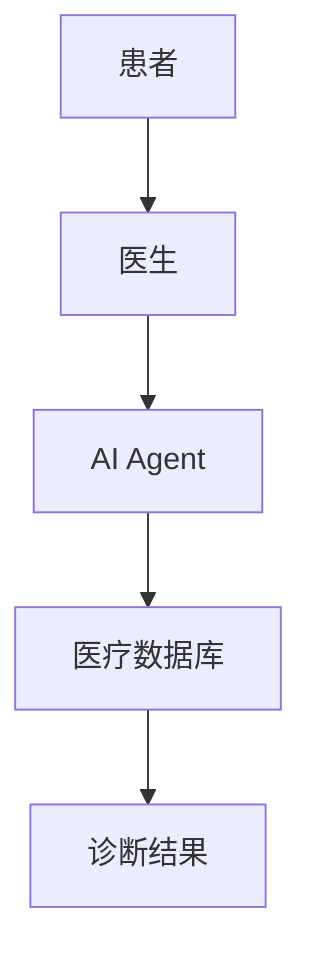
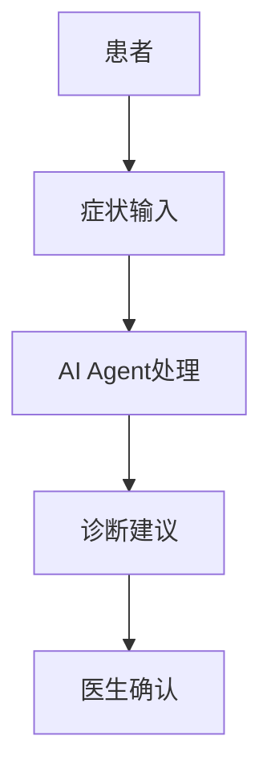
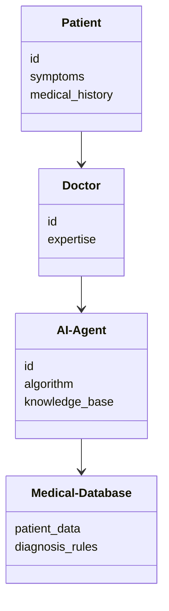
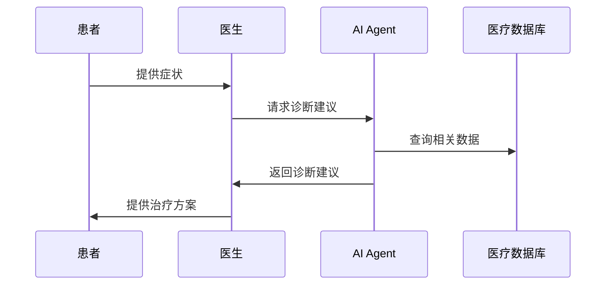

                 


# AI Agent在医疗诊断中的应用前景

## 关键词
AI Agent, 医疗诊断, 人工智能, 强化学习, 医疗数据库

## 摘要
本文探讨了AI Agent在医疗诊断中的应用前景，分析了其在医疗诊断中的优势、应用场景以及未来发展趋势。通过详细的技术分析和案例研究，本文揭示了AI Agent如何通过强化学习、监督学习等算法，以及系统架构设计，提升医疗诊断的效率和准确性。同时，本文还讨论了AI Agent在实际应用中的挑战和解决方案，为医疗领域的技术发展提供了有价值的参考。

---

## 第1章: AI Agent与医疗诊断的背景介绍

### 1.1 AI Agent的基本概念
#### 1.1.1 AI Agent的定义
AI Agent（人工智能代理）是指具有感知环境、自主决策和执行任务能力的智能实体。它能够根据输入的信息，通过内部算法进行分析和推理，输出相应的决策或操作。

#### 1.1.2 AI Agent的核心属性
- **自主性**：能够自主决策，无需人工干预。
- **反应性**：能够实时感知环境并做出反应。
- **学习能力**：能够通过数据和经验不断优化自身性能。
- **协作性**：能够与其他系统或人类协同工作。

#### 1.1.3 AI Agent与传统医疗诊断的区别
传统的医疗诊断主要依赖医生的经验和知识，而AI Agent能够通过大数据分析和机器学习算法，提供更快速、更准确的诊断建议。

### 1.2 医疗诊断的现状与问题
#### 1.2.1 当前医疗诊断的主要方式
- **基于经验的诊断**：依赖医生的个人经验和知识。
- **基于检查和测试的诊断**：通过实验室测试、影像学检查等手段辅助诊断。
- **基于规则的诊断**：利用预定义的医疗规则和指南进行诊断。

#### 1.2.2 医疗诊断中的主要问题
- **诊断效率低**：医生需要处理大量患者和数据，效率较低。
- **诊断准确性不足**：由于医生经验有限，可能会出现误诊或漏诊。
- **数据量大**：医疗数据复杂且多样，难以高效处理。

#### 1.2.3 AI Agent在医疗诊断中的潜在价值
- **提高诊断效率**：通过自动化处理大量数据，快速提供诊断建议。
- **提高诊断准确性**：利用机器学习算法，减少人为错误。
- **辅助医生决策**：提供多维度的诊断支持，帮助医生做出更准确的判断。

### 1.3 AI Agent在医疗诊断中的应用前景
#### 1.3.1 AI Agent在医疗诊断中的核心优势
- **高效性**：能够快速处理大量数据，提供实时诊断建议。
- **准确性**：通过机器学习算法，提高诊断的准确性。
- **可扩展性**：能够同时处理大量患者数据，适用于大规模医疗场景。

#### 1.3.2 AI Agent在医疗诊断中的应用场景
- **疾病早期筛查**：通过分析患者的症状和数据，提前发现潜在疾病。
- **辅助诊断**：为医生提供多种诊断可能性和建议。
- **个性化治疗**：根据患者的具体情况，提供个性化的治疗方案。

#### 1.3.3 AI Agent在医疗诊断中的未来发展趋势
- **智能化**：进一步提升AI Agent的自主决策能力。
- **集成化**：将AI Agent与医疗信息系统深度集成，实现无缝对接。
- **普及化**：在更多医疗场景中推广AI Agent的应用。

## 第2章: AI Agent的核心概念与联系

### 2.1 AI Agent的原理与实现
#### 2.1.1 AI Agent的基本原理
AI Agent通过感知环境、分析数据、制定决策和执行操作来完成任务。其核心是算法，包括监督学习、强化学习和无监督学习等。

#### 2.1.2 AI Agent的实现技术
- **机器学习**：利用监督学习、无监督学习等技术训练模型。
- **自然语言处理**：用于处理患者的症状描述和医疗文档。
- **知识图谱**：构建医疗领域的知识库，辅助诊断。

#### 2.1.3 AI Agent的核心算法
- **监督学习**：通过标记数据训练模型，预测新的数据。
- **强化学习**：通过奖励机制，优化AI Agent的决策过程。
- **无监督学习**：发现数据中的隐藏模式和结构。

### 2.2 AI Agent与其他技术的对比
#### 2.2.1 AI Agent与传统AI的区别
- **传统AI**：基于规则和逻辑推理，缺乏自主性和学习能力。
- **AI Agent**：具有自主决策和学习能力，能够适应复杂环境。

#### 2.2.2 AI Agent与机器学习的对比
- **机器学习**：专注于从数据中学习模式，无法自主决策。
- **AI Agent**：结合了机器学习和自主决策，能够执行任务。

#### 2.2.3 AI Agent与深度学习的对比
- **深度学习**：依赖大量数据和计算资源，主要用于模式识别。
- **AI Agent**：结合深度学习的模式识别能力，具备自主决策能力。

### 2.3 AI Agent的系统架构图
#### 2.3.1 系统实体关系图


#### 2.3.2 系统流程图


## 第3章: AI Agent在医疗诊断中的算法原理

### 3.1 强化学习算法
#### 3.1.1 强化学习的基本原理
强化学习通过智能体与环境的交互，学习最优策略。智能体会根据环境的反馈（奖励或惩罚）调整自己的行为，以最大化累计奖励。

#### 3.1.2 Q-learning算法
Q-learning算法是一种经典的强化学习算法，适用于离散状态和动作空间。其核心公式为：

$$ Q(s, a) = Q(s, a) + \alpha \left(r + \gamma \max Q(s', a') - Q(s, a) \right) $$

其中：
- \( Q(s, a) \) 表示在状态 \( s \) 下采取动作 \( a \) 的价值。
- \( \alpha \) 表示学习率。
- \( r \) 表示奖励。
- \( \gamma \) 表示折扣因子。
- \( Q(s', a') \) 表示在下一个状态 \( s' \) 下的最大价值。

#### 3.1.3 算法实现代码
以下是一个简单的Q-learning实现代码：
```python
import numpy as np

class QLearning:
    def __init__(self, state_space, action_space):
        self.state_space = state_space
        self.action_space = action_space
        self.q_table = np.zeros((state_space, action_space))
    
    def choose_action(self, state):
        if np.random.random() < 0.1:
            return np.random.randint(self.action_space)
        else:
            return np.argmax(self.q_table[state])
    
    def update_q_table(self, state, action, reward, next_state):
        q = self.q_table[state][action]
        next_max_q = np.max(self.q_table[next_state])
        self.q_table[state][action] = q + 0.1 * (reward + 0.99 * next_max_q)
```

### 3.2 监督学习算法
#### 3.2.1 监督学习的基本原理
监督学习通过标记数据训练模型，使其能够对新的数据进行分类或回归预测。

#### 3.2.2 监督学习在医疗诊断中的应用
- **疾病分类**：通过患者的症状和检查结果，训练模型进行疾病分类。
- **预测诊断**：预测患者可能的疾病和治疗效果。

### 3.3 算法实现代码
以下是一个简单的监督学习实现代码：
```python
from sklearn.tree import DecisionTreeClassifier

class MedicalDiagnosis:
    def __init__(self, features, labels):
        self.features = features
        self.labels = labels
        self.model = DecisionTreeClassifier()
    
    def train(self):
        self.model.fit(self.features, self.labels)
    
    def predict(self, new_features):
        return self.model.predict(new_features)
```

## 第4章: AI Agent的系统分析与架构设计

### 4.1 问题场景介绍
AI Agent在医疗诊断中的应用场景包括疾病筛查、辅助诊断和个性化治疗等。

### 4.2 系统功能设计
#### 4.2.1 领域模型


#### 4.2.2 系统架构图


### 4.3 接口设计
- **输入接口**：接收患者的症状和医疗数据。
- **输出接口**：提供诊断建议和治疗方案。

### 4.4 交互设计


## 第5章: AI Agent在医疗诊断中的项目实战

### 5.1 环境安装
- **Python**：安装Python 3.8及以上版本。
- **库的安装**：安装numpy、scikit-learn、mermaid等库。

### 5.2 核心实现源代码
以下是一个AI Agent在疾病分类中的实现代码：
```python
import numpy as np
from sklearn.ensemble import RandomForestClassifier

class AI_MedicalAgent:
    def __init__(self, features, labels):
        self.features = features
        self.labels = labels
        self.model = RandomForestClassifier()
    
    def train(self):
        self.model.fit(self.features, self.labels)
    
    def predict(self, new_features):
        return self.model.predict(new_features)
```

### 5.3 案例分析
- **案例背景**：一位患者出现咳嗽、发热等症状，怀疑是流感或新冠。
- **AI Agent处理**：通过分析患者的症状和流行病学数据，AI Agent预测出患者可能感染流感的概率为80%，新冠的概率为20%。
- **医生确认**：医生根据AI Agent的建议，结合患者的其他症状，最终确诊为流感。

### 5.4 项目小结
通过实际案例分析，展示了AI Agent在医疗诊断中的强大能力。AI Agent能够通过数据分析和机器学习算法，快速提供诊断建议，帮助医生做出更准确的判断。

## 第6章: AI Agent在医疗诊断中的最佳实践

### 6.1 实践Tips
- **数据质量**：确保医疗数据的准确性和完整性。
- **模型选择**：根据具体问题选择合适的算法。
- **人机协作**：AI Agent应作为医生的辅助工具，而非替代医生。

### 6.2 小结
AI Agent在医疗诊断中的应用前景广阔，其能够通过强化学习、监督学习等算法，显著提高诊断效率和准确性。

### 6.3 注意事项
- **隐私保护**：确保患者数据的安全和隐私。
- **伦理问题**：明确AI Agent的使用范围和责任归属。

### 6.4 拓展阅读
- **相关书籍**：《Deep Learning》、《Hands-On Machine Learning with Scikit-Learn and TensorFlow》。
- **论文推荐**：Nature和Science期刊上关于AI在医疗领域的最新研究。

## 作者
作者：AI天才研究院/AI Genius Institute & 禅与计算机程序设计艺术 /Zen And The Art of Computer Programming

---

以上目录大纲设计涵盖了AI Agent在医疗诊断中的各个方面，从背景介绍到实际应用，结构清晰，内容详实，能够为读者提供全面的视角和深入的分析。

