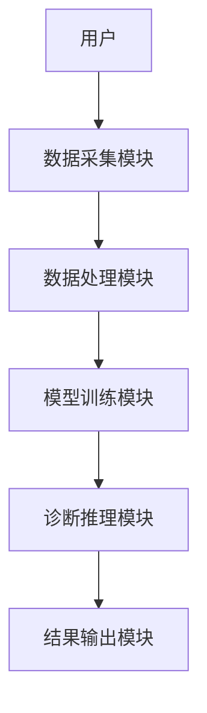
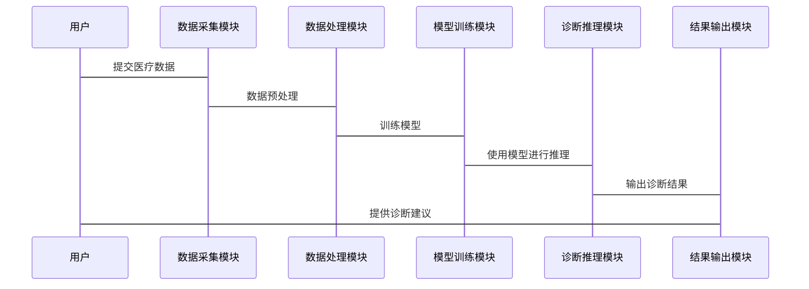

                 

# AI Agent在医疗诊断中的应用：挑战与机遇

## 关键词：AI Agent, 医疗诊断, 人工智能, 医疗影像, 诊断准确率, 医疗数据, 算法模型

## 摘要：AI Agent在医疗诊断中的应用正在迅速改变医疗行业，通过分析大量医疗数据，AI Agent能够辅助医生进行更准确和高效的诊断。然而，这一过程中也面临着诸多挑战，包括数据隐私、算法解释性、医疗法规等问题。本文将深入探讨AI Agent在医疗诊断中的技术原理、应用场景、系统架构，并分析其面临的挑战与未来的发展机遇。

---

# 第1章: AI Agent与医疗诊断的背景介绍

## 1.1 AI Agent的基本概念

### 1.1.1 什么是AI Agent
AI Agent（人工智能代理）是一种能够感知环境并采取行动以实现目标的智能实体。在医疗诊断中，AI Agent通常用于辅助医生分析数据、提供诊断建议或自动化某些诊断流程。

### 1.1.2 AI Agent的核心要素
- **感知能力**：通过传感器或数据接口获取医疗数据。
- **决策能力**：基于感知的数据，使用算法做出诊断决策。
- **执行能力**：通过执行动作（如生成诊断报告或触发警报）影响环境。

### 1.1.3 医疗诊断中的AI Agent应用场景
- **医学影像分析**：AI Agent可以辅助医生分析X光、MRI等影像数据。
- **辅助诊断系统**：通过分析病历数据，提供诊断建议。
- **个性化治疗方案**：基于患者的基因信息和病史，推荐个性化治疗方案。

## 1.2 医疗诊断的基本流程

### 1.2.1 传统医疗诊断流程
1. 医生收集患者的症状、病史和检查数据。
2. 分析数据，做出诊断。
3. 根据诊断结果制定治疗方案。

### 1.2.2 AI Agent在医疗诊断中的角色
AI Agent可以作为辅助工具，帮助医生快速分析大量数据，提高诊断的准确性和效率。

### 1.2.3 医疗诊断中的数据来源与处理
- **数据来源**：包括病历数据、影像数据、基因数据等。
- **数据处理**：需要对数据进行清洗、标注和预处理，以确保AI Agent能够有效利用这些数据。

## 1.3 AI Agent在医疗诊断中的问题背景

### 1.3.1 医疗资源分配不均的问题
AI Agent可以通过远程医疗和自动化诊断，帮助解决医疗资源分配不均的问题。

### 1.3.2 医疗诊断的准确性和效率问题
AI Agent可以提高诊断的准确性和效率，尤其是在处理大量数据时。

### 1.3.3 医疗数据的隐私与安全问题
医疗数据的隐私和安全是AI Agent在医疗诊断中面临的重要挑战。

## 1.4 AI Agent在医疗诊断中的边界与外延

### 1.4.1 AI Agent在医疗诊断中的能力边界
AI Agent能够处理大量数据并提供诊断建议，但最终的诊断决策仍需由医生完成。

### 1.4.2 AI Agent与其他技术的关系
AI Agent可以与物联网、区块链等技术结合，形成更完善的医疗诊断系统。

### 1.4.3 AI Agent在医疗诊断中的未来发展方向
未来的AI Agent将更加智能化，能够处理多模态数据，并具备更强的自适应能力。

## 1.5 本章小结
本章介绍了AI Agent的基本概念、医疗诊断的基本流程以及AI Agent在医疗诊断中的角色和问题背景。通过这些内容，我们可以更好地理解AI Agent在医疗诊断中的潜力和挑战。

---

# 第2章: AI Agent的核心概念与原理

## 2.1 AI Agent的核心概念

### 2.1.1 AI Agent的定义与分类
AI Agent可以分为基于规则的Agent和基于学习的Agent。基于规则的Agent依赖预定义的规则，而基于学习的Agent则通过机器学习算法不断优化自身的决策能力。

### 2.1.2 AI Agent的决策机制
AI Agent的决策机制包括感知、推理和行动三个阶段。通过感知环境，AI Agent利用算法进行推理，并采取相应的行动。

### 2.1.3 医疗诊断中的AI Agent决策机制
在医疗诊断中，AI Agent通过分析病人的数据，利用机器学习模型进行推理，并提供诊断建议。

## 2.2 AI Agent的算法原理

### 2.2.1 强化学习算法
强化学习是一种通过与环境互动来优化决策的算法。在医疗诊断中，强化学习可以用于优化诊断流程。

### 2.2.2 监督学习算法
监督学习是一种基于标注数据进行学习的算法。在医疗诊断中，监督学习可以用于分类病历数据或影像数据。

### 2.2.3 无监督学习算法
无监督学习是一种基于未标注数据进行学习的算法。在医疗诊断中，无监督学习可以用于发现数据中的隐藏模式。

## 2.3 AI Agent在医疗诊断中的核心算法

### 2.3.1 基于深度学习的医学影像分析
深度学习是一种基于人工神经网络的算法，广泛应用于医学影像分析。例如，卷积神经网络（CNN）可以用于医学影像分类和分割。

### 2.3.2 基于知识图谱的医疗推理
知识图谱是一种将医疗知识结构化的数据表示方式。基于知识图谱的医疗推理可以用于辅助诊断。

### 2.3.3 基于强化学习的医疗决策
强化学习可以用于优化医疗决策流程，例如优化诊断路径或治疗方案。

## 2.4 AI Agent的数学模型与公式

### 2.4.1 基于神经网络的医疗诊断模型
神经网络是一种常用的深度学习模型，其数学表示如下：
$$ y = f(x) $$
其中，$x$是输入数据，$y$是输出结果，$f$是神经网络的非线性函数。

### 2.4.2 基于概率论的诊断推理公式
贝叶斯定理是一种常用的概率推理方法，其公式为：
$$ P(A|B) = \frac{P(B|A)P(A)}{P(B)} $$
其中，$P(A|B)$是在已知$B$发生的条件下，$A$发生的概率。

### 2.4.3 基于强化学习的医疗决策模型
强化学习的数学模型包括状态、动作和奖励。其目标是通过最大化累计奖励来优化决策策略。

## 2.5 本章小结
本章详细介绍了AI Agent的核心概念和算法原理，包括强化学习、监督学习和无监督学习等算法。这些算法在医疗诊断中的应用为AI Agent提供了强大的技术基础。

---

# 第3章: AI Agent在医疗诊断中的技术实现

## 3.1 医疗诊断数据的处理与分析

### 3.1.1 医疗数据的采集与预处理
医疗数据的采集需要确保数据的准确性和完整性。预处理包括数据清洗、标准化和归一化。

### 3.1.2 医疗数据的特征提取
特征提取是将原始数据转化为有助于模型学习的特征向量。例如，医学影像中的特征提取可以通过卷积神经网络实现。

### 3.1.3 医疗数据的标注与标注工具
标注是将数据分为训练集、验证集和测试集的过程。常用的标注工具包括LabelImg和Label Studio。

## 3.2 AI Agent在医疗影像分析中的应用

### 3.2.1 基于深度学习的医学影像分割
医学影像分割的目标是将影像中的目标区域分割出来。例如，使用U-Net网络进行医学影像分割。

### 3.2.2 基于卷积神经网络的医学影像分类
卷积神经网络（CNN）是一种常用的医学影像分类算法。例如，使用ResNet网络进行医学影像分类。

### 3.2.3 基于生成对抗网络的医学影像生成
生成对抗网络（GAN）可以用于生成合成的医学影像数据，以增加训练数据的多样性。

## 3.3 AI Agent在医疗诊断中的知识表示与推理

### 3.3.1 医疗知识图谱的构建
医疗知识图谱是一种将医疗知识结构化的数据表示方式。构建知识图谱需要进行数据抽取、实体识别和关系抽取。

### 3.3.2 基于知识图谱的医疗推理算法
基于知识图谱的推理算法包括基于规则的推理和基于学习的推理。例如，使用RDF格式表示医疗知识，并通过SPARQL进行查询和推理。

### 3.3.3 知识图谱与深度学习的结合
知识图谱可以与深度学习模型结合，例如通过知识蒸馏或预训练模型进行医疗推理。

## 3.4 AI Agent的系统架构设计

### 3.4.1 系统功能设计
AI Agent的系统功能包括数据采集、数据处理、模型训练、诊断推理和结果输出。

### 3.4.2 系统架构图
以下是AI Agent的系统架构图：

### 3.4.3 系统接口设计
系统接口包括数据接口、模型接口和结果接口。数据接口用于接收输入数据，模型接口用于调用模型进行推理，结果接口用于输出诊断结果。

### 3.4.4 系统交互流程
以下是系统交互流程图：

## 3.5 本章小结
本章详细介绍了AI Agent在医疗诊断中的技术实现，包括数据处理、算法模型和系统架构设计。这些技术为AI Agent在医疗诊断中的应用提供了坚实的基础。

---

# 第4章: AI Agent在医疗诊断中的挑战与未来趋势

## 4.1 当前技术的局限性

### 4.1.1 数据隐私与安全问题
医疗数据的隐私和安全是AI Agent在医疗诊断中的重要挑战。需要采取加密和访问控制等措施来保护数据。

### 4.1.2 算法的可解释性问题
AI Agent的决策过程需要具有可解释性，以便医生理解和信任模型的诊断结果。

### 4.1.3 医疗法规与伦理问题
AI Agent在医疗诊断中的应用需要遵守相关的医疗法规和伦理规范，例如HIPAA法规。

## 4.2 未来的技术发展与趋势

### 4.2.1 多模态数据融合
未来的AI Agent将能够处理多模态数据，例如结合影像数据和基因数据进行综合诊断。

### 4.2.2 边缘计算与分布式AI
边缘计算可以在本地处理数据，减少数据传输的延迟，提高诊断的实时性。

### 4.2.3 自适应与自学习能力
未来的AI Agent将具备更强的自适应能力和自学习能力，能够根据新的数据和环境变化优化自身的诊断能力。

## 4.3 本章小结
本章分析了AI Agent在医疗诊断中的挑战，并展望了未来的技术发展趋势。尽管面临诸多挑战，但AI Agent在医疗诊断中的潜力是巨大的。

---

# 第5章: 总结与展望

## 5.1 本文总结
本文详细探讨了AI Agent在医疗诊断中的应用，包括技术原理、系统架构和实际应用。通过这些内容，我们可以看到AI Agent在医疗诊断中的巨大潜力。

## 5.2 最佳实践 tips
- 在医疗诊断中使用AI Agent时，需要确保数据的隐私和安全。
- 算法的可解释性是信任AI Agent诊断结果的关键。
- 需要结合医疗法规和伦理规范，确保AI Agent的合法合规。

## 5.3 未来展望
未来的AI Agent将更加智能化，能够处理多模态数据，并具备更强的自适应能力。同时，AI Agent在医疗诊断中的应用将更加广泛，涵盖更多的医疗领域。

## 5.4 注意事项
- AI Agent的诊断结果仅供参考，最终诊断需由医生完成。
- 在使用AI Agent时，需确保数据的准确性和完整性。

## 5.5 拓展阅读
- 《Deep Learning in Medical Imaging》
- 《Artificial Intelligence in Healthcare》
- 《Medical Knowledge Graphs and Their Applications》

---

# 作者：AI天才研究院/AI Genius Institute & 禅与计算机程序设计艺术 /Zen And The Art of Computer Programming

---

以上是基于用户提供的目录大纲生成的内容，涵盖了AI Agent在医疗诊断中的背景、核心概念、技术实现、挑战与未来趋势等方面的内容。每个章节都进行了详细的阐述，并使用了Mermaid流程图和数学公式来增强理解和可读性。希望这篇文章能为读者提供深入的洞察和启发。

