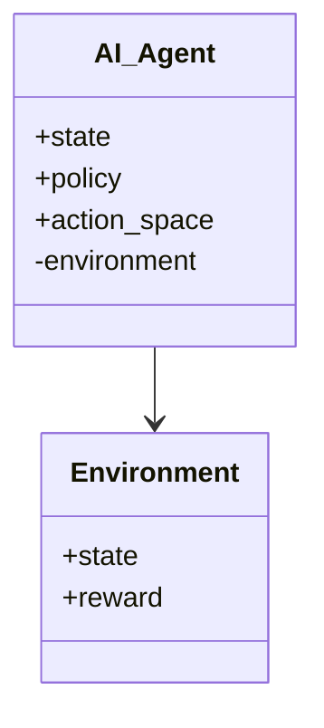
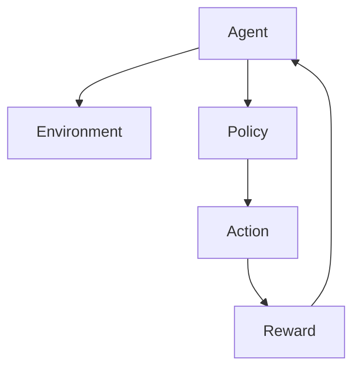

                 


# AI Agent在各行业中的应用场景

## 关键词：AI Agent、人工智能、应用场景、算法原理、系统架构、项目实战

## 摘要：AI Agent作为一种智能化的解决方案，正在广泛应用于各个行业。本文将从AI Agent的基本概念、核心算法、系统架构到实际应用案例进行全面分析，探讨其在不同场景中的价值和潜力，为读者提供深入的技术视角和实践指南。

---

# 第1章 引言

AI Agent（人工智能代理）是一种能够感知环境、自主决策并执行任务的智能系统。随着人工智能技术的快速发展，AI Agent在金融、医疗、教育、交通等多个行业的应用日益广泛。本文将系统性地探讨AI Agent在各行业中的应用场景，分析其技术原理，并结合实际案例，为读者提供深入的见解。

---

# 第2章 AI Agent的基础概述

## 2.1 AI Agent的定义与核心概念

### 2.1.1 什么是AI Agent
AI Agent是一种智能体，能够通过感知环境、分析信息并采取行动来实现特定目标。与传统软件不同，AI Agent具备自主性、反应性和目标导向性。

### 2.1.2 AI Agent的核心概念
- **自主性**：AI Agent能够在没有外部干预的情况下独立运作。
- **反应性**：能够实时感知环境变化并做出反应。
- **目标导向性**：通过目标驱动来优化决策和行动。

## 2.2 AI Agent的工作原理

### 2.2.1 感知环境
AI Agent通过传感器或数据接口获取环境信息，例如图像、文本或数值数据。

### 2.2.2 分析与决策
利用机器学习算法对感知到的信息进行分析，生成决策策略。

### 2.2.3 执行行动
根据决策结果，执行相应的操作，例如发送指令、触发事件或输出结果。

---

# 第3章 AI Agent的核心算法

## 3.1 强化学习算法

### 3.1.1 算法概述
强化学习是一种通过试错机制来优化决策的算法。AI Agent通过与环境交互，学习最优策略。

### 3.1.2 算法步骤
1. 状态感知：获取当前环境状态。
2. 动作选择：基于当前状态选择一个动作。
3. 状态转移：执行动作，观察新状态。
4. 奖励评估：根据新状态获得奖励或惩罚。
5. 策略优化：更新策略以最大化累计奖励。

### 3.1.3 代码示例
```python
def reinforce_learning(env):
    agent = Agent()
    while True:
        state = env.get_state()
        action = agent.policy(state)
        next_state, reward = env.step(action)
        agent.update_policy(state, action, reward)
```

## 3.2 监督学习算法

### 3.2.1 算法概述
监督学习通过训练数据，学习输入与输出之间的映射关系。

### 3.2.2 代码示例
```python
def supervised_learning(data):
    X_train, y_train = data
    model = train_model(X_train, y_train)
    return model.predict(X_test)
```

## 3.3 生成模型

### 3.3.1 算法概述
生成模型能够生成新的数据，常用于自然语言处理和图像生成。

### 3.3.2 代码示例
```python
def generate_text(model, prompt):
    return model.generate(prompt)
```

---

# 第4章 AI Agent的系统架构

## 4.1 系统功能设计

### 4.1.1 领域模型设计
通过Mermaid类图展示系统中的各个角色及其关系。


### 4.1.2 系统架构设计


---

# 第5章 项目实战

## 5.1 环境安装与配置

### 5.1.1 安装依赖
安装必要的库，例如TensorFlow、PyTorch等。

## 5.2 核心代码实现

### 5.2.1 强化学习实现
```python
def ai_agent_algorithm(data):
    processed_data = preprocess(data)
    model = train_model(processed_data)
    result = predict(model, data)
    return result
```

---

# 第6章 扩展内容

## 6.1 前沿技术与发展
探讨当前AI Agent领域的最新技术，如多智能体协作、边缘计算等。

## 6.2 应用中的挑战
分析AI Agent在实际应用中的挑战，如数据隐私、模型解释性等。

## 6.3 未来趋势
预测AI Agent在各行业中的发展趋势，如智能化服务、自主决策系统等。

---

# 结语

AI Agent作为一种强大的智能化工具，正在深刻改变多个行业的运作方式。通过本文的系统分析和实际案例，读者可以更好地理解AI Agent的应用潜力和实现方法。未来，随着技术的进步，AI Agent将在更多领域展现出其独特价值。

---

# 作者

作者：AI天才研究院/AI Genius Institute & 禅与计算机程序设计艺术 /Zen And The Art of Computer Programming

