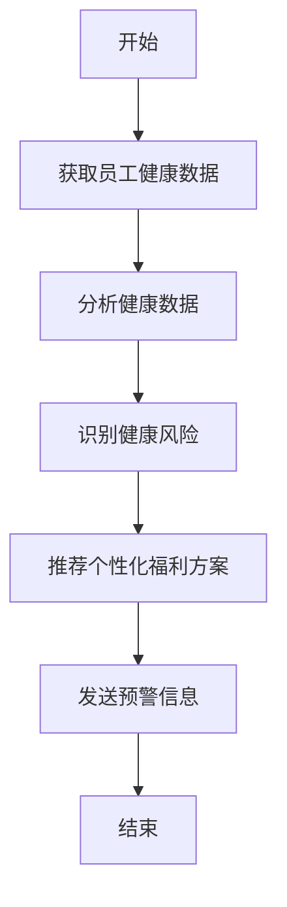
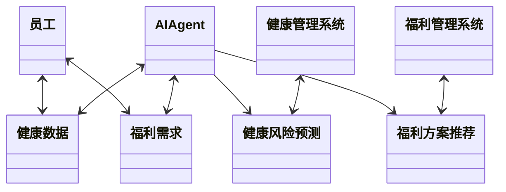
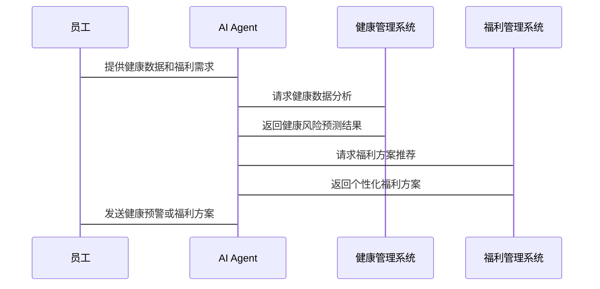

                 


# AI Agent在员工健康与福利管理中的应用前景

> 关键词：AI Agent, 员工健康, 福利管理, 人工智能, 智能系统

> 摘要：本文深入探讨了AI Agent在员工健康与福利管理中的应用前景，分析了当前管理模式的痛点与挑战，详细讲解了AI Agent的核心概念、算法原理、系统架构设计，并通过实际案例展示了AI Agent在员工健康与福利管理中的具体应用场景。文章最后总结了AI Agent在该领域的优势与未来发展方向。

---

# 第一部分: AI Agent在员工健康与福利管理中的应用背景

## 第1章: 问题背景与问题描述

### 1.1 问题背景

#### 1.1.1 员工健康与福利管理的现状
现代企业对员工的健康与福利管理日益重视，但传统的管理模式存在以下痛点：
- **数据分散**：员工健康数据（如体检报告、病历记录）和福利信息（如保险、公积金）分散在不同系统中，难以统一管理。
- **个性化需求难以满足**：员工的健康状况和福利需求千差万别，传统的标准化福利方案难以满足个性化需求。
- **管理效率低下**：手动处理健康数据和福利申请流程耗时耗力，且容易出错。

#### 1.1.2 当前管理模式的痛点与挑战
- **数据孤岛问题**：不同部门（如HR、医疗、财务）之间缺乏数据共享，导致信息重复录入和管理效率低下。
- **健康风险未及时预警**：传统管理模式难以实时监控员工健康数据，导致健康问题未能及时发现和干预。
- **福利方案缺乏智能化**：现有的福利方案通常是基于固定规则制定的，缺乏动态调整和个性化推荐能力。

#### 1.1.3 AI Agent技术的引入动机
AI Agent（人工智能代理）是一种能够感知环境、自主决策并执行任务的智能系统。引入AI Agent技术可以：
- **提高管理效率**：通过自动化处理健康数据和福利申请，减少人工干预。
- **实现个性化服务**：根据员工的健康数据和需求，提供个性化的健康建议和福利推荐。
- **实时监控与预警**：通过实时数据分析，及时发现健康风险并发出预警。

### 1.2 问题描述

#### 1.2.1 员工健康与福利管理的核心问题
- 员工健康数据的分散与不完整性。
- 福利方案的标准化与个性化需求之间的矛盾。
- 健康风险的早期预警能力不足。

#### 1.2.2 福利管理中的个性化需求
- 不同员工的福利需求（如保险、公积金、健康补贴）各不相同。
- 员工对福利方案的满意度直接影响企业的员工留存率和工作效率。

#### 1.2.3 健康管理中的数据化与智能化
- 健康数据的采集、存储和分析是健康管理的核心。
- 如何利用AI技术从海量健康数据中提取有价值的信息，为员工提供个性化的健康管理方案。

---

## 第2章: AI Agent的核心概念与技术基础

### 2.1 AI Agent的基本概念

#### 2.1.1 AI Agent的定义与分类
AI Agent是一种能够感知环境、自主决策并执行任务的智能系统。根据功能和应用场景的不同，AI Agent可以分为以下几类：
- **基于规则的AI Agent**：通过预定义的规则进行决策和执行任务。
- **基于机器学习的AI Agent**：通过机器学习算法从数据中学习决策策略。
- **基于知识图谱的AI Agent**：通过知识图谱进行推理和决策。

#### 2.1.2 AI Agent的核心技术特征
- **感知能力**：能够从环境中获取信息（如员工健康数据、福利需求）。
- **决策能力**：基于感知的信息，通过算法进行决策（如推荐福利方案、发出健康预警）。
- **执行能力**：根据决策结果执行任务（如自动调整福利方案、发送健康建议）。

#### 2.1.3 AI Agent与传统管理工具的对比
| 对比维度         | AI Agent                 | 传统管理工具           |
|------------------|--------------------------|-----------------------|
| 数据处理能力     | 强大的数据分析与挖掘能力 | 数据处理能力有限       |
| 决策能力         | 基于数据的智能决策       | 基于规则的简单决策     |
| 个性化能力       | 高度个性化               | 个性化能力有限         |
| 管理效率         | 高效自动化               | 依赖人工操作           |

### 2.2 相关技术基础

#### 2.2.1 自然语言处理（NLP）
- **应用场景**：通过NLP技术分析员工的健康咨询文本，提取关键信息。
- **技术优势**：支持多语言处理，能够理解复杂的员工需求。

#### 2.2.2 机器学习与深度学习
- **应用场景**：通过机器学习算法预测员工的健康风险，推荐个性化的福利方案。
- **技术优势**：能够从海量数据中提取非线性关系，提供更精准的预测。

#### 2.2.3 数据挖掘与分析
- **应用场景**：通过数据挖掘技术分析员工健康数据，发现潜在的健康风险。
- **技术优势**：能够从结构化和非结构化数据中提取有价值的信息。

---

## 第3章: AI Agent在员工健康与福利管理中的核心概念与联系

### 3.1 核心概念原理

#### 3.1.1 AI Agent在健康与福利管理中的核心功能
- **健康数据分析**：通过机器学习算法分析员工的健康数据，识别健康风险。
- **福利方案推荐**：基于员工的健康状况和需求，推荐个性化的福利方案。
- **实时预警与反馈**：通过实时监控员工健康数据，及时发出健康预警。

#### 3.1.2 实体关系图
```mermaid
er
  actor 员工 {
    <primitive> 员工ID
    <primitive> 健康数据
    <primitive> 福利需求
  }
  actor 福利系统 {
    <primitive> 福利方案
    <primitive> 保险信息
  }
  actor 健康管理系统 {
    <primitive> 健康报告
    <primitive> 预警信息
  }
  AI Agent {
    <primitive> 健康数据分析
    <primitive> 福利方案推荐
    <primitive> 实时预警
  }
  员工 --> AI Agent: 提供健康数据和福利需求
  AI Agent --> 福利系统: 推荐福利方案
  AI Agent --> 健康管理系统: 发出预警信息
```

---

## 第4章: AI Agent的算法原理讲解

### 4.1 算法流程图


### 4.2 Python代码实现

#### 4.2.1 数据预处理
```python
import pandas as pd

# 读取员工健康数据
data = pd.read_csv('employee_health.csv')

# 删除缺失值
data = data.dropna()

# 标准化处理
from sklearn.preprocessing import StandardScaler
scaler = StandardScaler()
data_scaled = scaler.fit_transform(data)
```

#### 4.2.2 机器学习模型训练
```python
from sklearn.model_selection import train_test_split
from sklearn.ensemble import RandomForestClassifier

# 划分训练集和测试集
X_train, X_test, y_train, y_test = train_test_split(data_scaled, data['健康风险'], test_size=0.2)

# 训练随机森林模型
model = RandomForestClassifier()
model.fit(X_train, y_train)
```

#### 4.2.3 模型预测与评估
```python
# 预测健康风险
y_pred = model.predict(X_test)

# 评估模型性能
from sklearn.metrics import classification_report
print(classification_report(y_test, y_pred))
```

### 4.3 算法的数学模型与公式

#### 4.3.1 随机森林算法
随机森林是一种基于树的集成学习算法，其核心思想是通过构建多个决策树并进行投票或平均来提高模型的准确性和鲁棒性。

#### 4.3.2 支持向量机（SVM）
支持向量机是一种监督学习算法，适用于分类和回归问题。其核心思想是将数据映射到高维空间，并在高维空间中找到一个超平面来分离不同类别的数据。

---

## 第5章: 系统分析与架构设计方案

### 5.1 问题场景介绍
AI Agent在员工健康与福利管理中的应用场景包括：
- **健康数据分析**：分析员工的健康数据，识别健康风险。
- **福利方案推荐**：根据员工的健康状况和需求，推荐个性化的福利方案。
- **实时预警与反馈**：通过实时监控员工健康数据，及时发出健康预警。

### 5.2 项目介绍
本项目旨在开发一个基于AI Agent的员工健康与福利管理系统，实现以下目标：
- 提供个性化的健康建议和福利方案。
- 实现健康数据的实时监控与预警。
- 提高员工健康管理和福利管理的效率。

### 5.3 系统功能设计

#### 5.3.1 领域模型设计


#### 5.3.2 系统架构设计


#### 5.3.3 系统接口设计
- **健康数据接口**：与企业现有的健康管理系统对接，获取员工的健康数据。
- **福利需求接口**：与企业现有的福利管理系统对接，获取员工的福利需求。
- **预警通知接口**：向员工发送健康预警信息。

#### 5.3.4 系统交互设计


---

## 第6章: 项目实战

### 6.1 环境安装与配置
```bash
pip install numpy
pip install pandas
pip install scikit-learn
pip install mermaid
```

### 6.2 核心代码实现

#### 6.2.1 健康数据分析
```python
import pandas as pd
from sklearn.ensemble import RandomForestClassifier
from sklearn.model_selection import train_test_split
from sklearn.metrics import classification_report

# 读取数据
data = pd.read_csv('employee_health.csv')

# 划分训练集和测试集
X_train, X_test, y_train, y_test = train_test_split(data.drop(columns=['健康风险']), data['健康风险'], test_size=0.2)

# 训练随机森林模型
model = RandomForestClassifier()
model.fit(X_train, y_train)

# 预测健康风险
y_pred = model.predict(X_test)

# 输出结果
print(classification_report(y_test, y_pred))
```

#### 6.2.2 福利方案推荐
```python
import pandas as pd
from sklearn.naive_bayes import GaussianNB

# 读取数据
data = pd.read_csv('employee_welfare.csv')

# 划分训练集和测试集
X_train, X_test, y_train, y_test = train_test_split(data.drop(columns=['推荐方案']), data['推荐方案'], test_size=0.2)

# 训练朴素贝叶斯模型
model = GaussianNB()
model.fit(X_train, y_train)

# 预测推荐方案
y_pred = model.predict(X_test)

# 输出结果
print(classification_report(y_test, y_pred))
```

### 6.3 案例分析与详细解读
以某企业为例，通过AI Agent系统分析员工的健康数据和福利需求，推荐个性化的健康方案和福利方案。通过实际案例展示AI Agent在提高管理效率和员工满意度方面的优势。

---

## 第7章: 总结与展望

### 7.1 总结
本文详细探讨了AI Agent在员工健康与福利管理中的应用前景，分析了当前管理模式的痛点与挑战，并通过实际案例展示了AI Agent在提高管理效率和员工满意度方面的优势。

### 7.2 展望
随着AI技术的不断发展，AI Agent在员工健康与福利管理中的应用前景将更加广阔。未来，可以通过以下方式进一步优化AI Agent的功能：
- **增强数据隐私保护**：通过加密技术和联邦学习等方法保护员工的健康数据隐私。
- **提升模型可解释性**：通过可解释的人工智能技术提高AI Agent决策的透明度和可信度。
- **扩展应用场景**：将AI Agent技术应用于更多领域，如员工绩效管理、职业发展规划等。

---

作者：AI天才研究院/AI Genius Institute & 禅与计算机程序设计艺术/Zen And The Art of Computer Programming

