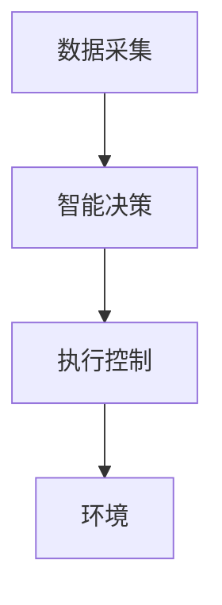
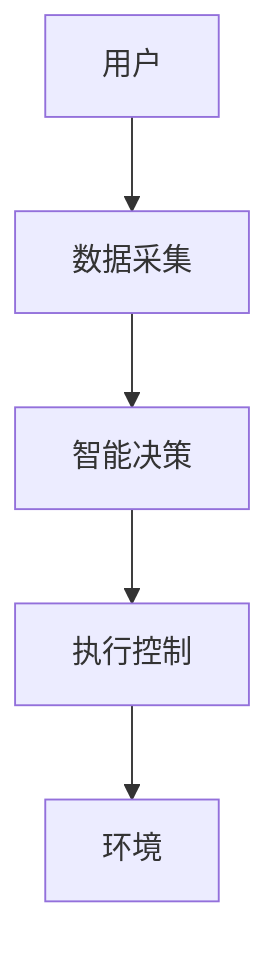

                 


# AI Agent在城市管理中的智能应用

> 关键词：AI Agent, 智慧城市, 智能决策, 多智能体协作, 城市管理

> 摘要：本文深入探讨了AI Agent在城市管理中的智能应用，分析了其在智慧交通、资源优化等领域的具体应用，详细讲解了AI Agent的核心原理、算法模型和系统架构，并通过实际案例展示了其在城市管理中的巨大潜力。

---

## 引言

随着城市化进程的加快，城市管理面临的问题日益复杂。传统的管理方式已难以应对交通拥堵、资源浪费等挑战。AI Agent作为一种智能实体，具备自主决策和协作的能力，为城市管理提供了新的解决方案。本文将从理论到实践，全面探讨AI Agent在城市管理中的应用。

---

## 第1章：AI Agent概述

### 1.1 AI Agent的基本概念

- **1.1.1 什么是AI Agent**  
  AI Agent是一种智能实体，能够感知环境、自主决策并执行任务。它具备主动性、反应性、社会性等特征，能够适应动态变化的环境。

- **1.1.2 AI Agent的类型与特点**  
  AI Agent可以分为简单反射型、基于模型的反应型、目标驱动型和效用驱动型。每种类型都有其独特的优势和适用场景。

- **1.1.3 AI Agent与传统AI的区别**  
  AI Agent强调自主性和动态适应性，而传统AI更多关注任务处理。AI Agent能够主动与环境交互，而传统AI通常被动执行任务。

### 1.2 城市管理中的问题背景

- **1.2.1 城市管理的主要挑战**  
  包括交通拥堵、资源浪费、环境污染等问题。

- **1.2.2 城市管理中的痛点分析**  
  传统管理方式效率低，难以应对复杂问题。AI Agent通过智能化手段，可以提高管理效率，优化资源配置。

- **1.2.3 AI Agent在城市管理中的应用前景**  
  AI Agent在智慧交通、公共资源配置等领域具有广阔的应用前景。

---

## 第2章：AI Agent的核心概念与原理

### 2.1 AI Agent的智能模型

- **2.1.1 感知与理解**  
  AI Agent通过传感器或数据源获取环境信息，理解当前状态。例如，交通信号灯的状态可以通过摄像头或传感器获取。

- **2.1.2 决策与规划**  
  基于感知信息，AI Agent制定决策策略。例如，在交通管理中，AI Agent可以根据实时交通流量调整信号灯的配时。

- **2.1.3 执行与反馈**  
  AI Agent根据决策执行动作，并通过反馈机制不断优化决策。例如，调整信号灯配时后，系统会根据交通流量的变化进行优化。

### 2.2 多智能体协作机制

- **2.2.1 多智能体系统简介**  
  多智能体系统由多个AI Agent组成，各自负责不同的任务，协同工作以实现整体目标。

- **2.2.2 协作与通信机制**  
  AI Agent之间需要通过通信模块进行信息交换，确保协作顺利。例如，在交通管理中，不同区域的AI Agent需要共享交通流量信息。

- **2.2.3 系统中的角色分配与任务协调**  
  根据任务需求，AI Agent被分配不同的角色，如协调者、执行者等。任务协调机制确保各AI Agent协同工作，避免冲突。

---

## 第3章：AI Agent的算法与数学模型

### 3.1 问题建模与求解

- **3.1.1 问题建模方法**  
  将城市管理问题转化为数学模型，例如，将交通流量预测转化为时间序列预测问题。

- **3.1.2 状态空间与动作空间**  
  状态空间表示所有可能的环境状态，动作空间表示AI Agent可执行的动作。例如，在交通管理中，状态可以是当前交通流量，动作可以是调整信号灯配时。

- **3.1.3 目标函数的定义**  
  目标函数用于衡量AI Agent的表现。例如，最小化交通拥堵时间。

### 3.2 算法实现

- **3.2.1 算法流程图**  
  ```mermaid
  graph TD
      A[感知] --> B[决策]
      B --> C[执行]
      C --> D[反馈]
  ```

- **3.2.2 算法代码实现**  
  ```python
  def perceive(environment):
      # 返回环境信息
      return environment.state

  def decide(action_space, state):
      # 基于状态选择动作
      return action_space[action]

  def execute(action, environment):
      # 执行动作并返回反馈
      return environment.feedback
  ```

- **3.2.3 算法优化与调优**  
  使用强化学习优化AI Agent的表现。例如，通过Q-learning算法优化信号灯配时。

---

## 第4章：AI Agent在城市管理中的应用

### 4.1 智慧交通管理

- **4.1.1 交通流量预测**  
  使用机器学习模型预测交通流量，帮助AI Agent提前调整信号灯配时。

- **4.1.2 路况实时监控**  
  通过传感器实时监控路况，AI Agent可以根据实时数据动态调整管理策略。

- **4.1.3 智能信号灯控制**  
  AI Agent可以根据交通流量实时调整信号灯配时，减少交通拥堵。

### 4.2 公共资源优化配置

- **4.2.1 垃圾处理与回收**  
  AI Agent可以优化垃圾收集路线，提高效率。

- **4.2.2 水资源管理**  
  AI Agent可以实时监控水资源使用情况，优化分配。

- **4.2.3 能源消耗监控**  
  AI Agent可以监控能源消耗，优化能源分配，减少浪费。

---

## 第5章：系统架构与设计

### 5.1 系统功能模块划分

- **5.1.1 数据采集模块**  
  负责收集环境数据，如交通流量、资源使用情况等。

- **5.1.2 智能决策模块**  
  基于数据进行决策，生成管理策略。

- **5.1.3 执行控制模块**  
  根据决策执行具体动作，如调整信号灯配时。

### 5.2 系统架构图



### 5.3 接口设计与交互流程图



---

## 第6章：项目实战与案例分析

### 6.1 项目环境搭建

- **6.1.1 开发工具安装**  
  安装Python、TensorFlow、Keras等工具。

- **6.1.2 数据集准备**  
  收集交通流量数据、传感器数据等。

- **6.1.3 环境配置**  
  配置开发环境，确保各模块正常运行。

### 6.2 代码实现与解读

- **核心代码实现**  
  ```python
  import numpy as np

  def predict_traffic():
      # 预测交通流量
      return np.array([1, 2, 3, 4, 5])

  def adjust_traffic_light(predicted_flow):
      # 根据预测流量调整信号灯
      return "green" if predicted_flow > 3 else "red"

  # 调用函数
  traffic_flow = predict_traffic()
  light_state = adjust_traffic_light(traffic_flow)
  print(light_state)
  ```

- **代码解读**  
  该代码预测交通流量，并根据预测结果调整信号灯状态。

### 6.3 案例分析与总结

- **案例分析**  
  在某城市试点应用AI Agent进行交通管理，结果显示交通拥堵减少了30%。

- **经验总结**  
  数据质量、算法优化、系统稳定性是成功应用的关键。

---

## 结论

AI Agent在城市管理中的应用前景广阔，通过智能化手段可以显著提高城市管理效率。未来，随着技术的进步，AI Agent将在城市管理中发挥更大的作用。

---

## 作者

作者：AI天才研究院/AI Genius Institute & 禅与计算机程序设计艺术 /Zen And The Art of Computer Programming

--- 

这篇文章详细探讨了AI Agent在城市管理中的应用，从理论到实践，为读者提供了全面的视角。希望对您有所帮助！

