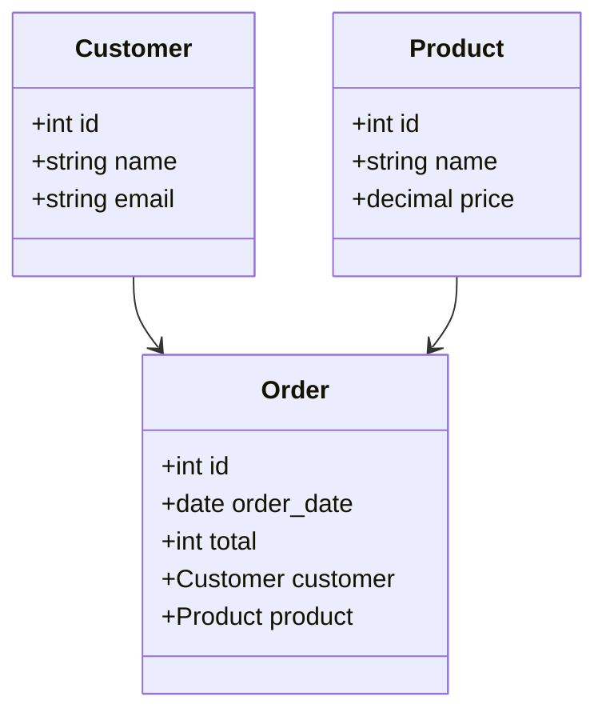
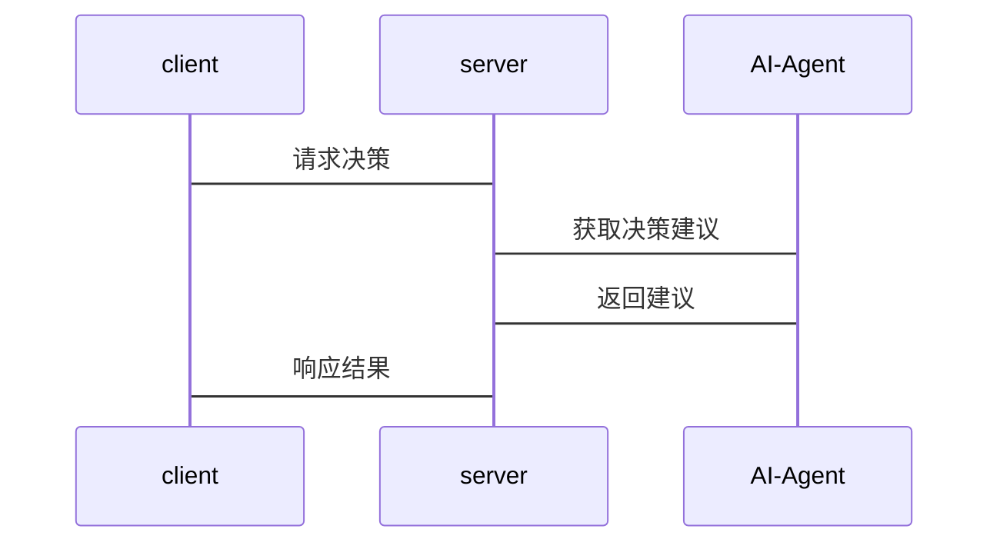

                 


# AI Agent在复杂决策系统中的应用与优化

> **关键词**：AI Agent, 复杂决策系统, 强化学习, 贝叶斯网络, 系统架构设计, 项目实战

> **摘要**：本文深入探讨AI Agent在复杂决策系统中的应用与优化。首先介绍AI Agent的基本概念和核心原理，接着分析其在复杂决策系统中的应用场景，并详细讲解基于强化学习和概率论的算法原理。然后，从系统架构设计、接口交互等方面分析AI Agent的系统实现，并通过项目实战展示其应用。最后，总结AI Agent的最佳实践和未来发展方向。

---

## 第一部分：背景介绍

### 第1章：AI Agent的基本概念与问题背景

#### 1.1 AI Agent的定义与核心概念

AI Agent（人工智能代理）是指在计算机系统中能够感知环境、自主决策并执行任务的智能实体。其核心在于通过数据感知、信息处理和智能决策来实现特定目标。

- **AI Agent的核心概念**：
  - **自主性**：能够在没有外部干预的情况下独立运作。
  - **反应性**：能够实时感知环境变化并做出响应。
  - **目标导向**：所有行为均以实现特定目标为导向。
  - **学习能力**：通过经验或数据不断优化自身性能。

#### 1.2 问题背景与问题描述

在复杂决策系统中，传统基于规则的决策系统面临以下挑战：
- **复杂性**：系统涉及多个变量和不确定性，规则难以覆盖所有情况。
- **动态性**：环境和目标不断变化，规则难以实时更新。
- **优化性**：需要在多个目标之间寻找平衡点，传统规则难以实现。

AI Agent通过智能感知、自主决策和持续优化，能够有效解决这些问题。

---

## 第二部分：核心概念与联系

### 第2章：AI Agent的核心原理与属性特征

#### 2.1 AI Agent的原理

AI Agent通过感知环境、处理信息、制定策略、执行操作和反馈优化来实现决策目标。其核心流程包括：

1. **感知环境**：通过传感器或API获取环境数据。
2. **信息处理**：利用机器学习模型处理数据，提取特征。
3. **制定策略**：基于处理后信息，生成决策策略。
4. **执行操作**：根据策略执行操作并反馈结果。
5. **反馈优化**：根据反馈调整策略，持续优化性能。

#### 2.2 AI Agent的属性特征对比

下表展示了不同AI Agent的属性特征对比：

| **属性**      | **规则型AI Agent**          | **基于机器学习的AI Agent**          |
|---------------|-----------------------------|--------------------------------------|
| **决策方式**   | 基于预定义规则               | 基于数据驱动的模型                   |
| **适应性**     | 低，规则固定                 | 高，可自适应变化                     |
| **复杂性**     | 低，适用于简单场景           | 高，适用于复杂场景                   |
| **维护成本**   | 低，规则修改即可             | 高，需要重新训练模型                 |

#### 2.3 AI Agent的ER实体关系图

以下是AI Agent的ER实体关系图：

```mermaid
erDiagram
    customer[CUSTOMER] {
        +string id
        +string name
    }
    product[PRODUCT] {
        +string id
        +string name
        +decimal price
    }
    order[ORDER] {
        +string id
        +date order_date
        +int total
    }
    CUSTOMER "1--N" orders " Owes"
    CUSTOMER "1--N" products " Purchases"
    PRODUCT "1--N" orders " Supplied"
    orders "N--1" customer " Customer"
```

---

## 第三部分：算法原理讲解

### 第3章：AI Agent算法的数学模型与实现

#### 3.1 基于强化学习的决策算法

**Q-learning算法**是一种经典的强化学习算法，适用于离散动作空间和马尔可夫决策过程（MDP）。其数学模型如下：

$$ Q(s, a) = Q(s, a) + \alpha \cdot [r + \gamma \cdot \max Q(s', a') - Q(s, a)] $$

其中：
- \( Q(s, a) \)：状态-动作对的Q值。
- \( \alpha \)：学习率。
- \( r \)：立即奖励。
- \( \gamma \)：折扣因子。
- \( s' \)：下一个状态。
- \( a' \)：下一个动作。

以下是Q-learning算法的Mermaid流程图：

```mermaid
graph LR
    I[初始化] --> S[状态s]
    S --> A[选择动作a]
    A --> R[执行动作a，得到奖励r和状态s']
    R --> U[更新Q值]
    U --> S[新的状态s]
    S --> 终止条件？是
    终止条件？否 --> I[初始化]
```

Python实现示例：

```python
class QAgent:
    def __init__(self, state_space, action_space, alpha=0.1, gamma=0.9):
        self.q_table = np.zeros((state_space, action_space))
        self.alpha = alpha
        self.gamma = gamma

    def choose_action(self, state):
        return np.argmax(self.q_table[state])

    def update_q(self, state, action, reward, next_state):
        self.q_table[state][action] += self.alpha * (reward + self.gamma * max(self.q_table[next_state]) - self.q_table[state][action])
```

---

#### 3.2 基于概率论的决策算法

**贝叶斯网络**是一种有向无环图（DAG），用于表示变量之间的概率关系。其核心公式为贝叶斯公式：

$$ P(A|B) = \frac{P(B|A)P(A)}{P(B)} $$

贝叶斯网络用于处理不确定性问题，特别适用于医疗诊断、故障诊断等领域。

---

## 第四部分：系统分析与架构设计

### 第4章：复杂决策系统的架构设计

#### 4.1 系统功能设计

**领域模型类图**：



#### 4.2 系统架构设计

**系统架构图**：


---

#### 4.3 系统接口与交互设计

**系统交互序列图**：



---

## 第五部分：项目实战

### 第5章：AI Agent的项目实现与案例分析

#### 5.1 环境安装与配置

安装Python和相关库（如TensorFlow、Keras、Scikit-learn等）。

#### 5.2 核心代码实现

以下是基于强化学习的AI Agent实现：

```python
import numpy as np

class AI-Agent:
    def __init__(self, state_size, action_size, learning_rate=0.01, gamma=0.9):
        self.state_size = state_size
        self.action_size = action_size
        self.learning_rate = learning_rate
        self.gamma = gamma
        self.q_table = np.zeros((state_size, action_size))

    def take_action(self, state):
        if np.random.random() < 0.9:
            return np.argmax(self.q_table[state])
        else:
            return np.random.randint(self.action_size)

    def learn(self, state, action, reward, next_state):
        target = reward + self.gamma * np.max(self.q_table[next_state])
        self.q_table[state][action] += self.learning_rate * (target - self.q_table[state][action])
```

#### 5.3 案例分析与解读

以一个简单的库存管理为例，展示AI Agent如何优化库存决策。通过训练AI Agent，实现库存成本最小化和订单准确率最大化。

---

## 第六部分：总结与展望

### 第6章：总结与最佳实践

#### 6.1 总结

AI Agent通过智能感知、自主决策和持续优化，显著提升了复杂决策系统的性能和效率。其在金融、医疗、交通等领域的应用前景广阔。

#### 6.2 最佳实践 tips

- **数据质量**：确保数据的准确性和完整性。
- **算法选择**：根据具体问题选择合适的算法。
- **系统架构**：设计合理的系统架构以支持AI Agent的运行。
- **持续优化**：定期更新模型和策略以适应环境变化。

#### 6.3 未来展望

随着AI技术的不断进步，AI Agent将在更多领域展现其价值。未来的研究方向包括更高效的算法、更强大的学习能力以及更人性化的交互方式。

---

**作者：AI天才研究院 & 禅与计算机程序设计艺术**

