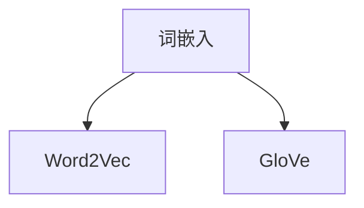
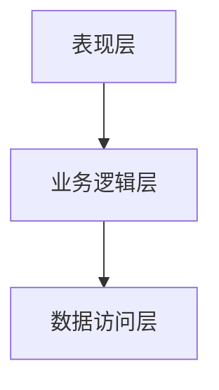
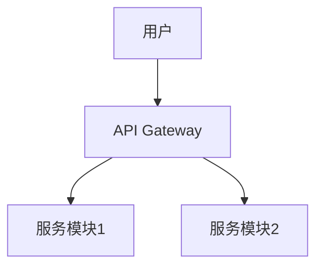

                 


# AI Agent在客户服务中的革新作用

**关键词**：AI Agent, 客户服务, 自然语言处理, 机器学习, 人工智能, 决策优化

**摘要**：随着人工智能技术的快速发展，AI Agent正在 revolutionize 客户服务行业。本文深入探讨AI Agent的核心概念、技术原理及其在客户服务中的应用场景，分析其革新作用，并结合实际案例展示其在提升客户体验和企业效率方面的巨大潜力。

---

# 第一部分: AI Agent 在客户服务中的背景与概念

## 第1章: AI Agent 的基本概念与背景

### 1.1 AI Agent 的定义与核心概念

#### 1.1.1 AI Agent 的定义
AI Agent（人工智能代理）是一种能够感知环境、自主决策并执行任务的智能系统。它通过与用户交互，理解需求并提供相应的服务，从而实现自动化和智能化的客户服务。

#### 1.1.2 AI Agent 的核心属性与特征

| 特性 | 描述 |
|------|------|
| 智能性 | 能够理解用户需求并提供解决方案 |
| 自主性 | 能够独立运行，无需人工干预 |
| 反应性 | 能够实时响应用户输入并调整行为 |

#### 1.1.3 AI Agent 的分类与应用场景

##### 分类：
1. **基于规则的AI Agent**：根据预定义的规则进行响应，适用于简单场景。
2. **基于学习的AI Agent**：通过机器学习模型进行决策，适用于复杂场景。

##### 应用场景：
1. **客服咨询**：解答用户问题，提供产品信息。
2. **售后服务**：处理投诉、反馈和订单跟踪。
3. **销售支持**：提供个性化推荐，促进销售。

### 1.2 AI Agent 在客户服务中的作用

#### 1.2.1 客户服务的定义与传统模式
- **定义**：客户服务是指企业通过各种渠道为客户提供支持和解决方案，以提升客户满意度和忠诚度。
- **传统模式**：依赖人工客服，效率低、成本高，且难以覆盖24/7的需求。

#### 1.2.2 AI Agent 如何革新客户服务
- **自动化响应**：7x24小时实时响应，无需人工值守。
- **个性化服务**：基于用户行为和偏好提供定制化服务。
- **高效问题解决**：通过智能分析快速定位问题并提供解决方案。

#### 1.2.3 AI Agent 在客户服务中的核心价值
- **提升客户满意度**：快速、准确地解决问题。
- **降低企业成本**：减少人工客服需求，提高运营效率。
- **增强客户忠诚度**：通过个性化服务提升客户体验。

### 1.3 AI Agent 的技术基础

#### 1.3.1 自然语言处理（NLP）技术
- **分词**：将文本分割成词语或短语。
- **语义理解**：理解文本的含义和上下文。
- **情感分析**：识别用户情感倾向。

#### 1.3.2 机器学习与深度学习
- **机器学习**：通过数据训练模型，使其能够识别模式并做出预测。
- **深度学习**：利用多层神经网络进行特征提取和模式识别。

#### 1.3.3 强化学习与决策优化
- **强化学习**：通过试错机制优化决策策略。
- **决策树**：基于规则的决策路径，用于分类和预测。

---

# 第二部分: AI Agent 的核心原理与技术

## 第2章: AI Agent 的核心算法与数学模型

### 2.1 自然语言处理（NLP）算法

#### 2.1.1 词嵌入（Word Embedding）
- **Word2Vec**：通过上下文预测单词，生成词向量。
- **GloVe**：基于全局词频统计生成词向量。



#### 2.1.2 注意力机制（Attention）
- **Transformer模型**：通过注意力机制捕捉序列中的重要信息。

$$\text{Attention}(Q, K, V) = \text{softmax}\left(\frac{QK^T}{\sqrt{d_k}}\right)V$$

#### 2.1.3 Transformer 模型
- **结构**：编码器-解码器架构，用于机器翻译、文本生成。

### 2.2 决策推理算法

#### 2.2.1 状态空间与动作空间
- **状态空间**：系统当前的状态表示。
- **动作空间**：系统可以执行的动作列表。

#### 2.2.2 Q-Learning 算法
- **Q函数**：$Q(s, a) = r + \gamma \max_a Q(s', a)$
- **步骤**：
  1. 确定当前状态$s$。
  2. 选择动作$a$。
  3. 执行动作，获得奖励$r$和新状态$s'$。
  4. 更新Q值：$Q(s, a) = Q(s, a) + \alpha (r + \gamma \max_a Q(s', a) - Q(s, a))$

#### 2.2.3 强化学习在决策中的应用
- **应用场景**：复杂决策问题，如动态定价、资源分配。

### 2.3 模型训练与优化

#### 2.3.1 梯度下降（Gradient Descent）
- **公式**：$\theta = \theta - \eta \nabla L$
- **作用**：优化模型参数，最小化损失函数。

#### 2.3.2 模型调优与超参数优化
- **超参数**：学习率、批量大小、正则化参数。

#### 2.3.3 集成学习与模型融合
- **集成方法**：投票法、加权平均，提升模型鲁棒性。

---

## 第3章: AI Agent 的系统架构与设计

### 3.1 系统功能设计

#### 3.1.1 客户交互模块
- **功能**：接收用户输入，解析需求。
- **流程**：用户输入 -> 解析 -> 转发到处理模块。

#### 3.1.2 自然语言理解模块
- **功能**：理解用户意图，提取实体。
- **工具**：分词、词性标注、实体识别。

#### 3.1.3 决策与执行模块
- **功能**：基于理解生成响应。
- **逻辑**：根据意图选择合适的处理流程。

### 3.2 系统架构设计

#### 3.2.1 分层架构设计
- **表现层**：用户界面，接收输入和显示输出。
- **业务逻辑层**：处理业务逻辑，调用数据访问层。
- **数据访问层**：与数据库交互，存储和检索数据。



#### 3.2.2 微服务架构设计
- **服务模块**：独立的服务单元，如NLP服务、决策服务。
- **通信方式**：通过API进行服务调用。



### 3.3 系统接口设计

#### 3.3.1 API 接口定义
- **RESTful API**：标准的HTTP方法（GET, POST, PUT, DELETE）。

#### 3.3.2 数据流与交互流程
- **流程**：用户请求 -> API Gateway -> 后端服务 -> 返回响应。

#### 3.3.3 接口安全与权限控制
- **认证**：使用JWT进行身份验证。
- **授权**：基于角色的访问控制（RBAC）。

---

# 第三部分: AI Agent 在客户服务中的应用实践

## 第4章: AI Agent 的项目实战

### 4.1 项目背景与目标

#### 4.1.1 项目需求分析
- **目标**：开发一个智能客服机器人，提升客户满意度和效率。
- **范围**：支持文本交互，处理常见问题，提供个性化推荐。

### 4.2 项目核心实现

#### 4.2.1 环境搭建与工具安装
- **工具**：Python 3.8+, TensorFlow 2.0+, Keras, Flask。

#### 4.2.2 核心代码实现

##### NLP处理模块
```python
import numpy as np
from tensorflow.keras.models import load_model

class NLPProcessor:
    def __init__(self, model_path):
        self.model = load_model(model_path)
    
    def process(self, text):
        # 分词
        words = self.tokenizer(text)
        # 词嵌入
        embeddings = self.embedding_layer(words)
        # 意图识别
        intent = self.model.predict(embeddings)
        return intent
```

##### 决策模块
```python
class DecisionMaker:
    def decide(self, intent, context):
        if intent == '查询订单':
            return self.get_order_status(context['order_id'])
        elif intent == '投诉':
            return self.handle_complaint(context['issue'])
```

#### 4.2.3 代码应用解读与分析
- **NLP模块**：处理用户输入，生成词向量，进行意图分类。
- **决策模块**：根据意图和上下文，选择合适的处理逻辑。

### 4.3 项目案例分析

#### 案例分析
- **场景**：用户咨询产品问题。
- **流程**：用户输入问题 -> NLP模块解析意图 -> 决策模块调用知识库 -> 返回答案。

#### 项目小结
- **成果**：成功实现智能客服机器人，显著提升客户满意度。
- **挑战**：模型准确率需进一步优化，复杂问题的处理能力有限。

---

# 第五章: 总结与展望

## 5.1 AI Agent的优势与挑战

### 5.1.1 优势
- **24/7可用性**：全天候服务，提升客户体验。
- **个性化服务**：基于用户数据提供定制化解决方案。
- **高效问题解决**：快速响应，提高服务效率。

### 5.1.2 挑战
- **数据隐私**：用户数据的安全性问题。
- **模型可解释性**：复杂的决策过程难以解释。
- **应对复杂场景**：目前在处理复杂问题时仍有局限。

## 5.2 未来发展趋势

### 5.2.1 技术趋势
- **更先进的NLP模型**：如GPT-3、GPT-4，提升生成能力和理解能力。
- **多模态交互**：结合视觉、语音等多种交互方式，提供更丰富的用户体验。
- **自适应学习**：模型能够实时更新，适应不断变化的用户需求和环境。

### 5.2.2 应用趋势
- **行业扩展**：从客服扩展到更多领域，如金融、医疗、教育。
- **智能化升级**：AI Agent将更加智能化，具备更强的自主决策能力。
- **生态系统整合**：与企业现有系统和平台深度集成，提供无缝化服务体验。

## 5.3 最佳实践与建议

### 5.3.1 数据安全
- **数据加密**：对用户数据进行加密存储和传输，确保数据安全。
- **隐私保护**：遵守数据隐私法规，如GDPR，保护用户隐私。

### 5.3.2 用户体验
- **交互设计**：设计直观易用的界面，提升用户体验。
- **反馈机制**：提供反馈渠道，及时收集用户意见，持续优化服务。

### 5.3.3 伦理问题
- **伦理规范**：确保AI Agent的行为符合伦理规范，避免潜在的伦理风险。
- **透明度**：提高决策过程的透明度，增强用户信任。

---

# 作者

作者：AI天才研究院/AI Genius Institute & 禅与计算机程序设计艺术 /Zen And The Art of Computer Programming

---

# 结束语

通过本文的详细讲解，我们可以看到AI Agent在客户服务中的革新作用，以及其背后的技术原理和应用场景。随着AI技术的不断进步，AI Agent将在未来发挥更大的作用，为企业和客户带来更多的价值。

