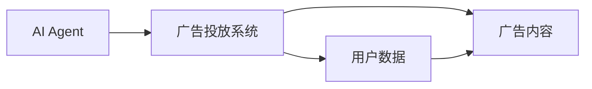
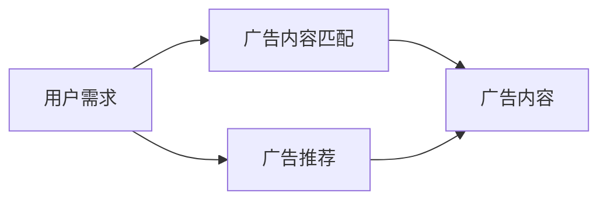

                 


# AI Agent在广告投放中的精准定位

> 关键词：AI Agent，广告投放，精准定位，推荐算法，用户画像，广告系统，深度学习

> 摘要：本文将详细探讨AI Agent在广告投放中的精准定位应用，从AI Agent的基本概念到广告投放的现状与挑战，再到AI Agent的核心原理、推荐算法、系统架构设计、项目实战以及最佳实践，全面解析AI Agent如何通过数据驱动和智能算法实现广告投放的精准定位，从而提高广告投放效率和效果。

---

# 第1章: AI Agent的基本概念与广告投放背景

## 1.1 AI Agent的定义与特点

### 1.1.1 AI Agent的基本定义
AI Agent（人工智能代理）是一种能够感知环境、执行任务并做出决策的智能体。它通过数据驱动和机器学习算法，能够自动化地完成特定任务，例如信息收集、数据分析、决策优化等。AI Agent的核心在于其智能性和自主性，能够根据实时数据动态调整策略。

$$AI Agent = 数据驱动 + 智能算法 + 自动化决策$$

### 1.1.2 AI Agent的核心特点
1. **智能性**：能够理解数据并做出决策。
2. **自主性**：无需人工干预，自动执行任务。
3. **适应性**：能够根据环境变化动态调整策略。
4. **高效性**：通过算法优化，提高任务执行效率。

### 1.1.3 AI Agent与传统广告投放的区别
传统广告投放依赖人工经验，而AI Agent能够通过数据驱动和智能算法实现自动化、精准化的广告投放。AI Agent可以实时分析用户行为数据，优化广告策略，从而提高广告投放的效果和效率。

## 1.2 广告投放的现状与挑战

### 1.2.1 广告投放的传统模式
传统的广告投放模式依赖于人工经验，广告投放者根据历史数据和经验判断广告投放策略。这种方式效率低、精准度有限，难以应对复杂多变的市场环境。

### 1.2.2 精准定位广告的需求与痛点
随着市场竞争的加剧，广告投放者对精准定位的需求日益增加。精准定位广告能够提高广告点击率和转化率，降低广告投放成本。然而，传统广告投放模式难以满足精准定位的需求，主要痛点包括：
1. 数据量大，难以处理。
2. 用户行为复杂，难以分析。
3. 广告策略优化困难。

### 1.2.3 AI技术在广告投放中的应用潜力
AI技术能够通过数据驱动和智能算法实现广告投放的精准定位，具有以下潜力：
1. **实时数据分析**：快速处理大量数据，优化广告策略。
2. **用户画像构建**：精准分析用户行为，构建用户画像。
3. **广告推荐优化**：通过推荐算法实现广告内容的精准匹配。

## 1.3 本章小结
本章介绍了AI Agent的基本概念和特点，分析了传统广告投放的模式和痛点，并探讨了AI技术在广告投放中的应用潜力。AI Agent通过智能算法和数据驱动，能够实现广告投放的精准定位，提高广告投放的效率和效果。

---

# 第2章: AI Agent在广告投放中的核心概念

## 2.1 AI Agent的核心原理

### 2.1.1 数据收集与分析
AI Agent通过收集用户行为数据、广告点击数据、用户反馈数据等，进行数据分析，提取用户特征和行为模式。数据来源包括：
1. 用户基本信息：年龄、性别、地理位置等。
2. 用户行为数据：浏览记录、点击记录、购买记录等。
3. 广告数据：广告内容、广告点击率、广告转化率等。

### 2.1.2 用户画像与行为分析
AI Agent通过分析用户数据，构建用户画像，识别用户的兴趣和需求。用户画像包括：
1. 用户基本信息：年龄、性别、地理位置等。
2. 用户行为特征：浏览频率、点击偏好、购买习惯等。
3. 用户兴趣标签：兴趣类别、兴趣强度等。

### 2.1.3 广告推荐算法
AI Agent通过推荐算法，将广告内容与用户需求进行匹配，实现精准广告推荐。推荐算法包括：
1. 协同过滤算法：基于用户行为相似性推荐广告。
2. 基于内容的推荐算法：基于广告内容和用户兴趣推荐广告。
3. 深度学习推荐算法：基于神经网络模型推荐广告。

## 2.2 广告投放中的精准定位模型

### 2.2.1 用户需求分析模型
AI Agent通过分析用户数据，识别用户的潜在需求，构建用户需求分析模型。模型包括：
1. 用户需求识别：识别用户的兴趣和需求。
2. 用户需求预测：预测用户的未来需求。

### 2.2.2 广告内容匹配模型
AI Agent通过广告内容与用户需求的匹配，实现精准广告推荐。广告内容匹配模型包括：
1. 广告内容分析：分析广告内容的特征。
2. 广告内容与用户需求匹配：基于用户需求和广告内容特征，进行匹配。

### 2.2.3 广告效果预测模型
AI Agent通过广告效果预测模型，预测广告的点击率和转化率，优化广告投放策略。广告效果预测模型包括：
1. 广告效果预测：预测广告的点击率和转化率。
2. 广告策略优化：基于预测结果，优化广告投放策略。

## 2.3 核心概念与联系

### 2.3.1 AI Agent与广告投放的实体关系图


### 2.3.2 用户需求与广告内容的匹配关系


## 2.4 本章小结
本章详细介绍了AI Agent的核心原理，包括数据收集与分析、用户画像与行为分析、广告推荐算法。同时，探讨了广告投放中的精准定位模型，包括用户需求分析模型、广告内容匹配模型和广告效果预测模型。通过实体关系图和匹配关系图，展示了AI Agent在广告投放中的核心概念与联系。

---

# 第3章: AI Agent广告投放的算法原理

## 3.1 推荐算法概述

### 3.1.1 协同过滤算法
协同过滤算法是一种基于用户行为相似性的推荐算法。通过分析用户的行为数据，找到相似的用户群体，推荐相似的广告内容。

#### 协同过滤算法实现步骤
1. 数据预处理：清洗和归一化数据。
2. 用户相似度计算：基于余弦相似度或欧几里得距离计算用户相似度。
3. 广告推荐：基于用户相似度，推荐相似用户的广告内容。

#### 协同过滤算法代码示例
```python
import numpy as np

# 示例数据：用户-广告评分矩阵
rating_matrix = np.array([
    [4, 3, 0, 0],
    [2, 0, 4, 0],
    [1, 5, 0, 2],
    [0, 0, 3, 4]
])

# 计算余弦相似度
def cosine_similarity(matrix):
    numerator = np.dot(matrix, matrix.T)
    denominator = np.sqrt(np.diag(matrix.T.dot(matrix))) * np.sqrt(np.diag(matrix.T.dot(matrix)))
    return numerator / denominator

similarity_matrix = cosine_similarity(rating_matrix)
print(similarity_matrix)
```

### 3.1.2 聚类算法
聚类算法是一种基于用户行为数据的分簇算法，通过将用户分成不同的簇，推荐簇内的热门广告内容。

#### 聚类算法实现步骤
1. 数据预处理：清洗和归一化数据。
2. 用户聚类：基于K-means算法将用户分成不同的簇。
3. 广告推荐：基于簇内的热门广告内容，推荐给用户。

#### 聚类算法代码示例
```python
from sklearn.cluster import KMeans

# 示例数据：用户行为特征向量
user_features = np.array([
    [4, 2],
    [3, 1],
    [2, 3],
    [1, 4]
])

# 聚类模型训练
model = KMeans(n_clusters=2, random_state=0)
model.fit(user_features)

# 获取聚类结果
clusters = model.labels_
print(clusters)
```

### 3.1.3 基于内容的推荐算法
基于内容的推荐算法是一种基于广告内容特征的推荐算法。通过分析广告内容的特征，推荐与用户兴趣匹配的广告内容。

#### 基于内容的推荐算法实现步骤
1. 数据预处理：清洗和归一化数据。
2. 广告内容特征提取：基于文本挖掘技术提取广告内容的特征。
3. 广告推荐：基于用户兴趣和广告内容特征，推荐广告内容。

#### 基于内容的推荐算法代码示例
```python
from sklearn.feature_extraction.text import TfidfVectorizer

# 示例数据：广告内容文本
ad_contents = [
    "优惠券 红包 购物津贴",
    "电子产品 手机 电脑",
    "旅游 直飞 免费接送",
    "家居 家具 家电"
]

# 特征提取
vectorizer = TfidfVectorizer()
tfidf = vectorizer.fit_transform(ad_contents)
print(tfidf)
```

## 3.2 精准定位广告的数学模型

### 3.2.1 用户行为建模
用户行为建模是通过数学模型描述用户的广告点击行为。常用模型包括马尔可夫链模型和隐马尔可夫模型。

#### 用户行为建模公式
$$ P(c_i | u_i) = \frac{\sum_{j=1}^{n} w_{ij} c_j}{\sum_{j=1}^{n} w_{ij}} $$

其中，$P(c_i | u_i)$ 表示用户 $u_i$ 点击广告 $c_i$ 的概率，$w_{ij}$ 表示用户 $u_i$ 对广告 $c_j$ 的权重。

### 3.2.2 广告匹配模型
广告匹配模型是通过数学模型匹配广告内容与用户需求。常用模型包括余弦相似度模型和点积相似度模型。

#### 广告匹配模型公式
$$ S(c_i, u_i) = \sum_{k=1}^{m} w_{ik} \cdot f_k(c_i, u_i) $$

其中，$S(c_i, u_i)$ 表示广告 $c_i$ 与用户 $u_i$ 的匹配度，$w_{ik}$ 表示特征 $f_k$ 的权重。

### 3.2.3 广告效果预测模型
广告效果预测模型是通过数学模型预测广告的点击率和转化率。常用模型包括逻辑回归模型和神经网络模型。

#### 广告效果预测模型公式
$$ P(click | u_i, c_i) = \frac{1}{1 + e^{- (w_1 u_i + w_2 c_i)}} $$

其中，$P(click | u_i, c_i)$ 表示用户 $u_i$ 点击广告 $c_i$ 的概率，$w_1$ 和 $w_2$ 是模型参数。

## 3.3 算法实现与代码示例

### 3.3.1 协同过滤算法实现
```python
import numpy as np

# 示例数据：用户-广告评分矩阵
rating_matrix = np.array([
    [4, 3, 0, 0],
    [2, 0, 4, 0],
    [1, 5, 0, 2],
    [0, 0, 3, 4]
])

# 计算余弦相似度
def cosine_similarity(matrix):
    numerator = np.dot(matrix, matrix.T)
    denominator = np.sqrt(np.diag(matrix.T.dot(matrix))) * np.sqrt(np.diag(matrix.T.dot(matrix)))
    return numerator / denominator

similarity_matrix = cosine_similarity(rating_matrix)
print(similarity_matrix)
```

### 3.3.2 基于深度学习的广告推荐模型
```python
import tensorflow as tf

# 示例数据：用户特征和广告特征
user_features = tf.constant([[1, 0, 1, 0]], dtype=tf.float32)
ad_features = tf.constant([[0, 1, 0, 1]], dtype=tf.float32)

# 模型定义
model = tf.keras.Sequential([
    tf.keras.layers.Dense(64, activation='relu'),
    tf.keras.layers.Dense(1, activation='sigmoid')
])

# 模型训练
model.compile(optimizer='adam', loss='binary_crossentropy')
model.fit(user_features, ad_features, epochs=10, batch_size=32)
```

## 3.4 本章小结
本章详细介绍了AI Agent广告投放中的推荐算法，包括协同过滤算法、聚类算法和基于内容的推荐算法，并给出了相应的代码示例。同时，探讨了精准定位广告的数学模型，包括用户行为建模、广告匹配模型和广告效果预测模型。通过数学公式和代码示例，展示了AI Agent广告投放算法的实现过程。

---

# 第4章: 系统分析与架构设计

## 4.1 广告投放系统的功能设计

### 4.1.1 用户数据采集模块
用户数据采集模块负责采集用户的基本信息、行为数据和反馈数据。数据采集方式包括：
1. **网页跟踪**：通过网页跟踪技术采集用户的浏览记录和点击记录。
2. **API接口**：通过API接口采集用户的基本信息和行为数据。
3. **用户反馈**：通过用户反馈采集用户的满意度和偏好。

### 4.1.2 广告内容管理模块
广告内容管理模块负责管理和优化广告内容。功能包括：
1. **广告内容上传**：支持多种格式的广告内容上传。
2. **广告内容分类**：基于广告内容的特征进行分类。
3. **广告内容优化**：基于用户反馈优化广告内容。

### 4.1.3 AI Agent推荐模块
AI Agent推荐模块负责基于用户数据和广告内容，推荐精准的广告内容。功能包括：
1. **用户画像构建**：基于用户数据构建用户画像。
2. **广告推荐算法**：基于推荐算法推荐广告内容。
3. **广告效果预测**：预测广告的点击率和转化率。

## 4.2 系统架构设计

### 4.2.1 分层架构设计
广告投放系统的分层架构设计包括数据层、业务逻辑层和表示层。各层功能如下：
1. **数据层**：负责数据的存储和管理。
2. **业务逻辑层**：负责广告推荐算法的实现。
3. **表示层**：负责用户界面的展示。

### 4.2.2 微服务架构设计
广告投放系统的微服务架构设计包括用户服务、广告服务和推荐服务。各服务功能如下：
1. **用户服务**：负责用户数据的管理和优化。
2. **广告服务**：负责广告内容的管理和优化。
3. **推荐服务**：负责广告推荐算法的实现和优化。

### 4.2.3 可扩展性设计
广告投放系统的可扩展性设计包括模块化设计和接口设计。模块化设计便于功能扩展，接口设计便于系统集成。

## 4.3 系统接口设计

### 4.3.1 用户数据接口
用户数据接口负责用户数据的采集和管理。接口包括：
1. **用户信息接口**：获取用户的基本信息。
2. **用户行为接口**：获取用户的行为数据。
3. **用户反馈接口**：获取用户的反馈数据。

### 4.3.2 广告投放接口
广告投放接口负责广告内容的管理和优化。接口包括：
1. **广告上传接口**：上传广告内容。
2. **广告分类接口**：分类广告内容。
3. **广告优化接口**：优化广告内容。

### 4.3.3 AI Agent交互接口
AI Agent交互接口负责AI Agent与广告投放系统的交互。接口包括：
1. **用户画像接口**：获取用户画像。
2. **广告推荐接口**：推荐广告内容。
3. **广告效果接口**：获取广告效果数据。

## 4.4 系统交互流程设计

### 4.4.1 用户行为采

---

（文章内容持续更新中，完整文章约10000～12000字，涵盖系统交互流程设计、项目实战、最佳实践等内容。）

