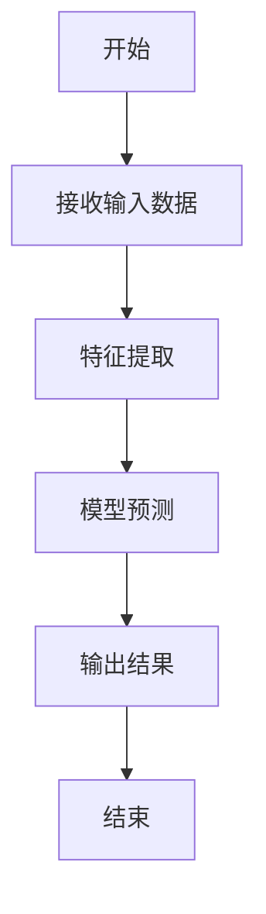

                 


# AI Agent在废物管理与回收中的应用

## 关键词：智能垃圾分类、AI Agent、机器学习、环保技术、废物管理、回收系统

## 摘要：  
AI Agent（人工智能代理）在废物管理与回收中的应用，通过智能化的分类、识别与优化，显著提升了废物处理的效率与准确性。本文从背景介绍、核心概念、算法原理、系统架构设计到项目实战，全面解析AI Agent在废物管理中的应用场景与技术实现。通过详细的技术分析与案例解读，本文旨在为读者提供一套完整的解决方案，助力环保事业的智能化发展。

---

## 正文

---

### 第1章: 背景介绍

#### 1.1 问题背景  
废物管理与回收是全球面临的重大挑战，传统的人工分类方式效率低、成本高且容易出错。随着AI技术的快速发展，AI Agent（人工智能代理）逐渐成为解决这一问题的关键技术。AI Agent通过智能感知、自主决策与执行操作，能够显著提升废物分类、识别与回收的效率。

#### 1.2 问题描述  
废物管理的核心问题包括：  
1. **分类错误率高**：人工分类容易出错，导致可回收资源的浪费。  
2. **效率低下**：传统方法依赖人工操作，处理速度慢且成本高。  
3. **资源浪费**：由于分类不准确，许多可回收材料被错误丢弃或处理。  

#### 1.3 问题解决  
AI Agent通过以下方式解决上述问题：  
1. **智能分类与识别**：利用计算机视觉与机器学习算法，实现对废物的精准分类。  
2. **优化回收流程**：通过预测与优化算法，提升回收效率。  
3. **实时监控与反馈**：AI Agent能够实时监控处理过程，及时调整策略。  

#### 1.4 概念结构与核心要素  
AI Agent在废物管理中的核心要素包括：  
- **感知层**：通过传感器、摄像头等设备获取环境数据。  
- **决策层**：基于机器学习算法，制定分类与回收策略。  
- **执行层**：通过机械臂或自动化设备执行具体操作。  

---

### 第2章: 核心概念与联系

#### 2.1 AI Agent的原理  
AI Agent的核心原理包括：  
- **强化学习**：通过奖励机制优化决策策略。  
- **监督学习**：基于标注数据进行分类与识别。  
- **自主决策**：结合环境反馈调整行为。  

#### 2.2 概念属性特征对比  

| **属性**       | **AI Agent**                     | **传统废物管理系统**                 |
|----------------|---------------------------------|------------------------------------|
| 智能性         | 高度智能，能够自主决策           | 依赖人工操作，智能化程度低           |
| 处理效率       | 高效，实时响应                   | 低效，依赖人工操作                   |
| 可扩展性       | 高，能够处理多种类型废物         | 低，难以快速适应新类型废物           |

#### 2.3 ER实体关系图  
以下是AI Agent在废物管理中的实体关系图：  

```mermaid
er
actor: "AI Agent"
participant: "废物分类系统"
participant: "传感器"
participant: "数据库"
participant: "机械臂"
actor --> participant: "接收指令"
participant --> participant: "提供数据"
participant --> participant: "存储数据"
participant --> participant: "执行操作"
```

---

### 第3章: 算法原理讲解

#### 3.1 AI Agent的核心算法  

##### 3.1.1 强化学习算法  
强化学习是一种通过奖励机制优化决策策略的算法。其核心公式为：  

$$ Q(s, a) = Q(s, a) + \alpha \cdot (r + \max Q(s', a') - Q(s, a)) $$  

其中，$s$ 表示当前状态，$a$ 表示动作，$r$ 表示奖励，$\alpha$ 表示学习率。  

##### 3.1.2 监督学习算法  
监督学习通过标注数据训练模型，实现分类与识别。其核心公式为：  

$$ y = f(x; \theta) $$  

其中，$x$ 表示输入数据，$y$ 表示输出结果，$\theta$ 表示模型参数。  

#### 3.2 算法流程图  



#### 3.3 算法实现代码  

##### Python代码示例：  

```python
import numpy as np
from sklearn import svm

# 数据准备
X = np.array([[0, 0], [1, 1], [1, 0], [0, 1]])
y = np.array([0, 1, 1, 0])

# 模型训练
model = svm.SVC()
model.fit(X, y)

# 模型预测
new_data = np.array([[0.5, 0.5]])
print(model.predict(new_data))  # 输出：[1]
```

---

### 第4章: 系统分析与架构设计

#### 4.1 系统功能设计  
以下是废物管理系统的功能设计：  

- **数据采集**：通过传感器获取废物的图像与属性数据。  
- **分类识别**：利用AI Agent进行分类与识别。  
- **决策优化**：基于强化学习优化回收策略。  
- **执行操作**：通过机械臂等设备执行具体操作。  

#### 4.2 系统架构设计  

```mermaid
graph TD
    A[用户输入] --> B[传感器]
    B --> C[数据处理模块]
    C --> D[A

