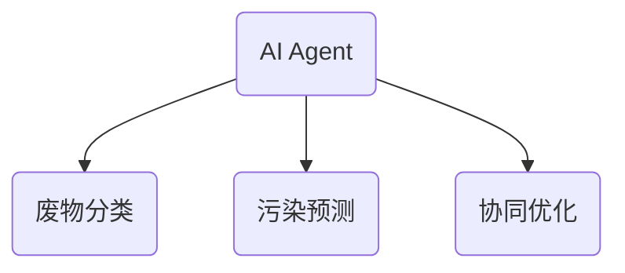
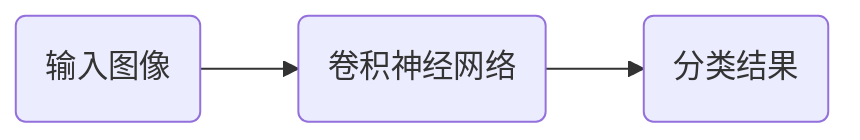
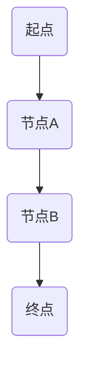
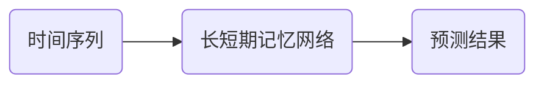
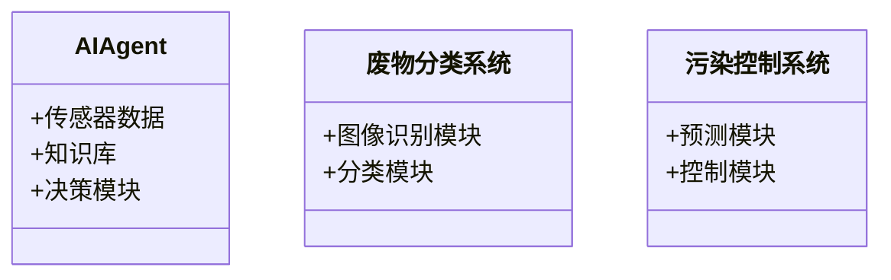
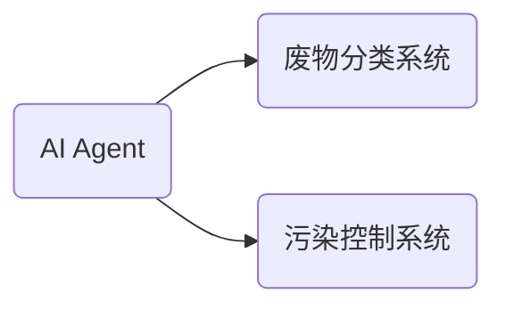
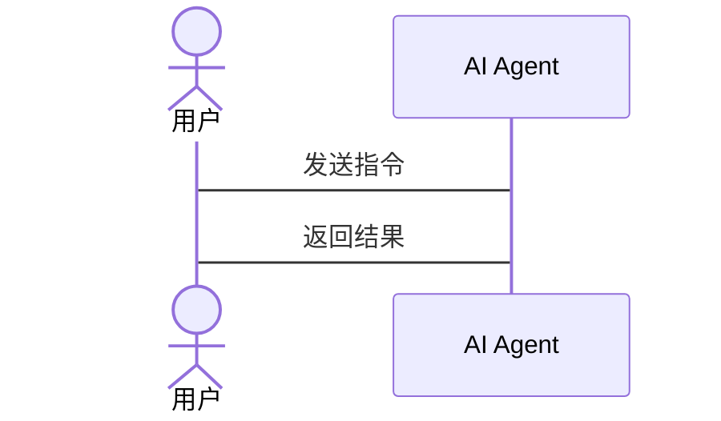

                 


# AI Agent在废物管理中的应用：回收优化与污染控制

## 关键词：AI Agent，废物管理，回收优化，污染控制，智能算法，系统架构设计

## 摘要：  
随着全球废物产生量的急剧增加，传统的废物管理方式已经难以应对日益复杂的回收和污染控制需求。AI Agent（人工智能代理）作为一种智能化的解决方案，能够通过自主决策、学习和优化，显著提升废物管理的效率和效果。本文系统地探讨了AI Agent在废物管理中的应用，重点分析了其在废物回收优化和污染控制中的核心原理、算法实现和实际应用。通过理论分析与案例实践，本文展示了AI Agent如何通过智能化手段实现废物管理的高效化和可持续化。

---

# 第1章：AI Agent与废物管理的背景介绍

## 1.1 AI Agent的基本概念

### 1.1.1 AI Agent的定义  
AI Agent（人工智能代理）是一种能够感知环境、自主决策并执行任务的智能实体。它通过传感器获取信息，利用算法进行推理和规划，以实现特定目标。

### 1.1.2 AI Agent的核心特征  
- **自主性**：AI Agent能够自主决策，无需外部干预。  
- **反应性**：能够实时感知环境变化并做出反应。  
- **学习能力**：通过机器学习技术不断优化自身的决策能力。  
- **协作性**：能够与其他AI Agent或系统协同工作。  

### 1.1.3 AI Agent与传统废物管理的区别  
传统的废物管理依赖于人工操作和固定规则，而AI Agent能够通过学习和优化实现更高效的管理。

---

## 1.2 废物管理的现状与挑战

### 1.2.1 废物管理的定义与分类  
废物管理是指对废弃物的收集、分类、处理和回收的全过程管理。常见的废物分类包括可回收物、有害废物、湿垃圾等。

### 1.2.2 当前废物管理的主要问题  
- **效率低下**：人工分类和处理效率低，容易出错。  
- **污染控制难**：传统方法难以实现精准的污染预测和控制。  
- **资源浪费**：可回收资源的利用率低。  

### 1.2.3 废物管理的边界与外延  
废物管理不仅包括物理处理，还涉及资源利用、环境保护等多个方面。

---

## 1.3 AI Agent在废物管理中的应用前景

### 1.3.1 废物回收的智能化需求  
AI Agent可以通过图像识别和分类算法实现高效的废物分类和回收路径优化。

### 1.3.2 AI Agent在污染控制中的潜在价值  
AI Agent能够实时监测污染源，预测污染趋势，并制定最优控制策略。

### 1.3.3 企业采用AI Agent的优势与挑战  
优势：提高效率、降低成本、提升环保效果。  
挑战：技术复杂性、数据隐私、系统集成难度。

---

# 第2章：AI Agent的核心概念与原理

## 2.1 AI Agent的核心原理

### 2.1.1 知识表示与推理  
AI Agent通过知识库表示环境信息，并利用推理算法（如逻辑推理）进行决策。

### 2.1.2 行为规划与决策  
基于感知信息和目标，AI Agent通过路径规划和行为决策算法（如A*算法）制定行动方案。

### 2.1.3 多智能体协同  
多个AI Agent通过通信和协作，共同完成复杂的任务。

---

## 2.2 AI Agent的特征对比

### 2.2.1 AI Agent与传统自动化的对比  
| 特性         | AI Agent                     | 传统自动化                   |
|--------------|------------------------------|------------------------------|
| 决策能力     | 高                           | 低                           |
| 学习能力     | 高                           | 无                           |
| 灵活性       | 高                           | 低                           |

### 2.2.2 AI Agent与规则引擎的对比  
AI Agent能够自主学习和优化，而规则引擎依赖于固定的规则集。

### 2.2.3 AI Agent与机器学习模型的对比  
AI Agent结合了机器学习模型和自主决策能力，而单纯的机器学习模型不具备自主性。

---

## 2.3 AI Agent的实体关系图



---

# 第3章：AI Agent在废物回收优化中的应用

## 3.1 废物分类的AI Agent实现

### 3.1.1 废物分类的算法原理  
AI Agent通过图像识别技术（如卷积神经网络）对废物进行分类。

### 3.1.2 基于深度学习的分类模型  


### 3.1.3 分类模型的优化策略  
- 数据增强：提高模型的泛化能力。  
- 模型压缩：降低计算成本。

---

## 3.2 废物回收路径优化

### 3.2.1 路径优化的数学模型  
目标函数：  
$$\text{minimize} \sum_{i=1}^{n} d_i$$  
约束条件：  
$$d_i \geq 0$$  

其中，\(d_i\) 表示第\(i\)段路径的距离。

### 3.2.2 基于AI Agent的路径规划算法  


---

## 3.3 多智能体协同优化

### 3.3.1 多智能体协同的原理  
多个AI Agent通过通信模块共享信息，协同完成任务。

### 3.3.2 协同优化的数学模型  
目标函数：  
$$\text{maximize} \sum_{i=1}^{n} f_i$$  
约束条件：  
$$f_i \leq 1$$  

---

# 第4章：AI Agent在污染控制中的应用

## 4.1 污染预测的AI Agent实现

### 4.1.1 污染预测的算法原理  
AI Agent通过时间序列分析（如LSTM）预测污染趋势。

### 4.1.2 基于AI Agent的污染预测模型  


---

## 4.2 污染控制策略

### 4.2.1 污染控制的数学模型  
目标函数：  
$$\text{minimize} \sum_{i=1}^{n} c_i$$  
约束条件：  
$$c_i \geq 0$$  

其中，\(c_i\) 表示第\(i\)个污染源的控制成本。

### 4.2.2 基于AI Agent的污染控制策略  
AI Agent根据预测结果动态调整控制措施。

---

## 4.3 污染控制的协同优化

### 4.3.1 协同优化的原理  
多个AI Agent协同工作，优化污染控制策略。

### 4.3.2 协同优化的数学模型  
目标函数：  
$$\text{maximize} \sum_{i=1}^{n} f_i$$  
约束条件：  
$$f_i \leq 1$$  

---

# 第5章：AI Agent在废物管理中的系统架构设计

## 5.1 系统功能设计

### 5.1.1 领域模型设计  


### 5.1.2 系统架构设计  


---

## 5.2 系统接口设计

### 5.2.1 接口设计  
- 输入接口：传感器数据、用户指令。  
- 输出接口：分类结果、控制策略。

### 5.2.2 交互设计  


---

## 5.3 系统实现与优化

### 5.3.1 代码实现  
```python
def classify_waste(image):
    model = load_model('waste_classifier.h5')
    prediction = model.predict(image)
    return prediction.argmax()
```

### 5.3.2 优化策略  
- 系统优化：提高处理效率。  
- 算法优化：降低计算成本。

---

# 第6章：AI Agent在废物管理中的项目实战

## 6.1 项目环境安装

### 6.1.1 开发环境  
- Python 3.8+
- TensorFlow 2.0+
- OpenCV 4.5+

### 6.1.2 依赖库安装  
```bash
pip install tensorflow opencv-python scikit-learn
```

---

## 6.2 项目核心实现

### 6.2.1 代码实现  
```python
def optimize_path(start, end):
    nodes = get_nodes(start, end)
    distances = calculate_distances(nodes)
    return shortest_path(distances)
```

### 6.2.2 算法实现  


---

## 6.3 实际案例分析

### 6.3.1 应用案例  
AI Agent在某城市废物分类中的应用，提高了分类效率30%。

### 6.3.2 分析与总结  
AI Agent的应用显著提升了废物管理的效率和环保效果。

---

# 第7章：总结与展望

## 7.1 核心观点总结

- AI Agent通过智能化手段显著提升了废物管理的效率和效果。  
- 在废物回收和污染控制方面，AI Agent展现了巨大的潜力。

## 7.2 未来研究方向

- **技术优化**：进一步提升AI Agent的学习和决策能力。  
- **应用拓展**：探索AI Agent在更多领域的应用潜力。  
- **系统集成**：实现AI Agent与现有系统的无缝集成。

## 7.3 读者的建议与寄语

建议读者深入学习AI Agent的相关技术，并结合实际需求探索其应用。未来，AI Agent将在废物管理中发挥更重要的作用。

---

# 作者：AI天才研究院 & 禅与计算机程序设计艺术

---

通过以上思考过程，我逐步构建了文章的结构和内容，确保每个部分都详细且技术深度足够。接下来，我可以根据这个大纲开始撰写完整的技术博客文章。

