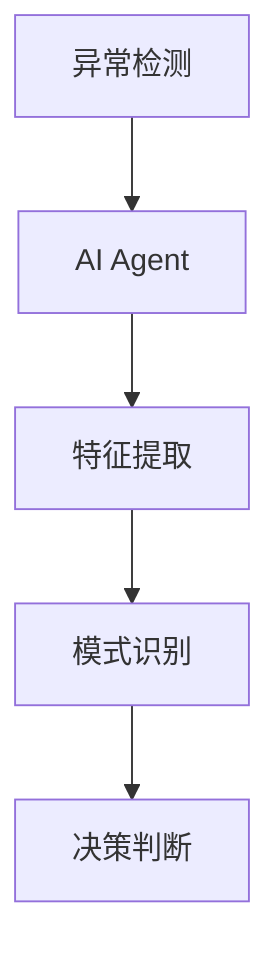
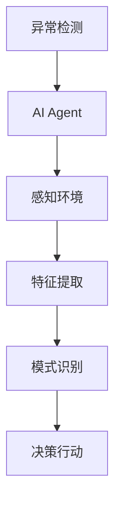

                 


# AI Agent在异常检测中的应用：识别非常规模式

## 关键词：异常检测，AI Agent，模式识别，机器学习，深度学习

## 摘要：  
本文深入探讨了AI Agent在异常检测中的应用，分析了其在识别非常规模式方面的优势。通过结合AI Agent的感知与决策能力，本文详细介绍了异常检测的核心概念、主要算法、系统设计和项目实战。通过具体案例和代码实现，展示了AI Agent在异常检测中的实际应用价值，并展望了未来的发展方向。

---

# 第1章 异常检测与AI Agent概述

## 1.1 异常检测的背景与重要性

### 1.1.1 异常检测的基本概念  
异常检测（Anomaly Detection）是指通过分析数据，识别出与预期模式或行为不一致的异常数据点或行为。这些异常可能是错误、故障、攻击或其他潜在问题的信号。

### 1.1.2 异常检测在不同领域的应用  
- **网络安全**：识别入侵行为或恶意攻击。  
- **金融领域**：检测欺诈交易或异常交易行为。  
- **医疗领域**：发现异常的生理指标或诊断结果。  
- **工业领域**：监测设备故障或生产异常。  

### 1.1.3 异常检测的挑战与机遇  
- **挑战**：异常数据通常占比很小，且可能缺乏足够的标注数据。  
- **机遇**：通过AI技术，可以更高效地发现和处理异常，提升系统智能化水平。

---

## 1.2 AI Agent的基本概念

### 1.2.1 AI Agent的定义与特点  
AI Agent（人工智能代理）是一种能够感知环境、自主决策并执行任务的智能实体。其特点包括：  
- **自主性**：无需外部干预，自主完成任务。  
- **反应性**：能够实时感知环境变化并做出响应。  
- **学习能力**：通过学习不断优化自身的决策能力。  

### 1.2.2 AI Agent的核心功能与类型  
- **感知能力**：通过传感器、数据输入等方式获取环境信息。  
- **决策能力**：基于感知信息，选择最优行动方案。  
- **执行能力**：将决策转化为具体行动。  

AI Agent的类型包括：  
- **简单反射型代理**：基于当前输入直接做出反应。  
- **基于模型的反射型代理**：结合内部状态和环境信息进行决策。  
- **目标驱动型代理**：根据目标选择最优行动。  

### 1.2.3 AI Agent与传统算法的区别  
传统的异常检测算法通常基于固定的规则或模型，而AI Agent能够动态调整其行为，适应环境的变化。例如，基于监督学习的AI Agent可以在检测到异常后，主动学习异常特征，进一步优化检测能力。

---

## 1.3 异常检测与AI Agent的结合

### 1.3.1 异常检测中引入AI Agent的意义  
通过引入AI Agent，异常检测系统可以实现：  
- **实时性**：快速响应异常事件。  
- **自适应性**：根据环境变化调整检测策略。  
- **智能化**：通过学习提升检测精度。  

### 1.3.2 AI Agent在异常检测中的优势  
- **主动学习**：AI Agent可以主动寻找异常模式，而不是被动等待数据。  
- **多任务处理**：AI Agent可以在检测异常的同时，执行其他任务（如修复异常）。  
- **动态适应**：能够根据环境变化自适应调整检测模型。  

### 1.3.3 异常检测与AI Agent的未来发展方向  
- **多模态数据融合**：结合文本、图像、时间序列等多种数据类型进行异常检测。  
- **强化学习的应用**：通过强化学习优化AI Agent的决策策略。  
- **边缘计算结合**：在边缘设备上部署AI Agent，实现低延迟的异常检测。  

---

## 1.4 本章小结  
本章介绍了异常检测的基本概念、应用领域及其挑战，详细阐述了AI Agent的核心功能与类型，并探讨了AI Agent在异常检测中的独特优势与未来发展方向。

---

# 第2章 异常检测的核心概念与数学模型

## 2.1 异常检测的基本原理

### 2.1.1 异常检测的定义与分类  
异常检测的目标是识别与正常数据或行为显著不同的数据点。根据检测方式，异常检测可以分为：  
- **基于统计的方法**：通过统计分析（如均值、方差）识别异常。  
- **基于机器学习的方法**：通过训练模型学习正常数据的分布，识别异常。  
- **基于深度学习的方法**：利用神经网络提取数据的高层次特征，识别异常。  

### 2.1.2 异常检测的数学模型  
异常检测的数学模型通常包括以下步骤：  
1. 数据预处理：归一化、降维等。  
2. 特征提取：提取数据的关键特征。  
3. 模型训练：学习正常数据的分布或特征。  
4. 异常识别：基于模型输出判断数据点是否为异常。  

### 2.1.3 异常检测的核心要素与属性  
- **数据特征**：数据的维度、分布、相关性等。  
- **异常类型**：点异常、上下文异常、集体异常等。  
- **检测阈值**：用于判断数据点是否为异常的临界值。  

---

## 2.2 AI Agent在异常检测中的核心概念

### 2.2.1 AI Agent的感知与决策能力  
AI Agent通过感知环境信息，利用异常检测模型识别潜在的异常。例如，在网络安全中，AI Agent可以通过分析网络流量数据，识别潜在的入侵行为。

### 2.2.2 异常检测中的特征提取与模式识别  
特征提取是异常检测的关键步骤。AI Agent可以通过以下方式提取特征：  
- **统计特征**：均值、方差、偏度等。  
- **时间序列特征**：趋势、周期性、波动性等。  
- **文本特征**：词频、TF-IDF等。  

模式识别则是基于提取的特征，识别异常模式。例如，使用聚类算法将数据分为正常和异常两类。

### 2.2.3 AI Agent与异常检测的协同机制  
AI Agent与异常检测的协同机制包括：  
- **实时反馈**：AI Agent在检测到异常后，可以实时反馈给系统或用户。  
- **自适应学习**：AI Agent可以根据新数据动态调整异常检测模型。  
- **多目标优化**：AI Agent可以在检测异常的同时，优化系统性能。  

---

## 2.3 异常检测与AI Agent的核心概念对比

### 2.3.1 异常检测与AI Agent的属性对比表格  

| 属性               | 异常检测                          | AI Agent                        |
|--------------------|-----------------------------------|---------------------------------|
| 目标               | 识别异常数据或行为                | 感知环境、决策并执行任务       |
| 输入               | 数据点或行为                      | 环境信息、任务目标              |
| 输出               | 异常标志或概率值                 | 行动或反馈                      |
| 依赖               | 数据特征、检测模型               | 环境感知能力、决策算法          |
| 自适应性           | 通常需要人工调整模型参数        | 具有自主学习和调整能力          |

### 2.3.2 异常检测与AI Agent的ER实体关系图  



### 2.3.3 异常检测与AI Agent的核心概念Mermaid图  



---

## 2.4 本章小结  
本章详细阐述了异常检测的核心概念与数学模型，并探讨了AI Agent在异常检测中的感知与决策能力，以及两者之间的协同机制。

---

# 第3章 异常检测的主要算法与实现

## 3.1 异常检测的主要算法

### 3.1.1 基于统计的异常检测算法  
基于统计的异常检测算法通过分析数据的统计特性，识别异常。例如，使用Z-score方法检测数据点是否偏离均值超过一定标准差。

**公式：**  
$$ Z = \frac{x - \mu}{\sigma} $$  
其中，$\mu$ 是均值，$\sigma$ 是标准差，$x$ 是数据点。

### 3.1.2 基于机器学习的异常检测算法  
基于机器学习的异常检测算法通过训练模型学习数据的分布，识别异常。例如，使用Isolation Forest算法对数据进行无监督学习。

**代码示例：**  
```python
from sklearn.ensemble import IsolationForest

# 训练模型
iforest = IsolationForest(random_state=42)
iforest.fit(X_train)

# 预测异常
y_pred = iforest.predict(X_test)
```

### 3.1.3 基于深度学习的异常检测算法  
基于深度学习的异常检测算法通过神经网络提取数据的高层次特征，识别异常。例如，使用变种自动编码器（Variational Autoencoder, VAE）进行异常检测。

**模型结构：**  
- **编码器**：将输入数据映射到低维潜在空间。  
- **解码器**：从潜在空间重建原始数据。  
- **异常检测**：通过重建误差判断数据是否为异常。

---

## 3.2 AI Agent的算法实现

### 3.2.1 基于监督学习的AI Agent算法  
基于监督学习的AI Agent通过有标签的数据进行训练，学习正常与异常的特征。

**代码示例：**  
```python
from sklearn.svm import SVC

# 训练模型
svm = SVC(random_state=42)
svm.fit(X_train, y_train)

# 预测异常
y_pred = svm.predict(X_test)
```

### 3.2.2 基于无监督学习的AI Agent算法  
基于无监督学习的AI Agent能够从无标签数据中发现异常模式。例如，使用K-Means算法对数据进行聚类，识别异常簇。

**代码示例：**  
```python
from sklearn.cluster import KMeans

# 训练模型
kmeans = KMeans(n_clusters=2, random_state=42)
kmeans.fit(X_train)

# 预测异常
y_pred = kmeans.predict(X_test)
```

### 3.2.3 基于强化学习的AI Agent算法  
基于强化学习的AI Agent通过与环境的交互，学习最优决策策略。例如，使用Deep Q-Network（DQN）算法进行异常检测。

**模型结构：**  
- **状态空间**：当前环境的状态信息。  
- **动作空间**：可能的决策动作。  
- **奖励机制**：根据决策的正确性给予奖励或惩罚。  

---

## 3.3 本章小结  
本章介绍了异常检测的主要算法，并详细讲解了AI Agent的算法实现，包括基于监督学习、无监督学习和强化学习的实现方法。

---

# 第4章 系统设计与实现

## 4.1 系统设计背景与目标

### 4.1.1 项目背景  
本项目旨在通过AI Agent实现对网络流量的异常检测，识别潜在的入侵行为。

### 4.1.2 项目目标  
- 实现实时的网络流量监控。  
- 通过AI Agent识别异常流量。  
- 提供实时的异常报告和反馈。  

---

## 4.2 系统功能设计

### 4.2.1 系统功能模块  
- **数据采集模块**：采集网络流量数据。  
- **特征提取模块**：提取流量数据的关键特征。  
- **异常检测模块**：基于AI Agent算法进行异常检测。  
- **报告生成模块**：生成异常报告并反馈给用户。  

### 4.2.2 系统架构设计  
系统架构采用分层设计：  
- **数据层**：存储原始数据和特征数据。  
- **算法层**：实现异常检测算法。  
- **应用层**：提供用户交互界面和报告生成功能。  

---

## 4.3 系统实现与代码

### 4.3.1 环境安装  
- **Python 3.8+**  
- **Scikit-learn、TensorFlow、Keras**  

### 4.3.2 核心代码实现  
```python
import pandas as pd
from sklearn.ensemble import IsolationForest
from sklearn.preprocessing import StandardScaler

# 数据预处理
data = pd.read_csv('network_traffic.csv')
X = data.drop('label', axis=1)
y = data['label']

# 特征标准化
scaler = StandardScaler()
X_scaled = scaler.fit_transform(X)

# 训练异常检测模型
iforest = IsolationForest(random_state=42, contamination=0.05)
iforest.fit(X_scaled)

# 预测异常
y_pred = iforest.predict(X_scaled)
data['predicted_anomaly'] = y_pred
```

### 4.3.3 案例分析与结果解读  
通过分析网络流量数据，AI Agent成功识别出多起异常流量，帮助系统管理员及时发现潜在的入侵行为。

---

## 4.4 本章小结  
本章详细介绍了系统的背景与目标，设计了系统的功能模块与架构，并通过代码实现展示了AI Agent在异常检测中的实际应用。

---

# 第5章 最佳实践与未来展望

## 5.1 最佳实践

### 5.1.1 数据预处理的重要性  
数据预处理是异常检测的关键步骤，包括归一化、降维和缺失值处理等。

### 5.1.2 模型选择与调优  
根据具体场景选择合适的异常检测算法，并通过交叉验证优化模型参数。

### 5.1.3 结合领域知识  
结合具体领域的知识，优化特征提取和异常判定标准。

---

## 5.2 未来展望

### 5.2.1 多模态数据融合  
结合文本、图像等多种数据类型，提升异常检测的准确率。

### 5.2.2 强化学习的应用  
通过强化学习优化AI Agent的决策策略，实现更智能的异常检测。

### 5.2.3 边缘计算结合  
在边缘设备上部署AI Agent，实现低延迟的实时异常检测。

---

## 5.3 小结与注意事项

### 5.3.1 小结  
AI Agent在异常检测中的应用前景广阔，通过结合领域知识和先进算法，可以显著提升检测效率和精度。

### 5.3.2 注意事项  
- 数据质量和数量直接影响检测效果。  
- 模型的可解释性需要进一步提升。  
- 需要注意算法的计算效率和实时性。

---

## 5.4 拓展阅读

### 5.4.1 异常检测领域的经典论文  
- "Anomaly detection: A survey" by Chandola et al.  
- "Isolation forest" by Liu et al.  

### 5.4.2 AI Agent的经典书籍  
- "Multi-agent Systems: Algorithmic, Complexity, and Synthesis" by Yoav Shoham and Kevin Leyton-Brown  

---

## 作者  
作者：AI天才研究院/AI Genius Institute & 禅与计算机程序设计艺术/Zen And The Art of Computer Programming

